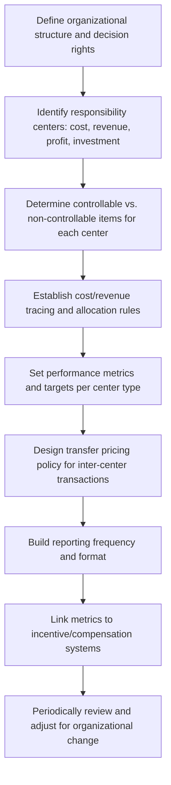

## Designing Responsibility Accounting Systems

### Definition and Purpose

A responsibility accounting system is the formal framework an organization builds to assign financial accountability to individual managers by aligning reporting structures, cost/revenue traceability, and performance metrics with the actual scope of each manager's decision-making authority. Rather than being a single technique, it is a *design problem*: the organization must decide how to structure responsibility centers, what to measure for each, how to trace and allocate costs, and how to link those measures to incentives — all in a way that promotes goal congruence between individual managers and the organization as a whole.

### Design Objectives

An effective responsibility accounting system is generally designed to satisfy several, sometimes competing, objectives:

- **Controllability**: managers should be evaluated primarily on items they can meaningfully influence
- **Goal congruence**: the system should motivate managers to make decisions that benefit the organization as a whole, not just their own reported metrics
- **Timeliness and relevance**: performance information should be available quickly enough to support corrective action
- **Comparability**: metrics should allow meaningful comparison across periods and, where appropriate, across similar units
- **Cost-effectiveness**: the benefits of more granular tracking and reporting must exceed the cost of collecting and processing that information
- **Motivational alignment**: the system should reward behavior consistent with long-term organizational value, not just short-term reported numbers

### Step-by-Step Design Process

**Step 1 — Map organizational structure to decision rights.** Before any accounting design work begins, management must clarify which decisions are made at which organizational level (a decentralization decision, addressed separately). The responsibility accounting structure should mirror, not dictate, the actual authority structure.

**Step 2 — Classify each unit as a cost, revenue, profit, or investment center.** This classification should reflect the manager's actual scope of authority, not simply follow the org chart by default. Misclassifying a unit (e.g., treating a unit as a profit center when the manager has no real pricing authority) undermines the controllability principle from the outset.

**Step 3 — Separate controllable from non-controllable items.** For each center, identify which specific line items (labor cost, allocated rent, corporate overhead, depreciation on inherited assets, etc.) the current manager can influence in the relevant time horizon. This typically requires distinguishing:

- **Controllable costs**: costs the manager can meaningfully affect in the short-to-medium term
- **Committed/traceable but non-controllable costs**: costs directly traceable to the unit but outside the current manager's short-term control (e.g., depreciation on equipment purchased by a predecessor)
- **Allocated common/corporate costs**: costs shared across multiple units and allocated using some basis (e.g., headcount, square footage, revenue), which are rarely controllable by any single unit manager

**Step 4 — Establish cost tracing and allocation rules.** The system must define how costs are traced directly to responsibility centers versus allocated from shared/common pools, and what allocation bases will be used. Overly aggressive allocation of uncontrollable shared costs into a manager's evaluated results is one of the most common design flaws, since it violates the controllability principle and can distort perceived performance.

**Step 5 — Select performance metrics appropriate to center type.** As established by the center classification: cost variances for cost centers; sales/revenue variances for revenue centers; operating income or segment margin for profit centers; and ROI, residual income, or EVA for investment centers. Metrics should be chosen deliberately, since each has known behavioral effects (e.g., pure ROI evaluation can create goal incongruence, as previously discussed).

**Step 6 — Design the transfer pricing policy.** For any organization with profit or investment centers that transact internally, a transfer pricing methodology (market-based, cost-based, or negotiated) must be established and consistently applied, since the choice materially affects each center's reported results.

**Step 7 — Set reporting frequency, format, and variance investigation thresholds.** The system should specify how often performance reports are generated (monthly, quarterly), what variances trigger further investigation (e.g., a materiality threshold such as variances exceeding a set percentage or dollar amount), and how reports are formatted to highlight controllable results distinctly from uncontrollable ones.

**Step 8 — Link to incentive and compensation systems.** Many organizations tie bonuses or other incentives to responsibility center performance. This step requires particular care, since compensation-linked metrics strongly shape managerial behavior — poorly designed links are a common source of dysfunctional decision-making (e.g., cutting discretionary costs like training or maintenance near period-end purely to hit a short-term budget target).

**Step 9 — Periodically review and adjust.** Organizational structures, product lines, and strategies change over time, and a responsibility accounting system designed for a prior structure can become misaligned with current decision authority if not periodically reassessed.

### Controllable vs. Traceable Cost Reporting Format

A well-designed responsibility accounting report typically separates controllable results (used to evaluate the manager) from traceable-but-uncontrollable items (used to evaluate the segment as an economic entity). A simplified illustrative format:

| Line Item | Division A | Division B | Total |
| --- | --- | --- | --- |
| Sales revenue | $1,200,000 | $800,000 | $2,000,000 |
| Less: variable costs | ($650,000) | ($420,000) | ($1,070,000) |
| **Contribution margin** | **$550,000** | **$380,000** | **$930,000** |
| Less: controllable fixed costs | ($180,000) | ($140,000) | ($320,000) |
| **Controllable margin (manager evaluation)** | **$370,000** | **$240,000** | **$610,000** |
| Less: traceable, non-controllable fixed costs | ($90,000) | ($60,000) | ($150,000) |
| **Segment margin (segment evaluation)** | **$280,000** | **$180,000** | **$460,000** |
| Less: allocated common corporate costs | — | — | ($110,000) |
| **Operating income** |  |  | **$350,000** |

This layered format allows the organization to answer two distinct questions: "How well did this manager perform?" (controllable margin) and "Is this segment, as an economic entity, worth continuing?" (segment margin), without conflating the two.

### Common Design Pitfalls

- **Over-allocating uncontrollable costs** to responsibility centers, which violates the controllability principle and demotivates managers who are held accountable for costs they cannot influence.
- **Designing metrics that create goal incongruence**, such as evaluating investment center managers solely on ROI without a residual income or EVA supplement, incentivizing rejection of value-adding projects.
- **Ignoring behavioral effects of the metrics chosen**, e.g., overly aggressive short-term cost targets encouraging managers to defer necessary maintenance or training, harming long-term performance to hit short-term numbers.
- **Inconsistent or unclear transfer pricing policy**, leading to constant disputes between profit/investment centers and unreliable segment profitability figures.
- **Static system design**, where the responsibility structure is not updated as the organization reorganizes, acquires new units, or changes strategy, causing a growing mismatch between reported accountability and actual decision authority.
- **Excessive reporting granularity or frequency** relative to the cost of producing it, violating the cost-effectiveness design objective.
- **Failure to separate manager performance from segment performance**, leading to decisions (e.g., closing a segment) based on figures that unfairly reflect uncontrollable allocated costs rather than the segment's true economic contribution.

### Illustrative System Architecture Diagram

<svg viewBox="0 0 850 400" xmlns="http://www.w3.org/2000/svg" font-family="Arial, sans-serif">

<text x="425" y="25" text-anchor="middle" font-size="16" font-weight="bold">Responsibility Accounting System Architecture (svg_diagram)</text>

<rect x="40" y="55" width="200" height="55" rx="6" fill="#E8F0FE" stroke="#4285F4" stroke-width="1.5"/>

<text x="140" y="80" text-anchor="middle" font-size="11" font-weight="bold">Org Structure &</text>

<text x="140" y="95" text-anchor="middle" font-size="11" font-weight="bold">Decision Rights</text>

<rect x="320" y="55" width="200" height="55" rx="6" fill="#FEF7E0" stroke="#F9AB00" stroke-width="1.5"/>

<text x="420" y="80" text-anchor="middle" font-size="11" font-weight="bold">Responsibility Center</text>

<text x="420" y="95" text-anchor="middle" font-size="11" font-weight="bold">Classification</text>

<rect x="600" y="55" width="200" height="55" rx="6" fill="#E6F4EA" stroke="#34A853" stroke-width="1.5"/>

<text x="700" y="80" text-anchor="middle" font-size="11" font-weight="bold">Controllable vs.</text>

<text x="700" y="95" text-anchor="middle" font-size="11" font-weight="bold">Traceable Cost Rules</text>

<line x1="240" y1="82" x2="318" y2="82" stroke="#555" stroke-width="1.5" marker-end="url(#arr2)"/>

<line x1="520" y1="82" x2="598" y2="82" stroke="#555" stroke-width="1.5" marker-end="url(#arr2)"/>

<rect x="40" y="150" width="200" height="55" rx="6" fill="#FCE8E6" stroke="#EA4335" stroke-width="1.5"/>

<text x="140" y="175" text-anchor="middle" font-size="11" font-weight="bold">Transfer Pricing</text>

<text x="140" y="190" text-anchor="middle" font-size="11" font-weight="bold">Policy</text>

<rect x="320" y="150" width="200" height="55" rx="6" fill="#E8F0FE" stroke="#4285F4" stroke-width="1.5"/>

<text x="420" y="175" text-anchor="middle" font-size="11" font-weight="bold">Performance Metrics</text>

<text x="420" y="190" text-anchor="middle" font-size="11" font-weight="bold">(cost/revenue/profit/ROI)</text>

<rect x="600" y="150" width="200" height="55" rx="6" fill="#FEF7E0" stroke="#F9AB00" stroke-width="1.5"/>

<text x="700" y="175" text-anchor="middle" font-size="11" font-weight="bold">Reporting Frequency</text>

<text x="700" y="190" text-anchor="middle" font-size="11" font-weight="bold">& Variance Thresholds</text>

<line x1="700" y1="110" x2="700" y2="148" stroke="#555" stroke-width="1.5" marker-end="url(#arr2)"/>

<line x1="420" y1="110" x2="420" y2="148" stroke="#555" stroke-width="1.5" marker-end="url(#arr2)"/>

<rect x="320" y="250" width="200" height="55" rx="6" fill="#E6F4EA" stroke="#34A853" stroke-width="1.5"/>

<text x="420" y="275" text-anchor="middle" font-size="11" font-weight="bold">Incentive & Compensation</text>

<text x="420" y="290" text-anchor="middle" font-size="11" font-weight="bold">Linkage</text>

<line x1="420" y1="205" x2="420" y2="248" stroke="#555" stroke-width="1.5" marker-end="url(#arr2)"/>

<rect x="320" y="335" width="200" height="45" rx="6" fill="#F1F3F4" stroke="#5F6368" stroke-width="1.5"/>

<text x="420" y="360" text-anchor="middle" font-size="11" font-weight="bold">Periodic Review & Redesign</text>

<line x1="420" y1="305" x2="420" y2="333" stroke="#555" stroke-width="1.5" marker-end="url(#arr2)"/>

<path d="M 320 360 Q 100 360 100 82 L 100 108" stroke="#999" stroke-width="1" stroke-dasharray="4,4" fill="none" marker-end="url(#arr2)"/>

<text x="60" y="220" font-size="9" fill="#999" transform="rotate(-90 60 220)">Feedback loop</text>

<defs>

<marker id="arr2" markerWidth="8" markerHeight="8" refX="6" refY="4" orient="auto">

<path d="M0,0 L8,4 L0,8 Z" fill="#555"/>

</marker>

</defs>

</svg>

### Behavioral and Motivational Considerations

[Inference] Beyond the mechanical design steps, the effectiveness of a responsibility accounting system depends heavily on how it is perceived by the managers it evaluates. A system perceived as fair, transparent, and appropriately reflective of actual controllability tends to generate better managerial buy-in and more constructive use of variance information for corrective action, whereas a system perceived as arbitrary or punitive can encourage defensive behavior, budget gaming, or data manipulation. Because these behavioral responses are context-dependent and vary across organizational cultures, the precise motivational impact of any specific system design should be validated within the organization rather than assumed from general principles alone.

### Integration with Budgeting and Standard Costing

A responsibility accounting system does not operate in isolation — it typically integrates directly with the organization's budgeting process (each responsibility center receives its own budget aligned with its controllable items) and standard costing system (cost centers are evaluated using standard cost variances computed against flexible budgets, as covered under flexible budgets and overhead analysis). The design choices made in responsibility accounting — particularly which items are deemed controllable — directly determine which variances are considered meaningful for evaluating a specific manager versus which are attributed to factors outside that manager's control (e.g., a fixed overhead volume variance driven by a corporate-level denominator capacity decision, not the plant manager's actions).

### Common Pitfalls (System-Level)

- Designing responsibility centers around convenient existing account codes rather than actual decision authority.
- Allowing the transfer pricing policy to be negotiated informally and inconsistently rather than governed by a documented, consistently applied policy.
- Failing to distinguish controllable margin from segment margin in reporting, leading to inappropriate manager evaluation or inappropriate segment continuation/discontinuation decisions.
- Setting variance investigation thresholds arbitrarily rather than based on materiality analysis, leading to wasted investigation effort on immaterial variances or missed investigation of material ones.
- Neglecting to revisit the system after significant organizational changes such as mergers, reorganizations, or new product line launches.

**Related Topics**

- Cost Centers, Revenue Centers, Profit Centers, and Investment Centers
- Advantages and Disadvantages of Decentralization
- Transfer Pricing Methods (Market-Based, Cost-Based, Negotiated)
- Segment Reporting and Controllable vs. Traceable Costs
- Return on Investment, Residual Income, and Economic Value Added
- Standard Costing and Variance Analysis
- Budgeting Process and Master Budget Development