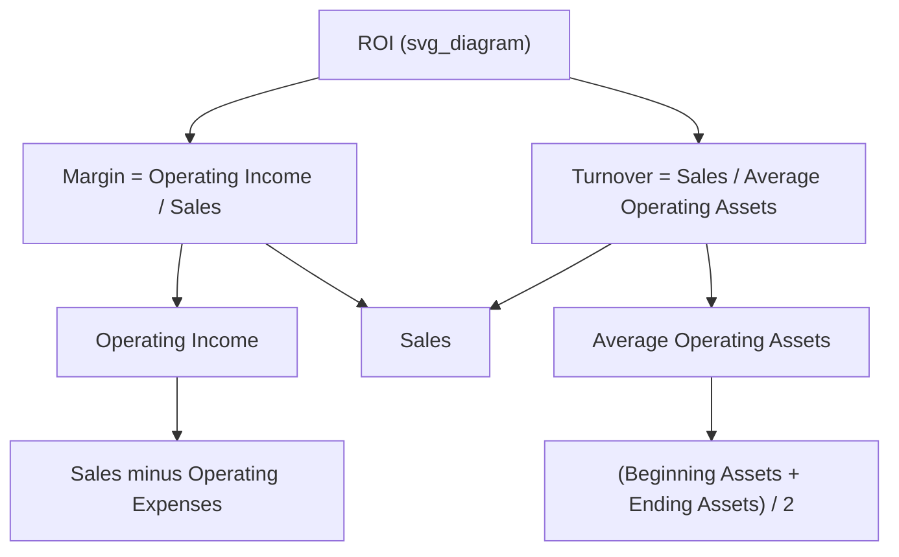

## Return on Investment and the DuPont Formula

### Overview

Return on Investment (ROI) is a performance metric used in decentralized organizations to evaluate the profitability of an investment center relative to the assets invested to generate that profit. It is one of the most widely used measures in responsibility accounting because it allows comparison of divisions of different sizes on a common percentage basis. The DuPont Formula (also called the DuPont Model or DuPont Analysis) decomposes ROI into two component ratios—margin and turnover—allowing managers to identify *why* an investment center's ROI is high or low.

### Responsibility Accounting Context

In responsibility accounting, organizations are divided into responsibility centers based on the scope of control a manager has:

- **Cost center** — manager controls only costs
- **Revenue center** — manager controls only revenue
- **Profit center** — manager controls both revenue and costs
- **Investment center** — manager controls revenue, costs, and the capital invested in operating assets

ROI is specifically designed to evaluate **investment centers**, since it requires a manager to have authority over the asset base, not just the income statement.

### The Basic ROI Formula

$$ROI = \dfrac{Operating\ Income}{Average\ Operating\ Assets}$$

**Key Points**

- *Operating income* excludes interest expense, income taxes, and non-operating gains/losses, since these are typically outside a segment manager's control.
- *Operating assets* include cash, receivables, inventory, plant, and equipment used in day-to-day operations; it excludes assets not used operationally, such as idle land held for speculation or investments in unrelated securities.
- *Average operating assets* is normally computed as:

$$Average\ Operating\ Assets = \dfrac{Beginning\ Assets + Ending\ Assets}{2}$$

Using the average smooths out the effect of asset purchases or disposals occurring during the period.

### The DuPont Formula (Decomposition of ROI)

The DuPont Formula restates ROI as the product of two ratios: **Margin** and **Turnover**.

$$ROI = Margin \times Turnover$$

$$ROI = \dfrac{Operating\ Income}{Sales} \times \dfrac{Sales}{Average\ Operating\ Assets}$$

Note that *Sales* cancels out algebraically, returning to the basic ROI formula, but retaining both ratios separately provides diagnostic insight.

#### Margin

$$Margin = \dfrac{Operating\ Income}{Sales}$$

Margin measures how much operating income is earned per dollar of sales — essentially, operating efficiency and cost control. A low margin may indicate excessive operating expenses relative to sales.

#### Turnover

$$Turnover = \dfrac{Sales}{Average\ Operating\ Assets}$$

Turnover measures how efficiently a segment uses its operating assets to generate sales — essentially, asset utilization efficiency. A low turnover may indicate excess inventory, idle equipment, or overinvestment in receivables.

### Why Decompose ROI?

**Key Points**

- Two divisions can have the same ROI for very different reasons: one might have high margin but low turnover (e.g., luxury goods), while another has low margin but high turnover (e.g., grocery retail).
- Decomposing ROI helps managers pinpoint the lever to pull — pricing/cost control (margin) versus asset efficiency (turnover) — rather than treating ROI as a single undifferentiated number.
- It supports more targeted managerial action: a manager can improve ROI by increasing sales, reducing operating expenses, or reducing operating assets (or some combination), each of which maps to a specific DuPont component.

### DuPont Relationship Diagram

### Worked Example

A division reports the following for the year:

| Item | Amount |
| --- | --- |
| Sales | $2,000,000 |
| Operating Income | $160,000 |
| Beginning Operating Assets | $750,000 |
| Ending Operating Assets | $850,000 |

**Step 1 — Average Operating Assets**

$$Average\ Operating\ Assets = \dfrac{750{,}000 + 850{,}000}{2} = 800{,}000$$

**Step 2 — Margin**

$$Margin = \dfrac{160{,}000}{2{,}000{,}000} = 0.08 = 8\%$$

**Step 3 — Turnover**

$$Turnover = \dfrac{2{,}000{,}000}{800{,}000} = 2.5\ times$$

**Step 4 — ROI (via DuPont)**

$$ROI = 0.08 \times 2.5 = 0.20 = 20\%$$

**Step 5 — Verification (basic formula)**

$$ROI = \dfrac{160{,}000}{800{,}000} = 0.20 = 20\%$$

Both methods agree, confirming the 20% ROI.

**Example**

If the division increases Sales to $2,200,000 while holding Operating Income margin constant at 8% and Average Operating Assets constant at $800,000:

- New Operating Income = $0.08 \times 2{,}200{,}000 = 176{,}000$
- New Turnover = $2{,}200{,}000 / 800{,}000 = 2.75$
- New ROI = $0.08 \times 2.75 = 22\%$

This isolates the effect of a sales increase (with margin held constant) on overall ROI.

### Levers to Improve ROI

**Key Points**

1. **Increase Sales** (without a proportional increase in expenses or assets) — raises both effective margin and turnover.
2. **Reduce Operating Expenses** — increases margin directly, holding sales constant.
3. **Reduce Operating Assets** — increases turnover directly, e.g., by reducing inventory levels, collecting receivables faster, or disposing of idle equipment.

[Inference] In practice, some of these levers involve trade-offs — for instance, aggressively cutting operating assets (like inventory) may risk stockouts and lost sales, so managers must balance short-term ROI gains against long-term operational health.

### ROI vs. Residual Income (Brief Comparison)

**Key Points**

- ROI is a *percentage* measure, which can cause **goal congruence problems**: a division manager evaluated on ROI may reject a project with a positive NPV or a return exceeding the company's minimum required rate of return, simply because the project's return is below the division's *current* ROI (this would pull the division's average ROI down even though it benefits the company overall).
- This is a key limitation of ROI discussed alongside the DuPont Formula in responsibility accounting: high-ROI divisions may underinvest, and low-ROI divisions may overinvest, relative to what is optimal for the company as a whole.
- Residual Income (RI) and Economic Value Added (EVA) are alternative measures often introduced specifically to correct this dysfunctional incentive, since they use a dollar amount above a minimum required return rather than a ratio.

### Advantages and Limitations of ROI

**Key Points**

*Advantages:*

- Widely understood and comparable across divisions, companies, and industries of different sizes
- Encourages efficient use of operating assets (discourages excessive investment in assets not being justified by returns)
- DuPont decomposition provides diagnostic power beyond a single ratio

*Limitations:*

- Can create disincentive to invest in profitable projects if they would lower a division's current average ROI (goal congruence issue)
- Sensitive to asset valuation method (net book value vs. gross cost), which can artificially inflate ROI over time as assets depreciate
- Historical cost-based asset measurement may not reflect current economic value [Unverified — depends on the specific accounting policies and asset valuation method used by the organization]
- Excludes the cost of capital explicitly, unlike Residual Income or EVA

### Practical Application Notes

- Some organizations use **gross book value** of assets (before depreciation) instead of net book value to avoid the increasing-ROI-over-time effect caused by a shrinking depreciated asset base; this is a policy choice and varies by organization. [Unverified — specific practice depends on company policy]
- When comparing divisions, ensure operating income and operating assets are defined consistently (e.g., whether to include/exclude shared corporate assets or allocated corporate overhead), since inconsistent definitions distort ROI comparisons.

### Related Topics

- Residual Income (RI) and minimum required rate of return
- Economic Value Added (EVA)
- Goal congruence and suboptimal investment decisions
- Transfer pricing between investment centers
- Balanced Scorecard as a complement to financial performance measures
- Segment margin reporting and controllable vs. non-controllable costs
- Asset valuation methods (net book value vs. gross book value) in performance measurement