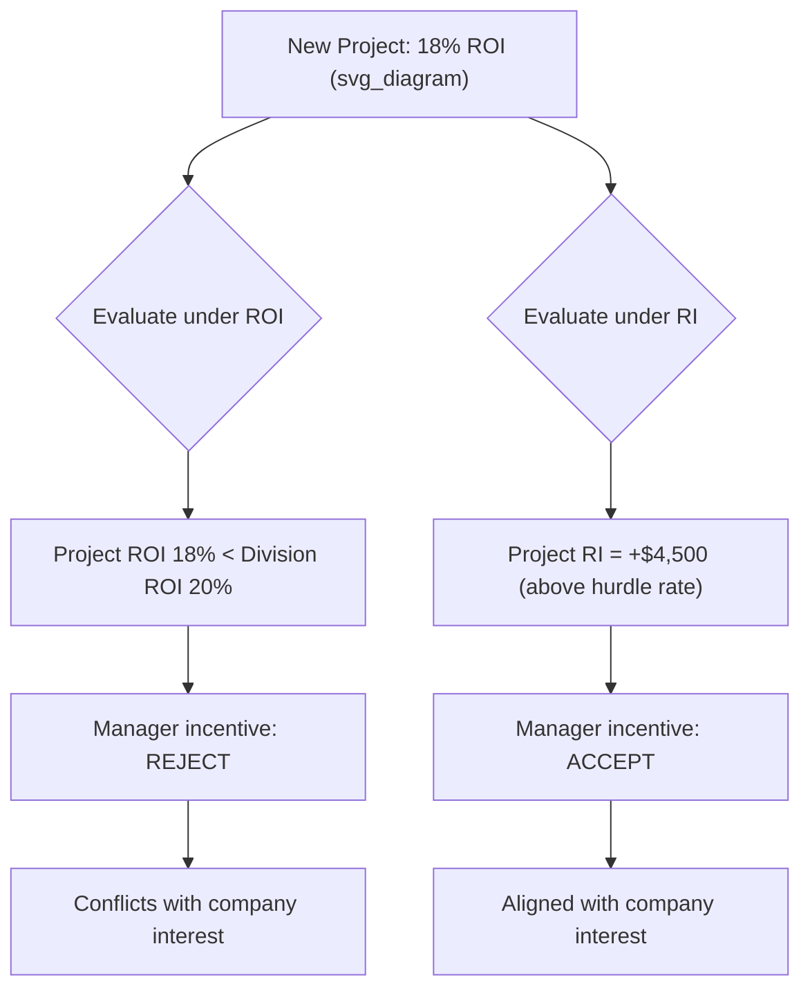

## Residual Income

### Overview

Residual Income (RI) is a performance measure used to evaluate investment centers in decentralized organizations. Unlike Return on Investment (ROI), which expresses performance as a percentage, Residual Income expresses performance as a **dollar amount** — the operating income remaining after subtracting a charge for the minimum required return on the operating assets employed. Residual Income was developed largely to correct the goal congruence problems associated with ROI.

### The Residual Income Formula

$$RI = Operating\ Income - (Average\ Operating\ Assets \times Minimum\ Required\ Rate\ of\ Return)$$

**Key Points**

- *Operating income* is defined the same way as in ROI calculations — income before interest and taxes, generated from normal operating activities.
- *Average operating assets* is typically computed as the average of beginning and ending operating assets, consistent with ROI.
- The *minimum required rate of return* (also called the hurdle rate) usually reflects the company's cost of capital or a target rate set by top management, and represents the minimum return investors/the company expects on invested capital.
- The term *(Average Operating Assets × Minimum Required Rate of Return)* is often called the **imputed interest charge** or **capital charge** — it represents the opportunity cost of tying up capital in the division's assets.

### Worked Example

A division reports the following:

| Item | Amount |
| --- | --- |
| Operating Income | $160,000 |
| Average Operating Assets | $800,000 |
| Minimum Required Rate of Return | 15% |

**Step 1 — Compute the imputed interest charge**

$$Imputed\ Interest\ Charge = 800{,}000 \times 0.15 = 120{,}000$$

**Step 2 — Compute Residual Income**

$$RI = 160{,}000 - 120{,}000 = 40{,}000$$

The division generates $40,000 of operating income *above* what is required to cover the minimum return on its asset base — this positive residual income indicates the division is creating economic value beyond the hurdle rate.

### Why Residual Income Solves the ROI Goal Congruence Problem

**Key Points**

- Under ROI, a division manager may reject a project whose ROI exceeds the company's minimum required rate of return but is *below the division's current average ROI*, because accepting it would pull down the division's overall ROI percentage — even though the project is beneficial to the company as a whole.
- Under RI, a manager is evaluated on maximizing a **dollar amount**, not a ratio. Any project earning a return above the minimum required rate of return will *increase* total Residual Income when accepted, regardless of the division's existing average performance.
- This means RI encourages managers to accept all projects that earn more than the minimum required rate of return, aligning divisional decision-making with overall company goals (**goal congruence**).

### Illustration: ROI vs. RI Decision Conflict

Assume a division currently has:

| Item | Amount |
| --- | --- |
| Operating Income | $160,000 |
| Average Operating Assets | $800,000 |
| Current Division ROI | 20% |
| Minimum Required Rate of Return | 15% |

A new investment opportunity is available:

| Item | Amount |
| --- | --- |
| Additional Operating Income | $27,000 |
| Additional Operating Assets Required | $150,000 |
| Project ROI | 18% |

**Under ROI evaluation:**

$$New\ Division\ ROI = \dfrac{160{,}000 + 27{,}000}{800{,}000 + 150{,}000} = \dfrac{187{,}000}{950{,}000} = 19.68\%$$

Since 19.68% < 20% (current ROI), a manager evaluated solely on ROI is incentivized to **reject** this project, even though it earns 18%, well above the 15% minimum required rate of return.

**Under RI evaluation:**

$$Project\ RI = 27{,}000 - (150{,}000 \times 0.15) = 27{,}000 - 22{,}500 = 4{,}500$$

Since the project's Residual Income is positive ($4,500), a manager evaluated on RI is incentivized to **accept** this project, correctly aligning with the company's interest in taking on any project earning above its cost of capital.

### Decision Comparison Diagram

### Advantages of Residual Income

**Key Points**

- Promotes **goal congruence** by encouraging acceptance of all value-adding projects (those earning above the minimum required rate of return)
- Explicitly incorporates the **cost of capital**, unlike basic ROI
- Focuses managerial attention on maximizing an absolute dollar contribution to company value, not merely a ratio
- Allows the minimum required rate of return to be adjusted for differing risk levels across divisions

### Limitations of Residual Income

**Key Points**

- **Not directly comparable across divisions of different sizes** — a larger division will tend to naturally generate a larger RI dollar amount even if it is less efficient on a percentage basis, making cross-division comparison difficult without normalizing for size.
- Selecting an appropriate minimum required rate of return can be subjective and may not accurately reflect divisional risk differences unless deliberately adjusted. [Inference] In practice, companies may use a single company-wide rate for simplicity even when divisions carry different risk profiles, which can distort investment incentives.
- Like ROI, RI is sensitive to the asset valuation method used (net book value vs. gross book value), and historical cost measures may not reflect current economic value of assets. [Unverified — depends on the specific valuation method and accounting policies used by the organization]

### Residual Income vs. Economic Value Added (EVA)

**Key Points**

- Economic Value Added (EVA) is a specific, trademarked variant of Residual Income developed by Stern Stewart & Co., using after-tax operating income and the weighted average cost of capital (WACC), with additional adjustments to accounting figures (e.g., capitalizing R&D, adjusting for certain reserves).
- Basic Residual Income as taught in introductory managerial accounting typically uses pre-tax operating income and a specified minimum required rate of return, without the additional adjustments used in EVA calculations.
- Both share the same conceptual foundation: performance measured as income in excess of a capital charge.

### Summary Comparison: ROI vs. Residual Income

| Feature | ROI | Residual Income |
| --- | --- | --- |
| Measurement Unit | Percentage | Dollar amount |
| Goal Congruence | Can be problematic | Generally promotes it |
| Cross-Division Comparability | Strong (size-neutral) | Weak (favors larger divisions) |
| Incorporates Cost of Capital | Not explicitly | Explicitly (via minimum required rate) |
| Risk of Rejecting Value-Adding Projects | Higher | Lower |

### Related Topics

- Return on Investment (ROI) and the DuPont Formula
- Economic Value Added (EVA)
- Minimum required rate of return / cost of capital determination
- Goal congruence in decentralized organizations
- Transfer pricing between investment centers
- Capital budgeting techniques (NPV, IRR) as complements to RI-based evaluation
- Asset valuation methods in performance measurement (net vs. gross book value)