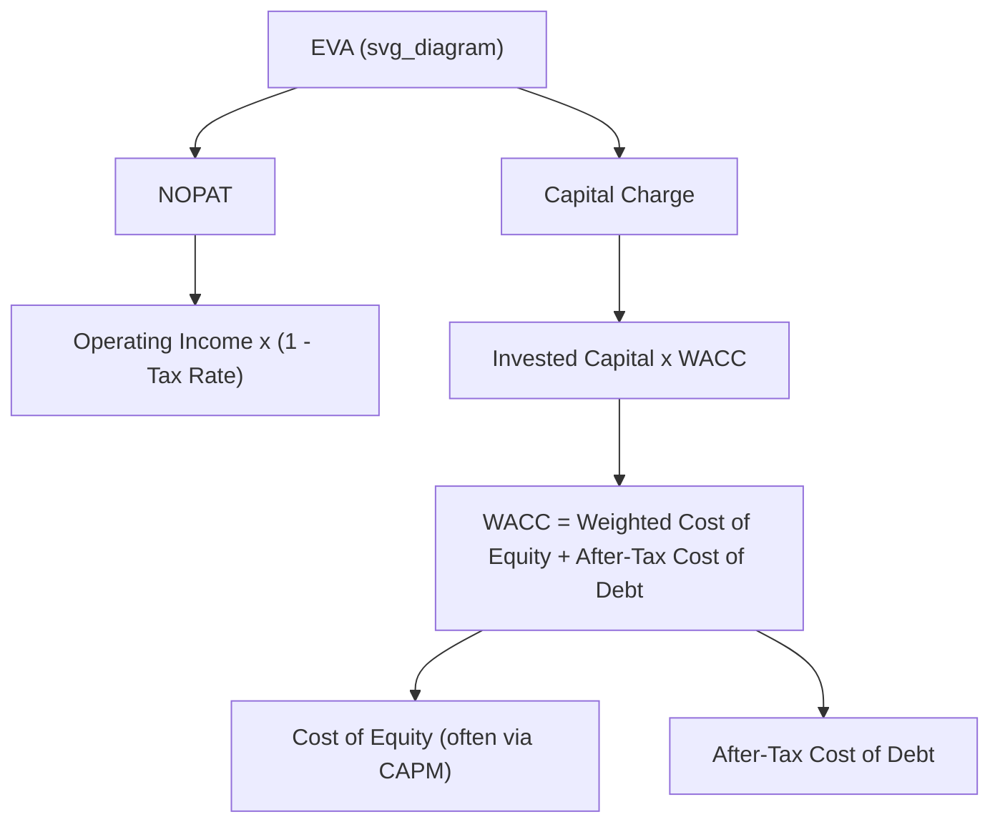

## Economic Value Added

### Overview

Economic Value Added (EVA) is a specific, refined variant of Residual Income used to measure the true economic profit generated by a division, business unit, or company after accounting for the cost of all capital employed — both debt and equity. EVA was developed and trademarked by the consulting firm Stern Stewart & Co. and is widely used as a performance measure and incentive-compensation basis because it explicitly captures whether an entity is creating or destroying shareholder value.

### The EVA Formula

$$EVA = NOPAT - (Invested\ Capital \times WACC)$$

Where:

- **NOPAT** = Net Operating Profit After Taxes
- **Invested Capital** = total capital employed in operations (typically total assets minus non-interest-bearing current liabilities, or equivalently, total debt plus equity used to fund operations)
- **WACC** = Weighted Average Cost of Capital

**Key Points**

- EVA is conceptually identical to Residual Income (RI): income in excess of a capital charge. The distinction is that EVA uses **after-tax** operating profit and the **weighted average cost of capital** (blending the cost of debt and the cost of equity), whereas basic RI as introduced in managerial accounting typically uses **pre-tax** operating income and a simpler, specified minimum required rate of return.
- EVA is generally used at the company-wide or larger business-unit level (given the complexity of computing WACC and making the necessary accounting adjustments), while basic RI is more commonly applied at the divisional level in introductory coursework.

### Computing NOPAT

$$NOPAT = Operating\ Income \times (1 - Tax\ Rate)$$

[Inference] In more rigorous EVA implementations (as originally designed by Stern Stewart), NOPAT is also adjusted for items such as capitalizing R&D expenditures, adjusting for LIFO reserves, and reclassifying certain items typically treated as expenses under GAAP into investments — these adjustments are intended to more closely reflect true economic performance rather than accounting profit. Basic managerial accounting courses often omit these adjustments and use NOPAT calculated directly from reported operating income.

### Computing WACC

$$WACC = \left(\dfrac{E}{V} \times R_e\right) + \left(\dfrac{D}{V} \times R_d \times (1 - Tax\ Rate)\right)$$

Where:

- $E$ = market value of equity
- $D$ = market value of debt
- $V = E + D$ (total value of capital)
- $R_e$ = cost of equity (often estimated using the Capital Asset Pricing Model, CAPM)
- $R_d$ = cost of debt (before tax)

**Key Points**

- The after-tax cost of debt is used because interest expense is tax-deductible, creating a "tax shield" that lowers the effective cost of debt financing.
- WACC represents the blended minimum rate of return required by all providers of capital (both bondholders and shareholders) to compensate them for the risk of investing in the company.

### Worked Example

A company reports:

| Item | Amount |
| --- | --- |
| Operating Income | $500,000 |
| Tax Rate | 30% |
| Invested Capital | $2,500,000 |
| WACC | 12% |

**Step 1 — Compute NOPAT**

$$NOPAT = 500{,}000 \times (1 - 0.30) = 500{,}000 \times 0.70 = 350{,}000$$

**Step 2 — Compute the Capital Charge**

$$Capital\ Charge = 2{,}500{,}000 \times 0.12 = 300{,}000$$

**Step 3 — Compute EVA**

$$EVA = 350{,}000 - 300{,}000 = 50{,}000$$

A positive EVA of $50,000 indicates the company generated $50,000 of economic profit above what is required to compensate all capital providers — i.e., the company **created shareholder value** during the period.

### Interpreting EVA Results

| EVA Result | Interpretation |
| --- | --- |
| EVA > 0 | Value created — return on invested capital exceeds WACC |
| EVA = 0 | Break-even — return exactly covers the cost of capital |
| EVA < 0 | Value destroyed — return on invested capital falls short of WACC |

### EVA Relationship Diagram

### EVA vs. Basic Residual Income

| Feature | Basic Residual Income | EVA |
| --- | --- | --- |
| Income Measure | Pre-tax operating income | After-tax NOPAT |
| Capital Charge Rate | Minimum required rate of return (company-specified) | Weighted Average Cost of Capital (WACC) |
| Accounting Adjustments | Typically none (uses reported figures directly) | Multiple adjustments to better reflect economic reality [Inference — extent of adjustments varies by implementation] |
| Typical Level of Use | Divisional / investment center | Company-wide or major business unit |
| Trademark Status | Generic concept | Trademarked methodology (Stern Stewart & Co.) |

### Why Companies Use EVA

**Key Points**

- **Goal congruence** — like RI, EVA encourages managers to accept any project or investment expected to earn a return above the cost of capital, since doing so increases EVA.
- **Shareholder value focus** — EVA directly ties divisional or corporate performance to the creation of economic value for shareholders, rather than accounting profit alone, which can be manipulated or may not reflect the true cost of the capital employed.
- **Incentive compensation** — many companies tie executive and management bonuses to EVA (or changes in EVA over time) specifically because it discourages excessive, low-return capital investment often incentivized by profit-only metrics.

### Limitations of EVA

**Key Points**

- Requires estimating WACC, which depends on inputs (such as cost of equity via CAPM) that involve subjective assumptions. [Unverified — precise estimation methodology varies across firms and analysts]
- The additional accounting adjustments (capitalizing R&D, adjusting reserves, etc.) can be complex, costly to compute and audit, and are not always applied consistently across organizations. [Inference] In practice, many companies adopt a simplified version of EVA without the full set of Stern Stewart adjustments.
- Like ROI and basic RI, EVA remains sensitive to how invested capital/operating assets are valued (e.g., historical cost vs. current market/replacement value).
- Short-term EVA can potentially be improved by reducing long-term investments (such as R&D or growth capital expenditures), which may harm long-term competitiveness if managers are excessively focused on short-term EVA figures. [Inference] This risk depends on how compensation and evaluation horizons are structured within a given organization.

### Related Topics

- Return on Investment (ROI) and the DuPont Formula
- Residual Income (basic RI concept)
- Weighted Average Cost of Capital (WACC) estimation
- Capital Asset Pricing Model (CAPM)
- Goal congruence in decentralized organizations
- Transfer pricing between investment centers
- Balanced Scorecard as a complement to financial value-based measures