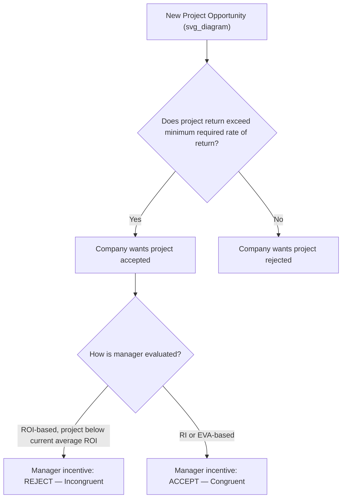

## Goal Congruence and Managerial Incentives

### Overview

Goal congruence exists when the objectives of individual managers or divisions within a decentralized organization align with the overall objectives of the organization as a whole. In responsibility accounting, achieving goal congruence is a central design challenge: performance measures and incentive systems must be structured so that when managers act in their own self-interest (or in the interest of maximizing their evaluated performance metric), they simultaneously act in the best interest of the company.

### Why Goal Congruence Matters in Decentralization

**Key Points**

- Decentralization grants segment managers autonomy over decisions within their responsibility centers (cost, revenue, profit, or investment centers), which improves responsiveness and allows top management to focus on strategic matters.
- This autonomy creates an **agency problem**: managers may pursue actions that improve their own evaluated performance metric even if those actions reduce overall company value.
- A well-designed performance measurement and incentive system reduces the gap between what benefits the manager personally (or their division) and what benefits the organization as a whole.

### Sources of Goal Incongruence

**Key Points**

- **Performance metric design** — metrics like ROI can cause a manager to reject profitable projects that would lower the division's current average return (see below).
- **Short-term vs. long-term incentives** — bonus structures based on current-period income may discourage investments (e.g., R&D, employee training, maintenance) that reduce short-term earnings but benefit the company long-term.
- **Misaligned responsibility and control** — evaluating a manager on factors outside their control (e.g., allocated corporate overhead they cannot influence) distorts incentives and may produce dysfunctional behavior or reduce motivation.
- **Transfer pricing disputes** — in divisions that buy from or sell to each other internally, poorly designed transfer prices can cause a division manager to make decisions that hurt overall company profit while helping their own division's reported performance.

### Illustration: ROI-Driven Goal Incongruence

This is the classic example used to introduce goal congruence in a responsibility accounting context.

A division currently earns a 20% ROI. A new investment opportunity would earn an 18% ROI — well above the company's minimum required rate of return of 15%.

- **From the company's perspective:** the company should want the division to accept this project, since 18% > 15% (it earns more than the cost of capital, creating value for the company).
- **From the division manager's perspective (if evaluated on ROI):** accepting the project would pull the division's average ROI down from 20% toward 18%, making the manager's own performance metric look worse — so a rational, self-interested manager evaluated purely on ROI is incentivized to **reject** the project.

This is a direct case of goal incongruence caused by the choice of performance metric. As shown in Residual Income (RI) content, switching the evaluation basis from ROI (a percentage) to RI or EVA (a dollar amount in excess of a capital charge) resolves this specific incongruence, since accepting the 18% project would increase total RI/EVA regardless of the division's prior average performance.

### Goal Congruence Decision Flow

### Designing Incentive Systems for Goal Congruence

**Key Points**

1. **Choice of performance measure** — selecting RI or EVA over ROI where feasible, or supplementing ROI with other measures, to avoid the percentage-based disincentive to invest.
2. **Controllability principle** — managers should be evaluated only on revenues, costs, and assets they can actually influence; uncontrollable items (like allocated corporate costs) should be excluded or reported separately from controllable performance.
3. **Balanced, multi-dimensional metrics** — using frameworks like the Balanced Scorecard to evaluate performance across financial, customer, internal process, and learning/growth dimensions, reducing overreliance on any single financial number that could be gamed.
4. **Time horizon alignment** — structuring bonuses or incentive compensation to reward sustained performance over multiple periods (not just the current period) to discourage short-termism, e.g., deferred bonuses, multi-year vesting, or evaluation trends over time rather than single-period snapshots.
5. **Appropriate transfer pricing policies** — setting transfer prices (market-based, cost-based, or negotiated) that do not create artificial incentives for a buying or selling division to act against overall company interest.

### The Controllability Principle

**Key Points**

- A core responsibility accounting principle: managers should be held accountable only for revenues, costs, and asset decisions they can control or significantly influence.
- Including uncontrollable costs (e.g., allocated corporate overhead, interest on company-wide debt) in a division manager's evaluated performance can cause resentment, reduced motivation, and may not accurately reflect the manager's actual decision-making quality.
- In practice, companies often prepare **segment margin** reports that separate controllable costs from allocated/uncontrollable costs, evaluating managers primarily on the controllable margin.

### Managerial Behavior Risks When Goal Congruence Is Absent

**Key Points**

- **Underinvestment** — rejecting positive-return projects to protect a favorable existing ratio (as in the ROI example above).
- **Overinvestment** — accepting low-return projects if the metric used doesn't adequately penalize excess capital usage.
- **Earnings management** — manipulating the timing of revenues/expenses to hit short-term targets.
- **Suboptimal transfer pricing behavior** — a selling division may set an artificially high internal transfer price to boost its own reported profit, even if it reduces overall company profit by discouraging the buying division from purchasing internally (leading it to source externally at a cost that hurts the company as a whole). [Inference] The specific direction and severity of this effect depends on the transfer pricing method adopted and the market conditions each division faces.

### Balancing Autonomy and Control

**Key Points**

- Excessive top-down control undermines the core benefits of decentralization (faster decisions, closer alignment with local market conditions, manager development).
- Excessive autonomy without proper incentive alignment risks goal incongruence and value-destroying decisions.
- Effective responsibility accounting systems aim to strike a balance: granting managers genuine decision-making authority while designing performance measures, reporting structures, and incentive compensation that naturally guide self-interested decisions toward the company's overall objectives.

### Related Topics

- Return on Investment (ROI) and the DuPont Formula
- Residual Income
- Economic Value Added (EVA)
- Transfer pricing methods (market-based, cost-based, negotiated)
- Controllability principle and segment margin reporting
- Balanced Scorecard
- Responsibility center types (cost, revenue, profit, investment centers)