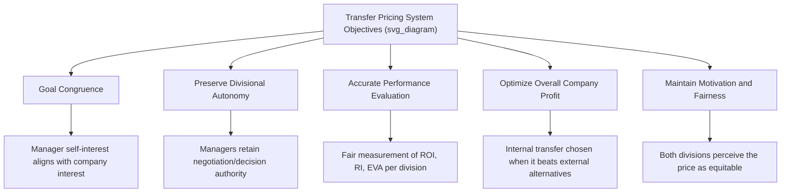

## Objectives of Transfer Pricing Systems

### Overview

A transfer price is the internal price charged when one division, segment, or subsidiary of an organization sells goods or services to another division, segment, or subsidiary within the same company. Transfer pricing systems are a core tool in responsibility accounting for decentralized organizations with multiple profit centers or investment centers that transact with one another. Because these internal transactions directly affect each division's reported revenue, cost, and profit, the design of the transfer pricing system has significant implications for divisional performance evaluation, managerial decision-making, and overall company profitability.

### Primary Objectives of a Transfer Pricing System

**Key Points**

1. **Goal Congruence**

   The transfer price should be set so that when each division manager acts to maximize their own division's reported profit, their decisions also maximize the profit of the company as a whole. A poorly designed transfer price can cause a buying division to purchase externally (hurting the company) or a selling division to underproduce internally, even when internal transfer would be more profitable for the company overall.
2. **Preserving Divisional Autonomy**

   In a decentralized organization, one of the key benefits is that division managers retain decision-making authority. An effective transfer pricing system should, where possible, allow managers the freedom to negotiate or accept/reject internal transfers, rather than having transfer prices dictated entirely by top management — this maintains the motivational and operational benefits of decentralization.
3. **Accurate Performance Evaluation**

   Since transfer prices directly affect the reported revenue of the selling division and the reported cost of the buying division, the transfer price must be set fairly so that each division's profitability is reasonably and accurately measured. An unfair transfer price can distort ROI, Residual Income, or EVA calculations for one or both divisions, undermining the usefulness of these metrics for evaluating managerial performance.
4. **Optimizing Overall Company Profit**

   The transfer pricing system should support decisions (make internally vs. buy externally, sell internally vs. sell externally) that maximize total company profit, not just the profit of individual divisions in isolation.
5. **Maintaining Motivation and Fairness**

   Because managers are often evaluated and compensated based on divisional profit, the transfer price must be perceived as fair by both the buying and selling division managers to sustain motivation and cooperation between divisions.

### Objectives Relationship Diagram

### The Core Tension: Selling Division vs. Buying Division

**Key Points**

- The **selling division** generally wants a transfer price that is as high as possible, since it increases the selling division's reported revenue and profit.
- The **buying division** generally wants a transfer price that is as low as possible, since it reduces the buying division's reported cost and increases its reported profit.
- This natural conflict of interest is precisely why the *design* of the transfer pricing system matters — an arbitrary or poorly chosen method can systematically favor one division over the other, causing dysfunctional behavior (e.g., the buying division sourcing externally purely to avoid an inflated internal price, even when internal sourcing is more efficient for the company overall).

### Why Transfer Pricing Decisions Affect Company-Wide Profit

**Key Points**

- Even though transfer pricing is, on the surface, a matter of allocating profit *between* divisions (which nets to zero at the consolidated company level for the transfer price itself), the *decisions* that result from a given transfer price can have real, non-zero effects on total company profit.
- For example, if a transfer price is set too high, a buying division might rationally decide to purchase an input from an external supplier instead — even if the internal selling division could have produced the item at a lower total cost to the company than the external supplier charges. This decision reduces overall company profit, even though it may appear rational from the buying division's isolated perspective.
- This is why "optimizing overall company profit" and "goal congruence" are listed as central, related objectives: the transfer pricing system exists in part to prevent divisions from making locally rational but globally suboptimal decisions.

### General Range of Acceptable Transfer Prices

**Key Points**

- A transfer price is generally only acceptable to both divisions (and beneficial to the company) if it falls within a certain range:

$$Minimum\ Transfer\ Price \geq Variable\ Cost\ per\ Unit + Opportunity\ Cost\ per\ Unit\ (to\ the\ selling\ division)$$

$$Maximum\ Transfer\ Price \leq External\ Purchase\ Price\ Available\ to\ the\ Buying\ Division$$

- If the selling division has idle/excess capacity (no opportunity cost), the minimum acceptable transfer price is generally at least its variable cost per unit.
- If the selling division is operating at full capacity, the minimum acceptable transfer price must also cover the **opportunity cost** of the lost external sale (i.e., the contribution margin forgone by selling internally instead of externally).
- The buying division will generally not agree to a transfer price above what it would otherwise pay to purchase the same item from an external supplier.
- [Note: Specific transfer pricing *methods* — cost-based, market-based, and negotiated pricing — and the detailed mechanics of the minimum/maximum transfer price range are typically addressed as separate, more detailed topics within the Transfer Pricing chapter.]

### Consequences of Poorly Designed Transfer Pricing Objectives

**Key Points**

- **Suboptimal sourcing decisions** — buying divisions may purchase externally even when internal production is more efficient for the company, or vice versa.
- **Distorted performance evaluation** — division managers may appear more or less successful than their actual operational performance warrants, undermining the credibility of ROI, RI, or EVA-based evaluations.
- **Interdivisional conflict** — persistent disputes over "fair" pricing can damage cooperation and morale between divisions, particularly if one division consistently perceives the pricing system as favoring the other.
- **Erosion of decentralization benefits** — if disputes require constant intervention by top management to resolve, the company loses some of the autonomy and responsiveness benefits that decentralization was intended to provide. [Inference] The degree of this erosion depends on how frequently disputes arise and how the organization's dispute-resolution process is structured.

### Related Topics

- Transfer pricing methods: market-based, cost-based (variable/full cost), and negotiated pricing
- Minimum and maximum transfer price range with idle vs. full capacity scenarios
- Goal congruence and managerial incentives
- Return on Investment (ROI) and the DuPont Formula
- Residual Income and Economic Value Added (EVA)
- Make-or-buy decisions and opportunity cost analysis
- International transfer pricing and tax considerations [Inference — often covered as an advanced/supplementary topic depending on course scope]