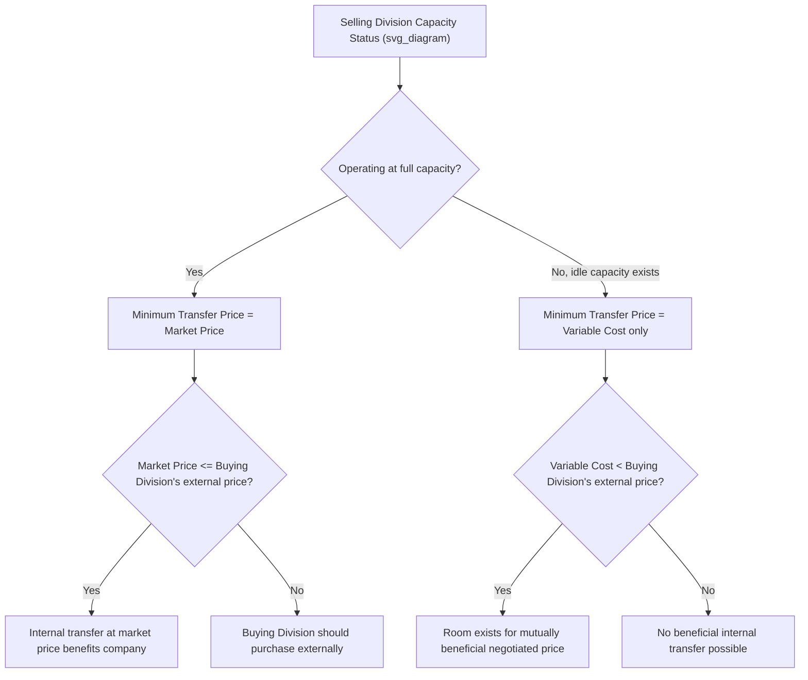

## Market Based Transfer Prices

### Overview

A market-based transfer price sets the internal price for goods or services exchanged between divisions equal to (or derived from) the price the selling division could obtain by selling the same product or service to an external, outside customer — or equivalently, the price the buying division would have to pay to purchase the same item from an external supplier. Market-based transfer pricing is generally considered the theoretically preferred method when a competitive external market for the transferred good or service exists, because it most closely approximates an arm's-length transaction and tends to naturally support goal congruence.

### The Market-Based Transfer Price Formula

$$Transfer\ Price = Current\ Market\ Price\ (sometimes\ adjusted)$$

**Key Points**

- The market price used is typically the price at which the selling division sells the same (or a highly similar) product to external customers, or the price at which the buying division could purchase the same item from an external supplier.
- Adjustments are sometimes made to the pure market price to reflect cost savings from the internal transaction — for example, the selling division may not incur certain selling and distribution costs (advertising, sales commissions, bad debt risk, shipping) when selling internally rather than externally, so the transfer price may be set slightly below the external market price to share these savings between divisions.

### Conditions Required for Market-Based Transfer Pricing to Work Well

**Key Points**

1. **A competitive external market must exist** for the exact (or a very close substitute) product or service being transferred, with an observable, reliable market price.
2. **The selling division should be operating at or near capacity**, or at least have the ability to sell everything it produces externally at the market price — this ensures the market price properly reflects the true opportunity cost of an internal transfer.
3. **Interdependence between divisions should be limited** — the divisions should be able to operate independently (i.e., the buying division could realistically source from outside, and the selling division could realistically sell to outside customers) for the market price to be a meaningful and enforceable benchmark.

[Inference] When these conditions are not fully met — for instance, if no close external market exists, or if the selling division has significant idle capacity — market-based transfer pricing becomes less appropriate or may need to be supplemented or replaced with negotiated or cost-based pricing methods.

### Worked Example — Selling Division at Full Capacity

The Components Division of a company produces a part that it currently sells to outside customers for $50 per unit. Variable cost per unit is $30, and the division is operating at full capacity, selling all units it can produce externally.

The Assembly Division (another division within the same company) wants to purchase 1,000 units of this part internally rather than buying a similar part from an external supplier at $48 per unit.

**Step 1 — Determine the minimum transfer price acceptable to the selling (Components) Division**

Since the Components Division is at full capacity, any unit sold internally means forgoing an external sale. The opportunity cost is the full contribution margin lost:

$$Opportunity\ Cost\ per\ Unit = Market\ Price - Variable\ Cost = 50 - 30 = 20$$

$$Minimum\ Transfer\ Price = Variable\ Cost + Opportunity\ Cost = 30 + 20 = 50$$

This confirms that, at full capacity, the minimum acceptable transfer price equals the market price of $50 — the Components Division has no incentive to sell internally for less than what it can already earn externally.

**Step 2 — Compare to the buying (Assembly) Division's external alternative**

The Assembly Division can buy the same part externally for $48. Since the Components Division's minimum acceptable price ($50) exceeds the Assembly Division's external purchase price ($48), **no mutually beneficial internal transfer should occur** — the Assembly Division should buy externally at $48, and the Components Division should continue selling all its output externally at $50.

This illustrates a key principle: when the selling division is at full capacity and can already sell every unit externally at a price higher than the buying division's outside alternative, the market-based price correctly signals that internal transfer would not benefit the company overall.

### Worked Example — Selling Division with Idle Capacity

Now assume the Components Division has **idle capacity** and is not currently selling all it could produce externally (perhaps external demand at $50 is limited to fewer units than the division's full production capability).

In this scenario, a purely market-based transfer price of $50 may be inappropriate, because it does not reflect the Components Division's true minimum acceptable price when there is no opportunity cost from idle capacity:

$$Minimum\ Transfer\ Price\ (idle\ capacity) = Variable\ Cost\ per\ Unit = 30$$

Since $30 (minimum) < $48 (Assembly Division's external option) < $50 (external market price), a transfer price **negotiated somewhere between $30 and $48** would benefit both divisions and the company overall — but a rigid "always use market price" policy of $50 would incorrectly block a mutually beneficial internal transfer.

[Note: this idle-capacity scenario illustrates why pure market-based pricing is best suited to full-capacity conditions; negotiated or cost-based pricing is often better suited to idle-capacity conditions, typically covered as related but separate topics.]

### Market-Based Transfer Pricing Decision Flow

### Advantages of Market-Based Transfer Pricing

**Key Points**

- **Strong support for goal congruence** — when a genuine competitive market exists and the selling division is at capacity, using the market price naturally leads both divisions toward decisions that also maximize company-wide profit.
- **Objective and verifiable** — the price is anchored to an external, observable benchmark rather than an internally negotiated or cost-derived figure, reducing disputes over fairness.
- **Preserves divisional autonomy** — both divisions can, in principle, choose to transact internally or externally based on the same price signal, similar to how independent companies would transact at arm's length.
- **Supports accurate performance evaluation** — since the transfer price reflects a genuine market rate, each division's reported profit more fairly reflects its actual economic contribution, supporting reliable ROI, RI, or EVA calculations.

### Limitations of Market-Based Transfer Pricing

**Key Points**

- **Requires an active, reliable external market** for the exact or a very comparable product/service — many internally transferred goods or services (e.g., highly specialized intermediate components, internal IT services, shared administrative services) have no directly comparable external market price. [Unverified — the availability of a suitable market price is highly dependent on the specific product/service and industry]
- **Less appropriate under idle capacity**, as shown in the worked example above, since a rigid market price can block internal transfers that would benefit the company overall.
- **Market price volatility** — if the relevant external market price fluctuates significantly, using it as a transfer price can introduce volatility into divisional performance reports that may not reflect changes in the divisions' actual underlying efficiency or operations.
- **Quality/service differences** — the external market price may reflect a good or service with different specifications, quality levels, payment terms, or service guarantees than what is provided internally, making direct comparison imperfect. [Inference] Adjustments to the raw market price are often necessary to account for such differences, though the specific adjustment approach varies by situation.

### Related Topics

- Objectives of Transfer Pricing Systems
- Cost-Based Transfer Prices (variable cost and full/absorption cost methods)
- Negotiated Transfer Prices
- Minimum and maximum transfer price range under idle vs. full capacity
- Goal congruence and managerial incentives
- Opportunity cost analysis in make-or-buy and internal transfer decisions
- Return on Investment (ROI), Residual Income, and Economic Value Added as affected by transfer pricing choices