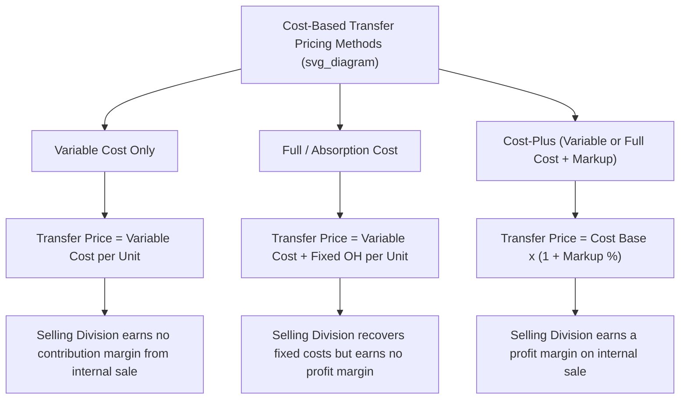

## Cost Based Transfer Prices

### Overview

A cost-based transfer price sets the internal price for goods or services exchanged between divisions using some measure of the selling division's cost to produce the item, rather than an external market price. Cost-based transfer pricing is commonly used when no reliable external market price exists for the transferred good or service, or when the transferred item is highly specialized, unique to the company, or has no close external substitute. There are several variations of cost-based transfer pricing, differing primarily in which cost base is used and whether a markup is added.

### Common Cost-Based Transfer Pricing Methods

**Key Points**

1. **Variable Cost Transfer Pricing**

   $$Transfer\ Price = Variable\ Cost\ per\ Unit$$
2. **Full (Absorption) Cost Transfer Pricing**

   $$Transfer\ Price = Variable\ Cost\ per\ Unit + Fixed\ Manufacturing\ Overhead\ per\ Unit$$
3. **Cost-Plus Transfer Pricing** (variable or full cost plus a markup)

   $$Transfer\ Price = Cost\ Base + (Markup\ \% \times Cost\ Base)$$

**Key Points**

- The *cost base* used in cost-plus pricing can be either variable cost or full (absorption) cost, depending on company policy.
- The *markup* is typically intended to allow the selling division to earn a reasonable profit margin on the internal transaction, rather than transferring goods at bare cost.
- Which specific cost definition is used (variable-only, full/absorption, or cost-plus) is a significant policy decision with real consequences for each division's reported profitability and incentives, as illustrated below.

### Worked Example — Variable Cost vs. Full Cost vs. Cost-Plus

The Fabrication Division produces a component with the following cost structure, and has idle capacity (no external market exists for this exact component):

| Item | Amount per Unit |
| --- | --- |
| Direct Materials | $12 |
| Direct Labor | $8 |
| Variable Manufacturing Overhead | $5 |
| Fixed Manufacturing Overhead (allocated) | $10 |
| **Variable Cost per Unit** | **$25** |
| **Full (Absorption) Cost per Unit** | **$35** |

**Variable Cost Transfer Price:**

$$Transfer\ Price = 25$$

**Full Cost Transfer Price:**

$$Transfer\ Price = 35$$

**Cost-Plus Transfer Price** (using full cost with a 20% markup):

$$Transfer\ Price = 35 + (0.20 \times 35) = 35 + 7 = 42$$

Each method produces a materially different transfer price ($25, $35, or $42) from the identical underlying cost structure, which directly changes both divisions' reported profit on the transaction.

### Cost-Based Method Comparison Diagram

### Key Implications of Each Method

**Key Points**

- **Variable cost transfer pricing:**
  - Correctly signals the short-run economic cost of production when the selling division has idle capacity, supporting good short-term make-vs-buy type decisions at the company level.
  - However, the selling division earns **no contribution margin or profit** on the internal sale, which can reduce the selling division manager's motivation to supply internally, since internal sales do not improve that division's reported profitability at all.
- **Full (absorption) cost transfer pricing:**
  - Allows the selling division to recover its fixed manufacturing overhead costs on internal sales, in addition to variable costs.
  - Still provides no profit margin, so the selling division manager may still prefer external sales (where a profit margin can typically be earned) over internal transfers, unless required by company policy.
  - Can distort the buying division's decisions if it does not consider that the fixed cost component would still be incurred by the company regardless of whether the item is bought internally or externally — from a company-wide perspective, if the selling division has idle capacity, only variable cost is truly relevant to the buy-vs-transfer decision.
- **Cost-plus transfer pricing:**
  - Gives the selling division a profit margin on internal transactions, which helps address the motivational concerns of variable-cost and full-cost-only pricing.
  - Introduces a **new goal congruence risk**: the buying division's cost is inflated above the selling division's actual production cost, which could cause the buying division to reject an internally sourced item that would actually be cheaper for the company overall (e.g., if the buying division's next-best external alternative is priced between the true cost and the cost-plus transfer price).

### Illustrative Goal Congruence Risk with Cost-Plus Pricing

Continuing the earlier example: if the Fabrication Division's actual cost to produce the component is $35 (full cost) but the cost-plus transfer price is set at $42, and the buying division can purchase a similar (though not identical) component externally for $40:

- From the **company's perspective**, internal production at a true cost of $35 is cheaper than the $40 external option — internal transfer should occur.
- From the **buying division's perspective**, the cost-plus transfer price of $42 exceeds the external price of $40, so a self-interested buying division manager would rationally choose to purchase externally at $40.
- This is a goal incongruence problem directly caused by the markup added in cost-plus pricing — the company loses $5 per unit ($40 external cost vs. $35 true internal cost) because the transfer pricing policy discouraged the more efficient internal transaction.

[Inference] This type of conflict is one of the primary reasons negotiated transfer pricing is often introduced as an alternative or supplement to rigid cost-plus formulas — negotiation allows both divisions to reach a price between true cost and the external alternative that both find acceptable.

### When Cost-Based Transfer Pricing Is Appropriate

**Key Points**

- No reliable external market price exists for the transferred good or service (e.g., a highly specialized internal part, or an internal service like centralized IT support or internal audit).
- The transferred item is unique to the company's internal operations and has no comparable external substitute for benchmarking.
- Top management wants a simple, formulaic, low-dispute method that does not require ongoing negotiation between divisions. [Inference] This administrative simplicity is often cited as a practical advantage, though it comes at the cost of the goal congruence and motivational issues discussed above.

### Standard Cost vs. Actual Cost as the Cost Base

**Key Points**

- Some companies use **standard cost** (a predetermined, budgeted cost) rather than **actual cost** as the basis for cost-based transfer prices.
- Using standard cost prevents the selling division from passing on its own production inefficiencies (cost overruns, waste, unfavorable variances) to the buying division in the form of a higher transfer price — this is often considered a best practice, since it isolates the buying division's cost from the selling division's operational performance.
- If actual cost is used instead, the buying division absorbs the financial impact of the selling division's inefficiencies, which can distort the buying division's own performance evaluation and reduce the selling division's incentive to control its costs.

### Advantages and Limitations Summary

| Aspect | Variable Cost | Full Cost | Cost-Plus |
| --- | --- | --- | --- |
| Selling division earns profit margin? | No | No | Yes |
| Covers fixed overhead? | No | Yes | Yes (plus markup) |
| Risk of goal incongruence (buying division over-costed) | Low | Moderate | Higher |
| Motivational appeal to selling division manager | Low | Low–Moderate | Higher |
| Administrative simplicity | High | High | High |
| Reflects true short-run economic cost (idle capacity) | Yes | No | No |

### Related Topics

- Objectives of Transfer Pricing Systems
- Market-Based Transfer Prices
- Negotiated Transfer Prices
- Minimum and maximum transfer price range under idle vs. full capacity
- Standard costing and variance analysis
- Goal congruence and managerial incentives
- Make-or-buy decisions and relevant cost analysis