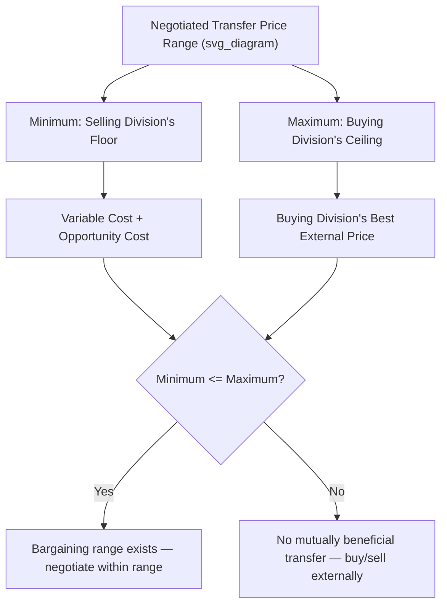

## Negotiated Transfer Prices

### Overview

A negotiated transfer price is a price for internally transferred goods or services that is determined through direct bargaining between the manager of the selling division and the manager of the buying division, rather than being dictated by a rigid formula (as in cost-based pricing) or set strictly equal to an external market rate (as in market-based pricing). Negotiated transfer pricing is often used when no perfectly comparable external market exists, when the selling division has idle capacity, or when top management wants to preserve maximum divisional autonomy by allowing managers to reach a mutually agreeable price themselves.

### The Negotiated Price Range

**Key Points**

Negotiated transfer pricing operates within a bounded range, with the **minimum** set by the selling division's floor price and the **maximum** set by the buying division's ceiling price:

$$Minimum\ Transfer\ Price = Variable\ Cost\ per\ Unit + Opportunity\ Cost\ per\ Unit$$

$$Maximum\ Transfer\ Price = Price\ the\ Buying\ Division\ Would\ Pay\ an\ External\ Supplier$$

- The **minimum** represents the lowest price the selling division manager should rationally accept — any price below this makes the selling division worse off than its next-best alternative use of capacity.
- The **maximum** represents the highest price the buying division manager should rationally agree to — any price above this makes the buying division worse off than simply purchasing externally.
- If $Minimum \leq Maximum$, a **bargaining range** exists, and a mutually beneficial negotiated price can be found somewhere within that range.
- If $Minimum > Maximum$, **no mutually beneficial transfer is possible**, and the buying division should purchase externally while the selling division should continue selling externally (or to whichever alternative use is most profitable).

### Determining the Selling Division's Minimum (Floor) Price

**Key Points**

- If the selling division has **idle capacity** (unused production capacity, no lost external sales), the opportunity cost is zero, and:

$$Minimum\ Transfer\ Price\ (idle\ capacity) = Variable\ Cost\ per\ Unit$$

- If the selling division is operating **at full capacity**, every unit sold internally displaces a unit that could have been sold externally, so the opportunity cost equals the forgone contribution margin:

$$Minimum\ Transfer\ Price\ (full\ capacity) = Variable\ Cost\ per\ Unit + (External\ Price - Variable\ Cost\ per\ Unit) = External\ Price$$

- At full capacity, the minimum negotiated price effectively converges to the external market price, since the selling division has no incentive to accept less than what it could already earn from an outside customer.

### Worked Example — Bargaining Range Exists

The Circuit Board Division has idle capacity and produces boards at a variable cost of $18 per unit. The Assembly Division needs these boards and can purchase a comparable board externally for $27 per unit.

**Step 1 — Determine the minimum (Circuit Board Division's floor)**

Since idle capacity exists:

$$Minimum\ Transfer\ Price = 18$$

**Step 2 — Determine the maximum (Assembly Division's ceiling)**

$$Maximum\ Transfer\ Price = 27$$

**Step 3 — Identify the bargaining range**

$$Bargaining\ Range: \$18 \leq Transfer\ Price \leq \$27$$

Since the minimum ($18) is less than the maximum ($27), a bargaining range of $9 per unit exists. Any price the two managers negotiate within this $18–$27 range benefits both divisions relative to their respective next-best alternatives, and also benefits the company overall (since internal transfer at any price in this range costs the company only $18 in variable cost, versus $27 if the Assembly Division bought externally).

The final negotiated price within this range (e.g., $22, splitting the difference, or another value depending on relative bargaining power) affects **how the $9 per unit of company-wide benefit is divided** between the two divisions, but does not change the fact that internal transfer is the economically correct decision for the company as a whole.

### Worked Example — No Bargaining Range Exists

Now assume the Circuit Board Division is operating at **full capacity**, selling all it can produce externally at $27 per unit (same variable cost of $18).

**Step 1 — Determine the minimum (Circuit Board Division's floor)**

At full capacity:

$$Minimum\ Transfer\ Price = Variable\ Cost + Opportunity\ Cost = 18 + (27-18) = 27$$

**Step 2 — Determine the maximum (Assembly Division's ceiling)**

The Assembly Division can still buy externally for $27:

$$Maximum\ Transfer\ Price = 27$$

**Step 3 — Identify the bargaining range**

$$Bargaining\ Range: Minimum\ (\$27) = Maximum\ (\$27)$$

The bargaining range has collapsed to a single point. There is no room for a mutually beneficial negotiated discount — the only rational negotiated price equals $27, which is identical to simply having the Assembly Division buy externally. In this case, negotiation offers no advantage over market-based pricing, and the transaction is economically indifferent to the company whether it occurs internally or externally.

### Negotiation Range Diagram

### Advantages of Negotiated Transfer Pricing

**Key Points**

- **Preserves divisional autonomy** — managers retain genuine authority to accept, reject, or shape the terms of internal transactions, reinforcing the core motivational benefits of decentralization.
- **Flexible for situations without a clean external market price** — works well when the transferred item is not perfectly identical to anything sold externally, allowing managers to account for quality, timing, or service differences during negotiation.
- **Naturally respects the economically relevant bargaining range** — because rational managers will not agree to a price outside their respective floor/ceiling, negotiated outcomes tend to support goal congruence, provided both managers have good information and reasonably balanced bargaining power.
- **Accounts for idle capacity appropriately** — unlike a rigid market-price rule, negotiation naturally allows for lower prices when the selling division has unused capacity, capturing mutually beneficial transfers that a strict market-price policy might block.

### Limitations of Negotiated Transfer Pricing

**Key Points**

- **Time-consuming** — negotiation between division managers can take significant time and management effort, particularly for recurring or high-volume transactions. [Inference] The administrative burden scales with the frequency and complexity of the transactions being negotiated.
- **Outcome depends on relative bargaining power/skill** — a manager who is a stronger negotiator, or who has better information about the counterpart's true costs or alternatives, may capture a disproportionate share of the available benefit, which can seem unfair and affect morale.
- **Risk of unresolved disputes** — if managers cannot reach an agreement even when a bargaining range genuinely exists, the potential company-wide benefit is lost unless top management intervenes, which can undermine the autonomy that negotiated pricing was intended to preserve.
- **Information asymmetry** — a division may not have full visibility into the other division's true cost structure or actual external alternatives, potentially leading to suboptimal negotiated outcomes relative to the theoretically efficient price. [Unverified — the extent of this issue depends heavily on internal transparency practices at a given organization]

### Comparison: Negotiated vs. Market-Based vs. Cost-Based

| Feature | Negotiated | Market-Based | Cost-Based |
| --- | --- | --- | --- |
| Requires external market price | No | Yes | No |
| Preserves divisional autonomy | High | Moderate | Low |
| Handles idle capacity well | Yes | Poorly (rigid) | Yes (esp. variable cost) |
| Administrative burden | Higher (ongoing negotiation) | Low | Low |
| Risk of unresolved disputes | Yes | Low | Low |
| Naturally supports goal congruence | Generally yes, if bargaining range exists | Yes, if at full capacity | Depends on method (risk with cost-plus) |

### Related Topics

- Objectives of Transfer Pricing Systems
- Market-Based Transfer Prices
- Cost-Based Transfer Prices
- Minimum and maximum transfer price range under idle vs. full capacity
- Goal congruence and managerial incentives
- Opportunity cost analysis in transfer pricing decisions
- Dispute resolution and top management intervention in decentralized organizations