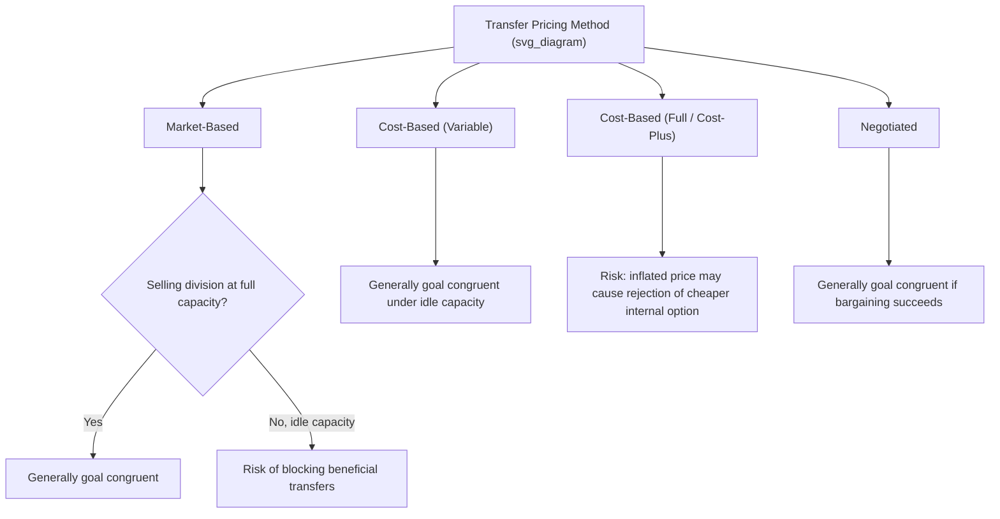

## Transfer Pricing and Goal Congruence

### Overview

Transfer pricing and goal congruence are tightly linked in responsibility accounting: the transfer pricing method a company chooses directly determines whether division managers, acting rationally in their own reported self-interest, will also make decisions that maximize overall company profit. This topic synthesizes how each transfer pricing approach (market-based, cost-based, and negotiated) affects goal congruence, and establishes the general decision rule that determines whether an internal transfer is economically beneficial to the company as a whole, independent of which specific pricing method is used to divide that benefit between divisions.

### The General Rule for Company-Wide Optimal Transfer Decisions

**Key Points**

Regardless of which transfer pricing method is used to set the actual price, the transfer **should occur** (from the company's perspective) whenever:

$$Selling\ Division's\ Minimum\ Acceptable\ Price \leq Buying\ Division's\ Maximum\ Acceptable\ Price$$

Equivalently:

$$(Variable\ Cost + Opportunity\ Cost)_{selling} \leq External\ Purchase\ Price_{buying}$$

- This rule is independent of the specific transfer pricing *method* chosen — it reflects the underlying economics of whether internal transfer creates more value for the company than the buying division's next-best external alternative.
- Goal congruence is achieved when the *chosen transfer pricing method* leads both division managers to voluntarily agree to transfer whenever this rule indicates they should, and to decline whenever it indicates they should not.
- A transfer pricing method causes **goal incongruence** whenever it produces a price that induces a decision opposite to what this underlying economic rule would recommend.

### How Each Method Interacts with Goal Congruence

**Key Points**

**Market-Based Pricing**

- Tends to strongly support goal congruence **when the selling division is at full capacity** and a genuine competitive market exists, since the market price then equals the true opportunity cost, causing both divisions' self-interested decisions to align with the company-optimal decision.
- Can **undermine** goal congruence under idle capacity, since a rigid market price may exceed the buying division's external alternative even though the selling division's true minimum (variable cost only) is well below it — blocking a transfer that would benefit the company.

**Cost-Based Pricing**

- **Variable cost only:** generally supports goal congruence well under idle capacity, since it reflects the true short-run economic cost to the company, correctly signaling when internal transfer beats an external alternative. However, it provides no incentive/motivation for the selling division to prioritize internal transfers, since no profit margin is earned.
- **Full (absorption) cost:** can create goal incongruence if fixed costs are irrelevant to the transfer decision (e.g., they will be incurred by the company regardless of the sourcing decision) but are nonetheless included in the price the buying division sees, potentially inflating the price above true cost and discouraging a transfer that would otherwise benefit the company.
- **Cost-plus:** the added markup raises the price above the selling division's true cost, which can cause the buying division to reject a genuinely cheaper internal option in favor of an external option that only appears cheaper because of the markup — creating a direct and well-known goal incongruence.

**Negotiated Pricing**

- Tends to support goal congruence well, since rational managers will only agree to a negotiated price within the range bounded by the selling division's true minimum and the buying division's true maximum — any price both managers agree to, by construction, falls within a range that benefits the company overall.
- Can fail to achieve goal congruence only if negotiations break down due to poor information, unequal bargaining power, or time constraints, even when a genuine bargaining range exists.

### Goal Congruence Outcomes by Method and Capacity Diagram

### Worked Example — Comparing Methods on the Same Facts

The Motor Division has idle capacity and produces a motor at a variable cost of $40 per unit and a full (absorption) cost of $55 per unit (fixed overhead of $15 allocated per unit). The Equipment Division can purchase a comparable motor externally for $50 per unit.

**Underlying company-optimal decision (general rule):**

$$Minimum\ (idle\ capacity) = Variable\ Cost = 40 \leq External\ Price = 50 = Maximum$$

Since $40 ≤ $50, the company is better off with an internal transfer — every unit transferred internally saves the company $10 ($50 external cost avoided minus $40 true internal variable cost) relative to the buying division purchasing externally.

**Testing each method against this benchmark:**

| Method | Transfer Price | Buying Division Compares To | Decision | Goal Congruent? |
| --- | --- | --- | --- | --- |
| Variable Cost | $40 | $50 external | Buy internally | Yes — matches company-optimal decision |
| Full Cost | $55 | $50 external | Buy externally | **No** — company loses $10/unit of potential benefit |
| Cost-Plus (Full Cost + 15%) | $63.25 | $50 external | Buy externally | **No** — same problem, magnified |
| Negotiated (e.g., $45, split of $10 benefit) | $45 | $50 external | Buy internally | Yes — matches company-optimal decision |

This example demonstrates directly how, holding the underlying economics constant, the *choice of transfer pricing method* alone can cause the buying division to make a decision that helps or hurts the company overall — full cost and cost-plus pricing induce a decision that contradicts the company-optimal outcome, while variable-cost and (successfully) negotiated pricing align with it.

### Why This Matters for Responsibility Accounting

**Key Points**

- Transfer pricing is one of the clearest, most quantifiable illustrations of the broader goal congruence problem introduced in responsibility accounting: a metric or pricing rule can look reasonable in isolation but produce systematically wrong incentives at the divisional level.
- Because division managers are typically evaluated (and often compensated) based on their division's reported profit, ROI, RI, or EVA — all of which are directly affected by the transfer price used — a poorly chosen transfer pricing method doesn't just cause a one-time bad decision; it creates an **ongoing, structural incentive** for managers to systematically favor external transactions over more efficient internal ones (or vice versa).
- This is why the transfer pricing method is not merely an accounting/bookkeeping choice but a genuine **incentive design problem** that top management must solve deliberately, often requiring a combination of methods, negotiation flexibility, or top-management override authority for genuinely conflicting cases. [Inference] The specific combination adopted varies significantly by company and industry practice.

### Mitigating Goal Incongruence in Transfer Pricing Systems

**Key Points**

1. **Use variable cost (not full cost) as the pricing floor** when the selling division has idle capacity, to avoid embedding irrelevant fixed costs into the buying division's decision.
2. **Allow negotiation** where a clean market price is unavailable or capacity conditions are mixed, so managers can reach a mutually beneficial price within the true bargaining range.
3. **Grant top management dual pricing or arbitration authority** for cases where divisions cannot reach agreement, ensuring company-optimal transfers still occur even if the specific price allocation between divisions remains contested. [Inference] "Dual pricing" (where the selling division records one transfer price and the buying division records another, with the difference reconciled at a corporate level) is sometimes used specifically to resolve otherwise irreconcilable disputes while still permitting the economically correct transfer to occur.
4. **Regularly review transfer pricing policy** against actual capacity utilization and market conditions, since a method appropriate at full capacity (market-based) may become goal-incongruent if capacity conditions shift toward idle capacity, and vice versa.

### Related Topics

- Objectives of Transfer Pricing Systems
- Market-Based Transfer Prices
- Cost-Based Transfer Prices
- Negotiated Transfer Prices
- Goal Congruence and Managerial Incentives
- Return on Investment (ROI), Residual Income, and Economic Value Added as affected by transfer pricing
- Dual pricing and top-management arbitration in transfer pricing disputes