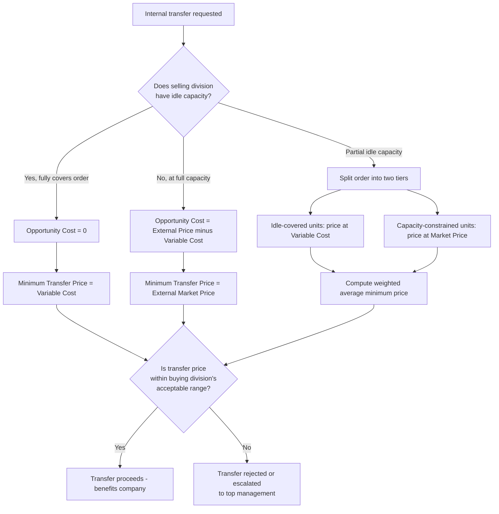

## Transfer Pricing Under Idle versus Full Capacity

### Definition and Context

Transfer pricing is the internal price charged when one division (the selling division) transfers goods or services to another division (the buying division) within the same decentralized organization. The appropriate transfer price depends critically on whether the selling division has idle (excess) capacity or is operating at full capacity, because capacity status determines the **opportunity cost** of the internal transfer.

### The General Transfer Pricing Rule

The foundational formula for the minimum transfer price (the floor the selling division should accept) is:

$$\text{Minimum Transfer Price} = \text{Variable Cost per Unit} + \frac{\text{Opportunity Cost of the Transfer}}{\text{Units Transferred}}$$

This is often simplified per unit as:

$$\text{Minimum Transfer Price} = \text{Variable Cost per Unit} + \text{Opportunity Cost per Unit}$$

The opportunity cost term is the variable that changes based on capacity status. Everything else in this topic follows from correctly identifying this term.

### Idle Capacity Scenario

**Key Points**

- Idle capacity means the selling division has unused production capacity — it can fulfill the internal transfer without reducing or forgoing any external sales.
- Because no outside sale is sacrificed, the **opportunity cost is zero**.
- The minimum transfer price collapses to just variable cost:

$$\text{Minimum Transfer Price (Idle Capacity)} = \text{Variable Cost per Unit}$$

- Any price between variable cost and the external market price (or the buying division's outside purchase price) creates a **positive contribution margin for the company as a whole**, so the transfer should generally occur.
- Fixed costs of the selling division are irrelevant to this decision because they are unavoidable and unaffected by the transfer (fixed costs are sunk/committed in the short run and do not change with the internal order).
- The negotiated range for the transfer price typically falls between:

$$\text{Variable Cost per Unit} \leq \text{Transfer Price} \leq \text{Buying Division's Outside Purchase Price}$$

**Example**

Division A produces a component with a variable cost of $40 per unit and has a practical capacity of 10,000 units/month. It currently produces and sells only 7,000 units externally at $70 per unit, leaving 3,000 units of idle capacity. Division B wants to buy 2,000 units per month internally and would otherwise pay an outside supplier $65 per unit.

- Opportunity cost = $0 (no external sales are displaced; 2,000 ≤ 3,000 idle units)
- Minimum transfer price = $40 (variable cost only)
- Maximum transfer price = $65 (Division B's outside price, its ceiling)
- Any price in the $40–$65 range benefits the company; a common negotiated outcome (e.g., variable cost plus a modest markup, such as $48–$50) keeps both division managers satisfied.
- Company-wide benefit of transferring at, say, $50 versus buying externally: Division B saves relative to $65, and Division A earns $10 contribution margin per unit it would not have earned otherwise, all funded from previously idle capacity.

### Full Capacity Scenario

**Key Points**

- Full capacity means the selling division is producing at its maximum output and every unit is already committed to external customers (or to other internal uses) at the market price.
- Fulfilling an internal transfer requires **displacing an external sale**, so the division sacrifices the contribution margin it would have earned on that lost sale.
- The opportunity cost per unit equals the **lost contribution margin from the forgone external sale**:

$$\text{Opportunity Cost per Unit} = \text{External Selling Price} - \text{Variable Cost per Unit}$$

- Substituting into the general formula:

$$\text{Minimum Transfer Price (Full Capacity)} = \text{Variable Cost} + (\text{External Price} - \text{Variable Cost}) = \text{External Selling Price}$$

- This is why, at full capacity, the minimum transfer price **equals the market/external selling price** — the selling division has no incentive to transfer internally for anything less than what it could earn on the open market.
- If the buying division cannot pay at least this price, the transfer is **not economically justified** company-wide, and the selling division should reject it (or top management must intervene if there is a strategic reason to override the internal-market outcome).

**Example**

Division A above is now operating at full capacity: all 10,000 units sell externally at $70, variable cost remains $40. Division B again wants 2,000 units and can buy externally at $65.

- Opportunity cost per unit = $70 − $40 = $30
- Minimum transfer price = $40 + $30 = $70 (equal to the external price)
- Since Division B's outside price ($65) is below Division A's minimum acceptable price ($70), the internal transfer should **not** occur — Division B should buy externally at $65, and Division A should continue selling all 10,000 units externally at $70.
- Company-wide, forcing the transfer at any price below $70 would reduce total company profit, because Division A gives up $30 of contribution margin per unit while Division B only saves at most $5 per unit ($70 minimized against $65) — a net loss to the company of $25 per unit if transfer price were set at, say, $65.

### Partial Idle Capacity (Mixed Scenario)

**Key Points**

- A common exam and real-world variation: the selling division has **some** idle capacity but not enough to cover the entire internal order.
- The transfer price (or the decision) must be split into two tiers:
  1. Units covered by idle capacity → transferred at variable cost (no opportunity cost).
  2. Units exceeding idle capacity → require displacing external sales → priced at variable cost plus full opportunity cost (i.e., at market price).
- The **weighted-average minimum transfer price** blends both tiers based on the proportion of units in each.

**Example**

Division A has capacity of 10,000 units, currently sells 8,500 externally at $70, variable cost $40 (idle capacity = 1,500 units). Division B requests 2,000 units.

- First 1,500 units: idle capacity → transfer price floor = $40 each
- Remaining 500 units: require displacing external sales → transfer price floor = $70 each (full opportunity cost)
- Weighted minimum transfer price:

$$\frac{(1{,}500 \times 40) + (500 \times 70)}{2{,}000} = \frac{60{,}000 + 35{,}000}{2{,}000} = \frac{95{,}000}{2{,}000} = \$47.50 \text{ per unit (blended minimum)}$$

- Note that this blended figure is a weighted average for evaluating the whole order; in practice, negotiation may instead structure the deal as two separate tranches priced differently, or management may decide the entire order is rejected if the buying division refuses to pay the tiered structure.

### Decision Framework Diagram

### Why Capacity Status Matters for Goal Congruence

**Key Points**

- **Goal congruence** is achieved when the transfer pricing rule leads division managers, acting in their own division's self-interest, to also make the decision that maximizes overall company profit.
- At idle capacity, using variable cost (or a range up to market price) as the floor encourages transfers that add contribution margin with no downside — this supports goal congruence.
- At full capacity, insisting on market price as the floor prevents a division from "giving away" profitable external sales at a discount to an internal buyer — this also supports goal congruence.
- A common **error** is using a single, static, cost-based transfer pricing policy (e.g., always "full cost plus 10%") regardless of capacity. This can cause:
  - Underpricing at full capacity (company loses margin by diverting units from high-margin external sales to lower-priced internal transfers).
  - Overpricing at idle capacity (buying division may reject a beneficial internal purchase and go outside, even though the internal transfer would have been cheaper for the company as a whole).
- [Inference] In practice, many companies adopt dual pricing or negotiated pricing systems specifically to manage this tension across fluctuating capacity levels, since capacity utilization often varies month to month.

### Negotiated, Market-Based, and Cost-Based Transfer Pricing Interaction

**Key Points**

- **Market-based transfer pricing**: uses the external market price as the transfer price. Most directly aligned with the full-capacity rule, since minimum price = market price when at capacity.
- **Cost-based transfer pricing**: uses variable cost, full cost, or cost-plus. Most aligned with the idle-capacity rule, where variable cost is an appropriate floor.
- **Negotiated transfer pricing**: allows divisions to bargain within the bounded range [minimum price, maximum price], which itself is capacity-dependent:
  - Idle capacity: range is [Variable Cost, Buying Division's Outside Price]
  - Full capacity: range narrows to a single point (Market Price) or the transfer becomes infeasible if the buying division's ceiling is below market price.
- Dual-rate transfer pricing (selling division credited at one price, buying division charged another, with a corporate-level reconciling entry) is sometimes used to preserve incentives for both divisions regardless of capacity status, though it complicates consolidated reporting and can mask true division profitability. [Inference] This method's use is more common in illustrative textbook treatments than as a universal industry practice.

### Common Pitfalls

- Confusing **fixed cost per unit** with variable cost when computing the transfer price floor at idle capacity — only variable cost belongs in the minimum price formula, since fixed costs do not change with the transfer decision.
- Assuming opportunity cost is always positive — it is exactly zero whenever idle capacity fully covers the requested units.
- Forgetting to check the **buying division's ceiling** (its best outside price or the value the transferred good creates for the buyer) even when the seller's floor is satisfied; a transfer only makes sense company-wide when floor ≤ ceiling.
- Applying a flat "full capacity" market-price rule to an order that is only partially constrained by capacity, instead of splitting the order into idle-covered and capacity-constrained tiers.
- Ignoring qualitative/strategic factors (e.g., quality control, delivery reliability, maintaining relationships with external customers) that can justify deviating from the purely quantitative minimum/maximum price range. [Unverified] The magnitude of these qualitative effects is context-specific and cannot be generalized numerically.

### Formula Summary

$$\text{Minimum Transfer Price} =
\begin{cases}
\text{Variable Cost per Unit}, & \text{if idle capacity} \geq \text{units requested} \\
\text{External Market Price}, & \text{if operating at full capacity} \\
\text{Weighted average of the two tiers}, & \text{if partial idle capacity}
\end{cases}$$

$$\text{Maximum Transfer Price} = \min(\text{Buying Division's Outside Purchase Price}, \text{Net Marginal Revenue Product to Buying Division})$$

**Related Topics**

- Negotiated vs. market-based vs. cost-based transfer pricing methods (general framework)
- Dual-rate (dual) transfer pricing systems
- Transfer pricing and goal congruence in decentralized organizations
- International transfer pricing and tax/regulatory considerations (e.g., arm's-length principle)
- Opportunity cost analysis in short-term decision making (relevant costing)
- Make-or-buy decisions and their relationship to capacity constraints
- Segment margin and divisional performance evaluation (ROI, RI, EVA) under transfer pricing
- Constrained resource / bottleneck analysis (theory of constraints) as it relates to capacity-based pricing