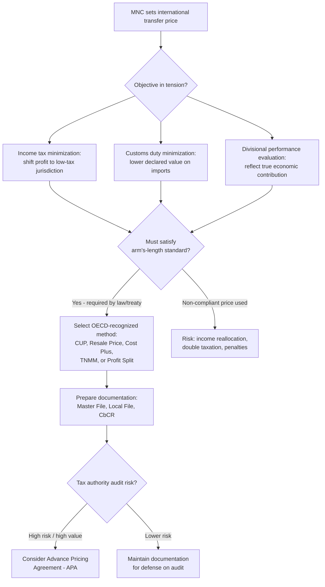

## International and Multinational Transfer Pricing Considerations

### Definition and Context

International transfer pricing refers to the pricing of goods, services, intangibles, and financing transferred between related entities (subsidiaries, branches, or divisions) of a multinational corporation (MNC) operating across different tax jurisdictions. Unlike purely domestic transfer pricing — which primarily addresses divisional performance evaluation and goal congruence — international transfer pricing must simultaneously satisfy **managerial decision-making objectives** and **regulatory/tax compliance requirements** imposed by multiple governments, since the transfer price directly affects how much taxable income is reported in each country.

### Why International Transfer Pricing Differs from Domestic Transfer Pricing

**Key Points**

- Domestic transfer pricing decisions (idle vs. full capacity, cost-based vs. market-based, negotiated ranges) are primarily internal management tools focused on divisional autonomy and goal congruence.
- International transfer pricing adds a second, often dominant, objective: **minimizing global tax liability and import duties** while remaining compliant with each country's tax code.
- Additional complicating factors unique to the cross-border context:
  - Differing corporate income tax rates across countries create incentives to shift profits.
  - Import tariffs and customs duties are often based on the declared transfer price of goods crossing borders.
  - Currency exchange rate fluctuations and restrictions on repatriating profits (currency controls).
  - Divergent local regulations, tax treaties, and transfer pricing documentation requirements.
  - Political, economic, and expropriation risk in the host country.
  - Joint venture partners or minority shareholders in a foreign subsidiary, whose interests may conflict with pure tax-minimization strategies.

### Tax-Minimization Motive: Shifting Profit Through Transfer Prices

**Key Points**

- If Country A has a higher corporate tax rate than Country B, an MNC has an incentive to set transfer prices such that more profit is recognized in the low-tax jurisdiction (Country B) and less in the high-tax jurisdiction (Country A).
- Mechanism: when the selling division is in the low-tax country, the MNC sets a **high transfer price** for goods sold to the division in the high-tax country, shifting profit (and thus taxable income) into the low-tax jurisdiction.
- Conversely, when the selling division is in the high-tax country, the MNC sets a **low transfer price** for goods sold to the affiliate in the low-tax country, again minimizing income recognized where tax rates are higher.

**Example**

A U.S. parent company's manufacturing subsidiary in a low-tax jurisdiction (assume 12% corporate tax rate) produces a component at a variable cost of $50 and transfers it to the U.S. marketing subsidiary (assume 25% corporate tax rate), which then sells the finished product externally for $200.

- **Strategy: Maximize profit in the low-tax subsidiary.** Set the transfer price high, e.g., $150 per unit.
  - Low-tax subsidiary's margin: $150 − $50 = $100 profit taxed at 12% = $12 tax
  - High-tax subsidiary's margin: $200 − $150 = $50 profit taxed at 25% = $12.50 tax
  - Total group tax = $24.50 per unit
- **Alternative: Set the transfer price low**, e.g., $70 per unit.
  - Low-tax subsidiary's margin: $70 − $50 = $20 profit taxed at 12% = $2.40 tax
  - High-tax subsidiary's margin: $200 − $70 = $130 profit taxed at 25% = $32.50 tax
  - Total group tax = $34.90 per unit
- The first strategy (high transfer price, shifting profit to the low-tax jurisdiction) reduces total group tax by $10.40 per unit compared to the second, illustrating the tax-minimization incentive that regulators specifically target.

### The Arm's-Length Principle

**Key Points**

- To prevent artificial profit shifting, most countries — through domestic law and bilateral/multilateral tax treaties — require that transfer prices between related entities reflect the **arm's-length price**: the price that would have been charged between unrelated (independent) parties in a comparable transaction under comparable circumstances.
- The arm's-length standard is the foundation of the **OECD Transfer Pricing Guidelines for Multinational Enterprises and Tax Administrations**, which most OECD and non-OECD countries reference in their domestic transfer pricing regulations.
- In the United States, the arm's-length standard is codified primarily under **Internal Revenue Code Section 482**, which grants the IRS authority to reallocate income, deductions, credits, or allowances between related entities to prevent tax evasion or to clearly reflect income.
- [Unverified] Specific statutory citations, thresholds, and penalty rates are subject to periodic legislative change; consult current IRC §482 regulations and OECD guidance for authoritative figures.

### OECD-Recognized Transfer Pricing Methods

**Key Points**

The OECD Guidelines and most national tax authorities (including the U.S. Treasury Regulations under §482) recognize several accepted methods for establishing and defending an arm's-length transfer price:

1. **Comparable Uncontrolled Price (CUP) Method** — compares the price charged in the controlled (related-party) transaction to the price charged in a comparable transaction between unrelated parties.
2. **Resale Price Method (RPM)** — starts from the price at which a product purchased from a related party is resold to an independent party, then subtracts an appropriate gross margin (the resale price margin) to arrive at an arm's-length transfer price.
3. **Cost Plus Method** — starts from the costs incurred by the supplier in a controlled transaction, then adds an appropriate markup (gross cost plus margin) based on comparable uncontrolled transactions.
4. **Transactional Net Margin Method (TNMM)** — examines the net profit margin relative to an appropriate base (costs, sales, assets) that a taxpayer realizes from a controlled transaction, compared to margins earned in comparable uncontrolled transactions.
5. **Profit Split Method** — allocates combined profits from a controlled transaction between the related parties based on the relative value of each party's contribution, used especially when transactions are highly integrated or involve unique intangibles.

**Key Points on Method Selection**

- The **CUP method** is generally preferred when reliable comparable market transactions exist (closest to a true market-based transfer price).
- **Cost Plus** and **Resale Price** methods are more commonly applied to routine manufacturing or distribution functions where comparable gross margins can be benchmarked.
- **TNMM** and **Profit Split** are typically used for more complex, integrated operations (e.g., transactions involving valuable intangibles, or where one-sided methods cannot capture the economics of both parties).
- [Inference] In practice, TNMM is the most frequently applied method globally due to the relative availability of net margin data on comparable independent companies, though this varies by jurisdiction and transaction type.

### Import Duties and Customs Valuation Interaction

**Key Points**

- Import (customs) duties are typically assessed as a percentage of the declared transaction value of goods entering a country, creating a **tension opposite** to the income tax incentive:
  - To minimize **income tax**, an MNC may want a transfer price that shifts profit to the low-tax country (potentially a high transfer price on goods leaving that country, or low transfer price on goods entering the high-tax country).
  - To minimize **customs duties**, an MNC generally wants the **lowest defensible transfer price** on goods entering a high-tariff country, since duties are charged on the declared value at import.
- This creates a fundamental trade-off: a transfer price low enough to minimize customs duties on importation may simultaneously shift too much profit into the high-tax importing country, increasing income tax liability, and vice versa.
- Customs authorities (e.g., under World Trade Organization Customs Valuation Agreement principles) also require arm's-length-consistent valuation for imported goods, though the customs and income-tax arm's-length determinations are administered by separate authorities and do not always reach the same number.
- [Inference] Because income tax authorities and customs authorities in the same country can scrutinize transfer prices for opposite reasons, some MNCs pursue dual documentation or advance rulings to defend a single price against both types of audits simultaneously.

### Additional Non-Tax Factors in International Transfer Pricing

**Key Points**

- **Currency and repatriation restrictions**: some countries limit the amount of profit that can be repatriated to the parent company or impose currency conversion controls; a higher transfer price on goods sold into such a country can serve as an indirect mechanism to extract cash (disguised as cost of goods rather than dividends), though this must still satisfy arm's-length requirements.
- **Exchange rate risk**: transfer prices denominated in a volatile currency expose one or both divisions to translation and transaction exposure; some MNCs build in currency risk-sharing clauses or price in a stable reference currency.
- **Joint venture and minority interest considerations**: when a foreign subsidiary is not wholly owned, an artificially low or high transfer price can unfairly transfer wealth away from minority shareholders or joint venture partners, raising legal and relationship risks beyond tax exposure.
- **Import/export subsidies and tariffs beyond standard customs duties**: some countries offer favorable tax treatment or subsidies for specific industries, which interacts with (and can override) the pure transfer-pricing tax-minimization calculus.
- **Performance evaluation distortion**: when the transfer price is set primarily to optimize global tax and duty outcomes, the reported profitability of individual country subsidiaries may no longer reflect their true underlying operating performance, undermining the goal-congruence objective central to domestic transfer pricing. This often requires MNCs to maintain a **dual reporting system**: one set of transfer prices for external tax/regulatory compliance and a separate internal management-reporting adjustment for evaluating divisional managers fairly.

### Transfer Pricing Documentation and Compliance Risk

**Key Points**

- Most major jurisdictions require contemporaneous **transfer pricing documentation** demonstrating that intercompany prices satisfy the arm's-length standard, often including:
  - A functional analysis (functions performed, assets used, risks assumed by each related party).
  - Selection and application of the most appropriate transfer pricing method.
  - Benchmarking studies identifying comparable uncontrolled transactions or companies.
- The **OECD Base Erosion and Profit Shifting (BEPS) Action 13** framework introduced a standardized three-tiered documentation structure adopted by many countries:
  1. **Master File** — high-level overview of the MNC group's global business operations and transfer pricing policies.
  2. **Local File** — detailed transactional transfer pricing documentation specific to each local entity/jurisdiction.
  3. **Country-by-Country Report (CbCR)** — aggregated data on global allocation of income, taxes paid, and indicators of economic activity, filed for large MNC groups above a revenue threshold.
- Non-compliance or aggressive transfer pricing positions can trigger tax authority audits, transfer pricing adjustments (income reallocation), double taxation (if two countries both claim the same income), interest, and significant penalties.
- **Advance Pricing Agreements (APAs)** allow an MNC to negotiate its transfer pricing methodology in advance with one (unilateral), two (bilateral), or more (multilateral) tax authorities, providing greater certainty and reducing audit risk.
- [Unverified] Specific documentation thresholds, penalty percentages, and CbCR revenue thresholds vary by jurisdiction and are periodically revised; current local tax authority guidance should be consulted for exact figures.

### Decision Framework Diagram

### Common Pitfalls

- Treating international transfer pricing as purely a tax-minimization exercise while ignoring customs duty, currency, and minority-interest consequences that can offset or reverse the intended tax benefit.
- Assuming a single "correct" transfer price satisfies both income tax and customs authorities simultaneously — these are separately administered regimes that can reach different conclusions from the same facts.
- Failing to maintain contemporaneous documentation, which shifts the burden of proof unfavorably onto the taxpayer during an audit in many jurisdictions.
- Using domestic (idle vs. full capacity) transfer pricing logic in isolation for cross-border transactions without layering in the arm's-length and regulatory requirements — a price that is optimal for divisional goal congruence may not be legally defensible internationally.
- Ignoring double taxation risk: if two countries' tax authorities each make their own (differing) transfer pricing adjustment without a coordinated resolution (e.g., via Mutual Agreement Procedure under a tax treaty), the same income can be taxed twice.

**Related Topics**

- Arm's-length principle and comparability analysis in depth
- OECD BEPS Action Plan (full 15-action framework, not limited to Action 13)
- Advance Pricing Agreements (APA) — unilateral, bilateral, multilateral processes
- U.S. IRC Section 482 regulations and penalty regimes
- Customs valuation methods under the WTO Customs Valuation Agreement
- Double taxation relief mechanisms and tax treaties (Mutual Agreement Procedure)
- Dual transfer pricing systems for tax compliance vs. internal performance evaluation
- Permanent establishment and nexus issues in cross-border operations
- Intangible asset valuation and cost-sharing arrangements in transfer pricing