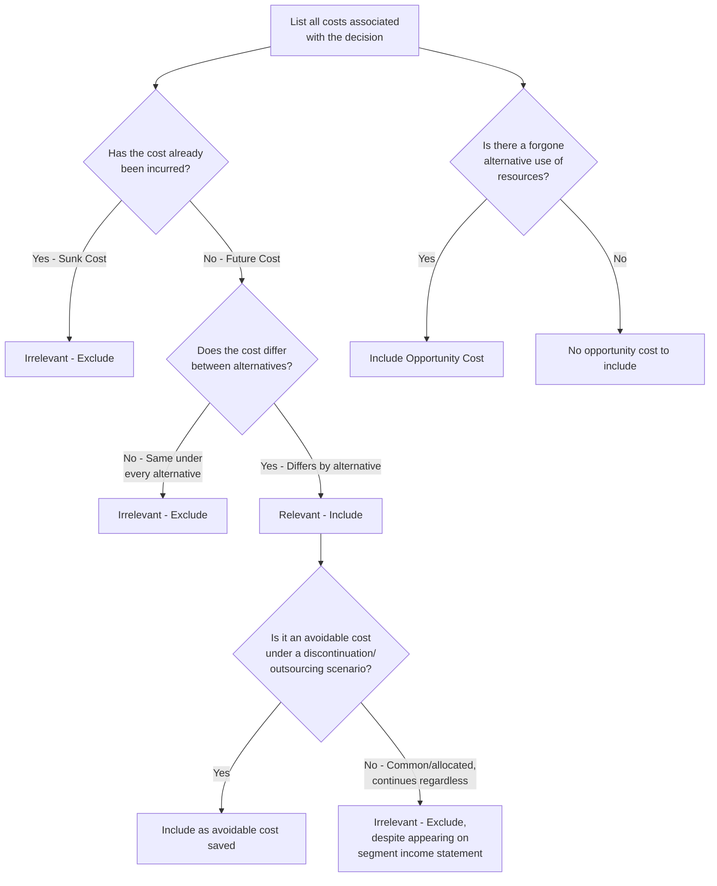

## Identifying Relevant and Avoidable Costs

### Definition and Context

Relevant costs are future costs that **differ between decision alternatives**. A cost qualifies as relevant to a specific decision only if it satisfies two simultaneous conditions: it must be a **future cost** (not yet incurred) and it must **differ** in amount or existence across the alternatives being compared. Avoidable costs are a closely related concept referring specifically to costs that can be eliminated, in whole or in part, by choosing one alternative over another (most commonly used in the context of discontinuation, dropping a product line, or outsourcing decisions).

### The Two-Part Test for Relevance

**Key Points**

- **Test 1 — Future cost**: The cost must not yet have been incurred as of the decision point. Costs already incurred, regardless of whether paid or merely committed, cannot be changed by any future decision.
- **Test 2 — Differs between alternatives**: Even a future cost is irrelevant if it will be exactly the same dollar amount under every alternative being considered. Only the *difference* between alternatives matters to the decision.
- A cost must pass **both** tests to be relevant. Failing either test — being a past cost, or being identical across all alternatives — makes the cost irrelevant and it should be excluded from the decision analysis.
- Relevance is decision-specific: the same cost item can be relevant to one decision and irrelevant to another, depending on which alternatives are being compared.

$$\text{Cost is Relevant} \iff (\text{Cost is a Future Cost}) \land (\text{Cost Differs Across Alternatives})$$

### Sunk Costs

**Key Points**

- A **sunk cost** is a cost that has already been incurred and cannot be recovered or changed regardless of which future alternative is chosen.
- Sunk costs automatically fail Test 1 (they are not future costs) and are therefore **always irrelevant** to short-term decision making.
- Common examples of sunk costs: the original purchase price of existing equipment, past research and development spending, costs already recorded for inventory already produced, and the net book value of an asset being considered for replacement.
- A frequent behavioral error — the **sunk cost fallacy** — occurs when decision-makers factor in sunk costs (e.g., "we already spent $500,000 on this machine, so we have to keep using it") even though that spending cannot be undone by any future choice.

**Example**

A company purchased a specialized machine two years ago for $200,000. It has a current book value of $120,000 (after depreciation) and no resale value. A new machine is available that would reduce annual operating costs.

- The $200,000 original cost and the $120,000 book value are both sunk costs — they were incurred in the past and do not change regardless of whether the company keeps the old machine or buys the new one.
- These figures should be **excluded entirely** from the replace-or-keep analysis. Only the future costs of operating the old machine versus the new machine (and the new machine's purchase price, since that is a future cost) are relevant.

### Future Costs That Do Not Differ

**Key Points**

- Some future costs, while not yet incurred, will be identical in amount regardless of which alternative is selected. These fail Test 2 and are irrelevant even though they are future costs.
- Common example: a fixed cost (such as factory rent or a plant manager's salary) that will continue at the same amount whether a company makes or buys a component, or whether it keeps or drops a product line — as long as that fixed cost is **unavoidable** under every alternative.

**Example**

A company is deciding whether to manufacture a part in-house or purchase it from an outside supplier. The factory building's $10,000/month rent will be paid regardless of which decision is made (the space would otherwise sit idle with no alternative use).

- The $10,000 rent is a future cost, but it does **not differ** between the make and buy alternatives — it fails Test 2.
- The rent is irrelevant to the make-or-buy decision and should be excluded from the comparison, even though it is a legitimate, currently-being-incurred cost.

### Avoidable Costs

**Key Points**

- An **avoidable cost** is a cost that can be eliminated (fully or partially) as a direct result of choosing a particular course of action, most typically discontinuing a segment, product line, or department, or outsourcing an activity that was previously performed in-house.
- Avoidable costs are, by definition, relevant to the decision, because they represent future costs that differ between the alternatives (they exist under the "continue" alternative and disappear under the "discontinue" alternative).
- **Unavoidable costs**, by contrast, will continue to be incurred regardless of the decision (most commonly, allocated common/joint fixed costs such as corporate overhead, top executive salaries, or facility-wide costs that would simply be reallocated to remaining segments rather than eliminated).
- The critical analytical skill in segment/product-line decisions is distinguishing which portion of reported fixed costs is **traceable and avoidable** versus **common and unavoidable**, since financial statements often display allocated common costs as if they belonged to the segment, creating a misleading impression that dropping the segment would eliminate all of its reported costs.

**Example**

A retail company is deciding whether to discontinue its housewares department. The department's income statement shows:

| Item | Amount |
| --- | --- |
| Sales | $300,000 |
| Variable expenses | $180,000 |
| Contribution margin | $120,000 |
| Traceable fixed expenses (avoidable if dropped) | $70,000 |
| Allocated common fixed expenses (unavoidable, reallocated to other departments if dropped) | $60,000 |
| Net operating income (loss) | $(10,000) |

- At first glance, the department shows a $10,000 loss, suggesting it should be dropped.
- However, only the **traceable fixed expenses of $70,000** (e.g., a department supervisor's salary, department-specific advertising, that would genuinely disappear) are avoidable and relevant.
- The **$60,000 allocated common fixed expenses** (e.g., a portion of the building depreciation, corporate executive salaries) will continue at the same total amount and simply be reallocated to the remaining departments if housewares is dropped — this cost is unavoidable and irrelevant to the drop decision.
- Correct relevant analysis: dropping the department eliminates $120,000 of contribution margin but saves only $70,000 of avoidable fixed costs, for a **net relevant loss of $50,000** if the department is dropped ($120,000 − $70,000 = $50,000 worse off). The department should be **kept**, despite the misleading $10,000 "loss" shown on a fully allocated income statement.

### Common Categories of Relevant vs. Irrelevant Costs

**Key Points**

| Cost Category | Typically Relevant? | Reasoning |
| --- | --- | --- |
| Variable costs that differ by alternative | Yes | Future costs, differ across alternatives |
| Avoidable/traceable fixed costs | Yes | Future costs, eliminated under one alternative |
| Differential future revenues | Yes | Future, differ across alternatives |
| Opportunity costs of forgone alternatives | Yes | Represents a real economic sacrifice, differs by alternative |
| Sunk costs (past purchase prices, prior R&D) | No | Not future costs |
| Unavoidable/common allocated fixed costs | No | Future, but do not differ (continue regardless) |
| Book value of existing assets | No | Sunk cost (past expenditure); only disposal/trade-in value and future costs matter |
| Historical/original cost data used only for depreciation schedules | No | Sunk; depreciation itself is a non-cash allocation of a sunk cost |

### Opportunity Costs as a Special Category of Relevant Cost

**Key Points**

- An **opportunity cost** is the potential benefit that is given up when one alternative is chosen over another. It is not a recorded accounting transaction but must be explicitly included in relevant cost analysis because it represents a genuine future sacrifice that differs across alternatives.
- Opportunity costs are especially critical in capacity-constrained decisions (e.g., using scarce machine hours for Product A instead of Product B; using idle factory space for a special order instead of leaving it available for a future higher-value use).
- Because opportunity costs do not appear on any general ledger or income statement, they are the cost category most often **omitted by mistake** in relevant costing analysis, despite being fully as important as accountable variable or avoidable fixed costs.

### Analytical Process for Identifying Relevant Costs

### Common Pitfalls

- Including sunk costs (original purchase price, book value, past R&D) in a forward-looking decision analysis — often driven by the sunk cost fallacy or a desire to "justify" past spending.
- Treating fully allocated fixed costs (common corporate overhead) as if they would disappear entirely when a segment is dropped, rather than correctly identifying that only the traceable/avoidable portion would actually be eliminated.
- Omitting opportunity costs simply because they do not appear as a recorded transaction in the accounting system.
- Confusing **avoidable** with merely **variable**: some fixed costs are avoidable (e.g., a segment supervisor's salary that ends when the segment is dropped) even though they are fixed in the short-run operating sense, so "fixed" and "unavoidable" are not synonymous.
- Assuming depreciation expense itself is relevant; depreciation is simply the periodic allocation of a sunk cost (the original asset purchase) and is not a future cash flow, though the **disposal/salvage value** of the asset (a future cash inflow) and the **purchase price of a replacement asset** (a future cash outflow) are relevant.
- Using a fully-allocated (absorption-based) segment income statement without adjusting for which fixed costs are truly avoidable, leading to potentially incorrect drop/keep, make/buy, or special-order decisions.

**Related Topics**

- Make-or-buy (outsourcing) decisions using relevant costing
- Special order decisions and relevant cost analysis under idle vs. full capacity
- Keep-or-drop segment/product-line decisions and segment margin reporting
- Constrained resource decisions and opportunity cost optimization (theory of constraints)
- Equipment replacement decisions and relevant cash flow analysis
- Sunk cost fallacy in behavioral decision-making
- Differential (incremental) analysis techniques
- Joint product further-processing decisions (sell-or-process-further)