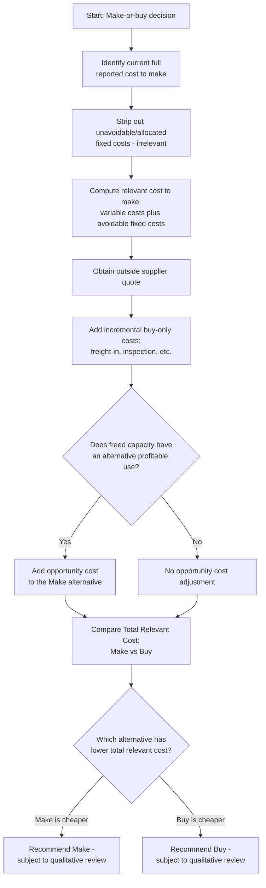

## Make or Buy and Outsourcing Decisions

### Definition and Context

A make-or-buy (outsourcing) decision evaluates whether a company should continue producing a component, product, or service internally ("make") or purchase it from an external supplier ("buy"). This is a classic application of relevant costing: the analysis compares only the future costs that **differ** between the make and buy alternatives, applying the same relevance tests used throughout short-term decision analysis (future cost, and differs across alternatives).

### The Core Comparison Structure

**Key Points**

- The basic decision rule: **choose the alternative with the lower total relevant cost** (or, equivalently, the higher relevant benefit if revenues also differ).
- Relevant costs of making internally typically include: direct materials, direct labor, variable manufacturing overhead, and any **avoidable** fixed manufacturing overhead (supervisor salaries, equipment costs specific to that production line, etc.).
- Relevant costs of buying externally typically include: the purchase price per unit multiplied by required quantity, plus any additional costs unique to purchasing (incremental freight-in, incoming inspection, ordering/administrative costs not already incurred).
- Costs that are the **same** under both alternatives (e.g., unavoidable allocated corporate overhead, facility rent that continues regardless) are irrelevant and excluded from the comparison, following the standard relevance test.

$$\text{Total Relevant Cost to Make} = \text{Direct Materials} + \text{Direct Labor} + \text{Variable Overhead} + \text{Avoidable Fixed Overhead}$$

$$\text{Total Relevant Cost to Buy} = (\text{Purchase Price} \times \text{Quantity}) + \text{Incremental Buying Costs} - \text{Opportunity Cost Recovered (if any)}$$

### Step-by-Step Analytical Process

**Key Points**

1. Identify the **total unit cost currently reported** for making the item (this is the starting point, but it usually includes some irrelevant allocated costs that must be stripped out).
2. Separate reported manufacturing costs into: (a) variable costs that will disappear if production stops, (b) fixed costs that are **avoidable** if production stops (traceable, directly tied to that product line), and (c) fixed costs that are **unavoidable** (common/allocated costs that will simply be spread over remaining production if this item is dropped).
3. Determine the external supplier's quoted purchase price and any additional costs unique to buying (e.g., incoming freight, quality inspection of purchased units).
4. Determine whether the freed-up capacity (space, equipment, labor) has an **opportunity cost** — i.e., could it be used for something else of value (a new product line, a special order) if the make option is dropped?
5. Compute and compare total relevant cost of make versus buy, including the opportunity cost as a cost of the make decision equal to the forgone benefit of the best alternative use.
6. Choose the lower-cost alternative, and separately evaluate qualitative factors before finalizing the decision.

### Example — Basic Make-or-Buy Without Opportunity Cost

A company currently manufactures 10,000 units of a component per year. The reported unit cost is:

| Cost Item | Per Unit | Total (10,000 units) |
| --- | --- | --- |
| Direct materials | $8 | $80,000 |
| Direct labor | $5 | $50,000 |
| Variable manufacturing overhead | $3 | $30,000 |
| Fixed manufacturing overhead (allocated) | $6 | $60,000 |
| **Total reported cost** | **$22** | **$220,000** |

An outside supplier offers to supply the component at $18 per unit. Investigation reveals that of the $6 per-unit fixed overhead, only $2 per unit ($20,000 total) is avoidable (a dedicated supervisor and equipment lease specific to this line); the remaining $4 per unit ($40,000) is allocated corporate overhead that will continue regardless and be reallocated to other products.

**Relevant cost to make:**

$$\$8 + \$5 + \$3 + \$2 = \$18 \text{ per unit (relevant cost)}$$

**Relevant cost to buy:** $18 per unit (the quoted purchase price, assuming no other incremental costs)

- Both alternatives cost exactly $18 per unit — the company is financially **indifferent** between making and buying based on the quantitative analysis alone. The $4 unavoidable fixed overhead per unit ($40,000 total) is irrelevant and must **not** be included in the comparison, even though it appears in the reported $22 "full cost" that made buying at $18 look attractive at first glance.
- This example illustrates a critical pitfall: comparing the outside price ($18) to the fully allocated internal cost ($22) would incorrectly suggest buying saves $4/unit, when the true relevant-cost comparison shows no difference.

### Incorporating Opportunity Cost of Freed Capacity

**Key Points**

- If the space, labor, or equipment freed up by discontinuing internal production has an **alternative profitable use**, that forgone benefit must be added as a relevant cost of the "make" decision (or, equivalently, as a benefit that improves the "buy" alternative).
- This mirrors the full-capacity transfer pricing logic: capacity that has a valuable alternative use is not free, and the opportunity cost must be quantified and included.

**Example**

Continuing the prior example: suppose the freed manufacturing space and equipment (if the component is bought instead of made) could be used to produce a different product with an annual contribution margin of $25,000.

- Relevant cost to make (now including opportunity cost): $18/unit × 10,000 units = $180,000, **plus** the $25,000 opportunity cost of not being able to use the space for the alternative product = **$205,000 total relevant cost to make**.
- Relevant cost to buy: $18/unit × 10,000 units = $180,000 (purchase price), with **no opportunity cost**, since buying frees the space for the alternative use.
- Comparing totals: Buy ($180,000) is now **$25,000 cheaper** than Make ($205,000), so the company should **buy** the component and use the freed capacity for the alternative product.
- This demonstrates that including the opportunity cost of idle capacity can reverse a decision that appeared to be a tie (or favored making) under a naive per-unit cost comparison.

### Quantitative Decision Framework Diagram

### Qualitative and Strategic Factors

**Key Points**

Beyond the quantitative relevant-cost comparison, make-or-buy decisions should weigh non-financial factors that can override a purely cost-based conclusion:

- **Quality control**: internal production may allow tighter control over quality standards; outsourcing introduces dependency on the supplier's quality processes.
- **Reliability of supply**: outsourcing creates dependency on the supplier's ability to deliver on time, exposing the company to supply chain disruption risk.
- **Loss of critical know-how**: outsourcing a component with proprietary technology or specialized expertise risks leaking intellectual property or eroding in-house capability that could be difficult or costly to rebuild later.
- **Impact on employees**: discontinuing internal production may require layoffs or reassignment, with associated morale, severance, and community relations effects.
- **Flexibility and control**: internal production offers more direct control over scheduling, customization, and rapid response to design changes; buying externally can reduce this flexibility, particularly under long-term supply contracts.
- **Supplier financial stability and long-term pricing risk**: a low initial quoted price may not be sustainable, and switching back to in-house production later (after internal capability has been dismantled) can be far more costly than the original make cost.
- [Inference] Many organizations formally weight these qualitative factors using scoring models or decision matrices alongside the quantitative relevant-cost analysis, rather than relying on cost alone, particularly for strategically important components.

### Common Pitfalls

- Comparing the outside supplier's price to the **fully allocated unit cost** (including unavoidable/common fixed overhead) instead of the correctly computed **relevant cost** — this systematically biases the analysis toward "buy" by making internal production look more expensive than it truly is.
- Failing to identify and quantify the **opportunity cost** of freed capacity when a genuine alternative use exists, which can reverse an otherwise correct make decision.
- Treating all fixed manufacturing overhead as automatically avoidable (or automatically unavoidable) without investigating which specific fixed costs are truly traceable to the component being evaluated.
- Ignoring **incremental buy-only costs** (incoming freight, additional quality inspection of purchased parts, administrative costs of managing a new supplier relationship) that inflate the true cost of buying beyond the quoted purchase price.
- Overlooking qualitative and strategic risks (loss of proprietary know-how, supplier dependency, difficulty reversing the decision later) by focusing exclusively on the short-term quantitative cost comparison.
- Failing to reconsider the analysis when volume assumptions change — the relevant cost comparison (particularly the per-unit avoidable fixed cost) can shift materially at different production volumes, since fixed costs do not scale proportionally with units.

**Related Topics**

- Identifying relevant and avoidable costs (foundational relevance tests)
- Special order decisions and relevant cost analysis under idle vs. full capacity
- Keep-or-drop segment/product-line decisions
- Opportunity cost analysis in capacity-constrained decisions
- Constrained resource optimization (theory of constraints, scarce resource ranking)
- Qualitative factors in outsourcing and vendor selection frameworks
- Transfer pricing considerations when "buy" is from an internal related division rather than an external supplier
- Total cost of ownership analysis for supplier evaluation