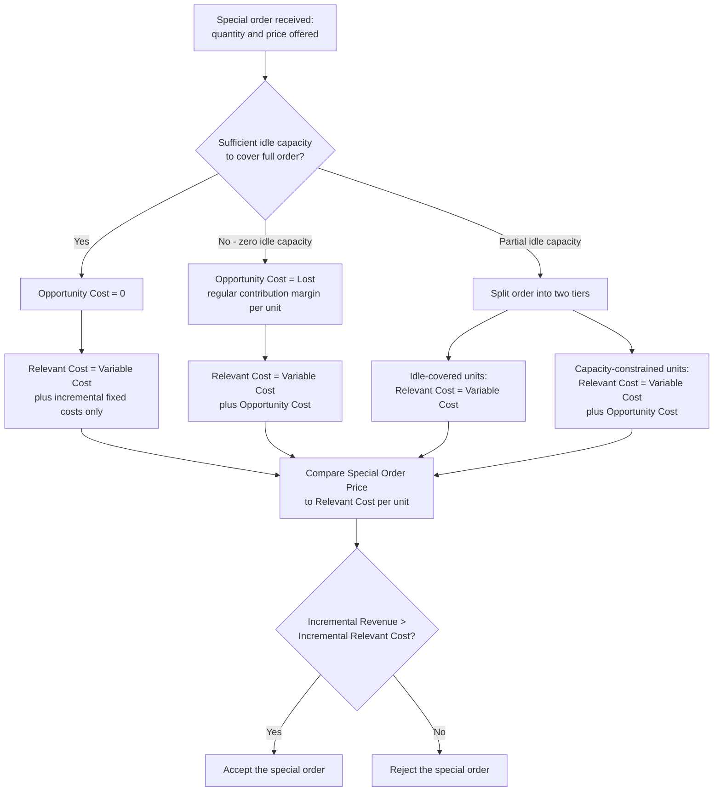

## Special Order Decisions

### Definition and Context

A special order decision evaluates whether a company should accept a one-time order at a price that typically differs from (often below) the regular selling price, usually from a customer outside the company's normal market, on a non-recurring basis. Like make-or-buy decisions, this is an application of relevant costing: the analysis compares only the future revenues and costs that **differ** depending on whether the order is accepted, and the answer depends critically on whether the company has **idle capacity** or is operating at **full capacity**.

### The Core Decision Rule

**Key Points**

- The fundamental question: does the **incremental revenue** from the special order exceed the **incremental (relevant) cost** of fulfilling it?

$$\text{Accept the Special Order if: } \text{Incremental Revenue} > \text{Incremental Relevant Cost}$$

- Incremental revenue is simply the special order price multiplied by the special order quantity.
- Incremental relevant cost includes only the variable costs that will actually be incurred to produce and deliver the special order units, plus any **additional fixed costs** that arise specifically because of accepting the order (e.g., a new die, special packaging setup, additional supervision), plus **opportunity cost** if capacity constraints require displacing existing sales.
- **Existing fixed manufacturing overhead** that will be incurred regardless of whether the special order is accepted is irrelevant and must be excluded from the analysis, because it fails the "differs between alternatives" relevance test.
- Special orders are generally analyzed assuming they will **not** affect regular sales volume or regular selling prices (i.e., no risk of the special order customer reselling into the regular market, and no risk that regular customers demand the same low price) — this assumption should always be explicitly checked as a qualitative factor.

### Special Order Analysis Under Idle Capacity

**Key Points**

- When the company has sufficient **idle (excess) capacity** to fulfill the special order without displacing any existing production or sales, the opportunity cost is **zero** — this mirrors the idle-capacity logic used in transfer pricing.
- Only the variable costs of producing the special order units, plus any special order-specific incremental fixed costs, are relevant.
- Existing fixed manufacturing overhead allocated on a per-unit basis in the regular costing system is **not** relevant, since total fixed costs will not change as a result of accepting the order.
- Because no regular sales are lost, a special order price that is below the normal selling price — even below the fully allocated unit cost — can still be profitable for the company as a whole, as long as the price exceeds the relevant (variable plus incremental) cost per unit.

**Example**

A company manufactures a product with the following normal cost structure at its current volume of 40,000 units (practical capacity: 50,000 units, so 10,000 units of idle capacity exist):

| Cost Item | Per Unit |
| --- | --- |
| Direct materials | $12 |
| Direct labor | $8 |
| Variable manufacturing overhead | $4 |
| Fixed manufacturing overhead (allocated at 40,000 units) | $10 |
| **Total unit cost** | **$34** |

Regular selling price: $50 per unit. A one-time customer offers to buy 8,000 units at $28 per unit. The order requires no special packaging or other incremental fixed costs, and will not affect regular sales.

- Since 8,000 units ≤ 10,000 units of idle capacity, no regular sales are displaced — opportunity cost = $0.
- Relevant cost per unit = $12 + $8 + $4 = $24 (variable costs only; the $10 fixed overhead per unit is irrelevant, since total fixed costs do not change).
- Incremental profit per unit = $28 − $24 = $4 profit per unit, even though $28 is well below both the normal price ($50) and the fully allocated cost ($34).
- Total incremental profit from accepting the order = $4 × 8,000 = **$32,000 additional profit**, despite the order price being below full cost.
- **Decision: Accept the special order.**

### Special Order Analysis Under Full Capacity

**Key Points**

- When the company is operating at **full capacity**, accepting the special order requires displacing existing production — either regular sales or other special orders — creating an opportunity cost equal to the **lost contribution margin** on the displaced units.
- The relevant cost of the special order now includes: variable cost per unit **plus** the forgone contribution margin per unit on whatever regular sales must be given up.
- This mirrors the full-capacity transfer pricing rule exactly: at full capacity, the minimum acceptable price effectively rises to cover the opportunity cost, often approaching or exceeding the regular selling price.

**Example**

Using the same cost structure, assume the company is now operating at full capacity (50,000 units, no idle capacity) and all 50,000 units currently sell at the regular price of $50. The same special order for 8,000 units at $28 is received, and accepting it would require reducing regular sales by 8,000 units.

- Opportunity cost per unit = Regular contribution margin per unit given up = $50 − ($12 + $8 + $4) = $50 − $24 = $26
- Relevant (total) cost per special order unit = $24 (variable cost) + $26 (opportunity cost) = $50
- Incremental profit per unit = $28 (special order price) − $50 (relevant cost including opportunity cost) = **−$22 per unit loss**
- Total impact of accepting the order = −$22 × 8,000 = **−$176,000 reduction in profit**
- **Decision: Reject the special order.** The company is better off continuing to sell all 50,000 units at the regular $50 price rather than diverting 8,000 units to the $28 special order.

### Special Order Analysis Under Partial Idle Capacity

**Key Points**

- When idle capacity exists but is **insufficient** to cover the entire special order quantity, the order must be split into two tiers, matching the partial-idle-capacity approach used in transfer pricing:
  1. Units covered by idle capacity → relevant cost = variable cost only (no opportunity cost).
  2. Units exceeding idle capacity → relevant cost = variable cost plus opportunity cost (lost regular contribution margin).
- The total incremental profit is the sum of the profit/loss contribution from both tiers, not a simple blended average applied uniformly, since the tiers behave differently.

**Example**

Suppose the company has only 5,000 units of idle capacity (instead of 10,000) and receives the same special order for 8,000 units at $28.

- Tier 1 (idle-covered, 5,000 units): relevant cost = $24/unit (variable only) → profit = ($28 − $24) × 5,000 = $20,000
- Tier 2 (capacity-constrained, 3,000 units): relevant cost = $24 + $26 opportunity cost = $50/unit → profit = ($28 − $50) × 3,000 = −$66,000
- Net impact of accepting the full 8,000-unit order = $20,000 − $66,000 = **−$46,000 net loss**
- **Decision: Reject the full order as specified.** [Inference] In practice, the company would typically negotiate to accept only the portion covered by idle capacity (5,000 units, yielding $20,000 profit) and decline the remaining 3,000 units, if the customer's order is divisible.

### Decision Framework Diagram

### Qualitative Factors in Special Order Decisions

**Key Points**

- **Price erosion risk**: if regular customers learn of the special discounted price, they may demand similar discounts, undermining the regular pricing structure.
- **Market segmentation validity**: the special order analysis assumes the discounted units can be sold in a genuinely separate market (different geography, private label, different customer segment) without cannibalizing regular sales; if this assumption fails, the "idle capacity" premise itself breaks down.
- **Long-term relationship and precedent effects**: accepting a one-time low-price order may create customer expectations of continued low pricing, or signal weakness to competitors.
- **Capacity commitment risk**: accepting a special order that consumes idle capacity may leave the company unable to accept a more profitable order or respond to unexpected regular demand growth later in the period.
- **Contractual and legal considerations**: selling identical goods at substantially different prices to different customers can raise price discrimination concerns in some jurisdictions, particularly for interstate commerce, depending on applicable law. [Unverified] Specific legal thresholds and applicability depend on jurisdiction and industry and should be confirmed with qualified legal counsel.
- [Inference] Many companies apply special order pricing more cautiously to recurring or semi-recurring customers than to genuinely one-time, non-repeating orders, precisely to manage these qualitative risks.

### Common Pitfalls

- Comparing the special order price to the **fully allocated unit cost** (including fixed manufacturing overhead spread over normal volume) instead of the correct **relevant cost**, which can cause a profitable order to be incorrectly rejected under idle capacity.
- Assuming idle capacity exists without verifying actual production constraints, leading to an incomplete analysis that omits a real opportunity cost.
- Failing to identify **incremental fixed costs** specific to the special order (e.g., a new mold, special packaging, additional quality certification) that must be included even though most fixed overhead is irrelevant.
- Ignoring the risk that the special order will **not** stay isolated from the regular market (price erosion, demand cannibalization), which invalidates the core assumption underlying the entire analysis.
- Applying a single blended per-unit relevant cost to an order that spans both idle-covered and capacity-constrained tiers, instead of correctly splitting the analysis.
- Overlooking the opportunity cost entirely when capacity is constrained, which can lead to accepting an order that actually destroys company-wide profit.

**Related Topics**

- Identifying relevant and avoidable costs (foundational relevance tests)
- Transfer pricing under idle versus full capacity (parallel opportunity cost logic)
- Make-or-buy and outsourcing decisions
- Constrained resource / scarce resource decisions and contribution margin per unit of constraint
- Price discrimination and legal considerations in differential pricing
- Contribution margin analysis and cost-volume-profit (CVP) fundamentals
- Capacity planning and long-term capacity investment decisions