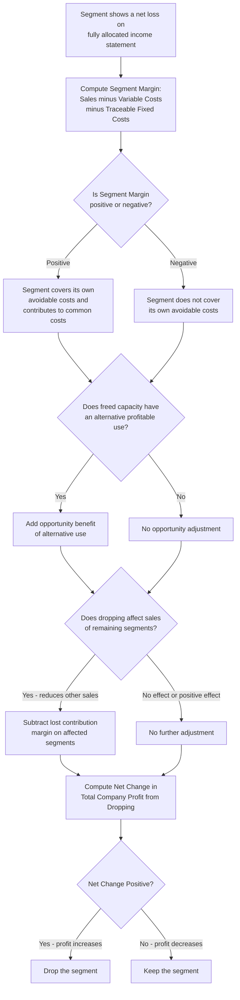

## Keep or Drop a Product Line or Segment

### Definition and Context

A keep-or-drop decision evaluates whether a company should continue operating a product line, department, branch, or other business segment, or discontinue it. Like other short-term relevant costing decisions, the analysis depends on correctly separating **avoidable costs** (which disappear if the segment is dropped) from **unavoidable common costs** (which continue regardless, typically because they are allocated shared costs that will simply be reallocated to remaining segments). This topic is a direct extension of the relevant/avoidable cost framework applied specifically to whole-segment discontinuation decisions.

### The Core Decision Rule

**Key Points**

- The fundamental question: does dropping the segment **increase or decrease total company profit**?
- Dropping a segment eliminates its **contribution margin** (sales minus variable costs) but only saves the portion of fixed costs that are truly **avoidable**.

$$\text{Change in Company Profit from Dropping} = \text{Avoidable Fixed Costs Saved} - \text{Contribution Margin Lost}$$

- **Decision rule**:
  - If Avoidable Fixed Costs Saved > Contribution Margin Lost → **Drop the segment** (dropping increases company profit).
  - If Avoidable Fixed Costs Saved < Contribution Margin Lost → **Keep the segment** (dropping would decrease company profit).
- A segment showing a net loss on a fully allocated (absorption) income statement is **not automatically** a candidate for dropping — the loss may be entirely attributable to unavoidable allocated common costs that would persist and simply burden the remaining segments more heavily if this segment is dropped.

### Distinguishing Avoidable (Traceable) from Unavoidable (Common) Fixed Costs

**Key Points**

- **Traceable (avoidable) fixed costs**: costs that arise specifically because of the existence of a particular segment and would be eliminated if that segment were dropped. Examples: a segment manager's salary, depreciation on equipment used exclusively by that segment, segment-specific advertising, direct segment supervision.
- **Common (unavoidable) fixed costs**: costs that support the organization as a whole and are merely **allocated** to segments for internal reporting purposes; they will continue at the same total amount and simply be redistributed to remaining segments if one segment is dropped. Examples: corporate headquarters expenses, the CEO's salary, building depreciation allocated by square footage, general liability insurance covering the whole facility.
- A cost being labeled "fixed" on the segment income statement says nothing about whether it is avoidable — fixed costs can be either avoidable or unavoidable, and this distinction (not the fixed/variable distinction) drives the keep-or-drop analysis.
- The single most common analytical error in this topic is treating **all** fixed costs shown on a segmented income statement as if dropping the segment would eliminate them entirely.

### Segment Margin vs. Net Operating Income

**Key Points**

- **Segment margin** = Sales − Variable Expenses − Traceable (avoidable) Fixed Expenses. This is the appropriate profitability measure for the keep-or-drop decision, because it reflects only the costs that genuinely disappear if the segment is dropped.
- **Net operating income (after common cost allocation)** = Segment Margin − Allocated Common Fixed Expenses. This is the "bottom line" figure typically shown on a fully allocated income statement, but it is **not** the correct figure for the keep-or-drop decision because it includes costs that will not actually change.
- A segment with a **positive segment margin** is covering all of its own avoidable costs and contributing something toward common fixed costs and company-wide profit — dropping such a segment generally reduces total company profit, even if its allocated net operating income shows a loss.
- A segment with a **negative segment margin** is not even covering its own avoidable costs — dropping such a segment generally increases total company profit (assuming no other complicating factors such as opportunity costs from freed capacity or effects on other segments' sales).

### Example — Misleading Allocated Loss

A company reports the following for its three product lines:

| Item | Product A | Product B | Product C | Total |
| --- | --- | --- | --- | --- |
| Sales | $400,000 | $250,000 | $150,000 | $800,000 |
| Variable expenses | $220,000 | $130,000 | $95,000 | $445,000 |
| **Contribution margin** | $180,000 | $120,000 | $55,000 | $355,000 |
| Traceable fixed expenses | $90,000 | $70,000 | $40,000 | $200,000 |
| **Segment margin** | $90,000 | $50,000 | $15,000 | $155,000 |
| Allocated common fixed expenses | $60,000 | $37,500 | $22,500 | $120,000 |
| **Net operating income (loss)** | $30,000 | $12,500 | $(7,500) | $35,000 |

Product C shows a **$7,500 net loss** under full allocation, suggesting it should be dropped.

- **Correct relevant analysis**: Product C's segment margin is a **positive $15,000** — it covers all $95,000 of variable costs and all $40,000 of its own traceable fixed costs, and still contributes $15,000 toward covering common corporate costs.
- If Product C is dropped: the company loses its $55,000 contribution margin and saves only the $40,000 traceable fixed costs (assuming they are genuinely avoidable). The $22,500 allocated common fixed expense does **not** disappear — it is redistributed to Products A and B.
- Change in company profit from dropping Product C = Avoidable Fixed Costs Saved ($40,000) − Contribution Margin Lost ($55,000) = **−$15,000** (company profit decreases by $15,000).
- **Decision: Keep Product C.** Dropping it would reduce total company net operating income from $35,000 to $20,000, even though Product C appeared to be losing money under the fully allocated presentation. This exactly matches the $15,000 segment margin that would be lost.

### Complicating Factor: Opportunity Cost of Freed Capacity

**Key Points**

- If dropping a segment frees up capacity, floor space, or equipment that can be used for an alternative profitable purpose (a new product line, expansion of another segment, or a special order), that alternative use's contribution margin must be **added as a benefit** of dropping, potentially reversing a "keep" decision into a "drop" decision.
- This mirrors the same opportunity cost logic used in special order and transfer pricing decisions under capacity constraints — freed resources are not free of value if a profitable alternative use exists.

**Example**

Suppose Product C's discontinuation would free up factory space that could be used to expand Product A's production, generating an estimated additional contribution margin of $25,000.

- Revised change in company profit from dropping Product C = Avoidable Fixed Costs Saved ($40,000) + Opportunity Benefit from Expanding A ($25,000) − Contribution Margin Lost from C ($55,000) = **+$10,000**
- With the opportunity benefit included, dropping Product C now **increases** company profit by $10,000, reversing the earlier "keep" conclusion.
- This illustrates why the freed-capacity question must always be explicitly investigated before finalizing a keep-or-drop decision — the correct answer can flip entirely depending on whether an alternative use exists.

### Complicating Factor: Effect on Sales of Complementary or Related Products

**Key Points**

- Some segments have positive or negative effects on the sales of other segments (complementary products, loss leaders that draw customer traffic, or products commonly purchased together).
- If dropping a segment would reduce sales in a **remaining** segment (e.g., dropping a low-margin accessory line reduces sales of the main product it is typically bundled with), the lost contribution margin on the affected remaining segment's sales must be included as an additional cost of dropping.
- Conversely, if dropping a segment would have no effect (or a positive effect, e.g., eliminating a cannibalizing product) on other segments' sales, this factor is irrelevant or beneficial to the drop decision.
- [Inference] Quantifying cross-segment demand effects is often more judgment-based than the direct cost/margin calculations and may rely on historical sales correlation data, customer surveys, or management estimates rather than precise accounting figures.

### Decision Framework Diagram

### Common Pitfalls

- Using **net operating income after common cost allocation** (rather than segment margin) as the basis for the keep-or-drop decision, which incorrectly treats unavoidable common costs as if they would be eliminated.
- Assuming all fixed costs reported for a segment are either entirely avoidable or entirely unavoidable, without a genuine traceability investigation into each specific cost item.
- Failing to consider the opportunity cost of freed capacity, which can reverse an otherwise correct "keep" decision into "drop" (or vice versa).
- Ignoring cross-segment demand effects — dropping a segment that indirectly supports sales elsewhere in the business can cause a larger-than-expected profit decline.
- Treating a segment with a positive segment margin but negative fully-allocated net income as automatically unprofitable, when in fact it is subsidizing common costs and its removal would burden the remaining segments more heavily.
- Overlooking employee, customer relationship, and strategic/reputational consequences of discontinuing a segment, which are qualitative factors outside the pure financial analysis.

**Related Topics**

- Identifying relevant and avoidable costs (foundational relevance tests)
- Special order decisions and relevant cost analysis under idle vs. full capacity
- Make-or-buy and outsourcing decisions
- Segment reporting and contribution format income statements
- Common cost allocation methods and their limitations for decision-making
- Constrained resource decisions and opportunity cost of capacity
- Cost-volume-profit (CVP) analysis at the segment level