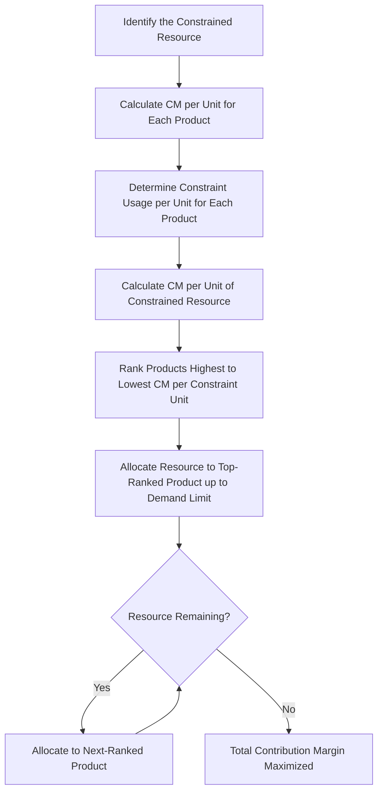

## Constrained Resource and Scarce Resource Decisions

### Overview

Constrained resource decisions (also called scarce resource decisions) arise when a company faces a limiting factor — a bottleneck — that restricts its ability to produce or sell as much as it otherwise could. Common constraints include machine-hours, labor-hours, floor space, raw materials, or units of a scarce input. When a constraint exists, the traditional per-unit contribution margin ranking used for product-mix decisions becomes misleading, and managers must instead rank products or services based on contribution margin **per unit of the constrained resource**.

### The Core Problem

In an unconstrained environment, a company would produce and sell as much as possible of every product with a positive contribution margin. However, when a single scarce resource limits total output, the company cannot make everything the market demands. The decision becomes: **which product(s) should be produced using the limited resource to maximize total contribution margin (and thus operating income)?**

### Why Contribution Margin Per Unit Is Not Enough

A product with the highest contribution margin (CM) per unit is not necessarily the most profitable choice when a resource is constrained, because different products may consume different amounts of the scarce resource per unit.

**Key Points**

- Ranking by CM per unit alone ignores how much of the constraint each unit consumes.
- The correct ranking metric is:

$$\text{CM per unit of constraint} = \dfrac{\text{Contribution margin per unit}}{\text{Units of constrained resource required per unit of product}}$$

- The product with the highest CM per unit of the constraint should be produced/sold first (up to demand or capacity limits), followed by the next-highest, and so on, until the constrained resource is exhausted.

### Step-by-Step Decision Process

1. Identify the constraint (the bottleneck limiting production or sales).
2. Determine the contribution margin per unit for each product ($\text{CM} = \text{Sales price} - \text{Variable cost}$).
3. Determine how many units of the constrained resource each product consumes per unit produced.
4. Calculate CM per unit of the constrained resource for each product.
5. Rank products from highest to lowest CM per unit of the constraint.
6. Allocate the scarce resource to the highest-ranked product first, up to its maximum sales demand, then move to the next-ranked product, and so on, until the resource is fully allocated.
7. Compute total contribution margin under this allocation to confirm it is optimized.

### Example

A company produces two products, Standard and Deluxe, and faces a constraint of only 1,000 machine-hours available per month.

| Item | Standard | Deluxe |
| --- | --- | --- |
| Selling price per unit | $50 | $80 |
| Variable cost per unit | $30 | $55 |
| Contribution margin per unit | $20 | $25 |
| Machine-hours required per unit | 0.5 hours | 1.0 hour |
| Maximum monthly demand | 1,500 units | 800 units |

**Step 1 — CM per unit (naive ranking):**

- Standard: $20/unit
- Deluxe: $25/unit

If a manager mistakenly used this ranking alone, Deluxe would appear more attractive.

**Step 2 — CM per unit of the constraint (machine-hours):**

$$\text{Standard} = \dfrac{\$20}{0.5} = \$40 \text{ per machine-hour}$$

$$\text{Deluxe} = \dfrac{\$25}{1.0} = \$25 \text{ per machine-hour}$$

**Step 3 — Correct ranking:** Standard ($40/hour) outranks Deluxe ($25/hour), even though Deluxe has the higher CM per unit.

**Step 4 — Allocate the constraint:**

- Produce Standard first, up to its demand of 1,500 units, which requires $1{,}500 \times 0.5 = 750$ machine-hours.
- Remaining machine-hours: $1{,}000 - 750 = 250$ hours.
- Use remaining 250 hours for Deluxe: $250 / 1.0 = 250$ units (less than the 800-unit demand ceiling, so Deluxe is capacity-limited).

**Step 5 — Total contribution margin under optimal allocation:**

$$(1{,}500 \times \$20) + (250 \times \$25) = \$30{,}000 + \$6{,}250 = \$36{,}250$$

Compare this to the suboptimal approach of prioritizing Deluxe first (based on CM/unit): Deluxe would use $800 \times 1.0 = 800$ hours, leaving 200 hours for Standard, or $200 / 0.5 = 400$ units.

$$(800 \times \$25) + (400 \times \$20) = \$20{,}000 + \$8{,}000 = \$28{,}000$$

The correct ranking produces $8,250 more in contribution margin per month ($\$36{,}250 - \$28{,}000$), illustrating the financial cost of using the wrong ranking criterion.

### Visualizing the Decision Logic

### Multiple Constraints

When more than one resource is constrained simultaneously (e.g., both machine-hours and labor-hours), simple ranking by CM per unit of a single constraint no longer guarantees an optimal solution. This situation requires **linear programming**, typically solved using:

- The graphical method (for two products/two constraints)
- The simplex method or software-based optimization (for more complex, multi-product, multi-constraint problems)

**Key Points**

- Linear programming maximizes an objective function (total contribution margin) subject to constraint inequalities.
- The objective function: $Z = CM_1 x_1 + CM_2 x_2 + \dots + CM_n x_n$
- Subject to constraints such as: $a_1 x_1 + a_2 x_2 \leq \text{available resource}$, and non-negativity constraints ($x_i \geq 0$).
- [Inference] Most introductory managerial accounting courses only require conceptual awareness of linear programming for multiple constraints, with detailed solving mechanics typically covered in a quantitative methods or operations management course, though this can vary by curriculum.

### Relevant vs. Irrelevant Costs in Constraint Decisions

Only costs and revenues that differ between alternatives are relevant to the decision.

**Key Points**

- Fixed costs that do not change regardless of the production mix are irrelevant to the ranking decision (though they still affect overall profitability and must be covered).
- Sunk costs (already incurred, unavoidable) are never relevant.
- Only variable costs used to compute contribution margin, and the constraint usage rate, matter for the ranking.
- Opportunity cost of the scarce resource becomes an important concept: choosing to produce one unit of a product means forgoing the contribution margin that could have been earned by using that resource on an alternative product.

### Strategies for Relieving the Constraint

Beyond simply optimizing the product mix given an existing constraint, managers can take actions to relax or eliminate the bottleneck itself, guided by the Theory of Constraints (TOC):

- Investing in additional capacity for the constrained resource (e.g., buying an additional machine)
- Outsourcing production of the constraining step
- Improving process efficiency to reduce the resource-usage rate per unit
- Overtime or additional shifts to increase available constrained hours
- Eliminating non-value-added activities that consume the constrained resource
- Re-engineering products to require less of the scarce resource

**Key Points**

- Under TOC, the five focusing steps are: (1) identify the constraint, (2) exploit the constraint (optimize its current use), (3) subordinate all other decisions to the constraint decision, (4) elevate the constraint (invest to increase capacity), and (5) repeat the process as a new constraint emerges.
- Any investment to relieve a constraint should be evaluated using the incremental contribution margin gained versus the incremental cost of the investment.

### Common Pitfalls

- Ranking products solely by contribution margin per unit rather than per unit of the constraint.
- Ignoring maximum demand limits and over-allocating capacity to the top-ranked product beyond what the market will absorb.
- Treating allocated (traditional) fixed manufacturing overhead as relevant when it does not vary with the decision.
- Failing to consider qualitative factors, such as customer relationships, contractual obligations, or strategic positioning, that might justify producing a lower-ranked product despite the numbers.

### Qualitative Considerations

**Key Points**

- Long-term customer contracts may require fulfilling minimum order quantities even for lower-ranked products.
- Product mix decisions based purely on short-term contribution margin optimization may harm long-term customer relationships or market share if applied rigidly.
- [Speculation] In some competitive markets, temporarily accepting a lower-margin product mix to retain a strategic customer may preserve future revenue streams not captured in the single-period analysis.

### Next Steps

- Special Order Decisions
- Make-or-Buy (Outsourcing) Decisions
- Sell or Process Further Decisions
- Adding or Dropping a Product Line or Segment
- Theory of Constraints and Throughput Accounting
- Linear Programming for Multiple Constraints
- Relevant Cost Analysis Fundamentals