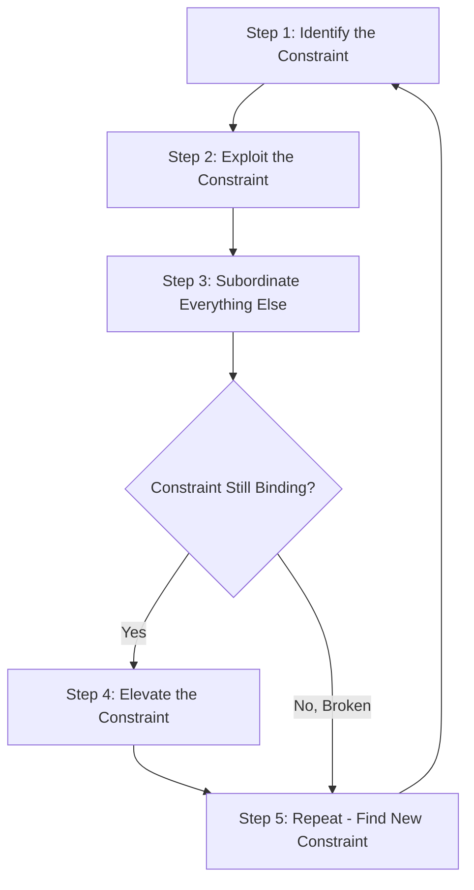

## Theory of Constraints and Throughput Analysis

### Overview

The Theory of Constraints (TOC) is a management philosophy developed by Eliyahu Goldratt that views every organization as a system limited in achieving its goals by at least one constraint (bottleneck). Throughput Accounting is the financial measurement approach built on TOC, which evaluates decisions based on their effect on **throughput** rather than traditional cost-allocation metrics. TOC argues that maximizing the performance of the constraint — not minimizing costs everywhere — is the key driver of overall organizational profitability.

### Core Definitions

**Key Points**

- **Throughput (T):** The rate at which the system generates money through sales, defined as:

$$T = \text{Sales Revenue} - \text{Totally Variable Costs}$$

- Totally variable costs (TVC) typically include only direct materials and other costs that vary strictly with each unit sold — direct labor is often treated as a fixed cost in throughput accounting, since it is rarely adjusted in the very short term.
- **Investment/Inventory (I):** All the money the system invests in purchasing things it intends to sell, including raw materials, work-in-process, and finished goods inventory, plus capital tied up in equipment and facilities.
- **Operating Expense (OE):** All the money the system spends to turn investment into throughput — includes direct labor, rent, utilities, depreciation, and other operating costs that are not totally variable.

**Net Profit and Return on Investment under TOC:**

$$\text{Net Profit} = T - OE$$

$$\text{ROI} = \dfrac{T - OE}{I}$$

### Throughput Accounting vs. Traditional Cost Accounting

| Aspect | Traditional Cost Accounting | Throughput Accounting |
| --- | --- | --- |
| Cost treatment | Allocates fixed overhead to units (absorption costing) | Treats most costs except direct materials as period costs |
| Focus | Minimizing cost per unit | Maximizing throughput through the constraint |
| Inventory valuation | Includes labor and overhead | Values inventory at totally variable cost only |
| Decision basis | Unit cost and traditional CM | Throughput per unit of constraint time |
| Risk | Can encourage overproduction to absorb fixed costs | Discourages producing non-constraint inventory buildup |

**Key Points**

- Traditional cost accounting can create a misleading incentive to keep every machine running to "absorb" fixed overhead, even producing excess inventory of non-bottleneck items. TOC argues this consumes resources without increasing sellable throughput and inflates unnecessary inventory investment.
- [Inference] This divergence tends to matter most in production environments with clearly identifiable bottleneck operations; in less capital-intensive or purely service settings, the practical difference between the two approaches may be smaller.

### The Five Focusing Steps of TOC

1. **Identify** the system's constraint (the resource or step limiting throughput).
2. **Exploit** the constraint — ensure the constraint is used as efficiently as possible without additional investment (e.g., eliminate downtime, changeovers, defects at the bottleneck; prioritize the most profitable products through it).
3. **Subordinate** everything else to the constraint decision — all non-constraint resources should be scheduled to support the constraint's pace, not maximize their own individual efficiency.
4. **Elevate** the constraint — if exploitation and subordination are insufficient, invest in increasing the constraint's capacity (e.g., buy additional equipment, add shifts).
5. **Repeat** the process — once a constraint is broken, a new constraint will emerge elsewhere in the system (or in the market), so the cycle continues (avoid organizational "inertia" from becoming the next constraint).

### Throughput Per Unit of Constraint Time

The central decision metric in throughput accounting mirrors constrained-resource analysis but uses throughput (rather than traditional contribution margin) as the numerator:

$$\text{Throughput per unit of constraint} = \dfrac{\text{Sales Price} - \text{Totally Variable Cost}}{\text{Constraint Time (or units) Required per Unit}}$$

Products are ranked and produced in order of highest throughput per unit of constraint time, similar to the constrained-resource decision framework, but with the stricter TOC definition of variable cost (materials only).

### Example

A company has one bottleneck operation: a heat-treatment furnace with 2,000 minutes of capacity available per day. It makes two products:

| Item | Product A | Product B |
| --- | --- | --- |
| Selling price | $100 | $150 |
| Direct material cost (totally variable) | $40 | $70 |
| Throughput per unit | $60 | $80 |
| Furnace minutes required per unit | 10 minutes | 20 minutes |
| Daily demand | 150 units | 80 units |

**Step 1 — Throughput per constraint minute:**

$$\text{Product A} = \dfrac{\$60}{10} = \$6.00 \text{ per minute}$$

$$\text{Product B} = \dfrac{\$80}{20} = \$4.00 \text{ per minute}$$

**Step 2 — Ranking:** Product A is prioritized over Product B, since it generates more throughput per constrained minute, despite Product B having the higher throughput per unit.

**Step 3 — Allocate the furnace's 2,000 minutes:**

- Product A demand: $150 \times 10 = 1{,}500$ minutes
- Remaining minutes: $2{,}000 - 1{,}500 = 500$ minutes
- Product B: $500 / 20 = 25$ units (demand-constrained short of the 80-unit ceiling)

**Step 4 — Total daily throughput:**

$$(150 \times \$60) + (25 \times \$80) = \$9{,}000 + \$2{,}000 = \$11{,}000$$

This $11,000 is then used to cover total operating expenses for the day; any excess represents net profit.

### The Drum-Buffer-Rope Scheduling Method

TOC production scheduling commonly uses the **Drum-Buffer-Rope (DBR)** method to synchronize the whole plant to the pace of the constraint:

- **Drum:** The constraint sets the production "beat" or pace for the entire system — all scheduling is built around the bottleneck's capacity.
- **Buffer:** A time or inventory buffer is placed in front of the constraint to protect it from starvation caused by upstream variability or disruptions, ensuring the bottleneck never sits idle.
- **Rope:** A signaling mechanism that paces the release of raw materials into the system to match the constraint's consumption rate, preventing excess work-in-process inventory from building up ahead of the bottleneck.

**Key Points**

- The goal of DBR is to keep the constraint continuously busy (since any lost time at the bottleneck is lost throughput for the entire system) while avoiding unnecessary buildup of inventory elsewhere.
- Non-bottleneck resources should have some idle capacity by design; keeping them "100% busy" simply builds inventory rather than adding sellable throughput.

### Elevating the Constraint: Cost-Benefit Analysis

When considering an investment to increase constraint capacity (Step 4), the incremental throughput gained should be compared to the incremental investment/operating expense required.

**Example:**

If adding a second furnace shift costs $3,500/day in additional operating expense (labor, utilities) and provides an additional 1,000 minutes of constraint capacity per day, the company can produce the remaining 55 units of Product B demand ($80 - 25 = 55$ units, requiring $55 \times 20 = 1{,}100$ minutes — close to the 1,000 available).

Approximate additional throughput: $1{,}000 / 20 \approx 50$ units $\times \$80 = \$4{,}000$

$$\text{Net benefit} = \$4{,}000 - \$3{,}500 = \$500 \text{ per day}$$

Since the net benefit is positive, elevating the constraint is financially justified in this scenario. [Inference] In practice, such decisions should also weigh capacity utilization trends, whether the added shift creates a new bottleneck elsewhere, and non-financial factors like labor availability and equipment wear.

### Relevant vs. Irrelevant Costs Under TOC

**Key Points**

- Direct materials are the primary relevant variable cost under strict TOC classification.
- Direct labor and manufacturing overhead are typically treated as fixed operating expenses in the short run, since they usually cannot be adjusted quickly, making them irrelevant to per-unit throughput ranking (though they remain relevant to overall profitability).
- [Unverified] Some organizations adapt the TOC framework to treat certain labor costs as variable if their workforce is highly flexible (e.g., extensive use of temporary or contract labor), which deviates from the classic Goldratt formulation.

### TOC vs. Contribution Margin Approach (Constrained Resource Analysis)

| Feature | Traditional CM-based Constraint Analysis | TOC Throughput Analysis |
| --- | --- | --- |
| Numerator used | Contribution margin (Sales − all variable costs) | Throughput (Sales − totally variable costs only) |
| Labor treatment | Usually variable | Usually fixed |
| Underlying goal | Maximize CM given constraint | Maximize throughput while protecting the constraint |
| Scheduling philosophy | Not explicitly addressed | Drum-Buffer-Rope scheduling |
| Broader system view | Product-mix focused | Whole-system, ongoing constraint-management focused |

### Common Pitfalls

- Treating direct labor as variable when applying strict throughput accounting definitions, which distorts the throughput-per-constraint-unit ranking.
- Focusing on local efficiency of non-bottleneck resources rather than protecting the throughput of the constraint.
- Failing to recognize that once one constraint is elevated or broken, a new constraint (internal or market demand itself) will emerge, requiring the five-step cycle to repeat.
- Ignoring the buffer needed in front of the constraint, leading to bottleneck starvation from upstream variability.

### Related Topics

- Constrained Resource and Scarce Resource Decisions
- Special Order Decisions
- Relevant Cost Analysis Fundamentals
- Variable Costing vs. Absorption Costing
- Make-or-Buy (Outsourcing) Decisions
- Capacity Planning and Capital Investment Decisions
- Just-in-Time (JIT) Production Systems