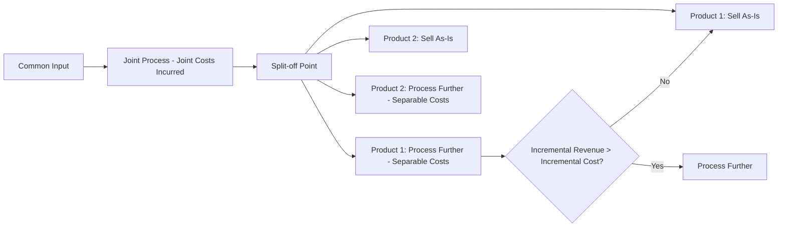

## Sell or Process Further Decisions

### Overview

A sell-or-process-further decision arises when a company produces a product that can either be sold at an intermediate stage (the **split-off point**) or processed further into a more refined product before being sold. This decision is especially common in **joint production processes**, where a single input or process yields multiple products (joint products and/or by-products) simultaneously up to a certain point, after which each product can be sold as-is or processed individually further.

### Key Terminology

**Key Points**

- **Split-off point:** The point in a joint production process at which the joint products become separately identifiable.
- **Joint costs:** Costs incurred prior to the split-off point that are shared across all joint products and cannot be traced to any single product. These are always **sunk costs** by the time the sell-or-process-further decision is made.
- **Separable costs:** Costs incurred after the split-off point that are specific to further processing an individual product; these are relevant to the decision because they can be avoided by selling at split-off instead.
- **Joint products:** Two or more products of significant relative sales value produced simultaneously from a common input or process.
- **By-products:** Products of minor sales value produced incidentally along with the main joint products.

### The Core Decision Rule

Because joint costs are sunk by the time of the split-off point, they are **irrelevant** to the sell-or-process-further decision, regardless of how they are allocated to individual products for financial reporting purposes.

**Key Points**

- The decision should be based solely on comparing:
  1. The **incremental revenue** from further processing (additional sales value gained), versus
  2. The **incremental (separable) costs** of further processing.
- The decision rule:

$$\text{Process Further if: } \Delta \text{Revenue} > \Delta \text{Separable Costs}$$

$$\text{Sell at Split-off if: } \Delta \text{Revenue} \leq \Delta \text{Separable Costs}$$

- Joint cost allocation method (physical units, sales value at split-off, net realizable value, etc.) has **no effect** on this decision — it only affects how costs are reported for inventory valuation and external financial statements.

### Why Joint Cost Allocation Is Irrelevant

Since joint costs are incurred regardless of what happens to the products after split-off, they do not change based on the further-processing decision. Allocating a larger or smaller share of joint cost to a product changes its *reported* profitability under GAAP-based costing but does not change the *economics* of whether further processing adds value.

**Example of the trap:** A manager might see that after allocating joint costs, "Product X shows a loss when processed further" and conclude it should be sold at split-off — but this is a common error, since the allocated joint cost would be incurred either way and is irrelevant to the true incremental decision.

### Step-by-Step Decision Process

1. Identify the sales value of each product **at the split-off point** (if sold immediately, without further processing).
2. Identify the sales value of each product **after further processing**.
3. Calculate the incremental revenue: $\Delta \text{Revenue} = \text{Sales value after processing} - \text{Sales value at split-off}$.
4. Identify the separable (incremental) costs required to further process the product.
5. Compare incremental revenue to incremental separable costs.
6. Process further only if incremental revenue exceeds incremental separable costs; otherwise, sell at split-off.
7. Ignore all joint costs and any allocated joint cost amounts — they do not affect the decision.

### Example

A company processes raw lumber through a joint process, yielding two products: Standard Boards and Premium Boards. Joint costs to reach split-off total $50,000 for a monthly batch.

| Item | Standard Boards | Premium Boards |
| --- | --- | --- |
| Sales value at split-off | $60,000 | $40,000 |
| Sales value after further processing | $68,000 | $58,000 |
| Separable (further processing) costs | $5,000 | $22,000 |

**Step 1 — Incremental revenue:**

- Standard Boards: $\$68{,}000 - \$60{,}000 = \$8{,}000$
- Premium Boards: $\$58{,}000 - \$40{,}000 = \$18{,}000$

**Step 2 — Compare to separable costs:**

- Standard Boards: Incremental revenue $8,000 > Separable cost $5,000 → **Process further** (net benefit of $3,000)
- Premium Boards: Incremental revenue $18,000 < Separable cost $22,000 → **Sell at split-off** (net loss of $4,000 if processed further)

**Step 3 — Conclusion:** Standard Boards should be processed further; Premium Boards should be sold at the split-off point. Note that the $50,000 joint cost plays no role in this determination — it is sunk and identical under either alternative.

### Visualizing the Decision Point

### By-Products in Sell-or-Process-Further Decisions

**Key Points**

- By-products are typically evaluated with the same incremental logic: process further only if the incremental revenue from doing so exceeds the incremental separable cost.
- Because by-products have low relative sales value, companies often use simplified accounting treatments (e.g., recognizing by-product revenue as a reduction of the main product's cost of goods sold at the time of sale), but this financial-reporting treatment does not change the underlying economic decision rule.

### Relevant vs. Irrelevant Costs Summary

| Cost/Revenue Item | Relevant to Decision? | Reason |
| --- | --- | --- |
| Joint costs (pre-split-off) | No | Sunk cost — incurred regardless of decision |
| Allocated joint costs | No | An accounting allocation, not an actual differential cash flow |
| Separable (further processing) costs | Yes | Avoidable — only incurred if further processing is chosen |
| Sales value at split-off | Yes | Represents the opportunity cost of foregoing an immediate sale |
| Sales value after further processing | Yes | Determines the incremental revenue from the decision |
| Fixed costs unaffected by the decision | No | Does not differ between alternatives |

### Common Pitfalls

- Allowing an allocated joint cost to influence the further-processing decision (a classic case of sunk cost fallacy).
- Comparing total sales value after processing to total joint and separable costs combined, rather than isolating the incremental (differential) amounts only.
- Assuming a product showing a "loss" under full-absorption reporting (which includes allocated joint costs) should not be processed further, without checking the incremental analysis.
- Ignoring qualitative factors — for example, contractual commitments to deliver a finished (further-processed) product, environmental or regulatory requirements, or market positioning — that might override a marginal incremental-cost result.

### Qualitative Considerations

**Key Points**

- Some products may need further processing for regulatory, safety, or contractual reasons even if the strict incremental analysis suggests selling at split-off.
- Market conditions and price volatility for the intermediate versus finished product should be monitored, since the sales values used in the analysis are estimates that can change.
- [Speculation] In industries with significant price volatility for intermediate versus finished goods (e.g., commodities, agricultural processing), the sell-or-process-further decision may need to be revisited more frequently than in stable-demand industries.

### Related Topics

- Joint Cost Allocation Methods (Physical Units, Sales Value at Split-off, NRV, Constant Gross Margin)
- Constrained Resource and Scarce Resource Decisions
- Special Order Decisions
- Make-or-Buy (Outsourcing) Decisions
- Adding or Dropping a Product Line or Segment
- Relevant Cost Analysis Fundamentals
- By-Product Accounting Treatments