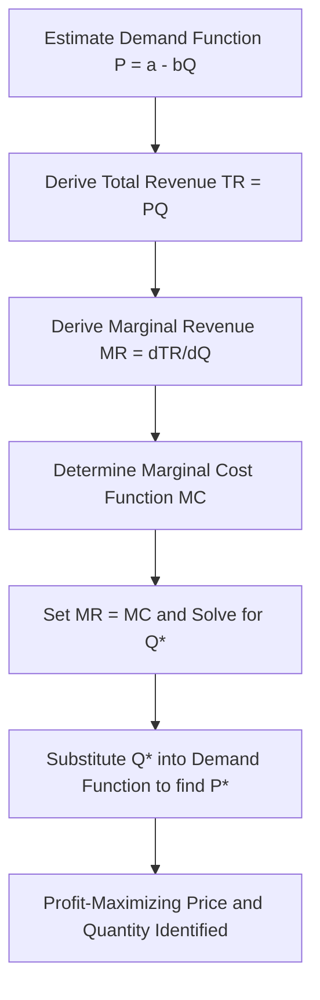

## Economic Theory of Pricing

### Overview

The economic theory of pricing provides the foundational framework for understanding how prices are determined in a market and how a firm can identify the price that maximizes its profit. Unlike cost-based pricing approaches used in practice (such as cost-plus pricing), economic theory approaches pricing from the perspective of the interaction between customer demand, marginal cost, and market structure. Managerial accounting draws on this framework to explain *why* certain pricing heuristics work as reasonable approximations of the theoretically optimal price.

### The Demand Curve

**Key Points**

- The demand curve represents the relationship between the price of a product and the quantity customers are willing to purchase at that price, holding other factors constant.
- Demand curves are typically downward-sloping: as price decreases, quantity demanded increases (the Law of Demand).
- The demand function can be expressed algebraically, for example: $Q = a - bP$, where $Q$ is quantity demanded, $P$ is price, and $a$ and $b$ are constants specific to the product and market.

### Price Elasticity of Demand

Price elasticity of demand measures how sensitive quantity demanded is to a change in price.

$$E_d = \dfrac{\%\Delta Q}{\%\Delta P}$$

**Key Points**

- **Elastic demand** ($|E_d| > 1$): Quantity demanded changes proportionally more than price — small price changes cause large volume changes. Typically applies to products with many substitutes or discretionary purchases.
- **Inelastic demand** ($|E_d| < 1$): Quantity demanded changes proportionally less than price — customers continue buying even as price rises. Typically applies to necessities or products with few substitutes.
- **Unit elastic** ($|E_d| = 1$): Percentage change in quantity exactly equals percentage change in price.
- Elasticity directly affects optimal pricing strategy: firms selling elastic-demand products generally benefit from lower prices to drive volume, while firms selling inelastic-demand products can sustain higher prices with a smaller volume trade-off.

### Marginal Revenue and Marginal Cost

**Key Points**

- **Marginal revenue (MR):** The additional revenue generated from selling one more unit.
- **Marginal cost (MC):** The additional cost incurred to produce one more unit.
- Under standard microeconomic theory, a profit-maximizing firm should produce and sell up to the quantity where:

$$MR = MC$$

- At quantities below this point, producing additional units still adds more revenue than cost (increasing total profit); beyond this point, additional units cost more to produce than they generate in revenue (decreasing total profit).

### Deriving Marginal Revenue from the Demand Curve

If the demand curve is linear ($P = a - bQ$), total revenue is $TR = P \times Q = (a - bQ)Q = aQ - bQ^2$.

Marginal revenue is the derivative of total revenue with respect to quantity:

$$MR = \dfrac{d(TR)}{dQ} = a - 2bQ$$

**Key Points**

- Notably, the marginal revenue curve has the same intercept ($a$) as the demand curve but twice the slope, meaning MR declines faster than price as quantity increases.
- This reflects the fact that, under a single uniform price, selling one more unit typically requires lowering price on *all* units sold (not just the incremental one), reducing the net revenue gain from that extra unit.

### Optimal Price and Quantity Determination

**Step-by-step approach:**

1. Establish the demand function: $P = a - bQ$.
2. Derive total revenue: $TR = aQ - bQ^2$.
3. Derive marginal revenue: $MR = a - 2bQ$.
4. Establish the marginal cost function (often assumed constant in introductory treatments, $MC = c$).
5. Set $MR = MC$ and solve for the profit-maximizing quantity $Q^*$.
6. Substitute $Q^*$ back into the demand function to find the profit-maximizing price $P^*$.

### Example

A company's demand function is estimated as $P = 200 - 2Q$, and its marginal cost is constant at $MC = \$40$ per unit.

**Step 1 — Total revenue:**

$$TR = PQ = (200 - 2Q)Q = 200Q - 2Q^2$$

**Step 2 — Marginal revenue:**

$$MR = \dfrac{d(TR)}{dQ} = 200 - 4Q$$

**Step 3 — Set MR = MC:**

$$200 - 4Q = 40$$

$$4Q = 160$$

$$Q^* = 40 \text{ units}$$

**Step 4 — Solve for optimal price:**

$$P^* = 200 - 2(40) = 200 - 80 = \$120$$

**Step 5 — Verify profit-maximizing logic:** At $Q = 40$, producing one more unit would generate $MR = 200 - 4(41) = \$36$, which is less than the $MC$ of $40 — confirming that producing beyond 40 units would reduce profit. This confirms $Q^* = 40$ and $P^* = \$120$ are optimal.

**Step 6 — Compute total profit** (assuming fixed costs of $1,000 and no other variable costs beyond the $40/unit marginal cost):

$$\text{Total Revenue} = 120 \times 40 = \$4{,}800$$

$$\text{Total Variable Cost} = 40 \times 40 = \$1{,}600$$

$$\text{Profit} = \$4{,}800 - \$1{,}600 - \$1{,}000 = \$2{,}200$$

### Visualizing the Optimal Pricing Point

### Market Structure and Pricing Power

**Key Points**

- **Perfect competition:** Firms are price-takers; price equals marginal cost ($P = MC$) at equilibrium, and no single firm has pricing power due to many competitors selling identical products.
- **Monopoly:** A single seller faces the entire market demand curve and sets price above marginal cost, restricting output relative to the competitive level to maximize profit ($MR = MC$, but $P > MC$).
- **Monopolistic competition:** Many firms sell differentiated products, giving each some pricing power, but competition and product substitutes constrain how far prices can rise above cost.
- **Oligopoly:** A small number of firms dominate the market; pricing decisions are interdependent, and firms must consider competitors' likely reactions to any price change (sometimes modeled using game theory).

### Cross-Price Elasticity and Income Elasticity

**Key Points**

- **Cross-price elasticity of demand** measures how the quantity demanded of one product responds to a price change in another product:

$$E_{xy} = \dfrac{\% \Delta Q_x}{\% \Delta P_y}$$

- A positive value indicates substitute goods (e.g., price of Product Y rises, demand for Product X rises).
- A negative value indicates complementary goods (e.g., price of Product Y rises, demand for Product X falls).
- **Income elasticity of demand** measures how quantity demanded responds to changes in consumer income, useful for distinguishing normal goods (positive elasticity) from inferior goods (negative elasticity).

### Connecting Economic Theory to Managerial Accounting Practice

**Key Points**

- Full economic optimization (deriving precise demand functions and marginal revenue curves) is often impractical in real business settings due to the difficulty of estimating demand curves with precision.
- As a result, managerial accounting relies on simplified, cost-based heuristics — such as cost-plus pricing and target costing — that are easier to apply but are implicitly influenced by the same underlying economic principles (elasticity, marginal cost, and competitive market structure).
- [Inference] Understanding the economic theory of pricing helps managers interpret why a cost-plus markup might need adjustment based on competitive intensity or demand elasticity, even though the formal $MR = MC$ calculation is rarely performed in day-to-day pricing decisions.
- Price elasticity estimates, when available (e.g., from market research or historical sales data), can directly inform target markup percentages: lower markups for elastic-demand products, higher markups for inelastic-demand products.

### Limitations of the Economic Pricing Model

**Key Points**

- Requires accurate estimation of the demand curve, which is often difficult or costly to determine precisely in practice.
- Assumes a stable market structure and holds other variables (e.g., competitor pricing, consumer preferences) constant, which may not reflect dynamic real-world conditions.
- Does not directly account for behavioral or psychological pricing factors (e.g., price anchoring, prestige pricing) that can influence actual customer purchasing behavior.
- [Speculation] In highly dynamic or rapidly evolving markets, continuously re-estimating demand elasticity may be more costly than the precision gained, leading many firms to favor simpler, periodically-revised pricing rules instead.

### Common Pitfalls

- Confusing total revenue maximization with profit maximization — the revenue-maximizing quantity generally differs from the profit-maximizing quantity (in the example above, revenue is maximized where $MR = 0$, i.e., $Q = 50$, not at $Q^* = 40$).
- Assuming marginal cost is constant when in reality it may vary with production volume (e.g., due to capacity constraints or economies/diseconomies of scale).
- Applying a single firm-wide elasticity estimate across all products or customer segments, when elasticity often varies significantly by market segment.
- Ignoring competitor reactions in oligopolistic markets when modeling the firm's own demand curve in isolation.

### Related Topics

- Cost-Plus Pricing
- Target Costing and Target Pricing
- Value-Based Pricing
- Price Elasticity of Demand in Practice
- Market Structure and Competitive Strategy
- Customer Profitability Analysis
- Life-Cycle Costing and Pricing