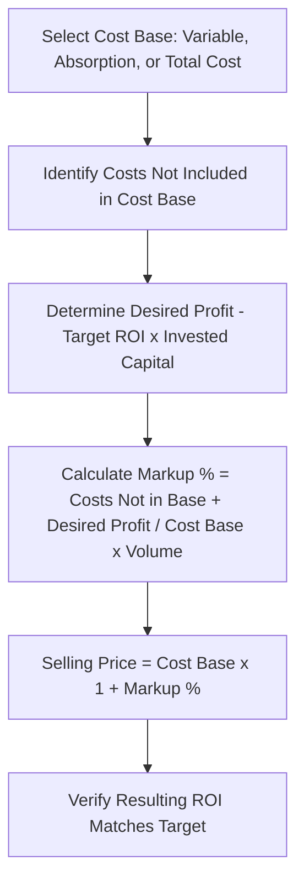

## Cost Plus Pricing Approaches

### Overview

Cost-plus pricing is a pricing method in which a company determines the selling price of a product or service by adding a markup to a chosen cost base. It is one of the most widely used practical pricing approaches because it is simple to calculate, ensures cost recovery, and provides a defensible starting point for price-setting, even though it does not directly incorporate demand or competitive market conditions the way economic pricing theory does.

### The General Cost-Plus Formula

$$\text{Selling Price} = \text{Cost Base} + (\text{Cost Base} \times \text{Markup Percentage})$$

Equivalently:

$$\text{Selling Price} = \text{Cost Base} \times (1 + \text{Markup Percentage})$$

**Key Points**

- The **cost base** can be defined in several different ways depending on which costs the company wants the markup to cover.
- The **markup percentage** is typically set to cover costs not included in the cost base, plus a desired profit margin.

### Common Cost Base Approaches

**Key Points**

1. **Variable cost pricing:** Cost base = total variable manufacturing and non-manufacturing costs per unit. Markup must cover fixed costs and desired profit.
2. **Absorption (full manufacturing) cost pricing:** Cost base = variable manufacturing costs + fixed manufacturing overhead per unit (i.e., full manufacturing cost, consistent with GAAP inventory costing). Markup must cover selling, general, and administrative (SG&A) costs and desired profit.
3. **Total cost pricing:** Cost base = full manufacturing cost + all SG&A costs (variable and fixed) allocated per unit. Markup only needs to cover desired profit margin, since all costs are already included in the base.

### Determining the Markup Percentage

A common approach is to set the markup so that it generates a target return on investment (ROI) on invested capital.

$$\text{Markup Percentage} = \dfrac{\text{Desired ROI} \times \text{Invested Capital} + \text{Costs Not Included in Cost Base}}{\text{Cost Base} \times \text{Expected Unit Volume}}$$

A simplified version, when the cost base already includes all costs except desired profit:

$$\text{Markup Percentage} = \dfrac{\text{Desired ROI} \times \text{Invested Capital}}{\text{Total Cost Base}}$$

### Example: Absorption Cost Pricing Approach

A company manufactures a product with the following data:

| Item | Amount |
| --- | --- |
| Variable manufacturing cost per unit | $25 |
| Fixed manufacturing overhead per unit (based on 10,000 units) | $15 |
| Variable SG&A cost per unit | $5 |
| Fixed SG&A costs (total) | $60,000 |
| Invested capital | $500,000 |
| Desired ROI | 12% |
| Expected annual volume | 10,000 units |

**Step 1 — Determine the cost base (absorption/full manufacturing cost):**

$$\text{Cost Base} = \$25 + \$15 = \$40 \text{ per unit}$$

**Step 2 — Determine costs not included in the cost base (SG&A costs):**

\text{Total SG&A} = (\$5 \times 10{,}000) + \$60{,}000 = \$50{,}000 + \$60{,}000 = \$110{,}000

**Step 3 — Determine desired profit:**

$$\text{Desired Profit} = 12\% \times \$500{,}000 = \$60{,}000$$

**Step 4 — Calculate markup percentage:**

$$\text{Markup \%} = \dfrac{\$110{,}000 + \$60{,}000}{\$40 \times 10{,}000} = \dfrac{\$170{,}000}{\$400{,}000} = 42.5\%$$

**Step 5 — Calculate selling price:**

$$\text{Selling Price} = \$40 \times (1 + 0.425) = \$40 \times 1.425 = \$57.00$$

**Step 6 — Verify:**

$$\text{Total Revenue} = \$57 \times 10{,}000 = \$570{,}000$$

$$\text{Total Costs} = (\$40 \times 10{,}000) + \$110{,}000 = \$400{,}000 + \$110{,}000 = \$510{,}000$$

$$\text{Profit} = \$570{,}000 - \$510{,}000 = \$60{,}000$$

$$\text{ROI} = \dfrac{\$60{,}000}{\$500{,}000} = 12\% \checkmark$$

The price achieves exactly the targeted 12% ROI on invested capital.

### Comparing Cost Base Approaches Side-by-Side

Using the same data above, the choice of cost base changes both the cost figure and the required markup percentage, but should converge on the same final selling price if applied consistently.

| Approach | Cost Base per Unit | Costs to Cover via Markup | Required Markup % (approx.) | Resulting Price |
| --- | --- | --- | --- | --- |
| Variable cost | $30 ($25 + $5) | Fixed mfg. overhead + Fixed SG&A + Profit | $\dfrac{\$150{,}000 + \$60{,}000}{\$300{,}000} = 70\%$ | $\$30 \times 1.70 = \$51.00$* |
| Absorption cost | $40 | Variable & Fixed SG&A + Profit | 42.5% | $57.00 |
| Total cost | $45 ($40 + $5) | Fixed SG&A + Profit | $\dfrac{\$60{,}000 + \$60{,}000}{\$450{,}000} = 26.7\%$ | $\$45 \times 1.267 \approx \$57.00$ |

*Note: [Inference] Minor differences between approaches (such as the $51.00 figure above) typically arise from rounding or from which fixed costs are explicitly included in the "costs to cover" numerator; when applied with full internal consistency, all three cost-base methods are designed to converge on the same target price.

**Key Points**

- Regardless of which cost base is used, the *final target price* should be consistent if the markup calculation properly accounts for whichever costs were excluded from the base.
- The choice of cost base is often driven by what information is most readily available, industry convention, or management's preferred way of thinking about cost recovery (e.g., manufacturers often default to absorption cost since it aligns with required external financial reporting).

### Visualizing the Cost-Plus Pricing Process

### Advantages of Cost-Plus Pricing

**Key Points**

- Simple to calculate and communicate, using data that is generally already available from the cost accounting system.
- Ensures all identified costs are covered and a target profit margin is built in, reducing the risk of unintentionally selling at a loss.
- Provides a consistent, defensible basis for pricing across a wide product range, useful in industries with many SKUs.
- Useful in cost-reimbursement contracts (e.g., government contracts) where pricing is explicitly based on allowable costs plus a fee.

### Limitations of Cost-Plus Pricing

**Key Points**

- Ignores customer demand and price elasticity — the calculated price may be far above or below what the market will bear.
- Ignores competitor pricing, which can result in a firm being priced out of the market or leaving money on the table if competitors charge substantially more.
- Can create a circular logic problem: fixed overhead per unit depends on assumed volume, but volume itself often depends on the price charged (which depends on the assumed volume).
- May encourage inefficiency, since a full-cost-based cost-plus formula guarantees cost recovery regardless of how well costs are controlled (sometimes called the "cost-plus trap").
- Does not account for the value the customer places on the product (contrast with value-based pricing).

### Relationship to Target Costing

**Key Points**

- Cost-plus pricing starts with cost and derives price ($\text{Price} = \text{Cost} + \text{Markup}$).
- Target costing reverses this logic, starting with a market-determined price and working backward to determine the maximum allowable cost ($\text{Target Cost} = \text{Target Price} - \text{Desired Profit}$).
- [Inference] Many companies use cost-plus pricing as an internal floor-price check (ensuring minimum cost recovery) while still setting the actual market price using target costing or competitive/value-based approaches, effectively blending the two philosophies.

### Common Pitfalls

- Using a fixed overhead allocation rate based on budgeted volume, then experiencing a "death spiral" where declining sales volume raises the per-unit fixed cost, further raising price, further reducing demand.
- Treating the calculated cost-plus price as non-negotiable, without adjusting for elasticity, competitive intelligence, or customer segment.
- Applying the same markup percentage uniformly across all products regardless of differing risk, capital intensity, or competitive intensity across product lines.
- Confusing "markup on cost" with "gross margin percentage" — these are related but different calculations:

$$\text{Markup on cost} = \dfrac{\text{Price} - \text{Cost}}{\text{Cost}} \quad \neq \quad \text{Gross margin \%} = \dfrac{\text{Price} - \text{Cost}}{\text{Price}}$$

### Markup vs. Margin Reconciliation

Using the earlier example ($\text{Cost} = \$40$, $\text{Price} = \$57$):

$$\text{Markup on Cost} = \dfrac{\$57 - \$40}{\$40} = 42.5\%$$

$$\text{Gross Margin \%} = \dfrac{\$57 - \$40}{\$57} = 29.8\%$$

These two percentages describe the same dollar spread ($17) but from different denominators, and are frequently confused in practice.

### Related Topics

- Economic Theory of Pricing
- Target Costing and Target Pricing
- Value-Based Pricing
- Return on Investment (ROI) and DuPont Analysis
- Life-Cycle Costing
- Transfer Pricing
- Special Order Decisions