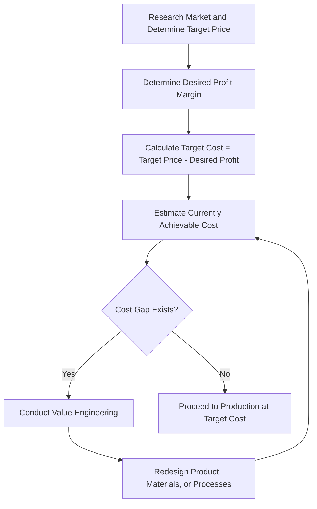

## Target Costing and Target Pricing

### Overview

Target costing is a proactive cost management approach in which a company first determines the price the market is willing to pay for a product, then works backward to establish the maximum allowable cost that will still yield the desired profit margin. This is the inverse of cost-plus pricing, which starts with cost and adds a markup to derive price. Target costing is especially prevalent in competitive, price-sensitive markets (e.g., consumer electronics, automobiles) where companies have little ability to dictate price to the market and must instead manage cost to a market-determined ceiling.

### The Core Logic: Price-Led Costing

**Key Points**

- Traditional cost-plus logic: $\text{Price} = \text{Cost} + \text{Markup}$
- Target costing logic (reversed): $\text{Target Cost} = \text{Target Price} - \text{Desired Profit Margin}$
- The target price is determined externally, based on market research, competitor pricing, and customer value perception — not derived from internal cost data.
- The target cost becomes an internal constraint that drives design, engineering, procurement, and production decisions from the earliest stages of product development.

### The Target Costing Formula

$$\text{Target Cost} = \text{Target Selling Price} - \text{Desired Profit per Unit}$$

**Key Points**

- **Target selling price:** Estimated from market research, competitive analysis, and understanding of customer willingness to pay.
- **Desired profit per unit (or margin):** Set based on the company's required return on sales, return on investment, or strategic profitability targets.
- **Target cost:** The maximum cost the company can incur to produce the product while still achieving its desired price and profit, becoming the cost ceiling that all functions (design, engineering, sourcing, manufacturing) must work within.

### Step-by-Step Target Costing Process

1. **Identify target price** using market research, competitive benchmarking, and customer value analysis (often incorporating conjoint analysis or willingness-to-pay studies).
2. **Determine desired profit margin**, typically expressed as a percentage of sales or based on corporate profitability targets.
3. **Calculate target cost** by subtracting desired profit from target price.
4. **Compare target cost to currently achievable cost** (based on existing design, materials, and processes).
5. If a **cost gap** exists (current cost exceeds target cost), engage in **value engineering** — a systematic cross-functional review of product design, materials, and processes to eliminate costs that do not add customer value, while preserving or enhancing functionality and quality.
6. Iterate through design and process changes until the achievable cost meets or falls below the target cost, or make a strategic decision to accept a lower margin, adjust the target price, or cancel the product.

### Example

A company wants to introduce a new wireless speaker to compete in a market where similar products sell for $120.

**Step 1 — Target price:** Based on competitive analysis, management sets a target price of $120.

**Step 2 — Desired profit margin:** The company requires a 25% profit margin on sales price.

$$\text{Desired Profit per Unit} = 25\% \times \$120 = \$30$$

**Step 3 — Target cost:**

$$\text{Target Cost} = \$120 - \$30 = \$90$$

**Step 4 — Compare to currently achievable cost:** Initial engineering estimates for materials, labor, and overhead total $104 per unit — a cost gap of $14 per unit ($\$104 - \$90$).

**Step 5 — Value engineering:** The cross-functional team examines the bill of materials and identifies opportunities:

- Substituting a lower-cost but functionally equivalent plastic housing material: saves $6/unit
- Redesigning the circuit board to reduce component count: saves $5/unit
- Negotiating volume discounts with a battery supplier: saves $4/unit

Total savings identified: $15/unit, reducing achievable cost to $89/unit — below the $90 target cost.

**Step 6 — Conclusion:** The redesigned product can now be launched at the $120 target price while achieving (and slightly exceeding) the 25% desired margin.

### Visualizing the Target Costing Process

### Value Engineering

**Key Points**

- Value engineering (also called value analysis) is a systematic, cross-functional method for reducing cost while preserving or improving functionality and quality that customers value.
- Techniques include: function analysis (identifying which product features actually drive customer value), component simplification, material substitution, standardization of parts across product lines, and design for manufacturability (DFM).
- A key principle is to eliminate costs associated with features or specifications that exceed what customers actually need or are willing to pay for, without compromising performance in dimensions the customer values.

### Cost Reduction vs. Cost Containment

**Key Points**

- **Cost reduction:** Achieved primarily in the design phase, before production begins — the most powerful lever, since [Inference] a large proportion of a product's lifecycle cost is typically locked in by decisions made during the design stage, even though the cost itself may not be incurred until later.
- **Cost containment (or cost control):** Achieved during the manufacturing phase, once the design is finalized — generally has more limited potential for savings compared to design-stage cost reduction, since major cost drivers (materials, components, process architecture) are already fixed.
- This is a central rationale for why target costing emphasizes early, upfront cost management during product design rather than relying solely on cost control once production has begun.

### Drifting Costs and Kaizen Costing

**Key Points**

- **Target costing** primarily applies during the *design and development* phase of a product's life.
- **Kaizen costing** (continuous improvement costing) applies during the *manufacturing* phase, focusing on small, incremental cost reductions to an already-designed and producing product.
- Kaizen costing targets are typically set as a percentage cost reduction from the prior period's actual cost, rather than derived from a market price, reflecting the different phase of the product life cycle in which it is applied.

### Comparing Cost-Plus Pricing and Target Costing

| Feature | Cost-Plus Pricing | Target Costing |
| --- | --- | --- |
| Starting point | Internal cost | External market price |
| Direction of calculation | Cost → Price | Price → Cost |
| Market orientation | Low (internally focused) | High (externally focused) |
| Timing of cost management | After production, reactive | Before production, proactive (design phase) |
| Best suited for | Custom orders, regulated/cost-reimbursement contracts, monopolistic or niche markets | Highly competitive, price-sensitive markets with many substitutes |
| Risk if unmanaged | Price may exceed what market will bear | Achievable cost may not fall to target, requiring redesign or margin sacrifice |

### Organizational and Cross-Functional Aspects

**Key Points**

- Target costing requires close collaboration among marketing (target price research), design/engineering (achieving functionality within cost constraints), procurement (sourcing components at target cost), and accounting/finance (tracking cost gaps and profitability).
- Target costing is most effective when integrated early into the new product development (NPD) process, rather than applied only after a product design is finalized.
- Supplier involvement is often critical, since a significant portion of product cost in many industries (e.g., automotive, electronics) resides in purchased components; supplier target costing extends the same price-led logic to negotiations with component suppliers.

### Common Pitfalls

- Attempting to apply target costing after the design phase is largely complete, when most cost-reduction opportunities have already been locked in.
- Setting an unrealistic target price without sufficient market research, leading to an unachievable target cost and repeated failed value engineering cycles.
- Focusing value engineering solely on visible material costs while ignoring overhead, logistics, warranty, or other lifecycle costs that also contribute to total product cost.
- Treating target costing as a one-time exercise rather than an iterative process integrated throughout the product development lifecycle.
- Allowing value engineering to degrade a feature that customers actually value strongly, resulting in a cost reduction that also erodes the target price the market will support.

### Related Topics

- Economic Theory of Pricing
- Cost-Plus Pricing Approaches
- Value-Based Pricing
- Life-Cycle Costing
- Kaizen Costing and Continuous Improvement
- Activity-Based Costing (for identifying true cost drivers during value engineering)
- New Product Development and Cost Management