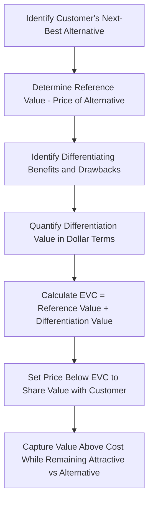

## Value Based Pricing

### Overview

Value-based pricing is a pricing approach in which the selling price is set primarily according to the perceived or measured value that the product or service delivers to the customer, rather than based on the cost of production (cost-plus pricing) or purely on abstract marginal-revenue calculations (economic theory of pricing). Under this approach, the price a customer is willing to pay is anchored to the benefits, outcomes, or problem-solving capability the offering provides relative to alternatives, including the "do nothing" or next-best-substitute option.

### Core Concept: Economic Value to the Customer (EVC)

**Key Points**

- **Economic Value to the Customer (EVC):** The total value a customer receives from using a product, measured relative to the next-best alternative available to them.
- The EVC framework generally starts with the price (or total cost of ownership) of the customer's next-best alternative, then adds or subtracts the value of differentiating factors between the offering and that alternative.

$$\text{EVC} = \text{Reference Value (price of next-best alternative)} + \text{Differentiation Value}$$

**Key Points**

- **Differentiation value** can be positive (the offering provides additional benefits, such as lower operating costs, higher reliability, time savings, or superior features) or negative (the offering has drawbacks relative to the alternative).
- The maximum price a rational customer would pay is theoretically equal to the EVC; pricing below EVC leaves value on the table for the customer (and potential margin for the seller), while pricing above EVC makes the alternative more attractive.

### Example: Calculating Economic Value to the Customer

A company sells industrial pumps. A customer's next-best alternative is a competitor's pump priced at $10,000, but the new pump offers the following differentiating benefits over its 5-year life:

| Differentiating Factor | Value Impact |
| --- | --- |
| Lower energy consumption (saves $400/year over 5 years) | +$2,000 |
| Reduced maintenance downtime (saves $300/year over 5 years) | +$1,500 |
| Shorter installation time (one-time labor savings) | +$500 |
| Higher upfront training cost required for staff (one-time cost) | -$300 |

**Step 1 — Reference value:** $10,000 (price of the next-best alternative)

**Step 2 — Sum differentiation value:**

$$\$2{,}000 + \$1{,}500 + \$500 - \$300 = \$3{,}700$$

**Step 3 — Calculate EVC:**

$$\text{EVC} = \$10{,}000 + \$3{,}700 = \$13{,}700$$

**Step 4 — Pricing decision:** The company could theoretically price up to $13,700 and the customer would still be economically indifferent to choosing the alternative. In practice, companies often price below full EVC (e.g., $12,000–$12,500) to leave the customer a visible incentive to switch, while still capturing a meaningful share of the value created relative to a strict cost-plus price that ignores this analysis entirely.

### Visualizing the Value-Based Pricing Logic

### Methods for Estimating Customer Value

**Key Points**

- **Conjoint analysis:** A market research technique in which customers evaluate combinations of product features and prices, allowing researchers to statistically infer the relative value customers place on individual attributes.
- **Willingness-to-pay (WTP) surveys:** Direct or indirect survey techniques (e.g., Van Westendorp price sensitivity meter) used to estimate the range of prices customers consider acceptable, too cheap, or too expensive.
- **Total cost of ownership (TCO) analysis:** Especially relevant in B2B contexts, quantifying all costs a customer incurs over the product's life (including the differentiation-value approach illustrated above) beyond the initial purchase price.
- **Segment-based value analysis:** Recognizing that different customer segments may derive different value from the same product, supporting differentiated (segment-based) pricing strategies.

### Value-Based Pricing vs. Cost-Plus Pricing vs. Target Costing

| Feature | Cost-Plus Pricing | Target Costing | Value-Based Pricing |
| --- | --- | --- | --- |
| Starting point | Internal cost | External market price | Customer-perceived/quantified value |
| Primary question | "What does it cost, plus margin?" | "What can the market bear, and can we produce below that?" | "What is this worth to the customer?" |
| Orientation | Internal | External (competitive) | External (customer-centric) |
| Data required | Cost accounting data | Market price benchmarks | Customer research (surveys, conjoint analysis, TCO studies) |
| Best suited for | Commodity products, cost-reimbursement contracts | Competitive, price-sensitive markets | Differentiated products/services with quantifiable customer benefits |

**Key Points**

- These approaches are not mutually exclusive — a company might use value-based pricing to set the target price used as an input into a target costing exercise, effectively combining both frameworks.

### Prerequisites for Effective Value-Based Pricing

**Key Points**

- The product or service must offer genuine, identifiable differentiation from competitive alternatives (commoditized products offer little room for value-based pricing above the reference value).
- The company must be able to credibly communicate and substantiate the claimed value to customers (e.g., through case studies, pilot programs, or verified performance data).
- Sales and marketing organizations need training and tools (such as value calculators or ROI models) to articulate and defend value-based prices during negotiations.
- Market segmentation must be sufficiently developed to tailor value propositions and pricing to different customer groups with differing needs and willingness to pay.

### Advantages of Value-Based Pricing

**Key Points**

- Better aligns price with customer-perceived benefit, often enabling higher margins than cost-based approaches for genuinely differentiated products.
- Encourages product development and innovation efforts to focus on features that create measurable customer value, rather than simply minimizing cost.
- Supports premium positioning and can reduce the tendency to compete purely on price.
- Facilitates more effective price segmentation, since value can differ meaningfully across customer segments even for the same core product.

### Limitations and Challenges

**Key Points**

- Requires significant investment in market research and customer data to estimate value accurately; poor estimates can lead to mispricing.
- Value is often difficult to quantify precisely, particularly for products with primarily emotional, aesthetic, or brand-driven value rather than measurable functional benefits.
- Sales teams may find it more difficult to justify value-based prices in negotiations compared to a straightforward cost-plus calculation, especially against cost-focused procurement functions.
- [Inference] Value-based pricing can be harder to defend internally (e.g., to a board or in budget justification) because it is not as directly traceable to verifiable internal cost data as cost-plus pricing, even when it produces a more economically sound price.
- [Speculation] In markets where customers have limited ability or willingness to evaluate a rigorous value analysis, sellers may find that simplified messaging around a smaller set of the most compelling value drivers is more persuasive in practice than a comprehensive EVC calculation.

### Common Pitfalls

- Setting price equal to the full calculated EVC, leaving the customer with no visible incentive to switch from their current alternative or competitor.
- Failing to validate assumed customer benefits (e.g., assumed energy savings, downtime reduction) with real data, leading to overstated and unconvincing value claims.
- Applying a single value-based price across all customer segments despite significant differences in how much value different segments actually realize.
- Ignoring the reference value (the customer's true next-best alternative), which anchors the entire EVC calculation — using the wrong reference point substantially distorts the resulting price.
- Underinvesting in the sales enablement tools and training needed to communicate value-based pricing effectively, resulting in prices that look arbitrary or unjustified to customers.

### Related Topics

- Economic Theory of Pricing
- Cost-Plus Pricing Approaches
- Target Costing and Target Pricing
- Customer Profitability Analysis
- Price Elasticity of Demand
- Market Segmentation and Differentiated Pricing
- Total Cost of Ownership Analysis