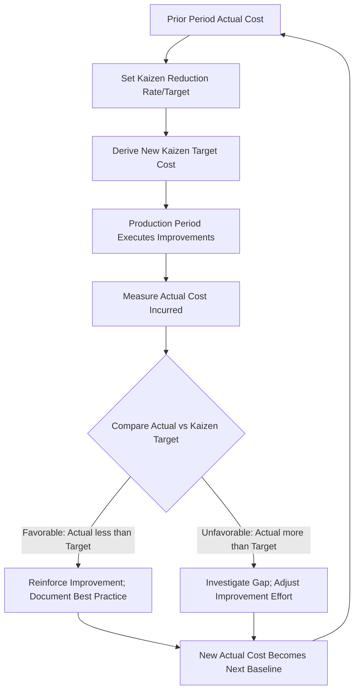

## Kaizen Costing

### Definition and Core Concept

Kaizen costing is a cost management approach that focuses on achieving continuous, incremental cost reductions during the manufacturing (production) phase of a product's life cycle. The term "kaizen" is Japanese for "continuous improvement," and the technique embeds this philosophy directly into the cost accounting and management control system.

Unlike standard costing, which sets a cost benchmark and treats variances as deviations to be explained or corrected, kaizen costing assumes that the target cost itself should decline over successive periods. The system builds cost-reduction targets into the budget on an ongoing basis, and the "standard" is deliberately a moving, downward-trending figure rather than a fixed one.

### Position in the Product Life Cycle

Kaizen costing is most closely associated with the production/manufacturing stage of a product's life, distinguishing it from target costing, which operates primarily at the design and development stage.

**Key Points**

- **Target costing**: applied before production begins, during design/planning, to ensure a new product can be made at a cost that yields the desired margin at a given market price.
- **Kaizen costing**: applied after production has started, to squeeze further, smaller cost reductions out of an already-designed process through continuous small improvements.
- **Standard costing**: applied during production, but oriented toward cost *control* (maintaining an existing standard) rather than cost *reduction*.

This sequencing is often summarized as: target costing reduces cost before manufacturing; kaizen costing reduces cost during manufacturing.

### Mechanics of Kaizen Costing

1. **Baseline cost**: The current actual cost (often the prior period's actual or budgeted cost) becomes the starting point for the next period.
2. **Kaizen (reduction) target**: Management sets a cost-reduction rate or amount — often expressed as a percentage of the prior period's cost — that the process is expected to achieve in the coming period.
3. **New target cost**: The kaizen target is subtracted from the baseline to produce the new period's target cost.

$$\text{Kaizen Target Cost} = \text{Prior Period Cost} - (\text{Prior Period Cost} \times \text{Kaizen Reduction Rate})$$

4. **Variance measurement**: At period end, actual cost is compared to the kaizen target cost, not to a static standard. A favorable kaizen variance means the reduction goal was met or exceeded; an unfavorable kaizen variance means the process failed to achieve the expected reduction.
5. **Reset for next period**: The new actual cost becomes the baseline for the following period's kaizen target, so the ratchet continues downward period after period.

**Example**

A company produces a component with a current unit variable cost of $50. Management sets a kaizen target of a 4% cost reduction per quarter.

- Q1 target: $50 - (50 \times 0.04) = \$48.00$
- If actual Q1 cost comes in at $48.50, the kaizen variance is $0.50 unfavorable per unit (target not fully met).
- Q2 baseline uses the *actual* Q1 cost of $48.50 (not the missed $48.00 target), and a new 4% reduction is applied:

  $48.50 - (48.50 \times 0.04) = \$46.56$

This illustrates a defining feature: the baseline for each new period is generally the most recent actual cost, so the target keeps ratcheting down regardless of whether the prior target was hit.

### Who Sets the Targets and How

Kaizen cost-reduction targets are typically negotiated between top management (who set overall corporate profitability and cost-reduction goals) and the operational managers/workers directly responsible for the process, since those closest to the line have the best information about where small efficiencies can be found. This is a contrast with pure top-down standard-setting, and it reflects the participative, shop-floor-driven nature of the kaizen philosophy as practiced in Japanese manufacturing management (notably associated with Toyota's production system).

### Sources of Kaizen Cost Reductions

**Key Points**

- Reducing material waste and scrap through minor process adjustments
- Improving labor efficiency via small workflow or ergonomic changes
- Reducing setup and changeover times (related to SMED — Single-Minute Exchange of Die concepts)
- Eliminating non-value-added steps identified through employee suggestions (e.g., suggestion-box/kaizen-event programs)
- Reducing energy, tooling, or consumable usage per unit
- Improving equipment uptime through preventive maintenance refinements
- Better space and material-flow layout on the shop floor

None of these are typically large, capital-intensive redesigns; kaizen costing works through many small, low-cost, frequent changes rather than infrequent large-scale process re-engineering (which would fall more under approaches like business process reengineering or value engineering during design).

### Kaizen Costing vs. Standard Costing

| Dimension | Standard Costing | Kaizen Costing |
| --- | --- | --- |
| Cost benchmark | Fixed for the period, based on engineering/historical study | Continuously declining, reset each period |
| Purpose of variance analysis | Identify deviations from an "acceptable" standard; investigate exceptions | Measure whether ongoing reduction targets were achieved |
| Underlying assumption | Current process efficiency is roughly optimal; variances signal problems | Current process efficiency can always be improved further |
| Who is involved | Primarily accountants/engineers set the standard | Cross-functional; heavy involvement of shop-floor workers |
| Time orientation | Static, periodic reset (e.g., annual) | Dynamic, often reset every period (monthly/quarterly) |

### Kaizen Costing vs. Target Costing

| Dimension | Target Costing | Kaizen Costing |
| --- | --- | --- |
| Life-cycle stage | Design/development (pre-production) | Manufacturing (post-production start) |
| Cost driver focus | Product design, features, specifications | Process efficiency, waste elimination |
| Cost reduction lever | Value engineering, redesign, supplier negotiation before launch | Incremental process improvement after launch |
| Formula anchor | Target Cost = Target Selling Price − Target Profit Margin | Target Cost = Prior Period Cost − Kaizen Reduction |

Both techniques are complementary: a product is often designed to hit a target cost, and once in production, kaizen costing takes over to continue driving costs down over the product's remaining life.

### Process Flow Diagram

### Kaizen Costing and Cost Behavior

Because kaizen costing operates at the process-improvement level, it interacts closely with variable and mixed cost behavior. Reductions typically target variable costs per unit (direct material, direct labor, variable overhead), since these are the costs most directly affected by shop-floor efficiency gains. Fixed costs (e.g., factory rent, salaried supervision) are generally outside the immediate scope of kaizen costing, though process improvements can sometimes reduce fixed overhead indirectly (e.g., less floor space needed, fewer inspection stations).

### Link to Profitability Analysis and Pricing

In the context of pricing decisions, kaizen costing supports profitability in markets where selling prices are largely set by external competitive forces (price-takers). If a firm cannot raise price, sustaining or improving margin requires continuously lowering cost. Kaizen costing institutionalizes this margin-protection mechanism:

$$\text{Profit Margin} = \text{Market-Determined Price} - \text{Continuously Declining Cost}$$

This mirrors the logic of target costing's formula but applied dynamically, period after period, rather than once at the design stage.

### Behavioral and Implementation Considerations

**Key Points**

- Kaizen costing depends on **employee buy-in**; because operators are asked to continually find ways to cut their own process costs, morale and incentive alignment are important design considerations. [Inference: the specific incentive structures used vary significantly by firm and are not standardized in the accounting literature.]
- There is a risk of **target fatigue** or diminishing returns — cost reductions become progressively harder to find as "low-hanging fruit" is exhausted. [Inference: this is a commonly cited practical limitation rather than a universally quantified effect.]
- **Data granularity** matters: kaizen costing requires frequent, reliable cost data collection (often monthly) to reset targets meaningfully, which imposes higher information-system demands than an annual standard-costing cycle.
- Overly aggressive kaizen targets can create pressure to cut corners on **quality or safety** if not carefully governed alongside quality control metrics.

### Numerical Illustration — Multi-Period Ratchet

Assume a production line's material cost per unit starts at $100, with a kaizen reduction target of 2% per month, and assume actual performance exactly meets target each month.

| Month | Beginning Cost | Reduction (2%) | Target/Actual Cost |
| --- | --- | --- | --- |
| 1 | $100.00 | $2.00 | $98.00 |
| 2 | $98.00 | $1.96 | $96.04 |
| 3 | $96.04 | $1.92 | $94.12 |
| 4 | $94.12 | $1.88 | $92.24 |

This is a compounding (geometric) decline, so after $n$ months:

$$\text{Cost}_n = \text{Cost}_0 \times (1 - r)^n$$

where $r$ is the periodic kaizen reduction rate. Using $r = 0.02$ and $n = 4$: $100 \times (0.98)^4 \approx \$92.24$, matching the table.

### Advantages

**Key Points**

- Institutionalizes continuous improvement rather than treating cost reduction as a one-time event
- Engages workers closest to the process, often surfacing practical efficiency ideas that top-down engineering standards miss
- Directly supports margin maintenance in competitive, price-taking markets
- Complements lean manufacturing and Total Quality Management (TQM) initiatives

### Limitations

**Key Points**

- Reduction targets cannot decline indefinitely; physical and process limits eventually cap achievable savings
- Can create employee stress or resistance if targets are perceived as unrealistic or as a pretext for headcount reduction
- Requires robust, frequent cost-tracking systems, raising administrative cost
- Less effective for cost elements largely fixed by contract or capacity (e.g., long-term lease costs, fixed salaried overhead)
- Does not address cost issues rooted in product design; a poorly designed product may have limited kaizen potential no matter how much process improvement is applied — this is why kaizen costing works best alongside target costing rather than as a substitute for it

### Related Topics

- Target Costing
- Standard Costing and Variance Analysis
- Total Quality Management (TQM) and Cost of Quality
- Lean Manufacturing / Just-in-Time (JIT) Production
- Value Engineering / Value Analysis
- Life-Cycle Costing
- Activity-Based Costing (ABC) as a data foundation for kaizen tracking
- Theory of Constraints and Throughput Costing