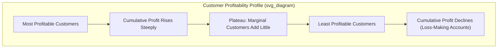

## Customer Profitability Analysis

### Definition and Purpose

Customer profitability analysis (CPA) is the process of identifying the revenues generated by, and the costs incurred to serve, individual customers or customer groups, in order to determine how much profit each customer contributes to the firm. Rather than treating all customers as equally valuable simply because they generate similar sales revenue, CPA recognizes that customers differ substantially in the resources they consume — order frequency, special handling, delivery requirements, sales support, returns, and payment terms — and therefore differ substantially in true profitability.

The central insight of CPA is that **revenue does not equal profitability**. Two customers who each purchase $100,000 of product annually can have very different profit contributions once the cost of serving each is properly traced.

### Why Traditional Costing Obscures Customer Profitability

Under traditional costing systems, customer-related costs (order processing, expedited shipping, sales visits, credit and collection effort, returns processing) are often lumped into a general selling and administrative (S&A) expense pool and allocated using broad, volume-based measures such as sales dollars or units sold. This tends to:

- **Overstate the profitability of small, high-maintenance customers**, since their disproportionate service costs are spread thinly across all customers.
- **Understate the profitability of large, low-maintenance customers**, who absorb allocated costs they did not actually cause.

Activity-Based Costing (ABC) is the standard remedy, because it traces customer-related costs to the specific activities that drive them, and then assigns those activity costs to individual customers based on actual usage.

### The Customer Profitability Framework (ABC-Based)

**Key Points**

1. **Identify customer-related activities**: order entry, order processing, sales calls, delivery/shipping, expediting, technical support, returns/credits handling, invoicing, and collections.
2. **Determine cost drivers for each activity**: e.g., number of orders, number of sales visits, number of delivery stops, number of expedited shipments, number of returns processed.
3. **Compute activity cost rates**: total activity cost ÷ total driver volume, yielding a cost-per-driver-unit figure.
4. **Trace costs to customers**: multiply each customer's actual consumption of each driver by the corresponding activity rate.
5. **Compute customer-level operating income**: customer revenue − cost of goods sold attributable to that customer − traced customer-level costs.

$$\text{Customer Operating Income} = \text{Revenue} - \text{COGS} - \sum (\text{Activity Rate} \times \text{Customer's Driver Quantity})$$

### Worked Example

Assume a distributor has two customers, both generating the same gross sales revenue.

| Item | Customer A | Customer B |
| --- | --- | --- |
| Sales revenue | $200,000 | $200,000 |
| Cost of goods sold (80% of sales) | $160,000 | $160,000 |
| Gross margin | $40,000 | $40,000 |
| Number of orders | 12 | 60 |
| Number of expedited shipments | 0 | 15 |
| Number of sales visits | 2 | 10 |
| Number of returns processed | 1 | 8 |

Activity cost rates (assumed, from the ABC system):

| Activity | Cost Driver Rate |
| --- | --- |
| Order processing | $150 per order |
| Expediting | $300 per expedited shipment |
| Sales visits | $400 per visit |
| Returns processing | $100 per return |

**Customer A traced costs:**

$(12 \times 150) + (0 \times 300) + (2 \times 400) + (1 \times 100) = 1,800 + 0 + 800 + 100 = \$2,700$

**Customer B traced costs:**

$(60 \times 150) + (15 \times 300) + (10 \times 400) + (8 \times 100) = 9,000 + 4,500 + 4,000 + 800 = \$18,300$

**Customer-level operating income:**

| Item | Customer A | Customer B |
| --- | --- | --- |
| Gross margin | $40,000 | $40,000 |
| Traced customer costs | $2,700 | $18,300 |
| **Operating income** | **$37,300** | **$21,700** |

Despite identical revenue and gross margin, Customer A is substantially more profitable than Customer B once the true cost-to-serve is recognized. Traditional allocation based on sales revenue alone would have hidden this difference entirely.

### Customer Cost Hierarchy

Customer-related costs are commonly organized into a hierarchy analogous to the manufacturing cost hierarchy used in ABC, reflecting the level at which each cost is incurred:

| Level | Description | Examples |
| --- | --- | --- |
| Customer output-unit-level costs | Vary with units sold to a customer | Product handling per unit, per-unit commissions |
| Customer batch-level costs | Vary with number of batches/orders for a customer | Order processing, shipping per delivery, expediting |
| Customer-sustaining costs | Support a customer relationship regardless of units or orders | Sales visits, customer-specific technical support, account management salary allocated to that account |
| Distribution-channel costs | Support a particular distribution channel used to reach a group of customers | Costs of operating a wholesale distribution channel |
| Corporate-sustaining costs | Support the organization as a whole; not caused by any individual customer | Top management salaries, general corporate administration |

**Key Points**

- Only customer output-unit-level, batch-level, and customer-sustaining costs are generally considered traceable to a specific customer.
- Corporate-sustaining costs are typically **not allocated** to individual customers in a well-designed CPA system, because doing so implies a false sense of precision and can distort decisions (e.g., mistakenly deciding to drop a customer that is actually profitable at the contribution level). [Inference: whether to allocate corporate-sustaining costs at all is a design choice; many practitioner frameworks explicitly recommend against it for decision-relevance reasons, though some full-cost reporting systems do allocate them for external or tax reporting purposes.]

### The Customer Profitability Profile / Whale Curve

A common visualization in CPA is the **customer profitability profile**, sometimes called the "whale curve," which ranks customers from most to least profitable and plots cumulative profit.

**Key Points**

- The curve typically shows that a relatively small percentage of customers generate a large majority of total profit (consistent with Pareto/80-20 patterns observed in many customer bases). [Inference: the specific 80/20 split is illustrative; actual concentration varies by industry and firm.]
- Cumulative profit often **rises steeply**, then **plateaus**, then **declines** as increasingly unprofitable customers are added to the ranking — producing a hump or "whale" shape, since some customers actually have negative operating income and pull the cumulative total back down.
- This visualization helps management identify which customers to retain, grow, renegotiate terms with, or potentially exit.

**Whale Curve Diagram**

### SVG Illustration — Stylized Whale Curve

<svg xmlns="http://www.w3.org/2000/svg" viewBox="0 0 640 360">
<text x="320" y="24" text-anchor="middle" font-size="16" font-weight="bold" fill="#1f2937">Customer Profitability Whale Curve (svg_diagram)</text>
<line x1="60" y1="300" x2="600" y2="300" stroke="#374151" stroke-width="2" />
<line x1="60" y1="60" x2="60" y2="300" stroke="#374151" stroke-width="2" />
<text x="330" y="335" text-anchor="middle" font-size="13" fill="#374151">Customers Ranked from Most to Least Profitable</text>
<text x="25" y="180" text-anchor="middle" font-size="13" fill="#374151" transform="rotate(-90 25 180)">Cumulative Profit</text>
<line x1="60" y1="230" x2="600" y2="230" stroke="#9ca3af" stroke-width="1" stroke-dasharray="4,4" />
<text x="65" y="225" font-size="11" fill="#6b7280">0</text>
<path d="M 60 230 C 150 90, 250 80, 330 95 S 470 140, 520 220 S 570 290, 600 300" fill="none" stroke="#2563eb" stroke-width="3" />
<circle cx="330" cy="95" r="4" fill="#2563eb" />
<text x="330" y="80" text-anchor="middle" font-size="11" fill="#1f2937">Peak Cumulative Profit</text>
<circle cx="600" cy="300" r="4" fill="#dc2626" />
<text x="560" y="318" text-anchor="middle" font-size="11" fill="#dc2626">Net Loss Customers Pull Total Down</text>
</svg>

### Applications and Decisions Supported

**Key Points**

- **Customer retention/exit decisions**: identifying chronically unprofitable customers as candidates for renegotiation, service-level adjustment, or termination
- **Pricing negotiations**: providing objective, activity-based evidence to justify price increases or minimum order sizes for high-cost-to-serve customers
- **Service differentiation**: tailoring service levels (e.g., expedited shipping, dedicated account management) based on a customer's profit contribution
- **Sales force incentives**: redesigning compensation to reward profit contribution rather than raw sales volume, discouraging reps from chasing low-margin, high-service accounts
- **Resource allocation**: directing marketing and relationship-building investment toward high-potential, currently under-served profitable segments

### Strategies for Managing Unprofitable Customers

Rather than immediately terminating an unprofitable relationship, firms typically consider a sequence of interventions:

1. **Renegotiate pricing** to better reflect service costs (e.g., minimum order quantities, surcharges for rush orders)
2. **Adjust service levels** — reduce free services, delivery frequency, or expediting availability
3. **Migrate order patterns** — encourage larger, less frequent orders through volume discounts or online self-service ordering to cut processing costs
4. **Educate the customer** on cost drivers, sometimes making the underlying cost-to-serve transparent
5. **Exit the relationship** only after other interventions have been attempted and the account remains structurally unprofitable

### Distinguishing Customer Profitability from Product Profitability

Customer profitability analysis is related to, but distinct from, product-line profitability analysis. A profitable *product* sold to a high-cost-to-serve *customer* can still result in an unprofitable customer relationship overall, and vice versa. Comprehensive profitability management typically examines both dimensions — sometimes in combination, via a customer–product profitability matrix — since decisions about which products to push to which customers depend on both.

### Behavioral and Practical Considerations

**Key Points**

- CPA outputs can be **politically sensitive** internally, especially when a long-tenured sales relationship turns out to be unprofitable; presenting findings requires care to avoid undermining sales relationships management wishes to preserve for strategic reasons (e.g., a flagship or reference customer). [Inference: this is a widely noted implementation challenge rather than a formally quantified effect.]
- **Data availability** is often the binding constraint: many firms do not track order-level or activity-level data by customer with sufficient granularity, making full ABC-based CPA costly to implement without an adequately detailed information system.
- CPA should generally be reviewed **periodically**, not treated as a one-time analysis, since customer behavior (order patterns, service demands) evolves and yesterday's profitable customer may become tomorrow's loss-maker.
- Some "unprofitable" customers may be **strategically important** despite negative current profitability — e.g., a customer providing valuable market reference, access to a new market segment, or anticipated future growth — so CPA findings should generally inform, not automatically dictate, customer retention decisions.

### Relationship to Cost-to-Serve and Activity-Based Management (ABM)

Customer profitability analysis is one of the principal applications of Activity-Based Management (ABM), the broader use of ABC data for managerial decision-making (as opposed to purely product costing). The same ABC cost pools and drivers used for product costing are frequently reused — and supplemented with additional customer-specific activities — to build the customer profitability view, making CPA a natural extension of an existing ABC system rather than a separate, parallel one.

### Related Topics

- Activity-Based Costing (ABC)
- Activity-Based Management (ABM)
- Customer Cost Hierarchy
- Cost-to-Serve Analysis
- Product-Line Profitability Analysis
- Sales Mix and Sales Variance Analysis
- Target Costing and Kaizen Costing
- Strategic Customer Relationship Management (CRM) Metrics