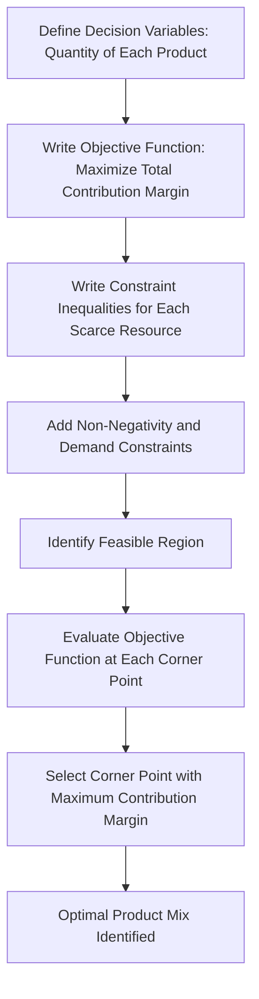

## Product Mix and Profitability Analysis

### Definition and Purpose

Product mix and profitability analysis is the evaluation of which products (and in what relative proportions) a firm should produce and sell in order to maximize overall profitability, given that the firm typically faces one or more binding constraints — such as limited machine hours, labor hours, materials, or shelf space — that prevent it from producing unlimited quantities of every product. The analysis determines the optimal combination of products to make and sell when resources are scarce, rather than simply ranking products by contribution margin per unit.

### The Core Problem: Why Contribution Margin Per Unit Is Insufficient

A common but incomplete approach is to rank products by contribution margin (CM) per unit and favor the highest-CM product. This is correct **only when there is no binding constraint** — i.e., when the firm has unlimited capacity to produce and sell as much of each product as demand allows. When a scarce resource limits production, the correct ranking criterion shifts to **contribution margin per unit of the constrained resource**.

$$\text{Contribution Margin per Unit of Constraint} = \frac{\text{Contribution Margin per Unit}}{\text{Units of Constrained Resource Required per Unit}}$$

### Worked Example — Single Constraint

Assume a firm produces two products, X and Y, and machine hours are the binding constraint (only 1,000 machine hours available per month).

| Item | Product X | Product Y |
| --- | --- | --- |
| Selling price per unit | $50 | $80 |
| Variable cost per unit | $30 | $56 |
| Contribution margin (CM) per unit | $20 | $24 |
| Machine hours required per unit | 1 hour | 2 hours |
| CM per machine hour | $20 | $12 |

If ranked naively by CM per unit, Product Y ($24) appears more attractive than Product X ($20). However, ranking by CM per **constrained resource** reverses the conclusion: Product X generates $20 per machine hour versus Product Y's $12 per machine hour. Given the 1,000-hour constraint, producing only Product X yields:

$$1,000 \text{ hours} \times \$20/\text{hour} = \$20,000 \text{ total contribution margin}$$

Producing only Product Y yields:

$$1,000 \text{ hours} \times \$12/\text{hour} = \$12,000 \text{ total contribution margin}$$

Product X is the more profitable use of the scarce resource, despite having the lower per-unit contribution margin. This is the central lesson of constrained-resource product mix analysis: **the ranking criterion must reflect the scarce resource, not simply the product's own unit economics.**

### Decision Rule Under a Single Constraint

**Key Points**

1. Identify the binding (scarce) resource.
2. Compute CM per unit of that resource for each product.
3. Rank products from highest to lowest CM per unit of the constraint.
4. Allocate the scarce resource to the highest-ranked product first, up to the limit of market demand for that product.
5. Continue allocating remaining resource capacity to the next-ranked product, and so on, until the resource is exhausted.

This produces the profit-maximizing product mix subject to the single constraint, assuming fixed costs are unaffected by the mix decision (i.e., fixed costs are irrelevant to the short-run mix choice because they do not change with which products are produced).

### Incorporating Demand Limits

In practice, market demand for each product is also limited, so the optimal mix analysis must respect demand ceilings alongside the resource constraint.

**Example (continued)**: Suppose maximum monthly demand is 700 units of Product X and 500 units of Product Y, with the same 1,000 machine-hour constraint.

1. Produce Product X first (highest CM per hour): 700 units × 1 hour = 700 hours used, satisfying full demand for X.
2. Remaining capacity: $1,000 - 700 = 300$ hours.
3. Allocate remaining hours to Product Y: $300 \text{ hours} \div 2 \text{ hours/unit} = 150$ units of Y (below its 500-unit demand ceiling, so all 300 remaining hours are used).

**Resulting total contribution margin:**

$(700 \times 20) + (150 \times 24) = 14,000 + 3,600 = \$17,600$

### Multiple Constraints — Linear Programming

When two or more resources are simultaneously binding (e.g., both machine hours and skilled labor hours are limited), the simple ranking approach no longer guarantees an optimal solution, because the product favored by one constraint may not be favored by the other. In this case, the problem is formally a **linear programming (LP)** problem.

**Key Points of LP Formulation**

- **Objective function**: maximize total contribution margin, expressed as a linear combination of the CM per unit of each product times the quantity produced.
- **Decision variables**: the quantity to produce of each product.
- **Constraints**: linear inequalities representing each scarce resource's total availability, plus non-negativity constraints (quantities cannot be negative) and any demand ceilings.

$$\text{Maximize: } Z = CM_X \cdot X + CM_Y \cdot Y$$

subject to:

$$a_1 X + a_2 Y \leq \text{Resource 1 available}$$

$$b_1 X + b_2 Y \leq \text{Resource 2 available}$$

$$X, Y \geq 0$$

**Solution methods**: For two products, the problem can be solved graphically by plotting the constraint lines, identifying the feasible region (the area satisfying all constraints simultaneously), and evaluating the objective function at each corner point (vertex) of the feasible region — the optimal solution always occurs at a corner point of the feasible region in a linear program. For three or more products, the **simplex method** or software-based LP solvers are used, since graphical solution is impractical beyond two dimensions.

### LP Feasible Region Diagram

### SVG Illustration — Two-Constraint Feasible Region

<svg xmlns="http://www.w3.org/2000/svg" viewBox="0 0 640 420">
<text x="320" y="24" text-anchor="middle" font-size="16" font-weight="bold" fill="#1f2937">Feasible Region Under Two Constraints (svg_diagram)</text>
<line x1="70" y1="360" x2="580" y2="360" stroke="#374151" stroke-width="2" />
<line x1="70" y1="60" x2="70" y2="360" stroke="#374151" stroke-width="2" />
<text x="325" y="392" text-anchor="middle" font-size="13" fill="#374151">Product X (units)</text>
<text x="30" y="210" text-anchor="middle" font-size="13" fill="#374151" transform="rotate(-90 30 210)">Product Y (units)</text>
<line x1="70" y1="100" x2="500" y2="340" stroke="#dc2626" stroke-width="2" />
<text x="480" y="335" font-size="11" fill="#dc2626">Machine Hour Constraint</text>
<line x1="70" y1="320" x2="560" y2="90" stroke="#2563eb" stroke-width="2" />
<text x="530" y="90" font-size="11" fill="#2563eb">Labor Hour Constraint</text>
<polygon points="70,360 70,320 250,190 340,220 70,360" fill="#93c5fd" fill-opacity="0.4" stroke="none" />
<circle cx="70" cy="360" r="4" fill="#111827" />
<circle cx="70" cy="320" r="4" fill="#111827" />
<circle cx="250" cy="190" r="4" fill="#111827" />
<circle cx="340" cy="220" r="4" fill="#111827" />
<text x="360" y="245" font-size="11" fill="#111827">Optimal Corner Point</text>
<text x="150" y="300" font-size="12" fill="#1e3a8a" font-weight="bold">Feasible Region</text>
</svg>

### The Theory of Constraints (TOC) Perspective

Product mix analysis is closely connected to the **Theory of Constraints**, which frames profitability around identifying and managing the system's bottleneck (binding constraint). TOC uses a related but distinct measure called **throughput**, defined as:

$$\text{Throughput per Unit} = \text{Selling Price} - \text{Totally Variable (Direct Material) Cost}$$

Under TOC, product mix decisions rank products by **throughput per unit of the bottleneck resource**, treating direct labor and overhead as largely fixed in the short run (a stricter variability assumption than standard contribution-margin analysis, which typically treats direct labor as variable as well). [Inference: whether direct labor is treated as variable or fixed is a modeling assumption that differs between standard CVP-based product mix analysis and TOC-based analysis; the appropriate treatment depends on the specific cost structure of the firm being analyzed.]

**Key Points — TOC and Product Mix**

- Identify the bottleneck (the constraint that limits overall system throughput).
- Exploit the bottleneck: maximize throughput per unit of bottleneck time by prioritizing high-throughput-per-bottleneck-hour products.
- Subordinate all other processes to the bottleneck's pace, since increasing efficiency at non-bottleneck stations does not increase overall system output.
- Elevate the bottleneck (invest in additional capacity) only after exploitation and subordination steps have been exhausted.

### Qualitative Factors in Product Mix Decisions

**Key Points**

- **Strategic product positioning**: a lower-margin product may be retained in the mix if it supports sales of a complementary high-margin product (product bundling/loss-leader effects)
- **Customer relationships**: dropping a product entirely to favor a higher-margin alternative may damage relationships with customers who require the full product line
- **Long-run capacity changes**: a binding constraint identified in the short run may be relaxable in the long run through capital investment, changing which product mix is optimal over a longer horizon
- **Fixed cost relevance**: fixed costs are generally irrelevant to the short-run mix decision (since they do not change with the mix chosen) but become relevant when a mix decision would require or eliminate a discrete fixed cost (e.g., adding a shift, closing a product line entirely)
- **Multiple bottleneck shifts over time**: the binding constraint can shift between resources across periods due to changes in demand, capacity investment, or process improvement, so product mix analysis is typically an ongoing exercise rather than a one-time determination

### Sensitivity Analysis and Shadow Prices

In LP-based product mix problems, the **shadow price** (or dual value) of a binding constraint indicates how much total contribution margin would increase if one additional unit of that scarce resource were made available. This is directly useful for capacity investment decisions: if the shadow price of machine hours exceeds the marginal cost of acquiring an additional machine hour (e.g., through overtime, outsourcing, or capital investment), it may be profitable to relax that constraint. Constraints that are not binding at the optimal solution have a shadow price of zero, since additional units of a non-binding resource do not increase achievable profit.

### Relationship to Other Managerial Accounting Topics

Product mix and profitability analysis draws directly on **cost-volume-profit (CVP) analysis** concepts (contribution margin, variable vs. fixed cost distinction) and is a natural extension of **relevant costing** for short-run decisions, since the analysis explicitly separates relevant, decision-affecting costs (variable costs, opportunity costs of the constraint) from irrelevant sunk or unavoidable fixed costs. It also connects to **capacity planning and capital budgeting**, since persistent binding constraints often justify long-run investment to expand capacity at the bottleneck.

### Related Topics

- Cost-Volume-Profit (CVP) Analysis
- Theory of Constraints and Throughput Accounting
- Relevant Costing for Short-Run Decisions
- Linear Programming and Operations Research Methods
- Make-or-Buy and Special Order Decisions
- Customer Profitability Analysis
- Capacity Planning and Capital Budgeting