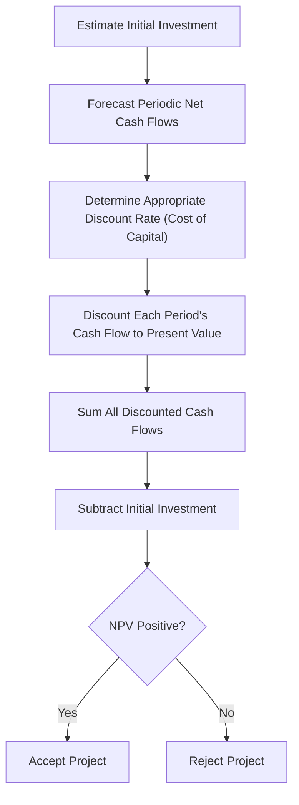

## Net Present Value Method

### Definition

The Net Present Value (NPV) method is a discounted cash flow (DCF) technique used to evaluate the economic desirability of a capital investment by computing the present value of all expected future cash inflows and outflows associated with the project, discounted at the firm's required rate of return, and subtracting the initial investment outlay. NPV expresses the total value a project is expected to add to the firm, measured in today's dollars.

### The NPV Formula

$$NPV = \sum_{t=1}^{n} \frac{CF_t}{(1+r)^t} - I_0$$

Where:

- $CF_t$ = net cash flow in period $t$
- $r$ = discount rate (required rate of return / cost of capital)
- $n$ = project life in periods
- $I_0$ = initial investment at time zero

An equivalent formulation includes $CF_0$ (typically the negative initial outlay) within the summation starting at $t=0$:

$$NPV = \sum_{t=0}^{n} \frac{CF_t}{(1+r)^t}$$

### Decision Rule

**Key Points**

- **NPV > 0**: Accept the project — it is expected to increase firm value by more than the required return, generating returns in excess of the cost of capital.
- **NPV < 0**: Reject the project — it is expected to destroy value, earning less than the required return.
- **NPV = 0**: The project earns exactly the required rate of return; it is a marginal, indifferent decision at the margin (neither strictly value-adding nor value-destroying).
- **Mutually exclusive projects**: choose the project with the **higher** NPV among acceptable alternatives, since NPV directly measures incremental dollar value added.
- **Independent projects with no capital rationing**: accept **all** projects with positive NPV, since each represents an independent value-adding opportunity.

### Worked Example

A company is considering a project requiring an initial investment of $50,000, with the following expected net cash inflows over a 4-year life, discounted at a required rate of return of 10%.

| Year | Cash Flow | PV Factor at 10% | Present Value |
| --- | --- | --- | --- |
| 0 | -$50,000 | 1.0000 | -$50,000.00 |
| 1 | $15,000 | 0.9091 | $13,636.50 |
| 2 | $18,000 | 0.8264 | $14,875.20 |
| 3 | $20,000 | 0.7513 | $15,026.00 |
| 4 | $22,000 | 0.6830 | $15,026.00 |
| **NPV** |  |  | **$7,563.70** |

Since NPV is positive ($7,563.70), the project is expected to add value to the firm and should be accepted under the NPV decision rule, assuming the 10% rate correctly reflects the project's risk and no superior mutually exclusive alternative exists.

### Handling Different Cash Flow Patterns

**Key Points**

- **Uneven cash flows**: each period's cash flow is discounted individually using the single-sum present value factor, then summed (as in the worked example above).
- **Level (annuity) cash flows**: if annual cash flows are equal across the project's life, the present value of the operating cash flows can be computed directly using the present value of an ordinary annuity formula, avoiding the need to discount each year separately:

  $$PV_{\text{operating flows}} = CF \times \left[\frac{1-(1+r)^{-n}}{r}\right]$$
- **Salvage/terminal value**: any expected salvage value, working capital recovery, or terminal cash flow at the end of the project's life is discounted as a single sum at the final period $n$ and added to the total PV of operating flows.
- **Initial working capital investment**: if the project requires an increase in net working capital at time zero, this is treated as an additional initial outflow (often recovered, and thus added back as a terminal cash inflow, at the end of the project).

### NPV Profile Diagram

### SVG Illustration — NPV Profile Curve

<svg xmlns="http://www.w3.org/2000/svg" viewBox="0 0 640 360">
<text x="320" y="24" text-anchor="middle" font-size="16" font-weight="bold" fill="#1f2937">NPV Profile: NPV vs. Discount Rate (svg_diagram)</text>
<line x1="70" y1="300" x2="580" y2="300" stroke="#374151" stroke-width="2" />
<line x1="70" y1="60" x2="70" y2="300" stroke="#374151" stroke-width="2" />
<text x="325" y="335" text-anchor="middle" font-size="13" fill="#374151">Discount Rate (%)</text>
<text x="30" y="180" text-anchor="middle" font-size="13" fill="#374151" transform="rotate(-90 30 180)">NPV ($)</text>
<line x1="70" y1="200" x2="580" y2="200" stroke="#9ca3af" stroke-width="1" stroke-dasharray="4,4" />
<text x="45" y="204" font-size="11" fill="#6b7280">0</text>
<path d="M 100 90 C 200 130, 300 175, 380 200 S 500 260, 560 295" fill="none" stroke="#2563eb" stroke-width="3" />
<circle cx="380" cy="200" r="5" fill="#dc2626" />
<text x="380" y="225" text-anchor="middle" font-size="12" fill="#dc2626">IRR (NPV = 0)</text>
<text x="150" y="110" font-size="12" fill="#1f2937">NPV Positive (Accept Region)</text>
<text x="450" y="280" font-size="12" fill="#1f2937">NPV Negative (Reject Region)</text>
</svg>

The NPV profile illustrates that NPV is a **decreasing function** of the discount rate: higher discount rates reduce the present value of future cash inflows more than they reduce the (already-current) initial outflow, so NPV declines as the discount rate rises. The point where the curve crosses zero is, by definition, the project's **Internal Rate of Return (IRR)**.

### Choosing the Discount Rate

**Key Points**

- The discount rate should reflect the **riskiness of the project's cash flows**, not simply the firm's overall average cost of capital, particularly when a project's risk differs materially from the firm's typical operations.
- The **Weighted Average Cost of Capital (WACC)** is the most common default discount rate for average-risk projects, since it reflects the blended return required by the firm's debt and equity investors.
- **Risk-adjusted discount rates** raise the rate for higher-risk projects and may lower it for unusually low-risk projects, which directly affects the resulting NPV and possibly the accept/reject decision.
- Using an inappropriately low discount rate can cause acceptance of value-destroying projects; using an inappropriately high rate can cause rejection of value-adding ones. [Inference: the specific sensitivity of the accept/reject outcome to discount-rate error depends on each project's particular cash flow timing and magnitude, and cannot be generalized numerically without project-specific data.]

### Strengths of the NPV Method

**Key Points**

- Directly measures the **dollar amount of value added** to the firm, aligning with the goal of shareholder wealth maximization.
- Properly accounts for the **time value of money**, unlike simple (undiscounted) payback period.
- Incorporates **all cash flows over the project's entire life**, unlike payback period, which ignores cash flows beyond the payback point.
- Assumes reinvestment of interim cash flows at the **discount rate** (the firm's cost of capital), which is generally considered a more realistic assumption than the IRR method's implicit reinvestment-at-IRR assumption. [Inference: whether the NPV reinvestment assumption is "more realistic" is a widely taught comparative point in the finance/accounting literature, but the realism of either assumption ultimately depends on the actual investment opportunities available to the firm.]
- Additive across projects (**value additivity**): the NPV of a combination of independent projects equals the sum of their individual NPVs, which supports coherent portfolio-level capital budgeting decisions.

### Limitations of the NPV Method

**Key Points**

- Requires **accurate forecasts** of future cash flows and an appropriate discount rate; forecasting errors directly distort the resulting NPV. [Inference: forecast precision requirements and their impact vary by project and cannot be generalized without specifics.]
- Expressed as an **absolute dollar figure**, which does not directly indicate relative efficiency (return per dollar invested) — a large project can show a larger NPV than a small project purely due to scale, even if the smaller project is more efficient per dollar invested. This limitation is often addressed by pairing NPV with the **Profitability Index**.
- Does not, by itself, communicate a **percentage rate of return**, which some decision-makers find less intuitive to compare against a hurdle rate than IRR's percentage format.
- Assumes the discount rate is **constant** over the project's life unless a more complex, period-varying discount rate is explicitly modeled.
- Standard NPV analysis assumes cash flow projections are made **without explicit consideration of managerial flexibility** (e.g., the option to expand, delay, or abandon a project), a limitation addressed by real options analysis as an extension.

### Profitability Index (Related Metric)

To address the scale limitation of NPV, the **Profitability Index (PI)** expresses value creation on a relative basis:

$$PI = \frac{PV \text{ of Future Cash Flows}}{Initial\ Investment} = 1 + \frac{NPV}{Initial\ Investment}$$

A PI greater than 1.0 corresponds to a positive NPV and indicates value creation per dollar invested; PI is particularly useful for ranking projects under **capital rationing**, when the firm cannot fund all positive-NPV projects and must prioritize based on return per dollar of scarce capital.

**Example (continued from above)**:

$$PI = \frac{50,000 + 7,563.70}{50,000} = \frac{57,563.70}{50,000} = 1.151$$

### NPV vs. Other Capital Budgeting Methods

| Method | Time Value Considered? | Output Format | Key Limitation |
| --- | --- | --- | --- |
| NPV | Yes | Dollar amount | Does not show relative efficiency alone |
| IRR | Yes | Percentage rate | Can yield multiple or no real solutions with non-conventional cash flows; reinvestment-at-IRR assumption |
| Payback Period | No | Time (years) | Ignores cash flows after payback; ignores time value |
| Discounted Payback | Yes | Time (years) | Still ignores cash flows after payback point |
| Accounting Rate of Return (ARR) | No | Percentage (accrual-based) | Uses accounting income, not cash flow; ignores time value |
| Profitability Index | Yes | Ratio | Can conflict with NPV ranking for mutually exclusive projects of different scale |

### Handling Mutually Exclusive Projects of Unequal Scale or Life

**Key Points**

- When comparing mutually exclusive projects, NPV and IRR/PI can occasionally produce **conflicting rankings**, particularly when projects differ substantially in scale or in the timing pattern of their cash flows; in such conflicts, NPV is generally regarded as the theoretically preferred criterion because it directly measures value added in dollar terms consistent with the firm's wealth-maximization objective. [Inference: this preference for NPV in ranking conflicts is standard guidance in the managerial/corporate finance literature, though the practical significance of any given conflict depends on the specific cash flow patterns involved.]
- For projects with **unequal useful lives**, direct NPV comparison can be misleading; the **Equivalent Annual Annuity (EAA)** or a **replacement chain** approach is used to place unequal-life projects on a comparable annualized basis.

### Sensitivity and Scenario Considerations

Because NPV depends on uncertain forecasts of cash flows and the discount rate, practitioners commonly supplement a single-point NPV calculation with **sensitivity analysis** (testing how NPV changes as key assumptions, such as sales volume or the discount rate, are varied) and **scenario analysis** (recalculating NPV under best-case, worst-case, and most-likely scenarios) to better understand the range of possible outcomes and the project's risk profile.

### Related Topics

- Internal Rate of Return (IRR) Method
- Profitability Index
- Payback Period and Discounted Payback Period
- Time Value of Money Review
- Weighted Average Cost of Capital (WACC)
- Capital Rationing
- Equivalent Annual Annuity for Unequal Project Lives
- Sensitivity and Scenario Analysis in Capital Budgeting
- Real Options Analysis