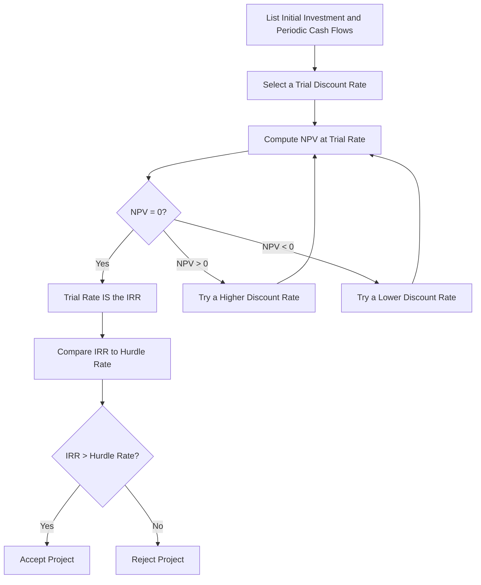

## Internal Rate of Return Method

### Definition

The Internal Rate of Return (IRR) is the discount rate at which the net present value (NPV) of a project's cash flows equals exactly zero. It represents the project's intrinsic percentage rate of return — the compound annual rate of growth the project is expected to generate on the capital invested, based solely on its own projected cash flows.

### The IRR Formula

IRR is the rate $r$ that solves:

$$0 = \sum_{t=0}^{n} \frac{CF_t}{(1+r)^t}$$

or equivalently, setting the present value of future inflows equal to the initial investment:

$$I_0 = \sum_{t=1}^{n} \frac{CF_t}{(1+IRR)^t}$$

Because this equation is generally a polynomial of degree $n$ in $(1+r)$, it typically has no closed-form algebraic solution for projects with more than a few periods or with uneven cash flows. IRR is therefore normally found through **iterative trial-and-error, interpolation, financial calculators, or spreadsheet functions** (e.g., a spreadsheet's built-in IRR function) rather than direct algebraic solution.

### Decision Rule

**Key Points**

- **IRR > required rate of return (hurdle rate/cost of capital)**: Accept the project — it is expected to earn more than the minimum acceptable return.
- **IRR < required rate of return**: Reject the project — it earns less than the cost of capital and would destroy value.
- **IRR = required rate of return**: Marginal decision, equivalent to NPV = 0.
- **Mutually exclusive projects**: selecting based on the **highest IRR** can conflict with the NPV ranking in certain cases (see Limitations below), which is a central reason NPV is generally preferred as the primary decision criterion when the two methods disagree.

### Worked Example — Trial and Error / Interpolation

Using the same project as the NPV example: initial investment of $50,000, with cash inflows of $15,000 (Year 1), $18,000 (Year 2), $20,000 (Year 3), and $22,000 (Year 4).

At a 10% discount rate, NPV was calculated as +$7,563.70 (positive), meaning the true IRR must be **higher** than 10% (since NPV declines as the discount rate rises).

Testing a higher rate, say 16%:

| Year | Cash Flow | PV Factor at 16% | Present Value |
| --- | --- | --- | --- |
| 0 | -$50,000 | 1.0000 | -$50,000.00 |
| 1 | $15,000 | 0.8621 | $12,931.50 |
| 2 | $18,000 | 0.7432 | $13,377.60 |
| 3 | $20,000 | 0.6407 | $12,814.00 |
| 4 | $22,000 | 0.5523 | $12,150.60 |
| **NPV at 16%** |  |  | **$1,273.70** |

Testing 18%:

| Year | Cash Flow | PV Factor at 18% | Present Value |
| --- | --- | --- | --- |
| 0 | -$50,000 | 1.0000 | -$50,000.00 |
| 1 | $15,000 | 0.8475 | $12,712.50 |
| 2 | $18,000 | 0.7182 | $12,927.60 |
| 3 | $20,000 | 0.6086 | $12,172.00 |
| 4 | $22,000 | 0.5158 | $11,347.60 |
| **NPV at 18%** |  |  | **-$840.30** |

Since NPV changes sign between 16% (+$1,273.70) and 18% (-$840.30), the IRR lies between these rates. Using linear interpolation:

$$IRR \approx 16\% + \left(\frac{1,273.70}{1,273.70 + 840.30}\right) \times (18\% - 16\%) = 16\% + \left(\frac{1,273.70}{2,114.00}\right) \times 2\% \approx 17.2\%$$

[Inference: linear interpolation produces an approximation of the true IRR, since the NPV-vs-rate relationship is not perfectly linear between the two test points; a financial calculator or spreadsheet function would yield a more precise result, but the interpolation method is standard for manual/exam-style computation.]

### IRR Solution Process Diagram

### SVG Illustration — Interpolation Between Two NPVs

<svg xmlns="http://www.w3.org/2000/svg" viewBox="0 0 640 340">
<text x="320" y="24" text-anchor="middle" font-size="16" font-weight="bold" fill="#1f2937">IRR via Interpolation Between Two Trial Rates (svg_diagram)</text>
<line x1="70" y1="280" x2="580" y2="280" stroke="#374151" stroke-width="2" />
<line x1="70" y1="60" x2="70" y2="280" stroke="#374151" stroke-width="2" />
<text x="325" y="315" text-anchor="middle" font-size="13" fill="#374151">Discount Rate</text>
<text x="30" y="170" text-anchor="middle" font-size="13" fill="#374151" transform="rotate(-90 30 170)">NPV ($)</text>
<line x1="70" y1="180" x2="580" y2="180" stroke="#9ca3af" stroke-width="1" stroke-dasharray="4,4" />
<text x="45" y="184" font-size="11" fill="#6b7280">0</text>
<circle cx="220" cy="120" r="5" fill="#2563eb" />
<text x="220" y="105" text-anchor="middle" font-size="12" fill="#2563eb">16%: +\$1,273.70</text>
<circle cx="400" cy="220" r="5" fill="#dc2626" />
<text x="400" y="245" text-anchor="middle" font-size="12" fill="#dc2626">18%: -\$840.30</text>
<line x1="220" y1="120" x2="400" y2="220" stroke="#111827" stroke-width="2" stroke-dasharray="3,3" />
<circle cx="312" cy="180" r="5" fill="#059669" />
<text x="312" y="165" text-anchor="middle" font-size="12" fill="#059669" font-weight="bold">IRR ≈ 17.2%</text>
</svg>

### Assumptions Underlying IRR

**Key Points**

- Assumes interim cash flows generated by the project are **reinvested at the IRR itself**, an assumption that can be unrealistic when the calculated IRR is very high, since the firm may not have access to other investment opportunities offering that same high rate. This is the classic **reinvestment rate assumption** critique of IRR, often contrasted with NPV's assumption of reinvestment at the more conservative cost of capital.
- Assumes a **conventional cash flow pattern** (a single initial outflow followed by one or more inflows) for a unique, well-behaved solution; non-conventional patterns can cause complications (see Limitations).

### Limitations of the IRR Method

**Key Points**

- **Multiple IRRs**: When a project's cash flow stream changes sign more than once (e.g., an initial outflow, followed by inflows, followed by another outflow — common in projects with major mid-life overhauls or environmental remediation costs at the end), the underlying polynomial equation can have **more than one mathematically valid root**, producing multiple IRRs and making the decision rule ambiguous. [Inference: the maximum possible number of sign changes bounds the maximum number of real roots per Descartes' Rule of Signs, though not every sign change necessarily produces an additional real, economically meaningful IRR in a given case.]
- **No real IRR**: In some non-conventional cash flow patterns, it is possible for **no real-valued IRR to exist** at all, at which point the IRR method cannot be applied and NPV must be used directly.
- **Reinvestment rate assumption**: as noted above, reinvestment at the IRR itself may overstate a project's true economic return when the IRR is unusually high relative to realistic reinvestment opportunities.
- **Ranking conflicts with NPV for mutually exclusive projects**: IRR and NPV can rank two mutually exclusive projects differently, particularly when:
  - The projects differ substantially in **scale** (initial investment size)
  - The projects have different **timing patterns** of cash flows (one front-loaded, one back-loaded)
  - The discount rate used for NPV differs meaningfully from the **crossover rate** (the discount rate at which the two projects' NPV profiles intersect)In such ranking conflicts, **NPV is generally regarded as the more theoretically sound criterion**, since it directly measures dollar value added under a more realistic reinvestment assumption, and because it is consistent with the value-additivity principle.
- **Percentage format can mask scale**: a small project with a very high IRR can appear more attractive than a large project with a lower (but still acceptable) IRR, even though the large project may add substantially more total dollar value — the same "relative vs. absolute" issue that motivates use of NPV or the Profitability Index alongside IRR.

### Modified Internal Rate of Return (MIRR)

To address the reinvestment rate critique, the **Modified Internal Rate of Return (MIRR)** explicitly separates the reinvestment rate from the discount rate applied to outflows, assuming interim positive cash flows are reinvested at a specified (typically more conservative) reinvestment rate rather than at the calculated IRR itself.

**General MIRR approach:**

1. Compound all positive cash flows forward to the end of the project's life at an assumed reinvestment rate, producing a **terminal value (TV)**.
2. Discount all negative cash flows (outflows) back to time zero at the financing rate (often the cost of capital), producing a **present value of costs (PV)**.
3. Solve for the single rate that equates the initial outflow to the terminal value over $n$ periods:

$$MIRR = \left(\frac{TV}{PV_{\text{costs}}}\right)^{1/n} - 1$$

MIRR always produces a **single, unique rate**, eliminating the multiple-IRR problem, and its reinvestment assumption can be set to a more realistic rate than the project's own IRR. [Inference: whether MIRR is materially "more accurate" in a given decision context depends on how well the chosen reinvestment rate reflects the firm's actual available reinvestment opportunities.]

### IRR vs. NPV — Comparative Summary

| Dimension | NPV | IRR |
| --- | --- | --- |
| Output format | Dollar amount | Percentage rate |
| Reinvestment assumption | At the discount rate (cost of capital) | At the IRR itself |
| Multiple solutions possible? | No — always a single NPV at a given rate | Yes, with non-conventional cash flows |
| Value additivity | Yes — NPVs of independent projects can be summed | No — IRRs cannot be meaningfully summed across projects |
| Preferred for ranking conflicts | Yes (theoretically preferred) | No — can produce misleading rankings |
| Intuitive communication | Less intuitive to non-financial audiences | Often more intuitive (compares directly to a hurdle rate) |

### Practical Considerations

**Key Points**

- IRR remains **widely used in practice** despite its theoretical limitations, largely because a percentage return is often more intuitive for communicating project attractiveness to decision-makers than an absolute dollar figure. [Inference: the degree of IRR's continued prevalence in practice relative to NPV varies by industry and firm and is not precisely quantifiable in general terms.]
- Best practice in capital budgeting typically involves **computing both NPV and IRR** (and often the Profitability Index) for a proposed project, using NPV as the primary decision criterion, especially for mutually exclusive project comparisons, while using IRR as a supplementary, more easily communicated metric.
- For **independent projects** evaluated individually against a hurdle rate (not in a mutually-exclusive comparison), NPV and IRR generally produce the **same accept/reject conclusion**, since both criteria agree whenever a project's cash flows are conventional (single sign change) — it is specifically the *ranking* of mutually exclusive alternatives where conflicts can arise.

### Related Topics

- Net Present Value Method
- Modified Internal Rate of Return (MIRR)
- Profitability Index
- Time Value of Money Review
- Weighted Average Cost of Capital (WACC)
- Crossover Rate and NPV Profile Analysis
- Capital Rationing