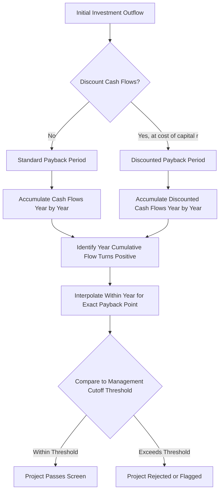

## Payback Period and Discounted Payback Period

### Definition and Purpose

The **payback period** is the length of time required for a capital investment's cumulative cash inflows to equal the amount of the initial cash outflow. It answers a single question: how quickly does the project return the cash that was put into it? It is not a measure of profitability — it is a measure of liquidity risk and capital recovery speed.

The **discounted payback period** modifies this by first discounting each future cash flow to present value using the firm's required rate of return (cost of capital) before accumulating them. This corrects the standard payback period's core flaw: ignoring the time value of money.

### Standard Payback Period

**Formula (even cash flows):**

$$\text{Payback Period} = \dfrac{\text{Initial Investment}}{\text{Annual Cash Inflow}}$$

**Formula (uneven cash flows):**

$$\text{Payback Period} = A + \dfrac{B}{C}$$

Where:

- $A$ = last period with a negative cumulative cash flow
- $B$ = absolute value of cumulative cash flow at the end of period $A$
- $C$ = cash flow during the period after $A$

**Example (even cash flows):**

A project requires an initial investment of $500,000 and generates $125,000 per year in net cash inflows.

$$\text{Payback Period} = \dfrac{500{,}000}{125{,}000} = 4 \text{ years}$$

**Example (uneven cash flows):**

| Year | Cash Flow | Cumulative Cash Flow |
| --- | --- | --- |
| 0 | ($200,000) | ($200,000) |
| 1 | $60,000 | ($140,000) |
| 2 | $70,000 | ($70,000) |
| 3 | $80,000 | $10,000 |
| 4 | $90,000 | $100,000 |

The cumulative cash flow turns positive during Year 3. Using the formula:

$$\text{Payback Period} = 2 + \dfrac{70{,}000}{80{,}000} = 2.875 \text{ years} \approx 2 \text{ years, } 10.5 \text{ months}$$

### Decision Rule

- **Independent projects:** Accept if the payback period is less than or equal to a management-specified maximum threshold.
- **Mutually exclusive projects:** Prefer the project with the shorter payback period, subject to the threshold.

This threshold is set subjectively by management and is not derived from any financial theory — it typically reflects risk tolerance, industry norms, or liquidity constraints. [Inference: the specific threshold used in any real firm depends on internal policy and is not standardized across industries.]

### Discounted Payback Period

**Process:**

1. Discount each period's cash flow to present value using the discount rate $r$ (cost of capital):

   $$PV_t = \dfrac{CF_t}{(1+r)^t}$$
2. Accumulate the discounted cash flows period by period.
3. Identify the period in which the cumulative discounted cash flow turns positive, using the same interpolation formula as the standard payback period.

**Example:**

Using the same project ($200,000 initial investment) with a discount rate of $r = 10\%$:

| Year | Cash Flow | Discount Factor $(1.10)^{-t}$ | PV of Cash Flow | Cumulative PV |
| --- | --- | --- | --- | --- |
| 0 | ($200,000) | 1.000 | ($200,000) | ($200,000) |
| 1 | $60,000 | 0.909 | $54,545 | ($145,455) |
| 2 | $70,000 | 0.826 | $57,851 | ($87,603) |
| 3 | $80,000 | 0.751 | $60,105 | ($27,498) |
| 4 | $90,000 | 0.683 | $61,471 | $33,972 |

Cumulative discounted cash flow turns positive during Year 4:

$$\text{Discounted Payback} = 3 + \dfrac{27{,}498}{61{,}471} = 3.447 \text{ years} \approx 3 \text{ years, } 5.4 \text{ months}$$

Note the discounted payback period (3.45 years) is always longer than or equal to the standard payback period (2.875 years) for the same project, since discounting reduces the present value of every future inflow.

### Comparison of the Two Methods

| Criterion | Payback Period | Discounted Payback Period |
| --- | --- | --- |
| Time value of money | Ignored | Incorporated |
| Cash flows after cutoff | Ignored | Ignored |
| Computation complexity | Low | Moderate (requires discount rate) |
| Risk of misleading ranking | Higher | Lower (but still present) |
| Common use | Quick liquidity screen | Slightly more rigorous liquidity screen |

### Strengths

- **Simplicity:** Easy to calculate and communicate to non-financial stakeholders.
- **Liquidity focus:** Useful when a firm is cash-constrained and needs to know how quickly capital is recovered.
- **Risk proxy:** Shorter payback periods are often treated as a rough proxy for lower risk, since more distant cash flow forecasts are less reliable.
- **Discounted version corrects for time value:** Better reflects the opportunity cost of capital than the standard method.

### Weaknesses

- **Ignores cash flows beyond the cutoff period entirely.** A project with a huge cash inflow in year 6 is penalized identically to one with nothing after year 4, if both pay back in year 4.
- **Standard payback period ignores time value of money** — a dollar in year 1 and a dollar in year 4 are treated as equivalent.
- **No objective decision criterion.** The cutoff/threshold is arbitrary and set by management judgment rather than derived from shareholder wealth maximization.
- **Not a measure of profitability.** A project can have a fast payback and still generate less total value than a slower-paying alternative.
- **Discounted payback period still ignores post-cutoff cash flows**, so it inherits this flaw from the standard method even though it fixes the time-value flaw.

### Relationship to Other Capital Budgeting Methods

Payback methods are typically used as a **screening tool** alongside — not a replacement for — discounted cash flow methods such as **Net Present Value (NPV)** and **Internal Rate of Return (IRR)**. A common approach:

1. Use payback period as an initial liquidity/risk filter to eliminate clearly unacceptable projects.
2. Use NPV or IRR as the primary decision criterion for projects that pass the initial filter.

[Inference: this two-stage approach is a common textbook heuristic; actual firm practice varies, and some firms weight payback more heavily than NPV, particularly in capital-constrained or high-uncertainty environments.]

### Process Flow Diagram

### Cumulative Cash Flow Illustration (svg_diagram)

<svg xmlns="http://www.w3.org/2000/svg" viewBox="0 0 720 420">
<text x="360" y="30" text-anchor="middle" font-size="18" font-weight="bold" fill="#1a1a1a">Cumulative Cash Flow: Payback vs Discounted Payback (svg_diagram)</text>

<line x1="80" y1="360" x2="680" y2="360" stroke="#333" stroke-width="2" />
<line x1="80" y1="60" x2="80" y2="360" stroke="#333" stroke-width="2" />

<line x1="80" y1="250" x2="680" y2="250" stroke="#999" stroke-width="1" stroke-dasharray="4,4" />
<text x="60" y="254" text-anchor="end" font-size="12" fill="#555">0</text>

<text x="140" y="380" text-anchor="middle" font-size="12" fill="#333">Yr 0</text>

<text x="260" y="380" text-anchor="middle" font-size="12" fill="#333">Yr 1</text>

<text x="380" y="380" text-anchor="middle" font-size="12" fill="#333">Yr 2</text>

<text x="500" y="380" text-anchor="middle" font-size="12" fill="#333">Yr 3</text>

<text x="620" y="380" text-anchor="middle" font-size="12" fill="#333">Yr 4</text>

<polyline points="140,362 260,300 380,222 500,140 620,60" fill="none" stroke="#2166ac" stroke-width="3" />
<circle cx="140" cy="362" r="4" fill="#2166ac" />
<circle cx="260" cy="300" r="4" fill="#2166ac" />
<circle cx="380" cy="222" r="4" fill="#2166ac" />
<circle cx="500" cy="140" r="4" fill="#2166ac" />
<circle cx="620" cy="60" r="4" fill="#2166ac" />

<polyline points="140,362 260,318 380,268 500,231 620,180" fill="none" stroke="#b2182b" stroke-width="3" stroke-dasharray="6,4" />
<circle cx="140" cy="362" r="4" fill="#b2182b" />
<circle cx="260" cy="318" r="4" fill="#b2182b" />
<circle cx="380" cy="268" r="4" fill="#b2182b" />
<circle cx="500" cy="231" r="4" fill="#b2182b" />
<circle cx="620" cy="180" r="4" fill="#b2182b" />

<line x1="450" y1="90" x2="480" y2="90" stroke="#2166ac" stroke-width="3" />
<text x="486" y="94" font-size="12" fill="#333">Standard Cumulative CF</text>
<line x1="450" y1="110" x2="480" y2="110" stroke="#b2182b" stroke-width="3" stroke-dasharray="6,4" />
<text x="486" y="114" font-size="12" fill="#333">Discounted Cumulative CF</text>

<text x="400" y="400" text-anchor="middle" font-size="12" fill="#555">Discounted line crosses zero later — reflecting the time value of money</text>

</svg>

### Practical Considerations

- **Inflation and reinvestment risk** faced in later years is implicitly ignored by both methods, since neither accounts for cash flows after the payback point.
- **Capital rationing environments** often make payback period more relevant in practice than theory suggests, because firms prioritize projects that free up capital quickly for reinvestment.
- **Combining with NPV/IRR** is standard practice: payback period addresses "when do we get our money back," while NPV addresses "does this investment create value."
- **Mutually exclusive project bias:** Payback period can favor short-lived, quickly-recovering projects over long-lived projects with substantially higher total value, leading to suboptimal capital allocation if used as the sole criterion.

**Related Topics**

- Net Present Value (NPV) Method
- Internal Rate of Return (IRR) and Modified IRR (MIRR)
- Accounting Rate of Return (ARR)
- Profitability Index and Capital Rationing
- Weighted Average Cost of Capital (WACC) as the Discount Rate
- Sensitivity and Scenario Analysis in Capital Budgeting
- Mutually Exclusive vs. Independent Project Evaluation
- Post-Audit of Capital Investment Decisions