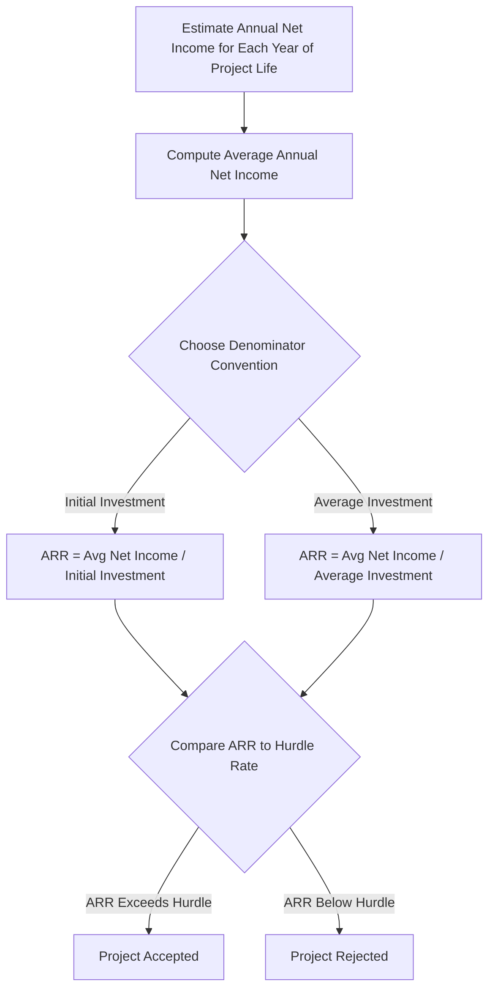

## Accounting Rate of Return

### Definition and Purpose

The **Accounting Rate of Return (ARR)**, also called the **Average Rate of Return** or **Simple Rate of Return**, measures the profitability of a capital investment by expressing average accounting profit as a percentage of the investment required. Unlike payback period methods, ARR is profitability-based rather than liquidity-based. Unlike NPV or IRR, it uses accounting net income rather than cash flows, and it does not discount for the time value of money.

### Core Formulas

**Basic form:**

$$\text{ARR} = \dfrac{\text{Average Annual Accounting Profit}}{\text{Initial Investment}}$$

**Using average investment (more common variant):**

$$\text{ARR} = \dfrac{\text{Average Annual Accounting Profit}}{\text{Average Investment}}$$

Where average investment, assuming straight-line depreciation to a salvage value, is:

$$\text{Average Investment} = \dfrac{\text{Initial Investment} + \text{Salvage Value}}{2}$$

**Average annual accounting profit** is typically computed as:

$$\text{Average Annual Accounting Profit} = \dfrac{\text{Total Net Income Over Project Life}}{\text{Number of Years}}$$

Net income here is **after depreciation and taxes**, following accrual accounting — this is the key distinction from cash-flow-based methods like NPV, IRR, and payback period.

### Worked Example

A company is evaluating a machine with the following characteristics:

- Initial investment: $300,000
- Useful life: 5 years
- Salvage value: $20,000
- Straight-line depreciation

$$\text{Annual Depreciation} = \dfrac{300{,}000 - 20{,}000}{5} = \$56{,}000$$

Projected annual net income (after depreciation and taxes) over the 5 years:

| Year | Net Income |
| --- | --- |
| 1 | $40,000 |
| 2 | $45,000 |
| 3 | $50,000 |
| 4 | $48,000 |
| 5 | $42,000 |

$$\text{Average Annual Net Income} = \dfrac{40{,}000+45{,}000+50{,}000+48{,}000+42{,}000}{5} = \$45{,}000$$

**ARR using initial investment:**

$$\text{ARR} = \dfrac{45{,}000}{300{,}000} = 15.0\%$$

**ARR using average investment:**

$$\text{Average Investment} = \dfrac{300{,}000 + 20{,}000}{2} = \$160{,}000$$

$$\text{ARR} = \dfrac{45{,}000}{160{,}000} = 28.1\%$$

Note the substantial difference between the two variants — this is why it is essential to specify which denominator convention is being used when reporting or comparing ARR figures. [Inference: in practice, inconsistent use of these two variants across textbooks and firms is a common source of confusion and miscomparison.]

### Decision Rule

- **Independent projects:** Accept if ARR exceeds a management-specified minimum required rate of return (hurdle rate).
- **Mutually exclusive projects:** Prefer the project with the higher ARR, subject to clearing the hurdle rate.

As with the payback period, the hurdle rate is set by management judgment and is not derived from a theoretically rigorous cost-of-capital calculation, although firms sometimes anchor it to their WACC or a target accounting return on assets.

### Strengths

- **Simple to calculate** using data already produced by standard accounting systems (income statements), with no need to forecast or discount cash flows separately.
- **Consistent with performance reporting.** Since manager performance is frequently evaluated using accounting net income and return on investment (ROI)-style metrics, ARR aligns the capital budgeting decision with the metric that will later be used to judge the project's success.
- **Considers the entire life of the project**, unlike payback period methods, which ignore cash flows after the cutoff point.
- **Expressed as a percentage**, making it intuitively comparable to other rate-of-return figures used in the business (e.g., ROA, ROE).

### Weaknesses

- **Ignores the time value of money.** A dollar of profit in year 1 is treated identically to a dollar of profit in year 5.
- **Uses accounting net income rather than cash flow.** Net income includes non-cash items (notably depreciation) and is subject to accounting policy choices (depreciation method, inventory valuation, revenue recognition), making ARR sensitive to manipulation or inconsistency across firms and projects.
- **No consistent theoretical basis for the hurdle rate**, unlike IRR, which is compared to a cost-of-capital figure with clear economic meaning.
- **Ambiguity in denominator convention** (initial vs. average investment) can produce materially different results for the same project, undermining comparability.
- **Does not directly reflect shareholder wealth creation** the way NPV does, since accounting profit does not equal cash available for distribution.

### Comparison to Other Capital Budgeting Methods

| Criterion | ARR | Payback Period | NPV | IRR |
| --- | --- | --- | --- | --- |
| Basis | Accounting net income | Cash flow | Cash flow | Cash flow |
| Time value of money | Ignored | Ignored (discounted payback: included) | Included | Included |
| Considers entire project life | Yes | No | Yes | Yes |
| Output form | Percentage | Time period | Currency amount | Percentage |
| Theoretical rigor | Low | Low | High | High |
| Ease of calculation | High | High | Moderate | Moderate–High (iterative) |

### Relationship to Return on Investment (ROI)

ARR is conceptually closely related to the **Return on Investment (ROI)** metric used in divisional performance evaluation and the DuPont framework. Firms that evaluate managers using ROI or Return on Assets (ROA) often find ARR attractive as a capital budgeting screen because it keeps the "language" of the investment decision consistent with the "language" of post-investment performance review — avoiding a scenario in which a project accepted using NPV criteria makes a manager's ROI look worse in early years due to the mismatch between cash-flow-based project evaluation and accrual-based performance evaluation.

[Inference: this alignment argument is a widely cited managerial-accounting rationale for ARR's continued use in practice, despite its theoretical weaknesses relative to DCF methods.]

### Process Flow Diagram

### ARR vs Cash-Flow-Based Methods Illustration (svg_diagram)

<svg xmlns="http://www.w3.org/2000/svg" viewBox="0 0 720 380">
<text x="360" y="30" text-anchor="middle" font-size="18" font-weight="bold" fill="#1a1a1a">ARR: Accounting Profit vs Cash Flow Basis (svg_diagram)</text>

<rect x="60" y="70" width="260" height="220" rx="8" fill="#eaf2fb" stroke="#2166ac" stroke-width="2" />
<text x="190" y="100" text-anchor="middle" font-size="14" font-weight="bold" fill="#2166ac">ARR (Accounting Basis)</text>
<text x="80" y="130" font-size="12" fill="#333">Net Income (after depreciation, tax)</text>
<text x="80" y="155" font-size="12" fill="#333">No discounting applied</text>
<text x="80" y="180" font-size="12" fill="#333">Denominator: Initial or Average</text>
<text x="80" y="205" font-size="12" fill="#333">Investment</text>
<text x="80" y="235" font-size="12" fill="#333">Output: Percentage return</text>
<text x="80" y="265" font-size="12" fill="#333">Aligned with ROI/ROA reporting</text>

<rect x="400" y="70" width="260" height="220" rx="8" fill="#fbeaea" stroke="#b2182b" stroke-width="2" />
<text x="530" y="100" text-anchor="middle" font-size="14" font-weight="bold" fill="#b2182b">NPV / IRR (Cash Flow Basis)</text>
<text x="420" y="130" font-size="12" fill="#333">Net Cash Flow (excludes non-cash</text>
<text x="420" y="150" font-size="12" fill="#333">items like depreciation)</text>
<text x="420" y="180" font-size="12" fill="#333">Discounted at cost of capital</text>
<text x="420" y="210" font-size="12" fill="#333">Output: NPV in currency, or</text>
<text x="420" y="230" font-size="12" fill="#333">IRR as a rate</text>
<text x="420" y="260" font-size="12" fill="#333">Theoretically tied to shareholder</text>
<text x="420" y="280" font-size="12" fill="#333">wealth maximization</text>
<line x1="320" y1="180" x2="400" y2="180" stroke="#555" stroke-width="2" marker-end="url(#arrow)" />
<text x="360" y="170" text-anchor="middle" font-size="11" fill="#555">contrast</text>
</svg>

### Practical Considerations

- ARR is frequently taught and tested as a capital budgeting technique in introductory managerial accounting courses, alongside payback period, as a simpler complement to DCF methods.
- Because it draws directly on projected income statements, it is often the fastest metric to compute when a project's financial projections already exist in accrual format.
- Firms should be cautious using ARR as the sole decision criterion for mutually exclusive projects of different scale or duration, since it can favor smaller, short-lived, high-margin projects over larger ones that create more total shareholder value.
- ARR is sometimes required for capital budgeting under certain international financial reporting or regulatory contexts, where accounting return metrics are part of mandated capital adequacy disclosures. [Speculation: the specific regulatory contexts requiring ARR-style disclosure vary by jurisdiction and industry and are not detailed here.]

**Related Topics**

- Payback Period and Discounted Payback Period
- Net Present Value (NPV) Method
- Internal Rate of Return (IRR) and Modified IRR (MIRR)
- Return on Investment (ROI) and the DuPont Framework
- Capital Rationing and the Profitability Index
- Depreciation Methods and Their Effect on Accounting Profit
- Divisional Performance Measurement and Residual Income
- Behavioral Effects of Performance Metrics on Capital Budgeting Decisions