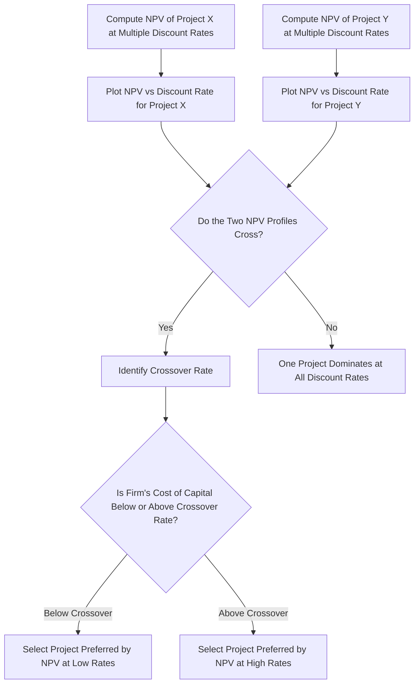
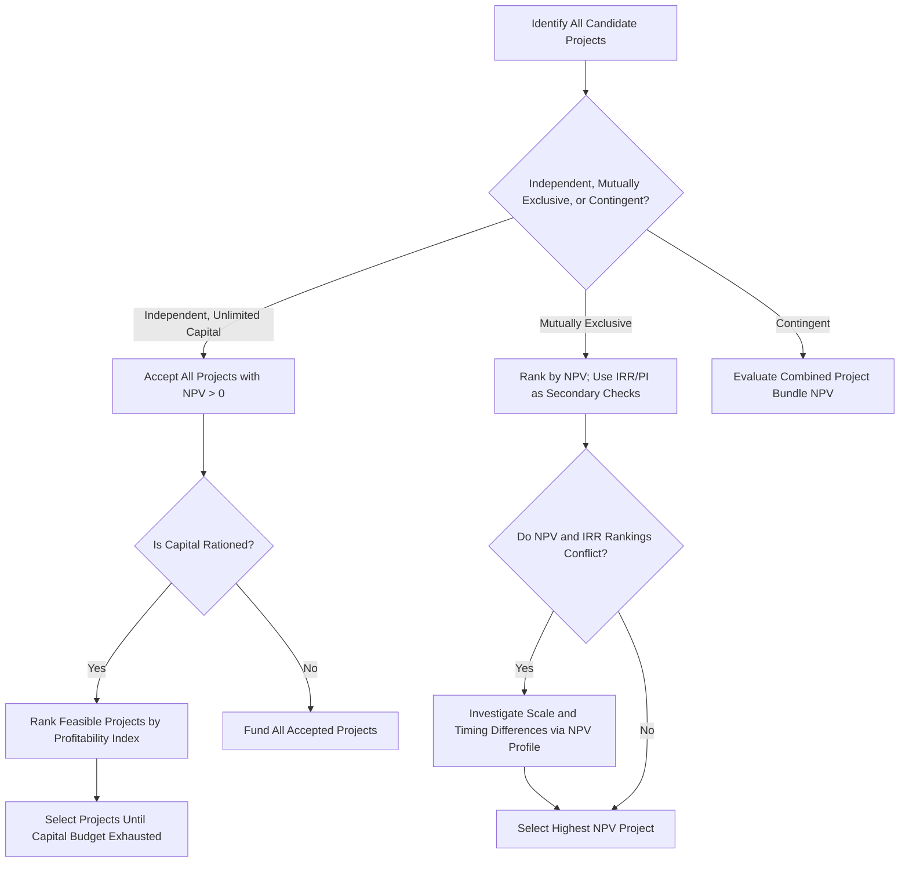

## Comparing and Ranking Capital Investment Proposals

### Purpose and Scope

When a firm faces multiple capital investment opportunities, it must decide not only whether each project individually creates value, but also how to **rank** and **select among** competing proposals, particularly under constraints such as limited capital, mutually exclusive alternatives, or projects of differing scale and duration. This topic synthesizes the individual techniques — payback period, discounted payback, ARR, NPV, IRR, and profitability index — into a coherent comparative decision framework, and addresses the conflicts that arise when these methods disagree.

### The Core Ranking Techniques Recap

| Method | Basis | Output | Time Value of Money |
| --- | --- | --- | --- |
| Payback Period | Cash flow | Years | No |
| Discounted Payback Period | Cash flow | Years | Yes |
| Accounting Rate of Return (ARR) | Accounting profit | Percentage | No |
| Net Present Value (NPV) | Cash flow | Currency amount | Yes |
| Internal Rate of Return (IRR) | Cash flow | Percentage | Yes |
| Profitability Index (PI) | Cash flow | Ratio | Yes |

### Classifying the Decision Context

Before ranking, the decision context must be classified, because the correct ranking approach differs by category:

1. **Independent projects** — accepting one does not affect the cash flows or feasibility of another. Each project is evaluated on its own merits against a hurdle rate.
2. **Mutually exclusive projects** — accepting one automatically precludes the others (e.g., choosing between two different machines to perform the same task). Only the single best project should be selected.
3. **Contingent (dependent) projects** — acceptance of one project requires acceptance of another (e.g., a new factory requires a new access road).
4. **Capital-rationed projects** — the firm has a fixed capital budget and must select the subset of available projects that maximizes total value without exceeding the budget.

### Ranking Independent Projects

For independent projects with unlimited capital, the decision rule is straightforward: **accept every project with a positive NPV** (equivalently, IRR above the cost of capital, or PI above 1.0). No ranking is strictly necessary since accepting one does not preclude accepting another.

### Ranking Mutually Exclusive Projects

This is where ranking conflicts most frequently arise. **NPV is the theoretically preferred ranking criterion** for mutually exclusive projects because it directly measures the dollar increase in firm value, and dollar increases are additive across projects — a property IRR and PI do not reliably share.

**Common conflicts between NPV and IRR rankings arise from two sources:**

**1. Differences in project scale.**

| Project | Initial Investment | NPV @ 10% | IRR |
| --- | --- | --- | --- |
| A | $10,000 | $3,000 | 25% |
| B | $100,000 | $18,000 | 15% |

Project A has the higher IRR, but Project B creates far more absolute value. If mutually exclusive, NPV ranking (favoring B) is correct because it reflects the actual dollar increase in shareholder wealth, not a rate that ignores the scale of investment.

**2. Differences in the timing pattern of cash flows.**

Two projects with the same initial investment can have crossing NPV profiles: one project generates cash flows earlier (favored at high discount rates, higher IRR) while the other generates larger cash flows later (favored at low discount rates, higher NPV at the firm's actual cost of capital). This is visualized using **NPV profiles**, discussed below.

**Reinvestment rate assumption** is the underlying theoretical reason for the conflict: NPV implicitly assumes interim cash flows are reinvested at the firm's cost of capital, while IRR implicitly assumes they are reinvested at the project's own IRR. When a project's IRR is far above the firm's actual reinvestment opportunities, this assumption is unrealistic, and IRR overstates the attractiveness of the project relative to NPV. **Modified IRR (MIRR)** corrects for this by explicitly specifying a reinvestment rate.

### NPV Profile Diagram

An NPV profile plots a project's NPV against a range of discount rates, allowing visual identification of the **crossover rate** — the discount rate at which two mutually exclusive projects' NPVs are equal.

### NPV Profile Crossover Illustration (svg_diagram)

<svg xmlns="http://www.w3.org/2000/svg" viewBox="0 0 720 420">
<text x="360" y="30" text-anchor="middle" font-size="18" font-weight="bold" fill="#1a1a1a">NPV Profiles and the Crossover Rate (svg_diagram)</text>

<line x1="80" y1="360" x2="680" y2="360" stroke="#333" stroke-width="2" />
<line x1="80" y1="60" x2="80" y2="360" stroke="#333" stroke-width="2" />
<text x="380" y="400" text-anchor="middle" font-size="13" fill="#333">Discount Rate</text>
<text x="40" y="210" text-anchor="middle" font-size="13" fill="#333" transform="rotate(-90 40 210)">NPV</text>

<line x1="80" y1="280" x2="680" y2="280" stroke="#999" stroke-width="1" stroke-dasharray="4,4" />

<polyline points="80,90 220,150 360,210 460,255 560,290 660,320" fill="none" stroke="#2166ac" stroke-width="3" />

<polyline points="80,120 220,165 360,205 460,225 560,245 660,270" fill="none" stroke="#b2182b" stroke-width="3" />

<circle cx="410" cy="217" r="6" fill="#333" />
<line x1="410" y1="217" x2="410" y2="360" stroke="#333" stroke-width="1" stroke-dasharray="3,3" />
<text x="410" y="378" text-anchor="middle" font-size="11" fill="#333">Crossover Rate</text>

<line x1="480" y1="90" x2="510" y2="90" stroke="#2166ac" stroke-width="3" />
<text x="516" y="94" font-size="12" fill="#333">Project X (front-loaded CFs)</text>
<line x1="480" y1="110" x2="510" y2="110" stroke="#b2182b" stroke-width="3" />
<text x="516" y="114" font-size="12" fill="#333">Project Y (back-loaded CFs)</text>
</svg>

### Ranking Under Capital Rationing: The Profitability Index

When capital is limited and the firm cannot fund every positive-NPV project, simple NPV ranking can be suboptimal because it does not account for how efficiently each project uses scarce capital. The **Profitability Index (PI)** addresses this:

$$PI = \dfrac{\text{PV of Future Cash Flows}}{\text{Initial Investment}} = 1 + \dfrac{NPV}{\text{Initial Investment}}$$

**Ranking rule under capital rationing:** rank projects by PI (descending) and select projects down the list until the capital budget is exhausted, since PI measures value created **per dollar invested** rather than total value created.

**Example:**

| Project | Initial Investment | NPV | PI |
| --- | --- | --- | --- |
| A | $200,000 | $60,000 | 1.30 |
| B | $150,000 | $50,000 | 1.33 |
| C | $100,000 | $25,000 | 1.25 |

With a capital budget of $350,000, ranking by NPV alone might select A and B ($350,000 total, $110,000 NPV). Ranking by PI confirms B and A are still both attractive, but if the budget were only $250,000, PI ranking would correctly prioritize B ($150,000, PI 1.33) then C ($100,000, PI 1.25) over A alone, potentially yielding higher total NPV per dollar deployed than a strict NPV-only ranking.

**Limitation:** the simple PI ranking approach is only strictly valid for perfectly divisible projects and a single-period capital constraint. Multi-period capital rationing or indivisible ("lumpy") projects require **integer programming** or combinatorial evaluation of project bundles to identify the value-maximizing combination.

### Comprehensive Ranking Decision Framework

### Qualitative and Non-Financial Ranking Considerations

Purely quantitative rankings should be supplemented with qualitative judgment in practice:

- **Strategic fit:** alignment with long-term corporate strategy, even when short-term quantitative metrics are marginal.
- **Risk profile differences:** projects with identical NPV but different risk levels are not equivalent; risk-adjusted discount rates or certainty-equivalent methods can be applied to make risk levels comparable.
- **Real options value:** flexibility to expand, delay, or abandon a project has value not captured by static NPV/IRR calculations, and is addressed through **real options analysis**.
- **Resource and managerial capacity constraints:** beyond financial capital, firms may be constrained by management attention, skilled labor, or physical capacity, which can override a purely financial ranking.
- **Sensitivity to key assumptions:** a project that ranks highly under base-case assumptions but is highly sensitive to a single uncertain input (e.g., commodity price) may be riskier than its point-estimate NPV suggests.

[Inference: the relative weight given to qualitative factors versus quantitative rankings varies significantly by firm and industry, and no universal formula governs this tradeoff.]

### Summary Comparison Table

| Situation | Preferred Ranking Method | Key Caveat |
| --- | --- | --- |
| Independent projects, unlimited capital | NPV > 0 (accept all) | No ranking needed |
| Mutually exclusive projects | NPV (highest) | Watch for scale/timing conflicts with IRR |
| Capital-rationed, divisible projects | Profitability Index | Only valid for single-period constraint |
| Capital-rationed, indivisible/lumpy projects | Integer programming over project bundles | Computationally more complex |
| Projects with differing risk levels | Risk-adjusted NPV | Requires project-specific discount rates |
| Projects with embedded flexibility | Real options-adjusted NPV | Requires option-pricing techniques |

**Related Topics**

- Net Present Value (NPV) Method
- Internal Rate of Return (IRR) and Modified IRR (MIRR)
- Profitability Index and Capital Rationing
- Payback Period and Discounted Payback Period
- Accounting Rate of Return
- NPV Profiles and the Crossover Rate
- Real Options in Capital Budgeting
- Risk-Adjusted Discount Rates and Certainty Equivalents
- Capital Rationing Under Multi-Period Constraints (Integer Programming Approaches)