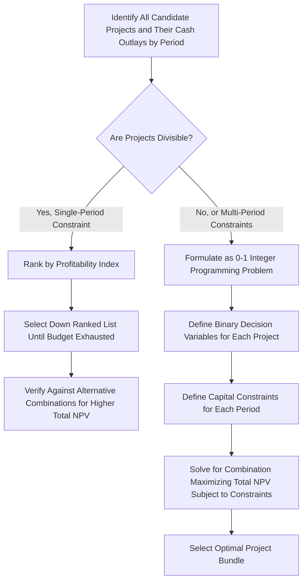

## Capital Rationing

### Definition and Purpose

**Capital rationing** refers to a situation in which a firm has a fixed, limited amount of capital available for investment and cannot fund every project that offers a positive net present value (NPV). Because not all value-creating projects can be accepted, the firm must select the combination of projects that maximizes total value **subject to the budget constraint**, rather than simply accepting every independent project that clears the hurdle rate.

Capital rationing is distinguished from the unconstrained capital budgeting case, where the decision rule is simply "accept all projects with NPV > 0." Under rationing, that rule can produce a suboptimal selection because it does not consider how efficiently each project uses the scarce capital.

### Types of Capital Rationing

**1. Soft (internal) capital rationing**

Self-imposed by management, often for reasons such as:

- Maintaining a conservative debt-to-equity ratio or credit rating
- Limiting organizational or managerial capacity to execute multiple large projects simultaneously
- Enforcing capital discipline to avoid overinvestment in marginal projects
- Divisional budget allocations set by corporate headquarters as part of internal control systems

**2. Hard (external) capital rationing**

Imposed by external market conditions or constraints outside management's control, such as:

- Limited access to debt or equity markets (e.g., during a credit crunch)
- Debt covenants restricting further borrowing
- Regulatory capital requirements
- Prohibitively high cost of additional external financing due to information asymmetry or financial distress risk

[Inference: the soft/hard distinction is a standard managerial finance framework; the specific causes cited are illustrative and not an exhaustive list of every possible capital constraint a firm might face.]

### Single-Period Capital Rationing: The Profitability Index Approach

When the capital constraint applies to a single period and projects are perfectly divisible (fractional investment is possible), the **Profitability Index (PI)** provides an optimal ranking method:

$$PI = \dfrac{\text{PV of Future Cash Flows}}{\text{Initial Investment}} = 1 + \dfrac{NPV}{\text{Initial Investment}}$$

**Decision process:**

1. Calculate PI for every candidate project.
2. Rank projects by PI in descending order.
3. Select projects down the ranked list until the capital budget is exhausted.
4. If the final project does not fully fit within the remaining budget, allocate the residual budget to the fractional portion of that project (assuming divisibility) or evaluate whether a different combination yields higher total NPV.

**Worked Example:**

Capital budget: $400,000

| Project | Initial Investment | NPV | PI |
| --- | --- | --- | --- |
| A | $250,000 | $75,000 | 1.30 |
| B | $200,000 | $70,000 | 1.35 |
| C | $150,000 | $45,000 | 1.30 |
| D | $100,000 | $22,000 | 1.22 |

Ranking by PI: B (1.35) > A (1.30) = C (1.30) > D (1.22)

Selecting B first ($200,000, $70,000 NPV) leaves $200,000 remaining. Between A and C (tied PI), C fits fully within the remaining budget ($150,000) while A does not ($250,000 > $200,000 remaining). Selecting B + C uses $350,000 of the $400,000 budget and yields:

$$NPV_{total} = 70{,}000 + 45{,}000 = \$115{,}000$$

Compare this to selecting A alone plus a fraction of B: A ($250,000) leaves $150,000, of which 75% of B could be funded (0.75 × $200,000 = $150,000), contributing 0.75 × $70,000 = $52,500 in NPV:

$$NPV_{total} = 75{,}000 + 52{,}500 = \$127{,}500$$

This example demonstrates that **simple PI ranking with indivisible whole-project selection does not always identify the truly optimal combination** — testing alternative combinations, or applying formal optimization, is often necessary even in ostensibly simple cases.

### Multi-Period and Indivisible Project Rationing: Integer Programming

When capital constraints apply across multiple periods, or projects cannot be fractionally funded (e.g., a single new factory either is or is not built), the single-period PI ranking approach breaks down. The general solution is to formulate the problem as an **integer programming (0-1 knapsack) problem**:

$$\text{Maximize} \sum_{i=1}^{n} NPV_i \cdot x_i$$

Subject to:

$$\sum_{i=1}^{n} C_{i,t} \cdot x_i \leq B_t \quad \text{for each period } t$$

$$x_i \in \{0, 1\} \quad \text{for each project } i$$

Where:

- $x_i$ = binary decision variable (1 if project $i$ is accepted, 0 otherwise)
- $C_{i,t}$ = capital outlay required by project $i$ in period $t$
- $B_t$ = capital budget available in period $t$

This formulation is solved using integer programming techniques (branch-and-bound, or standard solvers), since the combinatorial nature of the problem generally makes simple ranking heuristics unreliable once multiple constraints or indivisibilities are introduced.

### Multi-Period Capital Rationing Decision Flow

### Capital Rationing Optimization Illustration (svg_diagram)

<svg xmlns="http://www.w3.org/2000/svg" viewBox="0 0 720 400">
<text x="360" y="30" text-anchor="middle" font-size="18" font-weight="bold" fill="#1a1a1a">Capital Rationing: Budget Constraint vs Project Combinations (svg_diagram)</text>

<line x1="80" y1="340" x2="680" y2="340" stroke="#333" stroke-width="2" />
<line x1="80" y1="60" x2="80" y2="340" stroke="#333" stroke-width="2" />
<text x="380" y="375" text-anchor="middle" font-size="13" fill="#333">Capital Deployed</text>
<text x="40" y="200" text-anchor="middle" font-size="13" fill="#333" transform="rotate(-90 40 200)">Total NPV</text>

<line x1="460" y1="60" x2="460" y2="340" stroke="#b2182b" stroke-width="2" stroke-dasharray="6,4" />
<text x="460" y="55" text-anchor="middle" font-size="11" fill="#b2182b">Budget Limit</text>

<circle cx="180" cy="290" r="6" fill="#2166ac" />
<text x="180" y="310" text-anchor="middle" font-size="10" fill="#333">Project D only</text>
<circle cx="300" cy="230" r="6" fill="#2166ac" />
<text x="300" y="250" text-anchor="middle" font-size="10" fill="#333">B + C</text>
<circle cx="420" cy="150" r="6" fill="#2e7d32" />
<text x="420" y="170" text-anchor="middle" font-size="10" fill="#333">A + 0.75B</text>
<circle cx="560" cy="120" r="6" fill="#999" />
<text x="560" y="140" text-anchor="middle" font-size="10" fill="#999">A + B (exceeds budget)</text>

<text x="420" y="100" text-anchor="middle" font-size="12" font-weight="bold" fill="`#2e7d32`">Optimal feasible combination</text>

<line x1="420" y1="105" x2="420" y2="145" stroke="`#2e7d32`" stroke-width="1" />

</svg>

### Why Capital Rationing Conflicts With Unconstrained NPV Logic

In classical, unconstrained capital budgeting theory, the firm should accept every project with positive NPV, since in a perfect capital market the firm could always raise additional capital at the market cost of capital to fund any value-creating project. Capital rationing represents a deviation from this idealized assumption, and its presence implies one of the following:

- The firm faces market imperfections (information asymmetry, transaction costs, financial distress risk) that make raising additional external capital costlier than the projects' returns would justify.
- Management has deliberately chosen to limit capital deployment for governance, risk management, or capacity reasons, even though external capital may be technically available.

[Inference: the theoretical literature generally treats capital rationing as evidence of market imperfection or a deliberate managerial choice, since a frictionless capital market would not otherwise force a firm to reject positive-NPV projects.]

### Consequences of Capital Rationing

- **Opportunity cost of forgone projects:** value-creating projects that are rejected due to budget constraints represent a real economic cost, even though they do not appear on the financial statements.
- **Shadow price of capital:** in the integer programming formulation, the dual value (shadow price) associated with the capital constraint in each period represents the marginal value of one additional dollar of capital in that period — useful for evaluating whether relaxing the constraint (e.g., by raising external financing) would be worthwhile.
- **Divisional competition for capital:** in decentralized firms, capital rationing often creates internal competition between divisions, which can create incentive problems if divisional managers overstate project cash flow projections to compete more successfully for scarce capital.
- **Multi-period interactions:** accepting a project in one period may create or relax capital availability in future periods (e.g., through project-generated cash flows becoming available for reinvestment), which the single-period PI method cannot capture but multi-period integer programming formulations can.

### Practical Considerations

- Many firms use a hybrid approach in practice: PI ranking as an initial heuristic screen, followed by scenario testing of alternative combinations, rather than a full integer programming solve, particularly when the number of candidate projects is small.
- Capital rationing analysis is closely tied to the broader capital structure decision — a firm experiencing persistent binding capital constraints may reassess its target debt-to-equity ratio or financing strategy.
- Sensitivity analysis on the budget constraint itself (i.e., examining how total NPV changes if the budget is relaxed by a small increment) parallels the shadow price concept from linear/integer programming and can inform capital-raising decisions.

**Related Topics**

- Profitability Index and Capital Rationing
- Comparing and Ranking Capital Investment Proposals
- Net Present Value (NPV) Method
- Net Present Value (NPV) Method
- Capital Structure and the Cost of Capital
- Integer and Linear Programming in Financial Decision Making
- Divisional Performance Measurement and Incentive Problems
- Real Options in Capital Budgeting