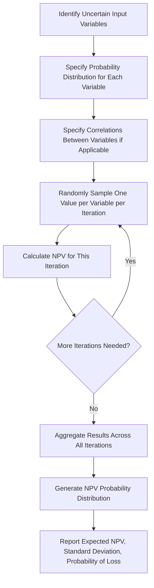
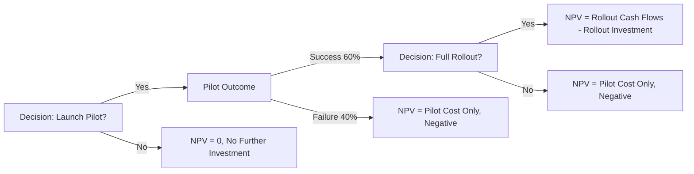

## Sensitivity and Risk Analysis in Capital Budgeting

### Purpose and Scope

Standard capital budgeting techniques (NPV, IRR, payback period, ARR) rely on single-point estimates of future cash flows, discount rates, and project life. In reality, these inputs are uncertain forecasts. **Sensitivity and risk analysis** techniques extend basic capital budgeting by explicitly examining how a project's value and acceptability change when underlying assumptions vary, and by quantifying the degree of risk associated with a project's cash flows.

### Sources of Risk in Capital Budgeting

- **Forecast risk:** errors in estimating future sales volume, price, cost, or terminal cash flows.
- **Market risk:** exposure to macroeconomic or industry-wide factors (interest rates, commodity prices, exchange rates) affecting project cash flows.
- **Project-specific (unique) risk:** risks specific to the individual project (e.g., a new product's uncertain market acceptance) that could, in principle, be diversified away in a well-diversified portfolio of projects.
- **Estimation risk in the discount rate:** the cost of capital itself is an estimate, and errors here compound with cash flow forecast errors.

### Sensitivity Analysis

**Sensitivity analysis** examines how NPV (or another decision metric) changes when a single input variable is varied while all other variables are held constant at their base-case values. It identifies which variables the project's value is most sensitive to.

**Process:**

1. Establish a base-case NPV using expected values for all inputs.
2. Select one variable (e.g., unit sales, sale price, variable cost per unit, discount rate).
3. Recalculate NPV across a range of values for that variable (e.g., ±10%, ±20% from the base case), holding all other variables fixed.
4. Repeat for each variable of interest.
5. Compare the resulting range of NPV outcomes across variables to identify which inputs have the largest impact on project value.

**Worked Example:**

Base case: Initial investment $500,000, 5-year life, discount rate 10%, base-case NPV = $85,000.

| Variable | -20% Case NPV | Base Case NPV | +20% Case NPV | NPV Range |
| --- | --- | --- | --- | --- |
| Unit Sales Volume | ($40,000) | $85,000 | $210,000 | $250,000 |
| Sale Price per Unit | $10,000 | $85,000 | $160,000 | $150,000 |
| Variable Cost per Unit | $140,000 | $85,000 | $30,000 | $110,000 |
| Discount Rate | $120,000 | $85,000 | $55,000 | $65,000 |

The variable with the widest NPV range (unit sales volume, $250,000) is the variable to which the project's value is **most sensitive**, and therefore the variable that deserves the most forecasting effort and ongoing monitoring during project execution.

### Sensitivity Analysis Tornado Diagram (svg_diagram)

<svg xmlns="http://www.w3.org/2000/svg" viewBox="0 0 720 300">
<text x="360" y="30" text-anchor="middle" font-size="18" font-weight="bold" fill="#1a1a1a">Tornado Diagram: NPV Sensitivity by Variable (svg_diagram)</text>
<line x1="360" y1="60" x2="360" y2="260" stroke="#333" stroke-width="1" />
<text x="360" y="275" text-anchor="middle" font-size="11" fill="#333">Base Case NPV</text>

<rect x="235" y="70" width="125" height="30" fill="#2166ac" />
<rect x="360" y="70" width="125" height="30" fill="#4393c3" />
<text x="220" y="90" text-anchor="end" font-size="12" fill="#333">Unit Sales Volume</text>

<rect x="275" y="115" width="85" height="30" fill="#2166ac" />
<rect x="360" y="115" width="85" height="30" fill="#4393c3" />
<text x="260" y="135" text-anchor="end" font-size="12" fill="#333">Sale Price per Unit</text>

<rect x="290" y="160" width="70" height="30" fill="#2166ac" />
<rect x="360" y="160" width="70" height="30" fill="#4393c3" />
<text x="275" y="180" text-anchor="end" font-size="12" fill="#333">Variable Cost per Unit</text>

<rect x="320" y="205" width="40" height="30" fill="#2166ac" />
<rect x="360" y="205" width="40" height="30" fill="#4393c3" />
<text x="305" y="225" text-anchor="end" font-size="12" fill="#333">Discount Rate</text>
</svg>

### Limitations of Sensitivity Analysis

- **Ignores interdependencies between variables.** In practice, sale price and unit volume are often correlated (e.g., raising price typically reduces volume), but standard sensitivity analysis varies each input independently.
- **Provides no probability information.** It identifies which variables matter most but not the *likelihood* of any particular outcome occurring, nor an overall probability distribution of project NPV.
- **Arbitrary range selection.** The ±10%/±20% ranges used are often chosen by convention rather than derived from the actual statistical distribution of each variable.

### Scenario Analysis

**Scenario analysis** addresses the interdependency limitation of sensitivity analysis by varying multiple variables simultaneously in internally consistent combinations, typically defined as best case, base case, and worst case.

**Worked Example:**

| Scenario | Unit Sales | Sale Price | Variable Cost | NPV |
| --- | --- | --- | --- | --- |
| Worst Case | 8,000 units | $45 | $32 | ($60,000) |
| Base Case | 10,000 units | $50 | $28 | $85,000 |
| Best Case | 12,500 units | $55 | $25 | $260,000 |

If management assigns subjective probabilities to each scenario (e.g., worst case 25%, base case 50%, best case 25%), an **expected NPV** can be computed:

$$E(NPV) = \sum_{s} P_s \cdot NPV_s$$

$$E(NPV) = 0.25(-60{,}000) + 0.50(85{,}000) + 0.25(260{,}000) = \$92{,}500$$

The **standard deviation** of NPV across scenarios provides a simple risk measure:

$$\sigma_{NPV} = \sqrt{\sum_s P_s \left(NPV_s - E(NPV)\right)^2}$$

### Break-Even Analysis in Capital Budgeting

A special case of sensitivity analysis, **break-even analysis** identifies the specific value of a key input variable at which NPV equals exactly zero (i.e., the point of indifference between accepting and rejecting the project). This is commonly computed for:

- **Break-even unit sales volume:** the minimum sales volume required for the project to earn a zero NPV at the given discount rate.
- **Break-even sale price:** the minimum price required, holding volume and costs constant.
- **Break-even discount rate:** equivalent to the project's IRR — the discount rate at which NPV = 0.

Break-even analysis provides intuitive risk context: a project whose break-even sales volume is only slightly below the forecasted base case is riskier than one with a large margin of safety.

### Monte Carlo Simulation

**Monte Carlo simulation** extends scenario analysis by specifying full probability distributions (not just three discrete scenarios) for each uncertain input variable, then repeatedly sampling from these distributions (typically thousands of iterations) to generate a full probability distribution of possible NPV outcomes.

**Process:**

1. Specify a probability distribution for each uncertain input (e.g., unit sales ~ Normal($\mu$, $\sigma$), sale price ~ Triangular(min, mode, max)).
2. Specify correlations between variables if relevant (e.g., negative correlation between price and volume).
3. For each simulation iteration, randomly draw a value for each input from its specified distribution.
4. Calculate NPV for that iteration's combination of inputs.
5. Repeat for a large number of iterations (typically 1,000–100,000+).
6. Analyze the resulting distribution of NPV outcomes: mean, standard deviation, probability of negative NPV, percentile ranges.

**Key outputs:**

- **Expected NPV:** the mean of the simulated NPV distribution.
- **Probability of loss:** the proportion of simulated iterations with NPV < 0, a direct measure of downside risk.
- **Value at Risk (VaR)-style percentiles:** e.g., the 5th percentile NPV outcome, representing a "worst reasonable case" at a given confidence level.

### Monte Carlo Simulation Process Flow

### Risk-Adjusted Discount Rate Method

An alternative approach to explicitly modeling probability distributions is to adjust the discount rate itself upward for riskier projects, reflecting the additional return investors would require to compensate for higher risk (consistent with the risk-return relationship embedded in models such as the Capital Asset Pricing Model).

$$NPV = \sum_{t=0}^{n} \dfrac{CF_t}{(1+r_{adj})^t}$$

Where $r_{adj} = r_f + \beta_{project}(r_m - r_f)$ or a similar risk premium is added to the base discount rate, with the risk premium scaled to the project's assessed risk category (e.g., a firm may maintain separate discount rates for "low-risk cost reduction projects," "average-risk expansion projects," and "high-risk new market entry projects").

**Limitation:** this method conflates the timing of cash flows with their risk — a constant risk-adjusted rate applied across all periods implicitly assumes risk increases at a constant compounded rate over time, which may not match the actual risk profile of the project's cash flows.

### Certainty Equivalent Method

An alternative to adjusting the discount rate is to adjust the cash flows themselves, converting risky expected cash flows into their certain-equivalent value, then discounting at the **risk-free rate**:

$$NPV = \sum_{t=0}^{n} \dfrac{\alpha_t \cdot CF_t}{(1+r_f)^t}$$

Where $\alpha_t$ (the certainty equivalent coefficient, $0 \leq \alpha_t \leq 1$) reflects the degree of confidence in the cash flow forecast for period $t$, typically decreasing as $t$ increases to reflect growing forecast uncertainty further into the future.

This method separates the **time value of money** (captured by discounting at $r_f$) from the **risk adjustment** (captured by $\alpha_t$), offering more flexibility than the risk-adjusted discount rate method, particularly when risk does not increase uniformly over the project's life. [Inference: in practice, the certainty equivalent method is used less frequently than the risk-adjusted discount rate method due to the difficulty of estimating period-specific $\alpha_t$ coefficients.]

### Decision Tree Analysis

For projects involving sequential decisions under uncertainty (e.g., an initial pilot phase followed by a decision on full-scale rollout contingent on pilot results), **decision tree analysis** maps out the sequence of decisions and chance events, assigning probabilities to each branch and calculating expected NPV by working backward from terminal outcomes ("folding back" the tree).

Decision tree analysis explicitly incorporates **managerial flexibility** — the ability to abandon, delay, or expand a project in response to how uncertainty resolves over time — which static NPV analysis does not capture. This connects directly to **real options analysis**, which applies option-pricing techniques to value this flexibility more rigorously.

### Summary Comparison of Risk Analysis Techniques

| Technique | Variables Varied | Probability Information | Captures Interdependency | Captures Sequential Flexibility |
| --- | --- | --- | --- | --- |
| Sensitivity Analysis | One at a time | No | No | No |
| Scenario Analysis | Multiple, jointly | Optional (discrete scenarios) | Yes (within defined scenarios) | No |
| Monte Carlo Simulation | Multiple, jointly | Yes (full distributions) | Yes (via correlations) | No |
| Break-Even Analysis | One (solved for) | No | No | No |
| Risk-Adjusted Discount Rate | None (rate adjustment) | Implicit | No | No |
| Certainty Equivalent | None (cash flow adjustment) | Implicit | No | No |
| Decision Tree Analysis | Sequential branches | Yes (branch probabilities) | Partial | Yes |
| Real Options Analysis | N/A (option framework) | Yes (via option pricing) | Partial | Yes |

### Practical Considerations

- Sensitivity and scenario analysis are typically performed first, as low-cost diagnostic tools, before investing in more resource-intensive techniques like Monte Carlo simulation.
- The choice of risk analysis technique often depends on data availability: Monte Carlo simulation requires credible probability distributions for each input, which may not be available for genuinely novel projects with limited historical data.
- Risk analysis outputs (e.g., probability of loss, NPV range) are frequently reported to capital budgeting committees alongside the single-point base-case NPV, to provide a fuller picture of the risk-return tradeoff rather than relying on a single number.
- Behavioral considerations matter: decision-makers may weight worst-case scenarios disproportionately (loss aversion) or, conversely, may be overconfident in base-case forecasts, both of which formal risk analysis techniques are intended to help counteract. [Inference: this behavioral framing draws on general findings from behavioral finance and is not specific to any single firm's documented practice.]

**Related Topics**

- Net Present Value (NPV) Method
- Internal Rate of Return (IRR) and Modified IRR (MIRR)
- Comparing and Ranking Capital Investment Proposals
- Capital Rationing
- Real Options in Capital Budgeting
- Cost of Capital and the Capital Asset Pricing Model (CAPM)
- Decision Tree Analysis in Managerial Decision Making
- Behavioral Biases in Capital Budgeting Forecasts