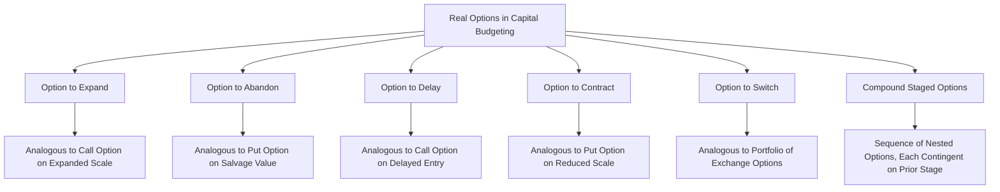
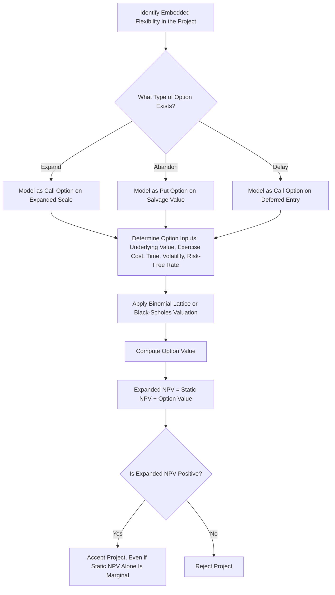

## Real Options in Capital Investment Decisions

### Definition and Purpose

**Real options analysis** applies the theory and mathematics of financial options pricing to real (non-financial) capital investment decisions. It recognizes that managers often possess **flexibility** to alter a project's course as uncertainty resolves over time — flexibility that static NPV analysis, which evaluates a single fixed cash flow stream, systematically ignores or undervalues.

A "real option" is the right, but not the obligation, to take a specific managerial action (expand, delay, abandon, switch) regarding a real asset or project at a future date, contingent on how conditions evolve.

### Why Static NPV Understates Project Value

Traditional NPV analysis implicitly assumes a **static, "now-or-never," all-or-nothing** investment decision: the firm either commits to the entire projected cash flow stream today or rejects the project entirely. In reality, most capital investments unfold in stages, and management retains the ability to react to new information:

$$\text{Expanded NPV} = \text{Static NPV} + \text{Value of Embedded Real Options}$$

This is directly analogous to the relationship between a financial option's intrinsic value and its total value, which includes **time value** reflecting the option's flexibility. A project with a negative or marginal static NPV may still be worth pursuing if it carries valuable embedded options — a common example being early-stage entry into a new market or technology.

### Categories of Real Options

**1. Option to Expand (Growth Option)**

The right to increase the scale of operations (e.g., build additional production capacity) if initial results are favorable. Analogous to a **call option** on the expanded scale of the project.

**2. Option to Abandon (Exit Option)**

The right to discontinue a project and recover any salvage value if conditions turn unfavorable, limiting downside losses. Analogous to a **put option** on the project's assets, with the exercise price equal to the salvage or resale value.

**3. Option to Delay (Timing Option / Option to Wait)**

The right to postpone an investment decision until more information becomes available (e.g., waiting to see how a new regulation, competitor entry, or commodity price trend develops). Analogous to a **call option** on the underlying project, where waiting preserves the option's time value at the cost of forgone early cash flows.

**4. Option to Contract (Downsize Option)**

The right to scale down operations if demand proves weaker than expected, reducing losses relative to a fixed-scale commitment.

**5. Option to Switch (Flexibility Option)**

The right to alter inputs, outputs, or operating modes in response to changing relative prices (e.g., a power plant that can switch between fuel sources depending on which is currently cheaper).

**6. Compound Options (Staged Investment)**

A sequence of investment stages where each stage is itself an option on proceeding to the next (e.g., R&D → pilot plant → full-scale production). Common in pharmaceutical drug development, where each clinical trial phase is a decision gate contingent on the prior phase's outcome.

### Real Options Taxonomy Diagram

### Analogy to Financial Options

| Financial Call Option | Real Option to Expand/Invest |
| --- | --- |
| Current stock price | Present value of expected project cash flows |
| Exercise price | Cost of investment (expansion, entry) |
| Time to expiration | Time until the investment opportunity is lost or the decision must be made |
| Volatility of stock returns | Volatility/uncertainty of project cash flows |
| Risk-free interest rate | Risk-free interest rate |

This analogy allows the **Black-Scholes model** or **binomial option pricing models** to be adapted for valuing real options, using the five inputs above in place of their financial-option counterparts.

### Binomial Lattice Approach to Real Options Valuation

The binomial model is generally preferred for real options over Black-Scholes because it accommodates early exercise (American-style options) and multiple decision points, both of which are common features of real investment decisions.

**Process:**

1. Model the underlying project value as following a binomial process over discrete time steps, with an "up" move factor $u$ and "down" move factor $d$.
2. At each node, determine whether the option would be exercised (e.g., expand, abandon) or held, comparing the immediate exercise payoff to the value of continuing to hold the option.
3. Work backward from the final period ("backward induction") to the present, discounting expected values at the risk-free rate under risk-neutral probabilities.

**Simplified worked example (option to expand):**

A firm invests $1,000,000 in a pilot project. In one year, depending on market conditions:

- **Up state** (probability 55%): project value rises to $1,600,000; firm has the option to invest an additional $800,000 to expand, capturing an expanded project value of $3,000,000.
- **Down state** (probability 45%): project value falls to $700,000; firm chooses not to expand.

**Expansion decision in the up state:**

$$\text{Expand payoff} = 3{,}000{,}000 - 800{,}000 = \$2{,}200{,}000 \quad \text{vs.} \quad \text{Value without expanding} = \$1{,}600{,}000$$

Since $2,200,000 > $1,600,000, the firm exercises the option to expand in the up state.

**Expected value at year 1 (risk-neutral, simplified with real probabilities for illustration):**

$$E[\text{Value}] = 0.55(2{,}200{,}000) + 0.45(700{,}000) = \$1{,}525{,}000$$

This expected value, discounted back to present value at an appropriate rate, would then be compared to the initial investment to determine whether the pilot project (which carries the embedded expansion option) is worthwhile — even if its static NPV alone is marginal or negative, because the illustrative expected value captures the upside captured by the expansion right. [Inference: a rigorous valuation requires risk-neutral probabilities derived from the underlying volatility and risk-free rate rather than real-world subjective probabilities as used in this simplified illustration; this example is presented for conceptual clarity, not as a precise valuation methodology.]

### Real Options Decision Process Flow

### Real Options Value Contribution Illustration (svg_diagram)

<svg xmlns="http://www.w3.org/2000/svg" viewBox="0 0 720 380">
<text x="360" y="30" text-anchor="middle" font-size="18" font-weight="bold" fill="#1a1a1a">Static NPV vs Expanded NPV with Real Options (svg_diagram)</text>

<line x1="100" y1="320" x2="620" y2="320" stroke="#333" stroke-width="2" />
<line x1="100" y1="60" x2="100" y2="320" stroke="#333" stroke-width="2" />
<text x="40" y="200" text-anchor="middle" font-size="13" fill="#333" transform="rotate(-90 40 200)">Value ($)</text>

<line x1="100" y1="240" x2="620" y2="240" stroke="#999" stroke-width="1" stroke-dasharray="4,4" />

<rect x="180" y="240" width="90" height="20" fill="#b2182b" />
<text x="225" y="278" text-anchor="middle" font-size="12" fill="#333">Static NPV</text>
<text x="225" y="230" text-anchor="middle" font-size="11" fill="#333">(marginal/negative)</text>

<rect x="350" y="110" width="90" height="130" fill="#2166ac" />
<text x="395" y="278" text-anchor="middle" font-size="12" fill="#333">Option Value</text>

<rect x="490" y="110" width="90" height="150" fill="#2e7d32" />
<text x="535" y="278" text-anchor="middle" font-size="12" fill="#333">Expanded NPV</text>
<text x="535" y="100" text-anchor="middle" font-size="11" font-weight="bold" fill="#2e7d32">Static NPV + Option Value</text>
</svg>

### Key Value Drivers of Real Options

- **Uncertainty (volatility):** counterintuitively, higher uncertainty in future project cash flows *increases* the value of an embedded real option, since flexibility is most valuable precisely when the range of possible outcomes is widest. This contrasts with static NPV/risk-adjusted discount rate approaches, where higher risk is treated as unambiguously reducing project value.
- **Time until the decision must be made:** more time before an irreversible commitment is required increases the value of a delay or timing option, analogous to how longer time-to-expiration increases a financial option's value.
- **Irreversibility of the investment:** the more difficult and costly it is to reverse an investment decision once made, the more valuable it is to retain the option to wait for better information rather than committing immediately.
- **Cost of exercising the option:** for an expansion option, the cost of expanding; for an abandonment option, the difference between continuing value and salvage value.

### Limitations and Practical Challenges

- **Estimating volatility for a real, non-traded asset is difficult.** Unlike a publicly traded stock, project cash flow volatility must typically be estimated indirectly (e.g., via Monte Carlo simulation of the underlying project, or by using the volatility of comparable publicly traded firms).
- **Market completeness assumption.** Classical option pricing theory assumes the underlying asset is tradable and markets are complete/arbitrage-free; real assets are not typically traded, which complicates the direct application of risk-neutral valuation and requires simplifying assumptions.
- **Complexity and communication challenges.** Real options valuations are mathematically more sophisticated than standard DCF analysis, which can make them harder to communicate to and gain buy-in from non-technical decision-makers.
- **Risk of overuse to justify weak projects.** Because option value is sensitive to volatility and other difficult-to-estimate inputs, there is a risk that real options analysis is used opportunistically to rationalize projects with poor static NPV rather than as a rigorous, independently verifiable valuation method. [Inference: this is a commonly cited practitioner and academic critique of real options analysis, not a claim about any particular firm's practice.]

### Relationship to Decision Tree Analysis

Real options analysis and decision tree analysis address the same underlying problem — valuing managerial flexibility under uncertainty — but differ in their discounting approach. Decision tree analysis typically discounts expected cash flows at a single risk-adjusted discount rate across all branches, which can be theoretically inconsistent when different branches carry different risk levels. Real options analysis, by contrast, uses **risk-neutral valuation** (discounting at the risk-free rate after adjusting probabilities), which is more theoretically consistent with no-arbitrage option pricing principles but requires additional inputs (notably volatility) that decision tree analysis does not.

### Summary Comparison Table

| Attribute | Static NPV | Decision Tree Analysis | Real Options Analysis |
| --- | --- | --- | --- |
| Captures flexibility | No | Yes | Yes |
| Discounting approach | Single risk-adjusted rate | Single risk-adjusted rate (typically) | Risk-neutral / risk-free rate |
| Requires volatility estimate | No | No | Yes |
| Theoretical consistency with option pricing | N/A | Approximate | Rigorous (under model assumptions) |
| Communication complexity | Low | Moderate | High |

### Practical Considerations

- Real options analysis is most valuable for projects characterized by high uncertainty, significant irreversibility, and clear decision points (staged investments), such as R&D, natural resource extraction, pharmaceuticals, and technology ventures.
- For simpler, lower-uncertainty projects, the added complexity of real options valuation may not be justified relative to standard NPV analysis supplemented with sensitivity/scenario analysis.
- In practice, real options are frequently analyzed qualitatively (i.e., acknowledging that flexibility has value and factoring it into the accept/reject judgment) rather than through full formal option-pricing calculations, particularly outside industries with mature quantitative finance capabilities. [Inference: the prevalence of qualitative versus fully quantitative real options practice varies by industry and firm sophistication and is not comprehensively documented here.]

**Related Topics**

- Sensitivity and Risk Analysis in Capital Budgeting
- Decision Tree Analysis in Managerial Decision Making
- Net Present Value (NPV) Method
- Comparing and Ranking Capital Investment Proposals
- Black-Scholes and Binomial Option Pricing Models
- Capital Rationing
- Staged Investment and R&D Portfolio Management
- Risk-Neutral Valuation and No-Arbitrage Pricing