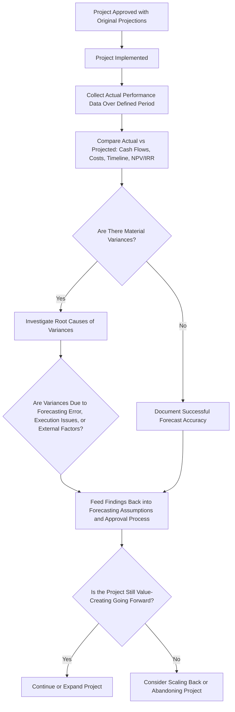
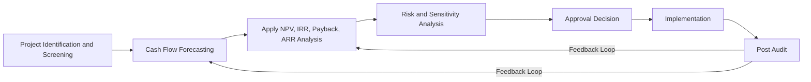

## Post Audit of Capital Projects

### Definition and Purpose

A **post audit** (also called post-completion audit or post-implementation review) is a formal, systematic comparison of a capital project's actual results against the projections made when the project was originally approved. It closes the feedback loop of the capital budgeting process by evaluating whether the initial investment decision was sound, whether forecasts were accurate, and whether the project should continue, be modified, or be discontinued.

Post audits distinguish capital budgeting from a one-time decision exercise and turn it into an iterative, learning-oriented management control process.

### Objectives of Post Audit

1. **Evaluate forecasting accuracy.** Compare actual cash flows, revenues, costs, and timelines against original projections to assess how reliable the forecasting process was.
2. **Improve future forecasting.** Identify systematic biases (e.g., consistent overestimation of revenue, underestimation of costs) that can be corrected in future project proposals.
3. **Assess managerial accountability.** Evaluate whether project sponsors and managers delivered on the commitments made during the approval process, supporting performance evaluation and incentive alignment.
4. **Support ongoing operating decisions.** Determine whether an in-progress or completed project should be continued, expanded, scaled back, or abandoned based on updated actual performance data.
5. **Improve the capital budgeting process itself.** Identify weaknesses in the approval process, such as overly optimistic assumptions being systematically approved, or inadequate risk analysis at the proposal stage.

### Post Audit Process Flow

### What Gets Compared in a Post Audit

| Dimension | Original Projection | Actual Result | Variance Analysis |
| --- | --- | --- | --- |
| Initial investment cost | Budgeted capital outlay | Actual capital spent | Cost overrun/underrun percentage |
| Revenue/cash inflows | Projected annual revenue | Actual annual revenue | Revenue variance by year |
| Operating costs | Projected annual costs | Actual annual costs | Cost variance by year |
| Project timeline | Planned completion/ramp-up schedule | Actual completion/ramp-up schedule | Schedule variance |
| NPV / IRR | Original approved NPV/IRR | Recalculated NPV/IRR using actual cash flows to date | Value creation variance |
| Useful life / terminal value | Projected asset life and salvage value | Actual or updated estimate | Life/salvage variance |

**Worked Example:**

A project was originally approved with:

- Initial investment: $2,000,000
- Projected Year 1–3 cash flows: $600,000, $700,000, $750,000
- Projected NPV at 10%: $180,000

Three years post-implementation, actual results were:

- Actual investment: $2,150,000 (7.5% cost overrun)
- Actual Year 1–3 cash flows: $500,000, $650,000, $680,000

Recalculating NPV using actual figures:

$$NPV_{actual} = -2{,}150{,}000 + \dfrac{500{,}000}{1.10} + \dfrac{650{,}000}{1.10^2} + \dfrac{680{,}000}{1.10^3}$$

$$NPV_{actual} = -2{,}150{,}000 + 454{,}545 + 537{,}190 + 510{,}862 = -\$647{,}403$$

This large negative variance from the original $180,000 projected NPV would trigger a root-cause investigation: was the shortfall driven by an unrealistic original revenue forecast, execution delays, an unexpected cost overrun, or a genuine adverse market shift outside management's control?

### Variance Root-Cause Categories

- **Forecasting errors:** overly optimistic assumptions at the proposal stage (e.g., unrealistic market share assumptions, underestimated competitive response).
- **Execution/implementation issues:** delays, cost overruns, or quality problems during project implementation that were within management's control.
- **External/uncontrollable factors:** macroeconomic shifts, regulatory changes, competitor actions, or other factors outside the original forecast's reasonable scope.
- **Changes in scope:** the project as actually implemented differed materially from the project as originally approved, making direct comparison partially inapplicable.

Distinguishing between these categories is critical for fair managerial accountability — penalizing a manager for variances caused by genuinely unforeseeable external factors can create perverse incentives (e.g., encouraging overly conservative future forecasts to avoid blame), whereas failing to hold managers accountable for controllable execution failures undermines the discipline of the capital budgeting process. [Inference: this accountability tradeoff is a widely discussed managerial control issue, and the appropriate balance depends on firm-specific governance practices.]

### Post Audit Root-Cause Investigation Diagram (svg_diagram)

<svg xmlns="http://www.w3.org/2000/svg" viewBox="0 0 720 340">
<text x="360" y="30" text-anchor="middle" font-size="18" font-weight="bold" fill="#1a1a1a">Post Audit Variance: Root Cause Categories (svg_diagram)</text>
<rect x="60" y="70" width="150" height="90" rx="8" fill="#eaf2fb" stroke="#2166ac" stroke-width="2" />
<text x="135" y="105" text-anchor="middle" font-size="13" font-weight="bold" fill="#2166ac">Forecasting</text>
<text x="135" y="122" text-anchor="middle" font-size="13" font-weight="bold" fill="#2166ac">Error</text>
<text x="135" y="145" text-anchor="middle" font-size="10" fill="#333">Overly optimistic</text>
<text x="135" y="158" text-anchor="middle" font-size="10" fill="#333">initial assumptions</text>
<rect x="240" y="70" width="150" height="90" rx="8" fill="#eafbea" stroke="#2e7d32" stroke-width="2" />
<text x="315" y="105" text-anchor="middle" font-size="13" font-weight="bold" fill="#2e7d32">Execution</text>
<text x="315" y="122" text-anchor="middle" font-size="13" font-weight="bold" fill="#2e7d32">Issues</text>
<text x="315" y="145" text-anchor="middle" font-size="10" fill="#333">Delays, overruns,</text>
<text x="315" y="158" text-anchor="middle" font-size="10" fill="#333">quality problems</text>
<rect x="420" y="70" width="150" height="90" rx="8" fill="#fdf3e3" stroke="#b08800" stroke-width="2" />
<text x="495" y="105" text-anchor="middle" font-size="13" font-weight="bold" fill="#b08800">External</text>
<text x="495" y="122" text-anchor="middle" font-size="13" font-weight="bold" fill="#b08800">Factors</text>
<text x="495" y="145" text-anchor="middle" font-size="10" fill="#333">Market, regulatory,</text>
<text x="495" y="158" text-anchor="middle" font-size="10" fill="#333">competitive shifts</text>
<rect x="600" y="70" width="100" height="90" rx="8" fill="#fbeaea" stroke="#b2182b" stroke-width="2" />
<text x="650" y="105" text-anchor="middle" font-size="12" font-weight="bold" fill="#b2182b">Scope</text>
<text x="650" y="122" text-anchor="middle" font-size="12" font-weight="bold" fill="#b2182b">Change</text>
<text x="650" y="145" text-anchor="middle" font-size="9" fill="#333">Project differs</text>
<text x="650" y="158" text-anchor="middle" font-size="9" fill="#333">from approval</text>
<line x1="360" y1="200" x2="360" y2="230" stroke="#333" stroke-width="2" />
<text x="360" y="250" text-anchor="middle" font-size="12" fill="#333">Feed findings back into forecasting process</text>
<text x="360" y="268" text-anchor="middle" font-size="12" fill="#333">and managerial accountability decisions</text>
</svg>

### Timing of Post Audits

- **Interim post audits:** conducted at defined milestones during a multi-year project (e.g., annually), allowing corrective action while the project is still in progress.
- **Final/completion post audits:** conducted once the project has reached full operational maturity, providing the most complete comparison of actual versus projected total returns.

The optimal timing balances the value of early corrective feedback against the need for enough elapsed time to observe meaningful, stable actual results rather than short-term noise.

### Challenges in Conducting Post Audits

- **Cost allocation difficulty.** Many projects share resources, overhead, or infrastructure with other parts of the business, making it difficult to isolate the specific actual cash flows attributable to a single project after implementation.
- **Behavioral resistance.** Managers who championed a project may resist rigorous post audit scrutiny, particularly if results are unfavorable, creating organizational friction and potential for biased self-reporting.
- **Sunk cost bias in continuation decisions.** There is a risk that post audit findings are used to justify continuing a failing project ("we've already invested so much") rather than objectively evaluating whether continuing is currently the best use of resources — a violation of the sunk cost principle, since only future incremental cash flows should matter for a continue/abandon decision, not the amount already spent.
- **Resource and time cost of the audit process itself.** Thorough post audits require analyst time and data collection effort, which firms must weigh against the audit's expected value in improving future decisions; as a result, many firms limit formal post audits to their largest or highest-risk capital projects rather than auditing every approved project.
- **Incomplete counterfactuals.** It is generally impossible to observe what would have happened under the road not taken (i.e., had the project been rejected or an alternative project selected instead), limiting the audit to a comparison against the original forecast rather than a comparison of realized versus best-alternative outcomes.

### Relationship to the Broader Capital Budgeting Cycle

The post audit closes the loop back to the earliest stages of the capital budgeting cycle, making the overall process iterative rather than linear — findings from completed projects directly inform the assumptions and rigor applied to future project proposals.

### Practical Considerations

- Firms typically reserve formal post audits for capital projects above a materiality threshold (e.g., investments exceeding a specified dollar amount), given the resource cost of conducting a thorough audit.
- Post audit findings are sometimes incorporated into internal databases of "forecasting accuracy by project type or division," which can be used to apply systematic adjustment factors (sometimes called an "optimism bias correction") to future proposals from the same source.
- Effective post audit programs generally emphasize organizational learning over individual blame, since a punitive post audit process can create incentives for managers to game future forecasts (e.g., deliberately lowballing projections to ensure they are easily exceeded) rather than to forecast accurately. [Inference: this learning-versus-blame framing is a commonly cited best-practice principle in managerial accounting and organizational control literature, not a description of universal practice.]

**Related Topics**

- Comparing and Ranking Capital Investment Proposals
- Sensitivity and Risk Analysis in Capital Budgeting
- Net Present Value (NPV) Method
- Capital Rationing
- Sunk Cost Fallacy and Relevant Costs in Decision Making
- Managerial Performance Evaluation and Incentive Alignment
- Variance Analysis in Budgetary Control Systems