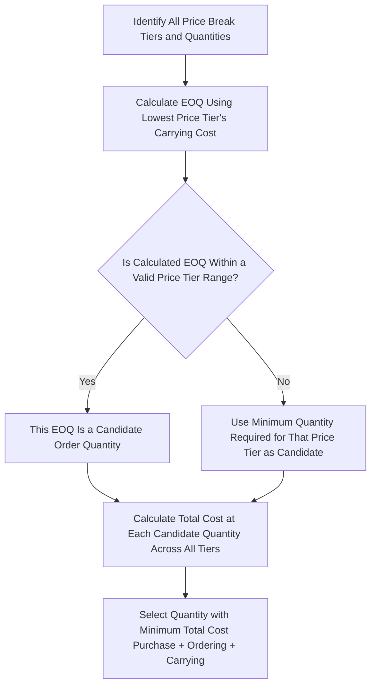

## Economic Order Quantity

### Definition and Purpose

**Economic Order Quantity (EOQ)** is a classic inventory management model that determines the optimal order quantity a firm should purchase (or produce) to minimize the total cost of managing inventory — specifically, the sum of ordering costs and carrying (holding) costs. It answers the question: "how much should we order each time, to minimize total annual inventory-related costs?"

### The Two Cost Components

**1. Ordering costs (setup costs)**

Costs incurred each time an order is placed (or a production run is set up), independent of order size: purchase order processing, shipping/freight arrangement fees, receiving and inspection costs, or machine setup costs for internally manufactured items. As order quantity increases, the firm orders less frequently, so total annual ordering cost **decreases**.

$$\text{Total Annual Ordering Cost} = \dfrac{D}{Q} \times S$$

Where $D$ = annual demand in units, $Q$ = order quantity, $S$ = ordering cost per order.

**2. Carrying costs (holding costs)**

Costs incurred for holding inventory: warehousing/storage space, insurance, obsolescence risk, spoilage, and the opportunity cost of capital tied up in inventory. As order quantity increases, average inventory on hand increases, so total annual carrying cost **increases**.

$$\text{Total Annual Carrying Cost} = \dfrac{Q}{2} \times H$$

Where $H$ = carrying cost per unit per year, and $Q/2$ represents average inventory (assuming inventory is depleted evenly from $Q$ to 0 before the next order arrives).

### The EOQ Formula

The EOQ minimizes the sum of these two opposing costs. Setting total ordering cost equal to total carrying cost (the point at which their sum is minimized) and solving for $Q$:

$$EOQ = \sqrt{\dfrac{2DS}{H}}$$

**Derivation (for completeness):**

Total relevant cost:

$$TC(Q) = \dfrac{D}{Q}S + \dfrac{Q}{2}H$$

Taking the derivative with respect to $Q$ and setting it to zero:

$$\dfrac{d(TC)}{dQ} = -\dfrac{DS}{Q^2} + \dfrac{H}{2} = 0$$

$$\dfrac{H}{2} = \dfrac{DS}{Q^2} \implies Q^2 = \dfrac{2DS}{H} \implies Q = \sqrt{\dfrac{2DS}{H}}$$

### Worked Example

A retailer sells 24,000 units annually of a product. Ordering cost per order is $150. Annual carrying cost per unit is $8.

$$EOQ = \sqrt{\dfrac{2 \times 24{,}000 \times 150}{8}} = \sqrt{\dfrac{7{,}200{,}000}{8}} = \sqrt{900{,}000} \approx 949 \text{ units}$$

**Number of orders per year:**

$$\dfrac{D}{EOQ} = \dfrac{24{,}000}{949} \approx 25.3 \text{ orders per year}$$

**Total annual ordering cost at EOQ:**

$$\dfrac{24{,}000}{949} \times 150 \approx \$3{,}793$$

**Total annual carrying cost at EOQ:**

$$\dfrac{949}{2} \times 8 \approx \$3{,}796$$

Note that ordering cost and carrying cost are approximately equal at the EOQ ($3,793 ≈ $3,796, with the small difference due to rounding $Q$ to a whole number) — this confirms the EOQ is correctly identified at the point where the two cost curves intersect.

**Total annual relevant inventory cost:**

$$TC(EOQ) \approx 3{,}793 + 3{,}796 = \$7{,}589$$

### EOQ Cost Curve Illustration (svg_diagram)

<svg xmlns="http://www.w3.org/2000/svg" viewBox="0 0 720 400">
<text x="360" y="30" text-anchor="middle" font-size="18" font-weight="bold" fill="#1a1a1a">EOQ: Ordering Cost vs Carrying Cost Tradeoff (svg_diagram)</text>

<line x1="90" y1="340" x2="660" y2="340" stroke="#333" stroke-width="2" />
<line x1="90" y1="60" x2="90" y2="340" stroke="#333" stroke-width="2" />
<text x="375" y="375" text-anchor="middle" font-size="13" fill="#333">Order Quantity (Q)</text>
<text x="40" y="200" text-anchor="middle" font-size="13" fill="#333" transform="rotate(-90 40 200)">Annual Cost ($)</text>

<line x1="90" y1="320" x2="640" y2="90" stroke="#b2182b" stroke-width="3" />
<text x="600" y="105" font-size="12" fill="#b2182b">Carrying Cost</text>

<path d="M 100,80 Q 200,110 300,190 T 640,320" fill="none" stroke="#2166ac" stroke-width="3" />
<text x="500" y="230" font-size="12" fill="#2166ac">Ordering Cost</text>

<path d="M 100,220 Q 250,140 370,140 T 640,240" fill="none" stroke="#2e7d32" stroke-width="3" stroke-dasharray="2,3" />
<text x="180" y="170" font-size="12" fill="#2e7d32">Total Cost</text>

<circle cx="370" cy="141" r="6" fill="#333" />
<line x1="370" y1="141" x2="370" y2="340" stroke="#333" stroke-width="1" stroke-dasharray="3,3" />
<text x="370" y="358" text-anchor="middle" font-size="12" font-weight="bold" fill="#333">EOQ</text>
</svg>

### Assumptions of the Basic EOQ Model

- **Demand is known and constant** throughout the year (deterministic, not stochastic).
- **Lead time is constant and known**, so orders can be timed to arrive exactly when needed.
- **Ordering cost per order is fixed**, regardless of order size.
- **Carrying cost per unit is constant**, regardless of the quantity held.
- **No quantity discounts** — unit purchase price does not vary with order size in the basic model (extensions relax this assumption; see below).
- **No stockouts occur** — the model assumes inventory is always available to meet demand, i.e., no safety stock is explicitly required in the basic formulation.
- **Instantaneous replenishment** — the entire order quantity arrives at once, not gradually over time (this assumption is relaxed in the production/manufacturing EOQ variant, sometimes called the Economic Production Quantity model).

These assumptions are frequently violated in practice, which is why numerous EOQ extensions exist to relax one or more of them. [Inference: the basic model's assumptions are a standard simplification used for pedagogical and initial planning purposes; real-world inventory systems typically require the extensions discussed below to be operationally realistic.]

### Reorder Point

While EOQ determines **how much** to order, the **reorder point (ROP)** determines **when** to place the order, ensuring the new order arrives just as existing inventory is depleted:

$$ROP = d \times L$$

Where $d$ = average daily demand and $L$ = lead time in days.

**Example:** If daily demand is 66 units ($24{,}000/365$) and lead time is 7 days:

$$ROP = 66 \times 7 = 462 \text{ units}$$

The firm should place a new order when inventory on hand falls to 462 units.

### Safety Stock

To protect against demand variability or lead time variability (both of which violate the basic EOQ model's deterministic assumptions), firms often maintain **safety stock** — additional inventory held as a buffer against stockouts:

$$ROP_{with\ safety\ stock} = (d \times L) + \text{Safety Stock}$$

Safety stock levels are typically set using statistical methods based on the variability of demand and lead time and a target service level (probability of not stocking out), commonly using the standard normal distribution:

$$\text{Safety Stock} = Z \times \sigma_d \times \sqrt{L}$$

Where $Z$ is the number of standard deviations corresponding to the desired service level (e.g., $Z \approx 1.65$ for a 95% service level) and $\sigma_d$ is the standard deviation of daily demand.

### EOQ with Quantity Discounts

When suppliers offer **quantity discounts** for larger order sizes, the basic EOQ model must be extended, since unit purchase price is no longer constant. The extended process:

1. Calculate the basic EOQ using the carrying cost associated with the lowest (undiscounted) price tier.
2. If the calculated EOQ falls within a price break's minimum order quantity, it is feasible; otherwise, adjust upward to the minimum quantity required for that price tier.
3. Calculate **total cost** (purchase cost + ordering cost + carrying cost) at each feasible order quantity — the EOQ for each price tier and/or the minimum quantity required to qualify for each discount tier.
4. Select the order quantity that minimizes total cost across all tiers, not just the tier with the lowest quoted price, since carrying cost increases with order size and can outweigh the purchase price savings.

**Illustrative Decision Logic:**

### EOQ Model Variants and Extensions

| Variant | Relaxed Assumption | Key Addition |
| --- | --- | --- |
| EOQ with Quantity Discounts | Constant unit price | Price tiers based on order size |
| Economic Production Quantity (EPQ) | Instantaneous replenishment | Gradual replenishment at a finite production rate |
| EOQ with Planned Shortages (Backorder Model) | No stockouts | Allows planned backorders, adding a shortage cost term |
| Probabilistic/Stochastic Inventory Models | Known, constant demand | Demand modeled as a random variable; incorporates safety stock formally |
| Multi-Item / Joint Replenishment Models | Single item ordered independently | Coordinates ordering across multiple items sharing fixed ordering costs |

### Relationship to Just-In-Time (JIT) and Theory of Constraints

The EOQ model's emphasis on minimizing the sum of ordering and carrying costs contrasts philosophically with **Just-In-Time (JIT)** inventory management, which seeks to minimize carrying costs by driving order quantities toward very small batch sizes (ideally approaching single-unit flow), while aggressively working to **reduce ordering/setup costs** ($S$) through process improvement rather than treating $S$ as fixed. As $S$ approaches zero in the EOQ formula, the optimal order quantity also approaches zero — illustrating mathematically why reducing setup costs is central to JIT philosophy.

This connects directly to the **Theory of Constraints (TOC)**, which similarly challenges the traditional EOQ framing by emphasizing that inventory decisions should be evaluated based on their impact on the system's **bottleneck (constraint)** throughput, rather than on unit-level ordering and carrying cost minimization in isolation. TOC argues that building inventory buffers ahead of a bottleneck resource can be beneficial (to protect throughput), even though this appears to conflict with minimizing carrying costs under the classical EOQ framework — the two philosophies differ in what they treat as the primary cost driver to be managed.

### Practical Considerations

- EOQ is most directly applicable to items with **relatively stable, predictable demand** — its assumptions are frequently violated for highly seasonal, promotional, or newly launched products, where the extensions or probabilistic models above are more appropriate.
- Carrying cost ($H$) is often expressed as a percentage of unit cost (e.g., 20–30% annually, reflecting the combined cost of capital, storage, insurance, and obsolescence risk) rather than a flat dollar amount, requiring the modeler to convert this percentage into a dollar carrying cost per unit before applying the formula.
- Because the EOQ formula involves a **square root**, the total cost curve is relatively flat near the optimum — meaning that moderate deviations from the exact calculated EOQ (e.g., rounding to a convenient shipping container quantity) typically produce only small increases in total cost, making the model reasonably robust to minor practical adjustments. [Inference: this flatness-near-the-optimum property is a well-known mathematical characteristic of the EOQ cost function, though the specific percentage cost impact of any given deviation depends on the particular parameters of each situation.]

**Related Topics**

- Reorder Point and Safety Stock Determination
- Economic Production Quantity (EPQ) Model
- Just-In-Time (JIT) Inventory Management
- Theory of Constraints and Throughput Accounting
- ABC Inventory Classification Analysis
- Inventory Carrying Cost Estimation
- Materials Requirements Planning (MRP) Systems
- Quantity Discount Models in Purchasing Decisions