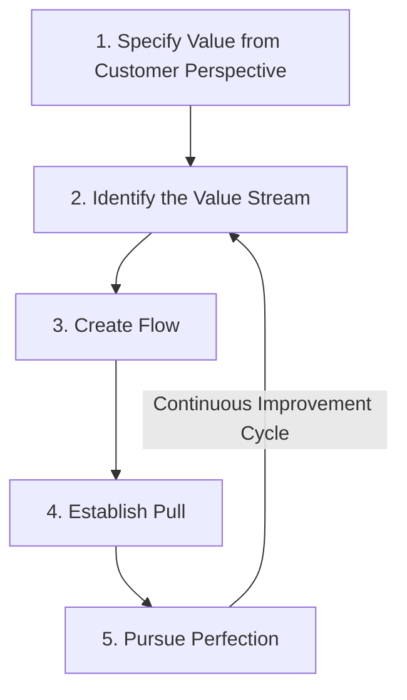

## Lean Production Principles


### Definition and Purpose

**Lean production** (or "lean manufacturing," "lean thinking") is a broad management philosophy focused on maximizing customer value while systematically eliminating waste (**muda**) from every process in an organization. Lean generalizes and extends the principles pioneered in the **Toyota Production System**, of which Just-in-Time is one core component, into a comprehensive framework applicable across manufacturing, service, healthcare, software development, and administrative processes.

Lean is best understood not as a single technique but as an integrated philosophy encompassing JIT, quality management, workforce engagement, and continuous improvement, unified by the goal of delivering maximum value with minimum waste.

### The Five Core Principles of Lean

**1. Specify Value from the Customer's Perspective**

Value is defined strictly by what the end customer is willing to pay for — any activity that does not directly contribute to a product or service attribute the customer values is, by definition, waste, regardless of how necessary it may seem from an internal operational perspective.

**2. Identify the Value Stream**

Map every step involved in bringing a product or service from raw input to customer delivery, explicitly classifying each step as: value-adding, non-value-adding but necessary (e.g., regulatory inspection), or pure waste (to be eliminated). This mapping exercise is commonly performed using **Value Stream Mapping (VSM)**.

**3. Create Flow**

Reorganize the remaining value-adding steps so that the product or service moves through the process smoothly and continuously, without interruptions, batching delays, backflows, or waiting — the ideal being continuous, uninterrupted single-piece flow from raw material to finished customer delivery.

**4. Establish Pull**

Production is triggered only by actual downstream customer demand (directly connecting to JIT's Kanban pull mechanism), rather than being pushed forward based on forecasts or production schedules disconnected from real demand.

**5. Pursue Perfection**

Continuous improvement (**Kaizen**) is an ongoing, never-complete process — every reduction in waste reveals further opportunities, and lean organizations institutionalize a culture of relentless incremental improvement rather than treating waste elimination as a one-time project.

### Lean Principles Flow Diagram



### The Eight Wastes (Muda) in Lean

Lean identifies eight categories of waste, commonly remembered by the mnemonic **TIMWOODS**:

| Waste Category | Description | Example |
| --- | --- | --- |
| Transportation | Unnecessary movement of materials or products | Moving parts between distant facilities |
| Inventory | Excess raw materials, WIP, or finished goods beyond immediate need | Overstocked warehouse |
| Motion | Unnecessary movement by workers | Walking to retrieve tools repeatedly |
| Waiting | Idle time waiting for the next process step | Machine downtime, queue delays |
| Overproduction | Producing more, earlier, or faster than actually needed | Building to forecast rather than actual orders |
| Overprocessing | Doing more work than the customer values | Excessive quality checks beyond specification |
| Defects | Errors requiring rework, scrap, or correction | Product recalls, returns |
| Skills (underutilized talent) | Failing to use employees' full capabilities and ideas | Not soliciting frontline improvement suggestions |

The first seven wastes originate from the Toyota Production System; the eighth (underutilized skills/talent) was added in later Western adaptations of lean thinking to emphasize the human and organizational learning dimension of the philosophy.

### Eight Wastes Illustration (svg_diagram)

<svg xmlns="http://www.w3.org/2000/svg" viewBox="0 0 720 340">
<text x="360" y="30" text-anchor="middle" font-size="17" font-weight="bold" fill="#1a1a1a">The Eight Wastes of Lean — TIMWOODS (svg_diagram)</text>
<g font-size="11" fill="#333">
<rect x="40" y="60" width="150" height="55" rx="6" fill="#eaf2fb" stroke="#2166ac" />
<text x="115" y="82" text-anchor="middle" font-weight="bold" fill="#2166ac">Transportation</text>
<text x="115" y="100" text-anchor="middle">Unneeded movement</text>



```
<rect x="210" y="60" width="150" height="55" rx="6" fill="#eaf2fb" stroke="#2166ac" />
<text x="285" y="82" text-anchor="middle" font-weight="bold" fill="#2166ac">Inventory</text>
<text x="285" y="100" text-anchor="middle">Excess stock</text>

<rect x="380" y="60" width="150" height="55" rx="6" fill="#eaf2fb" stroke="#2166ac" />
<text x="455" y="82" text-anchor="middle" font-weight="bold" fill="#2166ac">Motion</text>
<text x="455" y="100" text-anchor="middle">Unneeded worker movement</text>

<rect x="550" y="60" width="130" height="55" rx="6" fill="#eaf2fb" stroke="#2166ac" />
<text x="615" y="82" text-anchor="middle" font-weight="bold" fill="#2166ac">Waiting</text>
<text x="615" y="100" text-anchor="middle">Idle time</text>

<rect x="40" y="130" width="150" height="55" rx="6" fill="#fbeaea" stroke="#b2182b" />
<text x="115" y="152" text-anchor="middle" font-weight="bold" fill="#b2182b">Overproduction</text>
<text x="115" y="170" text-anchor="middle">Making too much/soon</text>

<rect x="210" y="130" width="150" height="55" rx="6" fill="#fbeaea" stroke="#b2182b" />
<text x="285" y="152" text-anchor="middle" font-weight="bold" fill="#b2182b">Overprocessing</text>
<text x="285" y="170" text-anchor="middle">More than customer wants</text>

<rect x="380" y="130" width="150" height="55" rx="6" fill="#fbeaea" stroke="#b2182b" />
<text x="455" y="152" text-anchor="middle" font-weight="bold" fill="#b2182b">Defects</text>
<text x="455" y="170" text-anchor="middle">Errors, rework, scrap</text>

<rect x="550" y="130" width="130" height="55" rx="6" fill="#fdf3e3" stroke="#b08800" />
<text x="615" y="152" text-anchor="middle" font-weight="bold" fill="#b08800">Skills</text>
<text x="615" y="170" text-anchor="middle">Underused talent</text>
```

</g>

<text x="360" y="230" text-anchor="middle" font-size="12" fill="#555">Overproduction (bottom-left) is considered the most damaging waste, as it triggers most of the others</text>

</svg>

### Key Lean Tools and Techniques

- **Value Stream Mapping (VSM):** a visual tool for documenting current-state and target future-state process flows, distinguishing value-adding from non-value-adding steps and quantifying cycle time, lead time, and process efficiency.
- **5S Workplace Organization:** Sort, Set in order, Shine, Standardize, Sustain — a structured method for organizing the physical workplace to reduce motion waste and improve visual management.
- **Kaizen Events:** focused, short-duration (often multi-day) improvement workshops targeting a specific process, involving cross-functional teams to rapidly identify and implement waste-reduction changes.
- **Poka-Yoke (error-proofing):** designing processes or equipment so that defects or mistakes are physically prevented or immediately detected, reducing reliance on inspection to catch quality problems after the fact.
- **Single-Minute Exchange of Die (SMED):** systematic technique for reducing equipment changeover/setup times, a direct enabler of the small-batch production central to both JIT and lean flow principles.
- **Total Productive Maintenance (TPM):** proactive, operator-involved equipment maintenance aimed at eliminating unplanned downtime (a waiting waste) and maximizing equipment reliability.
- **Andon Systems:** visual/audible signaling systems that allow any worker to immediately flag a quality or process problem, triggering rapid response rather than allowing defects to propagate downstream.

### Managerial Accounting Implications of Lean

- **Value stream costing:** lean organizations often shift away from traditional overhead allocation methods (which can obscure the true cost of a value stream) toward assigning costs directly to value streams, providing more direct visibility into the profitability of each end-to-end flow.
- **Reduced reliance on standard costing variance analysis:** traditional standard costing systems can incentivize large batch production and overproduction (to achieve favorable labor and overhead absorption variances), which directly conflicts with lean's flow and pull principles — many lean organizations therefore de-emphasize or fundamentally restructure standard costing and variance reporting.
- **Non-financial performance metrics:** lean environments frequently supplement or replace traditional financial variance reports with operational metrics more directly tied to lean objectives: cycle time, first-pass yield (quality rate), on-time delivery percentage, and inventory turns.
- **Box scores / plain-English financial reporting:** some lean accounting frameworks advocate simplified, value-stream-level "box score" reports combining operational, financial, and capacity metrics in a single, easily understood format for the teams directly responsible for the value stream, rather than complex traditional variance reports aimed primarily at accounting specialists. [Inference: "lean accounting" is a recognized sub-discipline with these general characteristics, though specific reporting formats vary across the practitioner and academic literature.]

### Lean vs Traditional Mass Production Paradigm

| Attribute | Traditional Mass Production | Lean Production |
| --- | --- | --- |
| Batch size | Large, to spread fixed/setup costs | Small, ideally single-piece flow |
| Inventory role | Buffer/asset | Waste to be minimized |
| Quality approach | End-of-line inspection | Built-in, error-proofed at each step |
| Worker role | Narrow, specialized tasks | Cross-trained, empowered to stop the line |
| Improvement approach | Periodic, engineering-driven | Continuous, front-line worker-driven (Kaizen) |
| Production trigger | Push (forecast-based schedule) | Pull (actual demand-based) |
| Performance metrics | Machine/labor utilization, output volume | Flow, quality, customer value delivered |

### Risks and Limitations

- **Overemphasis on tools without cultural change.** Implementing lean tools (5S, Kanban boards, VSM) without the underlying cultural shift toward continuous improvement and worker empowerment often produces superficial, unsustained results — a commonly cited failure mode sometimes described as adopting the "tools" of lean without its "philosophy."
- **Supply chain and demand volatility vulnerability**, inherited from lean's close relationship to JIT — minimal buffers throughout the value stream leave less capacity to absorb external shocks.
- **Difficulty in low-volume, high-variety, or project-based environments**, where the continuous, repetitive flow that lean tools are optimized for is harder to establish.
- **Requires sustained management commitment.** Because Kaizen and continuous improvement are ongoing, not one-time initiatives, lean transformations that lack sustained leadership attention frequently regress toward prior practices over time. [Inference: this regression risk is a widely discussed practitioner observation regarding lean and other continuous improvement programs generally, not a claim specific to any documented case.]

### Practical Considerations

- Lean principles have been extended well beyond manufacturing into "lean service," "lean healthcare," and "lean software development" (notably influencing Agile and DevOps methodologies), applying the same waste-elimination and flow principles to knowledge work and service delivery processes.
- Lean and Six Sigma are frequently combined into a hybrid methodology ("Lean Six Sigma"), pairing lean's waste-elimination and flow focus with Six Sigma's statistical process control and defect-reduction rigor.
- Successful lean implementation is generally described in the literature as requiring simultaneous attention to technical tools, management systems, and organizational culture — implementing only the technical tools in isolation is a commonly cited cause of failed or short-lived lean initiatives.

**Related Topics**

- Just in Time Inventory Systems
- Theory of Constraints and Throughput Accounting
- Value Stream Costing and Lean Accounting
- Total Quality Management and Cost of Quality
- Kaizen and Continuous Improvement Programs
- Standard Costing and Variance Analysis
- Six Sigma and Statistical Process Control
- Economic Order Quantity