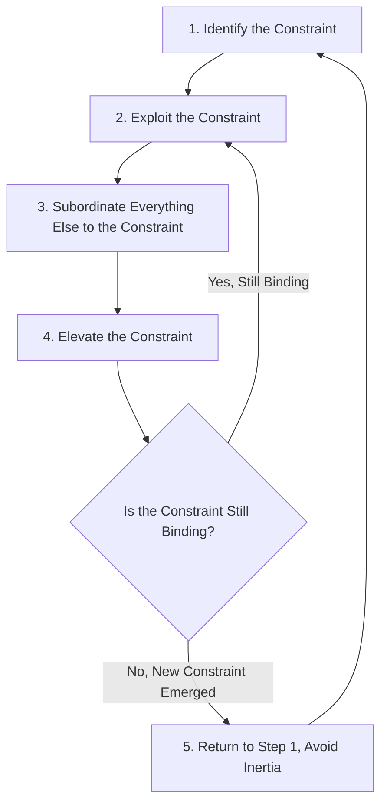
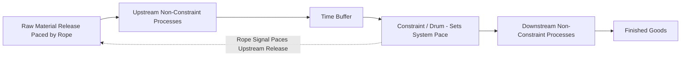

## Theory of Constraints in Depth

### Definition and Origin

The **Theory of Constraints (TOC)** is a management philosophy developed by Dr. Eliyahu Goldratt, first popularized in his 1984 business novel *The Goal*, centered on a foundational premise: **every system has at least one constraint (bottleneck) that limits its overall throughput**, and system-wide performance can only be improved by identifying and managing that constraint — improvements made anywhere else in the system that do not address the constraint produce little or no improvement in overall system output.

TOC's core insight distinguishes it sharply from traditional cost accounting and local efficiency optimization: a system is not improved by making every individual resource maximally efficient; it is improved only by increasing the throughput of its binding constraint.

### The Five Focusing Steps

TOC prescribes an ongoing, iterative five-step process for continuous improvement centered on the system's constraint:

**1. Identify the Constraint**

Determine which resource, policy, or market factor is currently limiting the system's ability to generate more throughput (this may be a physical bottleneck machine, a market demand limit, a policy constraint, or even a managerial mindset).

**2. Exploit the Constraint**

Ensure the constraint resource is used as efficiently as possible **without any additional capital investment** — eliminate downtime, idle time, defects, and non-essential work at the constraint, since every minute of constraint capacity lost is a minute of system throughput permanently lost.

**3. Subordinate Everything Else to the Constraint**

Align all non-constraint resources and decisions to support the constraint's continuous operation, even if this means intentionally running non-constraint resources at less than their own maximum local efficiency. This is the step most sharply at odds with traditional cost accounting's emphasis on maximizing utilization and efficiency at every individual workstation.

**4. Elevate the Constraint**

If exploiting and subordinating are insufficient to meet demand, invest additional resources (capital, overtime, additional shifts, outsourcing) specifically at the constraint to increase its capacity.

**5. Repeat the Process (Avoid Inertia)**

Once a constraint is elevated sufficiently, it may cease to be the binding constraint, and a new constraint will emerge elsewhere in the system. TOC emphasizes returning to Step 1 continuously, cautioning explicitly against allowing prior solutions or policies (designed around the old constraint) to become a new, unrecognized constraint themselves ("inertia" is explicitly named by Goldratt as a common failure mode).

### Five Focusing Steps Process Diagram

### Throughput Accounting: Core Definitions

TOC introduces an alternative performance measurement framework — **Throughput Accounting** — designed explicitly to support constraint-focused decision-making, in deliberate contrast to traditional absorption/standard costing, which TOC argues can systematically mislead decisions by allocating fixed costs per unit and encouraging local efficiency maximization regardless of the system constraint.

**Throughput (T):**

$$T = \text{Sales Revenue} - \text{Totally Variable Costs (TVC)}$$

Where TVC includes only costs that vary directly and totally with each unit sold — typically raw materials and directly variable purchased components — explicitly **excluding direct labor**, which TOC treats as largely fixed in the short run (in contrast to traditional variable costing, which typically treats direct labor as variable).

**Investment/Inventory (I):**

All the money the system has invested in purchasing things it intends to sell, including raw materials, work-in-process, and finished goods inventory, valued at **totally variable cost only** — explicitly excluding any allocated labor or overhead, again in contrast to traditional absorption costing's practice of including labor and overhead in inventory valuation.

**Operating Expense (OE):**

All the money the system spends to convert investment into throughput — essentially all costs other than totally variable costs, including labor, rent, utilities, and depreciation, treated as a single aggregate period cost rather than being allocated to individual units or products.

### Throughput Accounting Performance Metrics

$$\text{Net Profit} = T - OE$$

$$\text{Return on Investment} = \dfrac{T - OE}{I}$$

$$\text{Throughput per Unit of Constraint Time} = \dfrac{\text{Throughput per Unit}}{\text{Constraint Time per Unit}}$$

This last metric — throughput per unit of constraint time — is the central decision criterion TOC uses for product mix, pricing, and prioritization decisions, replacing the traditional cost accounting practice of ranking products by gross margin or contribution margin per unit without regard to which products consume the most of the scarce constraint resource.

### Worked Example: Product Mix Decision Under a Constraint

A firm produces two products, both processed through a single bottleneck machine with 2,400 available minutes per week.

| Product | Selling Price | Totally Variable Cost | Throughput per Unit | Constraint Minutes per Unit | Throughput per Constraint Minute |
| --- | --- | --- | --- | --- | --- |
| X | $80 | $30 | $50 | 10 | $5.00 |
| Y | $120 | $40 | $80 | 20 | $4.00 |

**Traditional approach (ranking by throughput/contribution per unit):** Product Y appears more attractive ($80 per unit vs. $50 per unit).

**TOC approach (ranking by throughput per unit of constraint time):** Product X is actually more attractive, generating $5.00 of throughput per constraint minute versus Product Y's $4.00, because Product X uses the scarce bottleneck resource more efficiently per unit of throughput generated.

**Optimal product mix:** given the 2,400 available constraint minutes per week, and assuming sufficient market demand for both products, the firm should prioritize Product X until its demand is exhausted, then allocate remaining constraint capacity to Product Y — maximizing total throughput per unit of the scarce constraint resource, rather than maximizing total units sold or total per-unit margin without regard to constraint consumption.

This example directly demonstrates why traditional cost accounting's per-unit contribution margin ranking can lead to a suboptimal product mix decision when a binding capacity constraint exists — a central critique TOC makes of conventional managerial accounting practice.

### Throughput vs Constraint Time Illustration (svg_diagram)

<svg xmlns="http://www.w3.org/2000/svg" viewBox="0 0 720 320">
<text x="360" y="30" text-anchor="middle" font-size="17" font-weight="bold" fill="#1a1a1a">Ranking Products by Throughput per Constraint Minute (svg_diagram)</text>
<line x1="90" y1="270" x2="640" y2="270" stroke="#333" stroke-width="2" />
<line x1="90" y1="60" x2="90" y2="270" stroke="#333" stroke-width="2" />
<text x="40" y="170" text-anchor="middle" font-size="12" fill="#333" transform="rotate(-90 40 170)">$ per Constraint Minute</text>

<rect x="200" y="90" width="100" height="180" fill="#2166ac" />
<text x="250" y="290" text-anchor="middle" font-size="13" fill="#333">Product X</text>
<text x="250" y="80" text-anchor="middle" font-size="13" font-weight="bold" fill="#2166ac">$5.00/min</text>

<rect x="420" y="126" width="100" height="144" fill="#b2182b" />
<text x="470" y="290" text-anchor="middle" font-size="13" fill="#333">Product Y</text>
<text x="470" y="116" text-anchor="middle" font-size="13" font-weight="bold" fill="#b2182b">$4.00/min</text>

<text x="360" y="55" text-anchor="middle" font-size="12" fill="#555">Product X is prioritized despite lower per-unit throughput</text>

</svg>

### Drum-Buffer-Rope Scheduling

TOC's operational scheduling methodology, **Drum-Buffer-Rope (DBR)**, translates the five focusing steps into a practical production scheduling system:

- **Drum:** the constraint sets the pace ("beats the drum") for the entire system — the production schedule for the whole plant is built around the constraint's capacity and optimal sequencing, since the constraint determines the maximum possible system throughput.
- **Buffer:** a time buffer (not merely a physical inventory buffer) is placed strategically before the constraint to protect it from disruptions or variability in upstream processes, ensuring the constraint is never starved for work — directly connecting to TOC's departure from pure JIT zero-inventory philosophy.
- **Rope:** a communication/scheduling mechanism that paces the release of raw materials into the system to match the constraint's actual consumption rate, preventing upstream overproduction and excess work-in-process inventory that would accumulate ahead of the constraint without providing any additional protective value.

### TOC's Critique of Traditional Cost Accounting

TOC advances several specific critiques of traditional absorption and standard costing practices:

- **Per-unit cost allocation obscures constraint impact.** Allocating fixed overhead per unit produced can make a product appear profitable in isolation while actually consuming disproportionate constraint capacity, leading to product mix decisions that reduce overall system throughput.
- **Local efficiency measures can harm global performance.** Traditional standard costing's favorable variances for high machine/labor utilization can incentivize overproduction at non-constraint resources, building excess work-in-process inventory that provides no system-wide benefit and directly contradicts TOC's subordination principle.
- **Cost-plus pricing built on fully absorbed unit cost can misprice products** relative to their actual constraint consumption, since two products with similar fully-absorbed unit costs may consume vastly different amounts of the scarce constraint resource per unit.
- **"Cutting costs" is treated as symmetrically important to "increasing throughput"** in most traditional accounting frameworks, whereas TOC argues throughput has effectively unlimited upside while cost-cutting has a hard floor at zero, implying management attention is generally better directed toward throughput improvement at the constraint than toward incremental cost reduction. [Inference: this asymmetry argument is a specific TOC theoretical position associated with Goldratt's writings, not a universally accepted accounting principle.]

### TOC vs Traditional Cost Accounting vs Lean/JIT — Comparative Summary

| Attribute | Traditional Cost Accounting | Theory of Constraints | Lean / JIT |
| --- | --- | --- | --- |
| Primary focus | Unit cost minimization, local efficiency | System throughput via the constraint | Waste elimination, flow |
| Inventory view | Asset (absorbs fixed cost) | Necessary buffer only at the constraint | Waste to be minimized everywhere |
| Labor cost treatment | Often treated as variable | Treated as largely fixed (part of OE) | Treated as a resource to be flexibly utilized |
| Decision ranking metric | Contribution margin per unit | Throughput per unit of constraint time | N/A (flow and waste elimination-based) |
| Improvement focus | Broad, often uniform across all resources | Concentrated deliberately on the constraint | Broad, applied across the entire value stream |

### Practical Considerations

- TOC and Lean/JIT are often presented as complementary rather than conflicting in practice: lean's broad waste-elimination principles can be applied throughout a system, while TOC's constraint-focused prioritization directs where improvement effort will have the greatest system-wide impact, preventing the common pitfall of spreading continuous improvement resources evenly across both constraint and non-constraint areas.
- Identifying the true constraint is often more difficult in practice than in textbook examples — constraints can be physical (a specific machine), a market/demand limitation, a policy or procedural rule, or even a behavioral/managerial mindset, and TOC literature devotes significant attention to policy constraints as frequently overlooked and underestimated relative to physical/equipment constraints.
- Throughput Accounting's exclusion of labor from variable cost and its treatment of most operating expenses as a single aggregate figure represents a significant departure from GAAP-based external financial reporting; it is generally understood as a management/decision-support framework for internal use, not a replacement for external financial statement preparation. [Inference: this internal-use framing reflects the general academic and practitioner consensus on Throughput Accounting's intended scope, not a claim about universal adoption practice.]

**Related Topics**

- Economic Order Quantity
- Just in Time Inventory Systems
- Lean Production Principles
- Throughput Accounting and Product Mix Decisions
- Standard Costing and Variance Analysis
- Relevant Costing and Short-Term Decision Making
- Drum-Buffer-Rope Scheduling
- Constraint Identification and Bottleneck Management