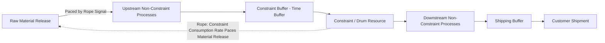

## Drum Buffer Rope Scheduling

### Definition and Purpose

**Drum-Buffer-Rope (DBR)** is the operational production scheduling methodology derived from the Theory of Constraints, designed to translate TOC's five focusing steps into a concrete, day-to-day scheduling system. DBR schedules an entire production system around its single binding constraint (bottleneck), rather than attempting to optimize the schedule of every individual workstation independently — a direct rejection of traditional scheduling approaches (such as Materials Requirements Planning systems run with uniform local efficiency targets at every resource) that TOC argues create excess work-in-process inventory without improving overall system throughput.

The name derives from three interconnected mechanisms: the **Drum** sets the system's pace, the **Buffer** protects that pace from disruption, and the **Rope** synchronizes material release to match the pace.

### The Drum: Setting the System's Pace

The **Drum** is the detailed production schedule for the constraint resource itself. Because the constraint determines the maximum possible throughput of the entire system, the constraint's schedule effectively "beats the drum" that the rest of the plant must follow — every other resource's schedule is derived from, and subordinated to, the drum schedule, rather than each resource being scheduled independently for its own local efficiency.

**Key characteristics of drum scheduling:**

- The constraint schedule is built first and is typically the only resource in the plant scheduled in fine, sequence-specific detail.
- Sequencing at the constraint aims to minimize setup/changeover time between different products, since every minute of constraint setup time is a minute of lost system throughput that can never be recovered.
- The drum schedule directly determines the plant's overall production rate and, by extension, its maximum achievable revenue for a given time period.

### The Buffer: Protecting the Constraint

A **Buffer** is a time-based (not merely quantity-based) protective mechanism placed strategically to ensure the constraint is never starved of work due to variability, breakdowns, or delays occurring upstream. DBR identifies several distinct buffer types:

**1. Constraint Buffer (Time Buffer)**

Positioned immediately before the constraint, sized in units of time (e.g., "8 hours of buffer"), ensuring that even if an upstream process is delayed or experiences a problem, work-in-process inventory has already arrived at the constraint with enough lead time to prevent the constraint from ever sitting idle.

**2. Shipping Buffer**

Positioned before the final shipping/delivery step, protecting on-time customer delivery from variability occurring in the steps downstream of the constraint (i.e., after the constraint but before shipment).

**3. Assembly Buffer**

Positioned where constraint-processed parts merge with non-constraint parts in an assembly operation, ensuring non-constraint parts are ready and waiting when constraint-processed parts arrive, so that valuable constraint output is never delayed waiting for cheaper, more abundant non-constraint components.

This directly illustrates TOC's departure from a pure zero-inventory JIT philosophy: DBR deliberately maintains inventory buffers at specific, strategically chosen points, while still applying JIT/lean-style waste elimination to all non-buffer inventory throughout the rest of the system.

### The Rope: Synchronizing Material Release

The **Rope** is the communication and material-release mechanism that paces the introduction of raw materials into the front of the production system to match the actual consumption rate of the constraint — not the theoretical maximum capacity of the first workstation, and not simply "as fast as materials are available."

**Function of the rope:**

- Prevents upstream, non-constraint resources from overproducing and building excess work-in-process inventory that provides no protective value once the constraint buffer is already adequately sized.
- Directly implements TOC's third focusing step (subordinate everything else to the constraint) at the material-release level: non-constraint resources are deliberately held back from running at their own maximum local efficiency if doing so would create excess inventory beyond what the buffer requires.
- Is conceptually and mechanically similar to a Kanban pull signal in JIT/lean systems, though DBR's rope is calculated based on the constraint's actual consumption schedule specifically, rather than being a generic downstream demand pull signal from any workstation.

### Drum-Buffer-Rope System Diagram

### Buffer Placement Illustration (svg_diagram)

<svg xmlns="http://www.w3.org/2000/svg" viewBox="0 0 720 300">
<text x="360" y="30" text-anchor="middle" font-size="17" font-weight="bold" fill="#1a1a1a">DBR Buffer Placement Along the Production Flow (svg_diagram)</text>
<line x1="60" y1="150" x2="660" y2="150" stroke="#999" stroke-width="2" />
<rect x="60" y="120" width="100" height="60" rx="6" fill="#eaf2fb" stroke="#2166ac" stroke-width="2" />
<text x="110" y="155" text-anchor="middle" font-size="11" fill="#2166ac">Raw Material Release</text>
<rect x="200" y="120" width="100" height="60" rx="6" fill="#eafbea" stroke="#2e7d32" stroke-width="2" />
<text x="250" y="155" text-anchor="middle" font-size="11" fill="#2e7d32">Upstream Process</text>
<rect x="340" y="120" width="90" height="60" rx="6" fill="#fdf3e3" stroke="#b08800" stroke-width="2" />
<text x="385" y="150" text-anchor="middle" font-size="11" fill="#b08800">Constraint</text>
<text x="385" y="164" text-anchor="middle" font-size="11" fill="#b08800">Buffer</text>
<rect x="470" y="120" width="90" height="60" rx="6" fill="#fbeaea" stroke="#b2182b" stroke-width="2" />
<text x="515" y="155" text-anchor="middle" font-size="11" fill="#b2182b">Constraint (Drum)</text>
<rect x="600" y="120" width="90" height="60" rx="6" fill="#e6e6f7" stroke="#5e35b1" stroke-width="2" />
<text x="645" y="150" text-anchor="middle" font-size="11" fill="#5e35b1">Shipping</text>
<text x="645" y="164" text-anchor="middle" font-size="11" fill="#5e35b1">Buffer</text>

<text x="360" y="230" text-anchor="middle" font-size="11" fill="#555">Buffers are placed only where protection of the constraint or delivery date is needed —</text>

<text x="360" y="248" text-anchor="middle" font-size="11" fill="#555">not uniformly throughout the process, unlike traditional safety stock practices</text>

</svg>

### Buffer Management and the "Buffer Zones" Monitoring Technique

A key operational discipline within DBR is **buffer management** — actively monitoring the status of material within each buffer, typically divided into three color-coded zones:

| Zone | Meaning | Management Action |
| --- | --- | --- |
| Green | Buffer is well-stocked; ample protection remains | No action needed; system operating normally |
| Yellow | Buffer is moderately depleted; approaching risk of constraint starvation | Monitor closely; investigate potential causes |
| Red | Buffer is critically depleted; constraint starvation risk is imminent | Immediate expediting action required to protect constraint throughput |

Buffer management serves a dual purpose in TOC practice: it provides real-time operational visibility to prevent constraint starvation, and it provides a **diagnostic tool for continuous improvement**, since a pattern of frequent "red zone" penetrations traceable to a specific upstream cause identifies a priority area for process improvement — directing Kaizen-style continuous improvement effort specifically toward the sources of disruption that most threaten constraint throughput, rather than spreading improvement effort evenly across the system.

### Buffer Sizing Considerations

Buffer size (measured in time, not simply quantity of parts) must balance two competing risks:

- **Buffer too small:** insufficient protection against upstream variability, resulting in frequent constraint starvation and lost throughput — the outcome DBR is specifically designed to prevent.
- **Buffer too large:** excess work-in-process inventory accumulates ahead of the constraint, increasing carrying cost, lead time, and working capital tied up in inventory without providing proportional additional protective benefit beyond what is actually needed to cover realistic upstream variability.

Buffer sizing is typically established initially based on historical variability data or managerial judgment, then adjusted dynamically over time based on observed buffer zone penetration patterns (a process sometimes called "buffer sizing through buffer management," reflecting DBR's inherently iterative, feedback-driven approach to schedule refinement). [Inference: specific quantitative buffer-sizing formulas vary across TOC implementations and practitioner methodologies, and no single universally standardized sizing formula is used across all applications.]

### Simplified Drum-Buffer-Rope (S-DBR)

A later refinement, **Simplified Drum-Buffer-Rope**, was developed to address a common practical issue: in many production environments, the market/demand itself — rather than any single internal physical resource — is the binding constraint most of the time. S-DBR simplifies the classical DBR approach by:

- Treating the **shipping date** (rather than a specific internal constraint resource) as the primary drum in environments where market demand is the binding constraint.
- Using a single, simplified buffer (typically just the shipping buffer) rather than multiple buffer types throughout the process.
- Reducing the scheduling complexity and data requirements relative to classical DBR, making implementation more practical in environments with frequently shifting internal constraints or highly variable product mix.

This distinction matters because it acknowledges that a firm's constraint is not always a fixed physical bottleneck machine — it can be, and often is, external market demand itself, which the classical five focusing steps framework equally accommodates but which requires a different scheduling emphasis than a purely internal physical constraint.

### DBR vs Traditional Scheduling Approaches

| Attribute | Traditional (e.g., MRP with local efficiency targets) | Drum-Buffer-Rope |
| --- | --- | --- |
| Scheduling detail | Detailed schedules attempted at every resource | Detailed schedule primarily at the constraint only |
| Buffer philosophy | Often uniform safety stock throughout the process | Strategic buffers only at constraint, assembly, and shipping points |
| Material release timing | Often released as early/soon as possible | Paced to match constraint consumption rate (rope) |
| Local efficiency emphasis | High — every resource targeted for maximum utilization | Deliberately subordinated for non-constraint resources |
| Primary complexity driver | Coordinating detailed schedules across all resources | Correctly identifying the constraint and sizing buffers |

### Practical Considerations

- DBR implementation begins with correctly identifying the true system constraint (per TOC's first focusing step) — a scheduling system built around an incorrectly identified constraint will misallocate buffer protection and subordination priorities, potentially reducing rather than improving system throughput.
- DBR is most naturally applied in environments with a relatively stable, identifiable physical or resource constraint; S-DBR's demand-based drum is more appropriate in environments where the constraint is external market demand or shifts frequently across internal resources depending on product mix.
- Buffer management's diagnostic function (using buffer zone penetration patterns to prioritize continuous improvement effort) connects DBR directly back to TOC's fifth focusing step, reinforcing that DBR is not a static, one-time scheduling setup but an ongoing operational discipline requiring regular review and adjustment as underlying conditions and constraints evolve.

**Related Topics**

- Theory of Constraints in Depth
- Just in Time Inventory Systems
- Lean Production Principles
- Economic Order Quantity
- Throughput Accounting and Product Mix Decisions
- Kanban and Pull-Based Production Systems
- Materials Requirements Planning (MRP) Systems
- Continuous Improvement and Buffer Management Diagnostics