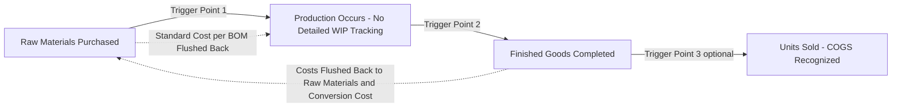

## Backflush Costing

### Definition and Purpose

**Backflush costing** (also called backflush accounting or post-deduct costing) is a simplified product costing method in which costs are not tracked sequentially through each individual production stage in real time, as in traditional job-order or process costing systems. Instead, costs are recorded only at one or a few trigger points — typically at completion of production or at the point of sale — and are then "flushed back" retroactively through the accounting records to raw materials, work-in-process, and finished goods accounts, using standard costs and bills of materials rather than tracking actual transactions at every intermediate stage.

Backflush costing is closely associated with **Just-in-Time (JIT) production environments**, where the compressed production cycle time and minimal work-in-process inventory levels make detailed stage-by-stage cost tracking both operationally difficult to justify and largely unnecessary for accurate costing, since goods move through the plant so quickly that there is little material buildup at each stage to individually track.

### Why Traditional Costing Becomes Impractical in JIT Environments

Traditional job-order and process costing systems require recording material requisitions, labor time tickets, and overhead application at each individual production stage or work order — a detailed transaction-recording burden that assumes production moves through discrete, trackable batches with meaningful dwell time at each stage.

In a JIT environment, production cycle times can be extremely short (sometimes hours or even minutes from raw material to finished good), and work-in-process inventory is deliberately minimized. Under these conditions:

- The administrative cost of detailed transaction tracking at every stage can exceed the informational benefit it provides, since there is minimal inventory value sitting at any intermediate stage to differentiate at a given point in time.
- Detailed variance reporting at each stage becomes less meaningful when production flows continuously rather than in discrete, trackable batches with significant time gaps between stages.

Backflush costing directly addresses this by eliminating most of the detailed intermediate transaction recording, relying instead on the bill of materials and standard costs, combined with periodic reconciliation against actual production output.

### Backflush Costing Trigger Points

Backflush costing systems are typically classified by the number and location of their "trigger points" — the points in the production process at which cost entries are actually recorded:

**1. Two Trigger Points (Purchase and Sale/Completion)**

Costs are recorded when materials are purchased and again only when finished goods are completed or sold — no separate work-in-process account is maintained at all, since WIP levels are assumed to be negligible at any given point in time in a well-functioning JIT system.

**2. Two Trigger Points (Purchase and Finished Goods Completion)**

Similar to the above, but the second trigger point is completion of production (finished goods) rather than sale, with a separate transfer to cost of goods sold recorded upon actual sale.

**3. Three Trigger Points (Purchase, Completion, and Sale)**

Retains slightly more granularity, recording separate entries at raw material purchase, finished goods completion, and sale/cost of goods sold recognition — closer to traditional costing but still eliminating detailed work-in-process tracking.

The number of trigger points chosen reflects a tradeoff between simplicity (fewer trigger points, less transaction recording) and the degree of financial reporting granularity and control retained (more trigger points, closer approximation to traditional costing detail).

### Backflush Costing Trigger Points Diagram

### Worked Example: Two-Trigger-Point Backflush System

A firm uses a two-trigger-point backflush system (purchase and completion of finished goods). Standard costs per unit: raw materials $40, conversion cost (labor + overhead) $25, for a total standard cost of $65 per unit.

**Step 1 — Raw materials purchased (Trigger Point 1):**

| Account | Debit | Credit |
| --- | --- | --- |
| Raw Materials Inventory | $40,000 (1,000 units × $40) |  |
| Accounts Payable |  | $40,000 |

**Step 2 — Production occurs during the period (no entries recorded at intermediate stages).**

**Step 3 — 950 units completed as finished goods (Trigger Point 2):**

The system "flushes back" standard costs from raw materials inventory and applies standard conversion costs directly to finished goods, based on the standard bill of materials and standard conversion cost per unit — without having tracked actual work-in-process transactions along the way.

| Account | Debit | Credit |
| --- | --- | --- |
| Finished Goods Inventory | $61,750 (950 × $65) |  |
| Raw Materials Inventory |  | $38,000 (950 × $40) |
| Conversion Cost Applied |  | $23,750 (950 × $25) |

**Step 4 — Actual conversion costs incurred during the period are recorded separately (e.g., actual payroll, actual overhead), and any difference between actual and standard applied conversion cost is recognized as a variance, typically written off to Cost of Goods Sold at period end** rather than being traced through detailed intermediate work-in-process entries.

### Comparison to Traditional Costing Systems

| Attribute | Traditional Job-Order/Process Costing | Backflush Costing |
| --- | --- | --- |
| Work-in-process tracking | Detailed, transaction-by-transaction | Minimal or eliminated |
| Cost basis | Actual or normal costing (actual materials/labor traced) | Standard costs applied via bill of materials |
| Number of accounting entries | High (recorded at each stage) | Low (recorded only at defined trigger points) |
| Suited to | Long production cycles, significant WIP, custom/batch production | Short production cycles, minimal WIP, repetitive JIT production |
| Variance recognition timing | Often recognized at each stage | Typically recognized in aggregate at period end |
| Real-time WIP valuation | Available at any point | Not directly available; assumed negligible |

### Advantages of Backflush Costing

- **Significantly reduced accounting transaction volume**, lowering the administrative cost of the cost accounting system, which is particularly valuable in high-volume, repetitive JIT manufacturing environments.
- **Alignment with JIT philosophy**, since detailed work-in-process tracking is itself a form of non-value-adding administrative overhead from a lean perspective — backflush costing extends waste-elimination thinking into the accounting function itself.
- **Simplified financial close process**, since fewer detailed intermediate entries need to be reconciled at period end.
- **Reduced need for physical inventory tracking systems** at intermediate production stages, since the assumption of minimal WIP reduces the informational value of tracking it in detail even if it were practical to do so.

### Limitations and Requirements

- **Requires accurate, well-maintained standard costs and bills of materials.** Because backflush costing relies on standard costs applied via the BOM rather than tracing actual costs through each stage, the accuracy of the resulting inventory valuations and cost of goods sold depends heavily on how current and accurate the underlying standard cost data is.
- **Reduced audit trail and control granularity.** With fewer discrete transaction records, it can be more difficult to trace and investigate specific cost discrepancies back to their originating production stage, which may present internal control and audit challenges relative to traditional systems with more detailed transaction trails.
- **Not well-suited to environments with significant, variable work-in-process levels.** If actual production cycle times are long or WIP levels are substantial and variable (i.e., the underlying JIT assumption does not hold), backflush costing's simplification can produce materially inaccurate period-end inventory valuations, since it does not capture the actual WIP present at a given reporting date.
- **Departure from GAAP inventory costing detail in some implementations.** Depending on the specific trigger-point configuration and materiality of any resulting inventory misstatement, firms must ensure their backflush costing approach still produces inventory valuations that are materially accurate for external financial reporting purposes. [Inference: the specific GAAP compliance considerations depend on materiality and the specific configuration used, and are not addressed in general terms here as a substitute for professional accounting judgment.]

### Relationship to JIT, Lean, and Theory of Constraints

Backflush costing is best understood as the **accounting system adaptation** that naturally follows from operational adoption of JIT and lean production principles — just as JIT eliminates unnecessary physical inventory buffers and lean eliminates non-value-adding process steps, backflush costing eliminates non-value-adding detailed transaction recording that provided diminishing informational value once WIP levels became minimal and production cycles became short. It is generally not directly associated with Theory of Constraints implementations specifically, since TOC's Drum-Buffer-Rope scheduling deliberately maintains certain strategic buffer inventories (which would still require some tracking), though a firm could in principle combine TOC operational scheduling with a backflush-style costing system for its non-buffer inventory.

### Practical Considerations

- Backflush costing is most commonly implemented using standard costing as its cost basis, since standard costs (predetermined per the bill of materials) are necessary to flush costs back through the system without having tracked actual costs at intermediate stages.
- Firms transitioning from traditional to JIT-style production often adopt backflush costing gradually, sometimes retaining an intermediate trigger point (e.g., three trigger points rather than two) during the transition period until confidence in the JIT system's consistency and minimal WIP levels is well established.
- Period-end variance analysis remains important under backflush costing even though it is performed in aggregate rather than at each stage — significant unfavorable variances between standard and actual costs still signal underlying process or pricing issues requiring management attention, consistent with the broader variance analysis principles used in standard costing systems generally.

**Related Topics**

- Just in Time Inventory Systems
- Lean Production Principles
- Standard Costing and Variance Analysis
- Theory of Constraints in Depth
- Job-Order Costing and Process Costing Systems
- Bill of Materials and Standard Cost Card Design
- Activity-Based Costing (ABC)
- Cost of Goods Sold Recognition Timing