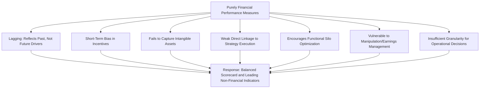

## Limitations of Purely Financial Performance Measures

### Overview

Traditional management control and performance evaluation systems have historically relied heavily on **financial performance measures** — return on investment (ROI), residual income, earnings per share, net income, and variance-based standard costing metrics. While these measures remain essential, an exclusive or overweighted reliance on purely financial indicators exhibits well-documented limitations that have driven the development of broader strategic performance measurement frameworks, most notably the **Balanced Scorecard**.

### Core Limitations of Purely Financial Measures

**1. Lagging Indicators — Backward-Looking, Not Forward-Looking**

Financial measures report the *consequences* of past decisions and operational actions; they do not directly indicate the drivers of future performance. By the time a decline in profitability appears in financial statements, the underlying operational problems (declining quality, customer dissatisfaction, employee turnover) may have been building for months or years — financial measures are a "rearview mirror," not a windshield.

**2. Short-Term Bias**

Financial metrics, particularly when tied to quarterly or annual performance evaluation and compensation, can incentivize managers to prioritize short-term financial results at the expense of long-term value creation — for example, delaying necessary maintenance, cutting R&D or training budgets, or reducing marketing spend to improve short-term reported earnings, even when these actions damage long-term competitive position.

**3. Failure to Capture Intangible Assets**

Traditional financial statements, prepared under historical cost accounting conventions, generally do not directly capture the value of key intangible assets central to many modern firms' competitive advantage: brand equity, customer relationships, employee knowledge and skill, organizational culture, proprietary processes, and innovation capability. As intangible assets have become a larger share of overall firm value in many industries, financial statements' inability to directly measure them has become a more significant limitation.

**4. Lack of Direct Linkage to Strategy**

Aggregate financial measures (e.g., overall ROI or net income) do not by themselves indicate *whether or how well* a specific strategic initiative is being executed — a firm can hit its financial targets in a given period through means unrelated to, or even contrary to, its stated strategic priorities, without the financial measures themselves revealing this disconnect.

**5. Encourages Silo-Based, Functionally Narrow Optimization**

Financial performance measures are often reported and evaluated by functional area or business unit, which can incentivize local optimization (e.g., a purchasing department minimizing material cost variances) that inadvertently harms other parts of the organization or overall customer value (e.g., purchasing lower-quality materials that increase downstream defect rates and warranty costs) — a dynamic closely related to the Theory of Constraints's critique of local efficiency optimization undermining system-wide performance.

**6. Can Be Manipulated or "Gamed"**

Because financial results are often directly tied to compensation and career advancement, purely financial performance systems can create incentives for earnings management, aggressive revenue recognition, deferred expense recognition, or other accounting-driven behaviors that improve reported financial metrics without corresponding genuine improvement in underlying business performance or long-term value creation.

**7. Insufficient Granularity for Operational Decision-Making**

Aggregate financial measures are often too high-level to guide day-to-day operational decisions by front-line employees and managers, who typically need more specific, timely, non-financial operational metrics (cycle time, defect rate, on-time delivery) to guide their actual work.

### Limitations Summary Diagram

### Illustrative Example: The Disconnect Between Financial Results and Underlying Health

A manufacturing division reports strong quarterly ROI, achieved partly by deferring equipment maintenance and reducing quality inspection staff to cut operating expenses. The financial statements for that quarter show improved profitability. However, non-financial indicators — if tracked — would show:

| Indicator | Trend |
| --- | --- |
| Equipment downtime | Increasing (deferred maintenance) |
| Defect rate | Increasing (reduced inspection) |
| Customer complaint volume | Increasing |
| Employee overtime to compensate for downtime | Increasing |

None of these deteriorating operational trends are visible in the quarter's financial statements, yet they represent building risk to the division's financial performance in future periods. This illustrates concretely why relying exclusively on financial measures can mask deteriorating operational health until it eventually and abruptly surfaces in financial results, at which point corrective action is far more costly than early intervention would have been.

### Financial vs Non-Financial Measures: Leading vs Lagging Illustration (svg_diagram)

<svg xmlns="http://www.w3.org/2000/svg" viewBox="0 0 720 320">
<text x="360" y="30" text-anchor="middle" font-size="17" font-weight="bold" fill="#1a1a1a">Leading Indicators Precede Lagging Financial Results (svg_diagram)</text>
<line x1="60" y1="270" x2="680" y2="270" stroke="#333" stroke-width="2" />
<text x="370" y="300" text-anchor="middle" font-size="12" fill="#333">Time</text>

<polyline points="60,150 180,130 300,180 420,220 540,250 660,260" fill="none" stroke="#2166ac" stroke-width="3" />
<text x="130" y="115" font-size="12" fill="#2166ac">Non-Financial Leading Indicators</text>
<text x="130" y="130" font-size="11" fill="#2166ac">(quality, customer satisfaction) decline first</text>

<polyline points="60,90 220,90 340,110 460,170 580,220 700,245" fill="none" stroke="#b2182b" stroke-width="3" stroke-dasharray="6,4" />
<text x="500" y="200" font-size="12" fill="#b2182b">Financial Results</text>
<text x="500" y="215" font-size="11" fill="#b2182b">(decline appears later)</text>
<line x1="300" y1="60" x2="460" y2="60" stroke="#555" stroke-width="1" marker-end="url(#arrowLag)" />
<text x="380" y="50" text-anchor="middle" font-size="11" fill="#555">Detection Lag</text>
</svg>

### Historical and Theoretical Response: Toward Balanced Performance Measurement

These well-documented limitations directly motivated the development of multidimensional strategic performance measurement frameworks that supplement financial measures with non-financial, leading indicators aligned to strategy — most prominently the **Balanced Scorecard** developed by Robert Kaplan and David Norton, which explicitly incorporates customer, internal process, and learning-and-growth perspectives alongside the traditional financial perspective. Other related responses include:

- **Non-financial operational metrics:** cycle time, defect rates, on-time delivery, customer retention, employee engagement — providing more timely, granular, and forward-looking signals of underlying business health.
- **Strategy maps:** explicit visual representations of the cause-and-effect linkages hypothesized between non-financial drivers (e.g., employee training) and eventual financial outcomes (e.g., profitability), making the strategic logic behind non-financial metrics explicit rather than assumed.
- **Value-based management approaches:** frameworks such as Economic Value Added (EVA) that attempt to refine purely accounting-based financial measures to better approximate genuine economic value creation, addressing some (but not all) of the limitations above.

### What Purely Financial Measures Still Do Well

Despite these limitations, financial measures retain important, irreplaceable strengths that explain why they remain a core (though not sole) component of virtually all performance measurement systems:

- **Common, standardized unit of measurement** (currency) enabling direct comparison and aggregation across highly diverse business units, products, and activities in ways non-financial metrics generally cannot achieve.
- **Direct linkage to shareholder value and external capital market communication**, since investors, lenders, and regulators fundamentally require standardized financial reporting.
- **Well-established, audited, and relatively objective measurement methodology**, in contrast to many non-financial metrics, which can suffer from inconsistent definition, measurement subjectivity, or lack of external verification/audit.
- **Ultimate accountability measure.** Regardless of how strong non-financial indicators appear, sustained financial performance is ultimately necessary for organizational survival — non-financial measures are valuable as leading indicators and operational drivers, not as replacements for the financial "bottom line."

### Summary Comparison: Financial vs Non-Financial Performance Measures

| Attribute | Financial Measures | Non-Financial Measures |
| --- | --- | --- |
| Timing orientation | Lagging | Often leading |
| Measurement standardization | High (common currency unit) | Variable, context-dependent |
| Capture of intangible value drivers | Weak | Stronger (directly targets drivers) |
| External comparability | High (audited, standardized) | Lower (definitions vary by firm) |
| Susceptibility to short-term gaming | Higher | Varies by metric design |
| Direct strategic linkage | Indirect (aggregate outcome) | Can be directly strategy-specific |

### Practical Considerations

- The appropriate response to these limitations, as reflected in the strategic performance measurement literature, is generally understood as **supplementing**, not replacing, financial measures with a balanced set of non-financial and leading indicators explicitly linked to strategy, rather than abandoning financial measurement altogether.
- Effective non-financial metric selection requires establishing a credible hypothesized cause-and-effect linkage to eventual financial outcomes (as formalized in strategy maps); non-financial metrics selected without this strategic linkage risk becoming disconnected "vanity metrics" that consume management attention without genuinely predicting or driving financial performance. [Inference: the "vanity metrics" risk is a commonly cited practitioner critique of poorly designed non-financial measurement systems, not a claim specific to any particular framework's documented failure rate.]
- The tension between short-term financial pressure (often driven by external capital markets and quarterly reporting cycles) and long-term strategic investment in intangible, non-financially-captured capabilities remains a persistent, only partially resolved challenge in performance measurement system design across most organizations.

**Related Topics**

- The Balanced Scorecard Framework
- Strategy Maps and Cause-and-Effect Linkages
- Economic Value Added (EVA) and Value-Based Management
- Residual Income and Return on Investment
- Theory of Constraints in Depth
- Non-Financial Performance Indicators and Leading Metrics
- Short-Termism and Managerial Incentive Design