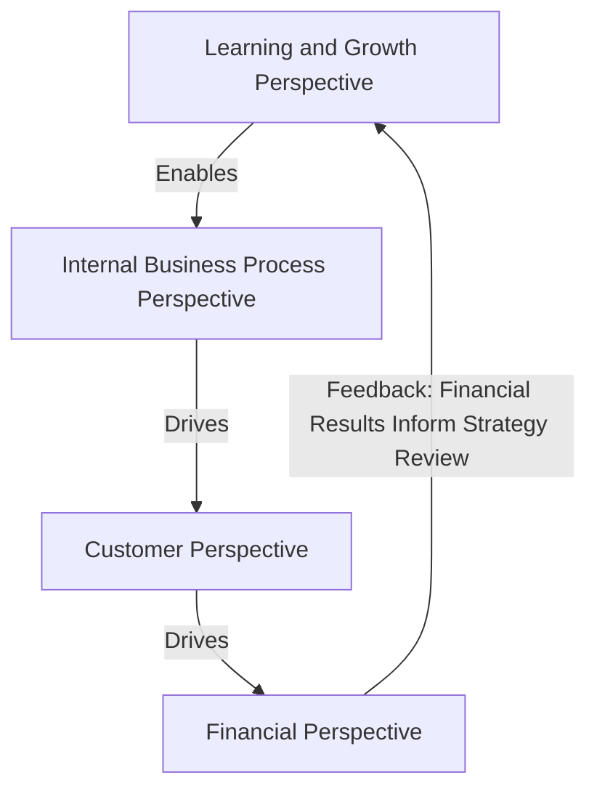
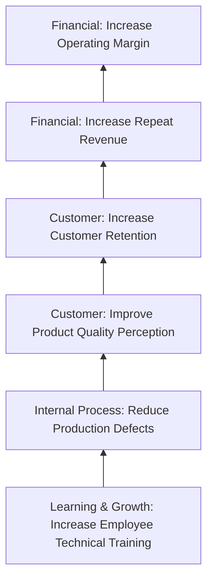

## Balanced Scorecard Framework and Its Four Perspectives

### Definition and Origin

The **Balanced Scorecard (BSC)** is a strategic performance measurement and management framework developed by Robert Kaplan and David Norton, first introduced in a 1992 *Harvard Business Review* article and subsequently expanded in their books. It was developed directly in response to the well-documented limitations of purely financial performance measures, translating an organization's strategy into a coherent set of performance measures spanning four interrelated perspectives, explicitly linked by hypothesized cause-and-effect relationships.

The framework's name reflects its core intent: **balancing** short-term financial outcomes against the longer-term, non-financial drivers of future financial performance.

### The Four Perspectives

**1. Financial Perspective**

Represents the ultimate outcomes that matter to shareholders and capital providers — revenue growth, profitability, return on investment, economic value added. This perspective asks: "To succeed financially, how should we appear to our shareholders?" It remains the top-level outcome in the standard BSC hierarchy, but is understood as the *result* of successful performance in the other three perspectives, not as the sole driver to be independently managed.

**2. Customer Perspective**

Represents the value proposition delivered to targeted customer segments — market share, customer satisfaction, customer retention, customer acquisition, and brand/product attributes that differentiate the firm competitively. This perspective asks: "To achieve our financial vision, how should we appear to our customers?"

**3. Internal Business Process Perspective**

Represents the internal operational processes the organization must excel at to deliver the customer value proposition — innovation processes (new product development), operations processes (production efficiency, quality, cycle time), and post-sale service processes. This perspective asks: "To satisfy our customers, at which internal processes must we excel?"

**4. Learning and Growth Perspective**

Represents the underlying organizational infrastructure — employee capabilities and skills, information systems and technology infrastructure, and organizational culture/climate — required to enable excellence in internal processes. This perspective asks: "To achieve our vision, how will we sustain our ability to change and improve?" It is generally positioned as the foundational perspective, since capabilities developed here are what ultimately enable improvement in internal processes, which in turn drives customer outcomes and financial results.

### The Four Perspectives Diagram

### Core Components of a Balanced Scorecard

For each of the four perspectives, a well-constructed BSC specifies four interconnected elements:

| Component | Description |
| --- | --- |
| Objectives | The specific strategic goal within that perspective (e.g., "improve on-time delivery") |
| Measures | The specific metric(s) used to track progress toward the objective (e.g., "percentage of orders delivered on time") |
| Targets | The specific quantitative performance level to be achieved by a given date (e.g., "98% on-time delivery by year-end") |
| Initiatives | The specific action programs or projects undertaken to achieve the target (e.g., "implement new warehouse routing software") |

### Balanced Scorecard Structure Illustration (svg_diagram)

<svg xmlns="http://www.w3.org/2000/svg" viewBox="0 0 720 420">
<text x="360" y="30" text-anchor="middle" font-size="17" font-weight="bold" fill="#1a1a1a">The Balanced Scorecard: Four Perspectives (svg_diagram)</text>
<rect x="260" y="60" width="200" height="80" rx="8" fill="#fbeaea" stroke="#b2182b" stroke-width="2" />
<text x="360" y="90" text-anchor="middle" font-size="14" font-weight="bold" fill="#b2182b">Financial</text>
<text x="360" y="108" text-anchor="middle" font-size="11" fill="#333">"To succeed financially,</text>
<text x="360" y="122" text-anchor="middle" font-size="11" fill="#333">how should we appear to shareholders?"</text>
<rect x="260" y="160" width="200" height="80" rx="8" fill="#eaf2fb" stroke="#2166ac" stroke-width="2" />
<text x="360" y="190" text-anchor="middle" font-size="14" font-weight="bold" fill="#2166ac">Customer</text>
<text x="360" y="208" text-anchor="middle" font-size="11" fill="#333">"To achieve our vision,</text>
<text x="360" y="222" text-anchor="middle" font-size="11" fill="#333">how should we appear to customers?"</text>
<rect x="260" y="260" width="200" height="80" rx="8" fill="#eafbea" stroke="#2e7d32" stroke-width="2" />
<text x="360" y="290" text-anchor="middle" font-size="14" font-weight="bold" fill="#2e7d32">Internal Business Process</text>
<text x="360" y="308" text-anchor="middle" font-size="11" fill="#333">"To satisfy customers, at which</text>
<text x="360" y="322" text-anchor="middle" font-size="11" fill="#333">processes must we excel?"</text>
<rect x="260" y="360" width="200" height="50" rx="8" fill="#fdf3e3" stroke="#b08800" stroke-width="2" />
<text x="360" y="382" text-anchor="middle" font-size="13" font-weight="bold" fill="#b08800">Learning and Growth</text>
<text x="360" y="398" text-anchor="middle" font-size="10" fill="#333">"How will we sustain our ability to change?"</text>
<line x1="360" y1="140" x2="360" y2="158" stroke="#333" stroke-width="2" marker-end="url(#arrDown)" />
<line x1="360" y1="240" x2="360" y2="258" stroke="#333" stroke-width="2" marker-end="url(#arrDown)" />
<line x1="360" y1="340" x2="360" y2="358" stroke="#333" stroke-width="2" marker-end="url(#arrDown)" />
</svg>

### Worked Example: BSC Objectives, Measures, Targets, and Initiatives by Perspective

| Perspective | Objective | Measure | Target | Initiative |
| --- | --- | --- | --- | --- |
| Financial | Increase profitability | Operating margin | 15% by year-end | Cost reduction program in supply chain |
| Customer | Improve customer loyalty | Customer retention rate | 90% annual retention | Launch loyalty rewards program |
| Internal Process | Reduce production defects | First-pass yield | 98% first-pass yield | Implement statistical process control |
| Learning and Growth | Build employee capability | Hours of technical training per employee | 40 hours/year | Establish internal technical certification program |

### Strategy Maps: Visualizing Cause-and-Effect Linkages

A **strategy map** is a companion tool to the Balanced Scorecard that explicitly visualizes the hypothesized cause-and-effect chain connecting objectives across all four perspectives — making the underlying strategic logic (why investing in employee training is expected to eventually improve financial results) explicit, testable, and communicable throughout the organization, rather than leaving the linkage between non-financial and financial objectives implicit or assumed.

### Distinguishing Leading and Lagging Indicators Within the BSC

The Balanced Scorecard explicitly incorporates both types of measures within its structure, addressing the "purely lagging" critique of traditional financial-only systems:

- **Lagging indicators:** typically found in the financial and, to some extent, customer perspectives — outcome measures that confirm whether a result was achieved (e.g., revenue growth, customer retention rate).
- **Leading indicators:** typically found in the internal process and learning-and-growth perspectives — driver measures that predict future performance in the outcome measures (e.g., training hours predicting future defect rates, which predict future customer satisfaction, which predicts future revenue).

A well-designed scorecard deliberately balances both types across all four perspectives, ensuring the organization has early warning signals (leading indicators) as well as ultimate accountability measures (lagging indicators).

### Cascading the Scorecard Through the Organization

In large organizations, the Balanced Scorecard is typically **cascaded** from the corporate level down through business units, departments, and eventually individual employee performance objectives, with each level's scorecard translating the level above's strategic objectives into more specific, locally actionable objectives and measures relevant to that unit's contribution to the overall strategy — ensuring strategic alignment throughout the organizational hierarchy rather than a single high-level scorecard disconnected from day-to-day operational decision-making.

### Common Implementation Pitfalls

- **Too many measures.** A scorecard with dozens of measures across all four perspectives loses focus and dilutes management attention; the BSC literature generally recommends a limited, carefully selected set of measures per perspective (commonly cited guidance suggests roughly 4-7 measures per perspective) directly tied to the organization's specific strategic priorities.
- **Weak or unvalidated cause-and-effect assumptions.** If the hypothesized linkages in the strategy map are not genuinely valid for the organization's specific business model, achieving strong performance on leading indicators (e.g., training hours) may not actually translate into the intended downstream financial results, undermining the scorecard's core premise.
- **Treating the scorecard as a static reporting exercise rather than a management system.** The BSC is intended to drive ongoing strategic dialogue, resource allocation, and strategy review — organizations that treat it merely as a periodic reporting template without connecting it to actual strategic decision-making and resource allocation processes generally realize limited benefit from the framework.
- **Disconnection from compensation and incentive systems.** Scorecard measures not meaningfully connected to managerial performance evaluation and compensation may receive insufficient organizational attention relative to measures that are directly tied to incentives. [Inference: this incentive-alignment critique reflects a commonly cited implementation success factor in the BSC practitioner literature, not a universal requirement for the framework to provide any value.]

### Balanced Scorecard vs Purely Financial Measurement Systems

| Attribute | Purely Financial System | Balanced Scorecard |
| --- | --- | --- |
| Number of perspectives | One (financial) | Four (financial, customer, process, learning & growth) |
| Leading vs lagging balance | Predominantly lagging | Explicit balance of both |
| Strategic linkage | Indirect/implicit | Explicit via strategy maps |
| Intangible asset visibility | Low | Higher (via process and learning & growth perspectives) |
| Risk of short-term gaming | Higher | Lower (multiple dimensions harder to simultaneously game) |
| Implementation complexity | Lower | Higher (requires strategy mapping, cascading, measure selection) |

### Practical Considerations

- Successful BSC implementation generally requires genuine senior leadership engagement in defining the strategic objectives and cause-and-effect logic underlying the scorecard, rather than delegating scorecard design purely to finance or accounting staff disconnected from strategic decision-making.
- The specific measures selected within each perspective should be tailored to the organization's specific strategy and industry context; the BSC is a *framework* for organizing strategic measurement, not a prescriptive list of universal metrics applicable to every organization.
- Organizations sometimes adapt the standard four-perspective structure (e.g., adding a separate "sustainability" or "employee" perspective, or renaming perspectives for nonprofit/public sector contexts where "financial" is not the ultimate top-level outcome) while retaining the core underlying logic of linking leading non-financial drivers to lagging outcome measures through explicit cause-and-effect reasoning.

**Related Topics**

- Limitations of Purely Financial Performance Measures
- Strategy Maps and Cause-and-Effect Linkages
- Economic Value Added (EVA) and Value-Based Management
- Residual Income and Return on Investment
- Key Performance Indicators (KPIs) and Metric Design
- Theory of Constraints in Depth
- Cascading Performance Objectives Through Organizational Hierarchy