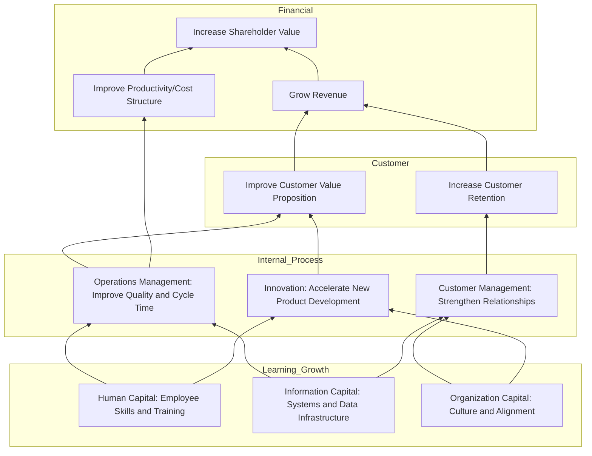
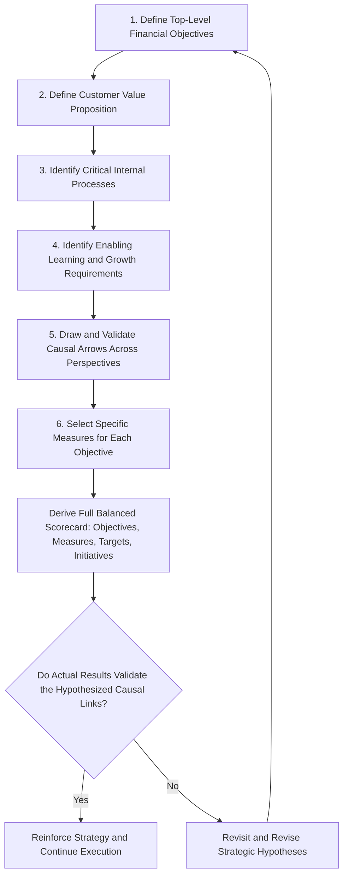

## Building Strategy Maps

### Definition and Purpose

A **strategy map** is a one-page visual diagram that depicts the hypothesized cause-and-effect chain of strategic objectives across the four Balanced Scorecard perspectives, explicitly showing how investments and improvements in the learning-and-growth and internal-process perspectives are expected to drive improved customer outcomes, which in turn are expected to drive improved financial results. It converts an organization's strategy — often expressed only in narrative or abstract form — into a precise, testable set of causal linkages that can be measured, communicated, and managed.

Strategy maps were developed by Kaplan and Norton as a direct companion and extension to the Balanced Scorecard, addressing a common early criticism of the scorecard: that organizations could select measures across the four perspectives without a rigorous, explicit logic connecting them to one another.

### Why Strategy Maps Matter

- **Makes strategic assumptions explicit and falsifiable.** Rather than assuming "training improves performance" as an unstated background belief, a strategy map forces the organization to specify precisely *which* training objective is expected to drive *which* specific downstream process improvement, customer outcome, and financial result — a chain of assumptions that can subsequently be tested against actual data.
- **Communicates strategy in an accessible, visual format** that can be understood and internalized by employees throughout the organization, not just senior executives or finance specialists.
- **Provides the logical foundation for scorecard measure selection**, since the strategy map is typically built first, with the Balanced Scorecard's specific objectives, measures, targets, and initiatives subsequently derived from the causal chain the map establishes.
- **Enables identification of measurement gaps** — perspectives or linkages in the causal chain for which the organization currently has no corresponding measure, revealing where new metrics need to be developed.

### The General Structure of a Strategy Map

Strategy maps are conventionally drawn with the four Balanced Scorecard perspectives stacked vertically, financial at the top and learning-and-growth at the bottom, with arrows connecting specific objectives across perspectives to show the hypothesized causal flow moving upward from foundational capabilities to ultimate financial outcomes.

**Within the Internal Business Process perspective**, strategy maps commonly organize objectives into distinct process clusters:

- **Operations Management Processes:** producing and delivering products/services efficiently (e.g., reducing cycle time, improving quality).
- **Customer Management Processes:** selecting, acquiring, retaining, and growing relationships with target customers.
- **Innovation Processes:** identifying new market opportunities and designing/developing new products and services.
- **Regulatory and Social Processes:** managing relationships with external stakeholders such as regulators and communities, including environmental, safety, employment, and community-related performance.

### Strategy Map Structure Diagram

### Step-by-Step Process for Building a Strategy Map

**1. Clarify the Financial Perspective's Top-Level Objectives**

Begin at the top: what specific financial outcomes define strategic success — revenue growth, productivity/cost improvement, or asset utilization improvement? Kaplan and Norton generally frame the financial perspective around two broad strategic themes: a **revenue growth strategy** (expanding sources of revenue) and a **productivity strategy** (improving cost structure and asset utilization) — both of which must be pursued in some balance to achieve sustained long-term financial performance.

**2. Define the Customer Value Proposition**

Identify the specific target customer segments and the value proposition the organization intends to deliver to them — commonly framed using generic strategic archetypes such as **operational excellence** (best total cost), **customer intimacy** (best total solution/relationship), or **product leadership** (best product) — since the choice of value proposition determines which internal process objectives will actually matter most.

**3. Identify the Critical Internal Processes**

Working backward from the customer value proposition, identify which specific internal processes (across operations, customer management, innovation, and regulatory/social clusters) must excel to deliver on that value proposition. A firm pursuing operational excellence will prioritize different internal process objectives (e.g., cost reduction, cycle time) than a firm pursuing product leadership (e.g., R&D speed, innovation processes).

**4. Identify the Enabling Learning and Growth Requirements**

For each critical internal process objective identified, determine the specific human capital (skills), information capital (systems/data), and organizational capital (culture, alignment, leadership) requirements necessary to excel at that process — these become the foundational, bottom-level objectives on the map.

**5. Draw and Validate the Causal Arrows**

Connect objectives across perspectives with arrows representing the hypothesized cause-and-effect relationship, working from bottom to top. Each arrow represents a testable strategic hypothesis, not merely an aesthetic connection — the map-building team should be able to articulate a specific, reasoned justification for each linkage drawn.

**6. Select Measures for Each Objective**

Once the causal structure is established, select one or a small number of specific, measurable indicators for each objective on the map — this step directly produces the "Measures" column of the corresponding Balanced Scorecard.

### Strategy Map Building Process Flow

### Worked Example: Strategy Map for a Customer-Intimacy-Focused Retailer

| Perspective | Objective | Rationale for Placement |
| --- | --- | --- |
| Financial | Increase revenue per customer | Top-level financial outcome for a relationship-focused strategy |
| Customer | Deepen customer relationships and loyalty | Central to a customer-intimacy value proposition |
| Internal Process (Customer Management) | Improve personalized service and recommendation accuracy | Directly enables the customer relationship objective |
| Internal Process (Innovation) | Develop new personalized product bundles | Supports differentiated, relationship-tailored offerings |
| Learning & Growth (Information Capital) | Build a unified customer data platform | Enables personalized service and accurate recommendations |
| Learning & Growth (Human Capital) | Train staff in consultative selling | Enables improved personalized service delivery |

The causal chain reads: investing in a unified customer data platform and consultative sales training (learning & growth) → enables improved personalized service and new personalized product development (internal process) → which deepens customer relationships and loyalty (customer) → which increases revenue per customer (financial). Each arrow in this chain represents a specific, testable strategic bet rather than an assumed, unexamined link.

### Common Pitfalls in Building Strategy Maps

- **Overly generic objectives** ("improve efficiency," "increase employee engagement") that are not specific enough to guide meaningful measure selection or initiative design — effective strategy map objectives should be specific enough that a reasonable person could identify what evidence would confirm or disconfirm progress toward them.
- **Too many objectives and linkages**, producing an overly complex map that fails to communicate a clear, memorable strategic narrative — effective strategy maps are generally kept to a limited number of objectives per perspective (commonly cited guidance suggests roughly 3-5 per perspective) to maintain clarity and focus.
- **Unvalidated or implausible causal linkages** drawn primarily to justify a desired measure rather than reflecting a genuinely reasoned strategic hypothesis, undermining the map's core value as a tool for strategic learning and hypothesis testing.
- **Building the map in isolation from actual strategic decision-making**, treating it as a one-time documentation exercise rather than a living tool that is revisited and revised as actual results confirm or disconfirm the hypothesized causal linkages over time.
- **Failing to distinguish the strategy map from an organizational chart or process flow diagram.** A strategy map represents causal, strategic logic between distinct *objectives*, not simply a depiction of organizational structure or sequential business process steps. [Inference: this distinction is a commonly emphasized point in the strategy map literature to prevent common implementation confusion, not a claim about the prevalence of this specific error across organizations.]

### Relationship to the Balanced Scorecard

| Attribute | Strategy Map | Balanced Scorecard |
| --- | --- | --- |
| Primary purpose | Visualize causal strategic logic | Operationalize strategy into measures, targets, initiatives |
| Typical sequence | Built first | Derived from the strategy map |
| Level of detail | Objectives and causal linkages only | Objectives + measures + targets + initiatives |
| Primary audience use | Strategic communication and alignment | Ongoing performance tracking and management |

### Practical Considerations

- Strategy maps are most valuable when built collaboratively by a cross-functional senior leadership team with genuine strategic decision-making authority, since the exercise itself often surfaces previously implicit or conflicting assumptions about how the organization's strategy is actually expected to create value.
- Because strategy maps encode testable hypotheses, organizations that take the framework seriously should periodically review actual performance data against the hypothesized causal chain, revising the map itself when evidence suggests a hypothesized linkage does not hold as originally assumed — treating the strategy map as a living strategic learning tool rather than a static, one-time deliverable.
- Different generic value propositions (operational excellence, customer intimacy, product leadership) generally imply meaningfully different strategy map structures even within the same industry, since the critical internal processes and learning-and-growth requirements differ substantially depending on which value proposition a given organization is actually pursuing.

**Related Topics**

- Balanced Scorecard Framework and Its Four Perspectives
- Limitations of Purely Financial Performance Measures
- Generic Competitive Strategies: Cost Leadership, Differentiation, Focus
- Key Performance Indicators (KPIs) and Metric Design
- Economic Value Added (EVA) and Value-Based Management
- Cascading Performance Objectives Through Organizational Hierarchy
- Customer Value Proposition and Segmentation Strategy