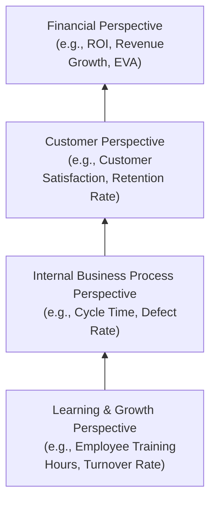

## Key Performance Indicators

### Overview

Key Performance Indicators (KPIs) are quantifiable metrics used to evaluate an organization's, department's, or process's success in achieving strategic and operational objectives. In managerial accounting, KPIs bridge the gap between high-level strategy and day-to-day performance measurement, providing managers with actionable, measurable signals of how well the organization is executing its strategy.

### Purpose and Role in Strategic Performance Measurement

- Translate broad strategic goals into specific, measurable, and monitorable metrics
- Enable managers to track progress toward objectives in near real-time, rather than waiting for periodic financial statements
- Support **management by exception**, directing attention to areas of significant deviation from targets
- Provide a common performance language across different levels and functions of an organization, facilitating alignment between operational activity and strategic intent
- Serve as inputs to performance evaluation and, often, incentive/compensation systems

**Key Points**

- A KPI is only useful if it is tied to a specific strategic objective; a metric tracked simply because it's easy to measure, without linkage to strategy, is not a true KPI in the strategic performance sense
- KPIs must be distinguished from generic operational metrics: not every number a company tracks is "key" — a KPI reflects a factor genuinely critical to achieving strategic success

### Financial vs. Non-Financial KPIs

**Financial KPIs**

- Derived from accounting and financial data
- Examples: Return on Investment (ROI), Residual Income (RI), Economic Value Added (EVA), gross margin percentage, revenue growth rate, cost per unit, operating cash flow

**Non-Financial KPIs**

- Capture operational, customer, and organizational-capability dimensions not directly reflected in financial statements
- Examples: customer satisfaction scores, on-time delivery rate, employee turnover rate, defect rate, cycle time, market share, employee engagement scores

**Key Points**

- Financial KPIs tend to be **lagging indicators** — they reflect the results of past decisions and actions
- Non-financial KPIs are frequently **leading indicators** — they can signal future financial performance before it materializes (e.g., declining customer satisfaction often precedes declining sales)
- A robust KPI framework deliberately balances both types, since relying exclusively on financial KPIs risks a short-term, backward-looking management focus

### Characteristics of Effective KPIs (the SMART Framework)

| Criterion | Description |
| --- | --- |
| **Specific** | Clearly defined, unambiguous, tied to a particular objective |
| **Measurable** | Quantifiable with reliable, consistent data |
| **Achievable** | Realistic given resources and constraints, while still meaningful |
| **Relevant** | Directly linked to strategic priorities |
| **Time-bound** | Associated with a specific reporting period or deadline |

Additional desirable characteristics commonly cited in managerial accounting:

- **Controllable** (at least partially) by the manager or team being evaluated, to support fair responsibility accounting
- **Timely**, available frequently enough to support decision-making before problems compound
- **Comparable**, allowing benchmarking across time periods, business units, or against external/industry standards

### Linking KPIs to Strategy: The Balanced Scorecard Perspective

KPIs are often organized using the **Balanced Scorecard** framework, which groups performance measures into four perspectives to ensure a comprehensive, strategy-aligned view:

1. **Financial Perspective** — "How do we look to shareholders?" (e.g., ROI, revenue growth, cost reduction)
2. **Customer Perspective** — "How do customers see us?" (e.g., customer satisfaction, retention rate, market share)
3. **Internal Business Process Perspective** — "What must we excel at?" (e.g., cycle time, defect rate, capacity utilization)
4. **Learning and Growth Perspective** — "Can we continue to improve and create value?" (e.g., employee training hours, employee turnover, innovation metrics such as percentage of revenue from new products)

**Key Points**

- The Balanced Scorecard's underlying logic is that improvements in the Learning and Growth perspective drive improvements in Internal Business Processes, which drive improvements in the Customer perspective, which ultimately drive Financial results — forming a **cause-and-effect chain**
- KPIs selected within each perspective should be traceable back to specific strategic objectives via this chain of causation, not selected arbitrarily

### Diagram: KPI Cause-and-Effect Chain (Balanced Scorecard Logic)

### Common Categories of KPIs by Functional Area

**Profitability and Financial KPIs**

- Gross margin percentage, operating margin, ROI, Residual Income, EVA, Return on Sales (ROS)

**Efficiency and Productivity KPIs**

- Asset turnover, inventory turnover, labor productivity (output per labor hour), capacity utilization rate

**Quality KPIs**

- Defect rate (parts per million), first-pass yield, warranty claims rate, rework rate (linking to spoilage/rework costing concepts)

**Customer-Related KPIs**

- Customer satisfaction score, Net Promoter Score (NPS), customer retention rate, customer acquisition cost, on-time delivery percentage

**Innovation and Growth KPIs**

- Percentage of revenue from products introduced in the last N years, R&D spending as a percentage of revenue, time-to-market for new products

**Employee/Human Capital KPIs**

- Employee turnover rate, employee engagement score, training hours per employee, safety incident rate

### Worked Example: Selecting and Calculating KPIs

A mid-sized manufacturer's strategic objective is "Improve customer responsiveness while maintaining profitability." Relevant KPIs might include:

**On-Time Delivery Rate**

$$\text{On-Time Delivery Rate} = \frac{\text{Number of On-Time Shipments}}{\text{Total Number of Shipments}} \times 100$$

If 940 out of 1,000 shipments were on time: $\frac{940}{1{,}000} \times 100 = 94\%$

**Order Cycle Time**

Average number of days from order receipt to shipment — a leading indicator; a rising trend signals future delivery/customer-satisfaction problems even before the on-time delivery rate itself declines.

**Return on Investment (linking back to the Financial perspective)**

$$ROI = \frac{\text{Operating Income}}{\text{Average Total Assets}}$$

If a division has operating income of $500,000 and average total assets of $2,500,000:

$$ROI = \frac{\$500{,}000}{\$2{,}500{,}000} = 20\%$$

**Interpretation**: Tracking on-time delivery rate and order cycle time (non-financial, more immediate signals of customer responsiveness) alongside ROI (financial, lagging profitability measure) gives management both an early warning system and a bottom-line profitability check — consistent with balanced, strategy-aligned KPI design.

### KPI Dashboards and Reporting

- KPIs are frequently consolidated into a **performance dashboard**, giving management a consolidated, at-a-glance view across multiple perspectives
- Dashboards commonly use visual cues (e.g., red/yellow/green status indicators) tied to target thresholds, supporting rapid identification of areas needing attention
- Effective dashboards limit the number of KPIs tracked at any given management level — too many KPIs dilute focus and can overwhelm decision-makers, undermining the purpose of highlighting what's truly "key" [Inference — a widely cited practical principle in performance management literature, not a specific benchmark count]

### Common Pitfalls

- **KPI proliferation**: tracking too many metrics dilutes focus and makes it difficult to identify which indicators are genuinely strategically significant
- **Gaming the metric**: when incentive compensation is tied too directly to a specific KPI, employees may optimize for the metric itself rather than the underlying strategic objective it was meant to represent (e.g., rushing shipments to hit on-time delivery targets at the expense of quality)
- **Overreliance on lagging (financial) indicators**: waiting for financial results to reveal problems means the opportunity for corrective action may have already passed
- **Poor linkage to strategy**: selecting KPIs because they are easy to measure or historically tracked, rather than because they meaningfully reflect current strategic priorities
- **Ignoring controllability**: holding a manager accountable for a KPI substantially influenced by factors outside their control undermines the fairness and motivational value of the performance measurement system

### Managerial Implications

- A well-designed KPI system operationalizes strategy, translating broad statements like "become the most customer-responsive competitor in our market" into specific, trackable, and actionable numbers
- KPIs support decentralized decision-making by giving managers at all levels clear, relevant signals about performance in their area of responsibility, consistent with responsibility accounting principles
- Because KPIs often feed into incentive compensation systems, their design has direct behavioral consequences — poorly chosen KPIs can inadvertently incentivize actions that harm long-term strategic goals even while hitting short-term targets

**Related Topics**

- Balanced Scorecard Framework and Strategy Maps
- Return on Investment (ROI), Residual Income, and Economic Value Added (EVA)
- Responsibility Accounting and Controllability Principle
- Benchmarking and Target-Setting for Performance Metrics
- Non-Financial Performance Measures and Leading vs. Lagging Indicators
- Incentive Compensation Design and Goal Congruence