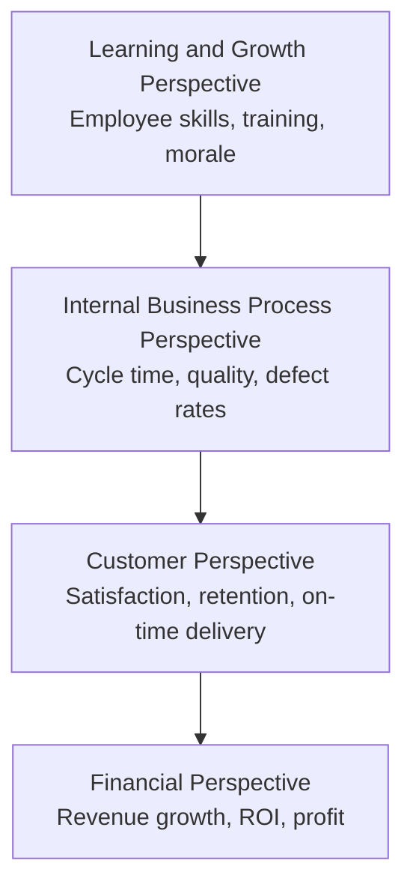

## Nonfinancial Performance Measures

### Definition and Purpose

Nonfinancial performance measures are metrics that evaluate organizational performance using non-monetary indicators — quantities, ratios, percentages, ratings, and counts rather than dollar figures. These measures capture operational, customer-related, and strategic dimensions of performance that financial measures such as net income or return on investment (ROI) cannot fully explain.

**Key Points**

- Financial measures are lagging indicators — they report the *outcome* of past decisions.
- Nonfinancial measures are often leading indicators — they signal *future* financial performance before it appears in the accounting records.
- Managers use nonfinancial measures to diagnose the operational drivers behind financial results (e.g., declining on-time delivery today predicts declining revenue next quarter).

### Why Financial Measures Alone Are Insufficient

| Limitation of Financial Measures | How Nonfinancial Measures Address It |
| --- | --- |
| Historical/backward-looking | Provide real-time or near-real-time operational signals |
| Easily manipulated short-term (e.g., cutting R&D to boost income) | Track sustainability of long-term value drivers (e.g., innovation pipeline) |
| Ignore intangible assets (brand, employee skill, customer loyalty) | Directly measure these intangible drivers |
| Aggregate too much — hide root causes | Granular and operational, pinpointing specific process failures |
| Not actionable at the shop-floor level | Directly tied to daily operational decisions of frontline employees |

### Common Categories of Nonfinancial Measures

#### 1. Customer-Related Measures

- Customer satisfaction scores (e.g., survey ratings, Net Promoter Score)
- Number of customer complaints
- Percentage of on-time deliveries
- Market share
- Customer retention rate
- Number of new customers acquired

#### 2. Internal Business Process Measures

- Cycle time (time to complete a process, e.g., order-to-delivery)
- Defect rate / parts per million (PPM) defective
- Yield rate (good units produced ÷ total units started)
- Setup time
- Manufacturing lead time
- Percentage of on-time production schedule adherence

#### 3. Learning and Growth (Innovation/Employee) Measures

- Employee satisfaction/engagement scores
- Employee turnover rate
- Hours of training per employee
- Number of employee suggestions implemented
- Percentage of revenue from new products (last 3–5 years)
- Number of new patents or products launched

#### 4. Quality Measures

- First-pass yield
- Number of units reworked or scrapped
- Warranty claims
- Number of customer returns

### Formulas for Common Nonfinancial Measures

**On-Time Delivery Percentage**

$$\text{On-Time Delivery \%} = \frac{\text{Number of On-Time Deliveries}}{\text{Total Deliveries}} \times 100$$

**Defect Rate**

$$\text{Defect Rate} = \frac{\text{Number of Defective Units}}{\text{Total Units Produced}} \times 100$$

**Yield Rate**

$$\text{Yield Rate} = \frac{\text{Good Units Produced}}{\text{Total Units Started}} \times 100$$

**Employee Turnover Rate**

$$\text{Turnover Rate} = \frac{\text{Number of Employees Who Left}}{\text{Average Number of Employees}} \times 100$$

**Manufacturing Cycle Efficiency (MCE)**

MCE links a nonfinancial time measure directly to the value-added content of a process:

$$\text{MCE} = \frac{\text{Value-Added Time}}{\text{Total Manufacturing Cycle Time}}$$

Where total cycle time = process time + inspection time + move time + wait/queue time. Only process time is generally value-added. An MCE close to 1.0 (100%) indicates minimal waste; low MCE (e.g., 0.1–0.5) signals large amounts of non-value-added time such as waiting or inspection.

**Example**

A furniture manufacturer records the following average times per batch:

- Process time: 2.0 days
- Inspection time: 0.5 days
- Move time: 0.3 days
- Wait time: 7.2 days

$$\text{Total Cycle Time} = 2.0 + 0.5 + 0.3 + 7.2 = 10.0 \text{ days}$$

$$\text{MCE} = \frac{2.0}{10.0} = 0.20 \text{ or } 20\%$$

Only 20% of the cycle time adds value from the customer's perspective; 80% is non-value-added (mostly waiting), highlighting a clear improvement target — reducing queue time — without needing any dollar figures.

### Integration with the Balanced Scorecard

Nonfinancial measures are formally embedded in strategic performance systems, most notably the **Balanced Scorecard**, which links four perspectives in a cause-and-effect chain:

The logic: better-trained, more engaged employees (Learning and Growth) → improve internal processes such as reduced defects and faster cycle times (Internal Process) → which increases customer satisfaction and retention (Customer) → which ultimately drives revenue and profit (Financial). Nonfinancial measures populate the first three perspectives, serving as leading indicators of the financial outcomes in the fourth.

### Leading vs. Lagging Indicator Relationship (svg_diagram)

<svg xmlns="http://www.w3.org/2000/svg" viewBox="0 0 720 260">
<text x="360" y="25" text-anchor="middle" font-size="16" font-weight="bold" fill="#1a1a1a">Leading vs. Lagging Indicators (svg_diagram)</text>
<rect x="20" y="70" width="200" height="90" rx="8" fill="#dbeafe" stroke="#2563eb" stroke-width="1.5" />
<text x="120" y="100" text-anchor="middle" font-size="13" font-weight="bold" fill="#1e3a8a">Nonfinancial</text>
<text x="120" y="118" text-anchor="middle" font-size="13" font-weight="bold" fill="#1e3a8a">Leading Indicators</text>
<text x="120" y="140" text-anchor="middle" font-size="11" fill="#1e3a8a">Employee training,</text>
<text x="120" y="155" text-anchor="middle" font-size="11" fill="#1e3a8a">defect rate, on-time %</text>
<line x1="220" y1="115" x2="290" y2="115" stroke="#374151" stroke-width="2" marker-end="url(#arrow)" />
<text x="255" y="105" text-anchor="middle" font-size="10" fill="#374151">predicts</text>
<rect x="290" y="70" width="200" height="90" rx="8" fill="#fef3c7" stroke="#d97706" stroke-width="1.5" />
<text x="390" y="100" text-anchor="middle" font-size="13" font-weight="bold" fill="#78350f">Operational</text>
<text x="390" y="118" text-anchor="middle" font-size="13" font-weight="bold" fill="#78350f">Outcomes</text>
<text x="390" y="140" text-anchor="middle" font-size="11" fill="#78350f">Customer satisfaction,</text>
<text x="390" y="155" text-anchor="middle" font-size="11" fill="#78350f">retention, quality</text>
<line x1="490" y1="115" x2="560" y2="115" stroke="#374151" stroke-width="2" marker-end="url(#arrow)" />
<text x="525" y="105" text-anchor="middle" font-size="10" fill="#374151">drives</text>
<rect x="560" y="70" width="150" height="90" rx="8" fill="#dcfce7" stroke="#16a34a" stroke-width="1.5" />
<text x="635" y="100" text-anchor="middle" font-size="13" font-weight="bold" fill="#14532d">Financial</text>
<text x="635" y="118" text-anchor="middle" font-size="13" font-weight="bold" fill="#14532d">Lagging Indicator</text>
<text x="635" y="140" text-anchor="middle" font-size="11" fill="#14532d">Revenue, ROI,</text>
<text x="635" y="155" text-anchor="middle" font-size="11" fill="#14532d">net income</text>

<text x="360" y="210" text-anchor="middle" font-size="12" fill="`#4b5563`">Nonfinancial measures appear weeks or months before the financial impact shows in the accounting records.</text>

</svg>

### Advantages of Nonfinancial Measures

- **Timeliness**: Available daily or weekly rather than at month/quarter close.
- **Actionability**: Directly tied to processes frontline employees and supervisors control.
- **Predictive power**: Reveal problems before they translate into lower profit.
- **Goal congruence**: Can be tailored to specific departments (e.g., machine downtime for production, response time for customer service), improving alignment between individual effort and strategic objectives.
- **Reduced manipulation risk**: Harder to "game" through accounting choices than earnings-based metrics, though not immune to manipulation (e.g., pressuring employees to inflate satisfaction survey responses).

### Limitations and Cautions

- **No common unit**: Cannot be aggregated the way dollar figures can, making cross-department comparison difficult.
- **Subjectivity**: Measures like satisfaction ratings can be influenced by survey design or respondent bias.
- **Measure proliferation**: Tracking too many nonfinancial metrics can dilute focus and create information overload — best practice limits scorecards to a vital few measures per perspective (commonly 4–7).
- **Weak or unproven linkage**: [Inference] The assumed causal link between a specific nonfinancial measure and future financial performance is not always statistically validated within a given organization and should be periodically tested rather than assumed.
- **Gaming risk**: Employees may optimize the specific metric measured (e.g., rushing to hit a cycle-time target) at the expense of unmeasured dimensions (e.g., quality), a phenomenon related to Goodhart's Law.

### Nonfinancial Measures vs. Financial Measures — Comparative Summary

| Dimension | Financial Measures | Nonfinancial Measures |
| --- | --- | --- |
| Timing | Lagging | Often leading |
| Unit | Monetary ($) | Physical units, %, ratios, counts |
| Frequency | Monthly/quarterly | Daily/weekly/real-time |
| Focus | Aggregate outcome | Specific operational driver |
| Comparability | High (common currency) | Low (measure-specific) |
| Risk of short-termism | Higher | Lower, if well-designed |

### Application in Responsibility Accounting

Nonfinancial measures are commonly assigned to responsibility centers to match the measure to the manager's sphere of control:

- **Cost centers**: Defect rate, scrap rate, cycle time
- **Revenue centers**: Customer count, market share, call response time
- **Profit centers**: Customer satisfaction combined with cost/revenue data
- **Investment centers**: Innovation rate (new product %) alongside ROI/RI, since investment-center managers are evaluated on both growth drivers and capital efficiency

**Next Steps**

- Balanced Scorecard (four perspectives in depth)
- Key Performance Indicators (KPIs) and KPI dashboards
- Benchmarking and best-practice comparisons
- Total Quality Management (TQM) and quality cost measures
- Theory of Constraints and throughput measures
- Employee empowerment and behavioral effects of performance measurement
- Goodhart's Law and measurement dysfunction in incentive systems