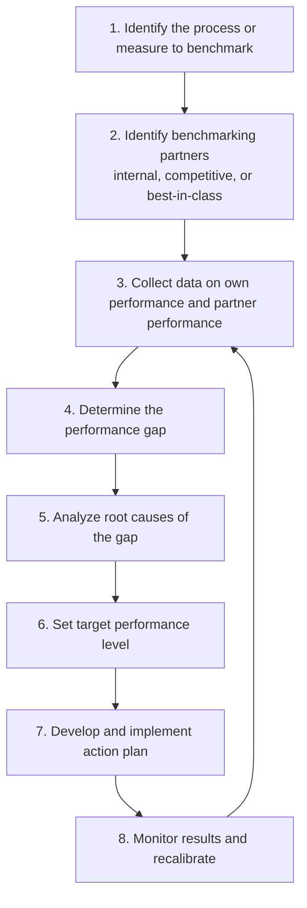

## Benchmarking Practices

### Definition and Purpose

Benchmarking is the continuous process of measuring an organization's products, services, and practices against those of the toughest competitors or firms recognized as industry leaders, in order to identify performance gaps and improvement opportunities. In managerial accounting, benchmarking provides an external reference point against which internal financial and nonfinancial performance measures can be evaluated, since internal historical comparisons alone may perpetuate mediocre performance if the entire industry is improving.

**Key Points**

- Benchmarking answers the question: "How good are we *relative to others*, not just relative to our own past?"
- It supports continuous improvement (kaizen) by setting externally validated, realistic improvement targets.
- It complements the Balanced Scorecard and standard costing by providing the external standard against which internal standards are periodically recalibrated.

### Types of Benchmarking

| Type | Description | Example |
| --- | --- | --- |
| **Internal Benchmarking** | Comparing performance across units, divisions, or plants within the same organization | Comparing defect rates between two manufacturing plants of the same company |
| **Competitive Benchmarking** | Comparing directly against a known competitor | Comparing cost per unit against the closest market rival |
| **Functional/Industry Benchmarking** | Comparing a specific function against industry-wide standards, not necessarily a direct competitor | Comparing accounts payable processing time against industry averages |
| **Generic/Process Benchmarking** | Comparing a process against best-in-class performers in *any* industry, since some processes (e.g., order fulfillment, customer service) are comparable across sectors | A hospital benchmarking its patient check-in process against a hotel's guest check-in process |

### The Benchmarking Process

#### Step Detail

1. **Identify the process/measure**: Select a critical success factor — e.g., order-to-delivery cycle time, cost per unit, customer complaint rate.
2. **Identify partners**: Select comparison organizations; may involve benchmarking consortia, industry associations, or public financial statements of competitors.
3. **Collect data**: Use surveys, site visits, published financial statements, industry reports, or third-party benchmarking databases.
4. **Determine the gap**: Quantify the difference between own performance and the benchmark.
5. **Analyze root causes**: Determine *why* the gap exists (process design, technology, employee skill, scale).
6. **Set targets**: Establish achievable, time-bound improvement goals.
7. **Implement**: Redesign processes, retrain staff, invest in technology.
8. **Monitor and recalibrate**: Benchmarking is iterative — targets should be reset as the benchmark itself improves over time.

### Quantifying the Benchmark Gap

**Performance Gap Formula**

$$\text{Performance Gap} = \text{Benchmark Performance} - \text{Current Performance}$$

**Example**

A company's current cost per unit is $45. The best-in-class competitor's cost per unit, obtained through a benchmarking study, is $38.

$$\text{Performance Gap} = \$45 - \$38 = \$7 \text{ per unit}$$

$$\text{Gap Percentage} = \frac{\$7}{\$45} \times 100 = 15.6\%$$

This 15.6% gap becomes the target for cost-reduction initiatives, and management can further decompose the $7 gap into its cost driver components (e.g., $3 in direct materials due to superior supplier contracts, $2.50 in labor efficiency, $1.50 in overhead absorption) to prioritize corrective action.

### Benchmarking and Standard Costing

Benchmarking data is frequently used as an input to setting or revising standard costs, rather than relying solely on internal historical averages:

| Standard-Setting Approach | Basis | Risk |
| --- | --- | --- |
| Historical internal average | Past internal performance | May embed existing inefficiencies |
| Engineering/time-motion studies | Theoretical ideal process | May be unrealistic; ignores fatigue/downtime |
| **Benchmarking-based standards** | Best-in-class external performance | Requires reliable, comparable external data |

Using benchmark data helps avoid the common pitfall of "practical standards" that are merely "attainable given our current process," instead pushing standards toward what is proven achievable by others.

### Sources of Benchmarking Data

- Industry trade associations and published industry ratio studies
- Benchmarking consortia (e.g., APQC — American Productivity & Quality Center)
- Competitor public financial statements (10-K filings for public competitors)
- Government statistical agencies
- Management consulting firm databases
- Customer and supplier feedback on comparative service levels

### Advantages of Benchmarking

- Provides objective, externally validated performance targets rather than internally negotiated (and potentially "sandbagged") budget targets.
- Encourages organizational learning by exposing employees to best practices outside their own function or industry.
- Identifies which capability gaps have the largest financial impact, aiding prioritization of improvement investment.
- Reduces the risk of complacency from comparing only against one's own historical trend.

### Limitations and Cautions

- **Data access**: Detailed competitor operational data (e.g., process cycle times) is often confidential and unavailable; publicly available data (financial statement ratios) may be too aggregated for process-level insight.
- **Comparability issues**: Differences in accounting policies, scale, geography, labor cost structures, or product mix can distort comparisons unless carefully adjusted.
- **Lagging nature**: [Inference] By the time benchmark data is published or gathered, the leading firm may have already advanced further, meaning benchmarking can perpetually target a moving and slightly outdated standard.
- **Imitation trap**: Copying a competitor's practice without understanding the underlying context or capability (culture, technology infrastructure) that made it work can fail to replicate the result.
- **Cost of the benchmarking exercise itself**: Site visits, consultant fees, and data-gathering effort must be weighed against the expected benefit — benchmarking should itself be subject to a cost-benefit test.

### Benchmarking Relative to Other Strategic Tools

| Tool | Primary Comparison Basis | Complementary Role |
| --- | --- | --- |
| Benchmarking | External peers/best-in-class | Sets external target |
| Balanced Scorecard | Internal strategic objectives across four perspectives | Tracks progress toward targets, some of which originate from benchmarking |
| Variance Analysis | Budget/standard vs. actual | Explains *why* internal performance deviates from internally set standards, which themselves may be benchmark-derived |
| Total Quality Management (TQM) | Zero-defect/continuous improvement philosophy | Provides the improvement methodology used once benchmarking gaps are identified |

### Illustrative Benchmarking Dashboard (svg_diagram)

<svg xmlns="http://www.w3.org/2000/svg" viewBox="0 0 700 280">
<text x="350" y="25" text-anchor="middle" font-size="16" font-weight="bold" fill="#1a1a1a">Company vs. Benchmark Comparison (svg_diagram)</text>
<line x1="80" y1="230" x2="650" y2="230" stroke="#374151" stroke-width="1.5" />
<line x1="80" y1="60" x2="80" y2="230" stroke="#374151" stroke-width="1.5" />

<text x="150" y="250" text-anchor="middle" font-size="11" fill="`#374151`">Cost/Unit</text>

<rect x="120" y="120" width="30" height="110" fill="`#93c5fd`" />

<rect x="160" y="150" width="30" height="80" fill="`#16a34a`" />

<text x="135" y="115" text-anchor="middle" font-size="10" fill="`#1e3a8a`">$45</text>

<text x="175" y="145" text-anchor="middle" font-size="10" fill="`#14532d`">$38</text>

<text x="320" y="250" text-anchor="middle" font-size="11" fill="`#374151`">Cycle Time (days)</text>

<rect x="290" y="90" width="30" height="140" fill="`#93c5fd`" />

<rect x="330" y="140" width="30" height="90" fill="`#16a34a`" />

<text x="305" y="85" text-anchor="middle" font-size="10" fill="`#1e3a8a`">7.0</text>

<text x="345" y="135" text-anchor="middle" font-size="10" fill="`#14532d`">4.5</text>

<text x="490" y="250" text-anchor="middle" font-size="11" fill="`#374151`">Defect Rate (%)</text>

<rect x="460" y="180" width="30" height="50" fill="`#93c5fd`" />

<rect x="500" y="205" width="30" height="25" fill="`#16a34a`" />

<text x="475" y="175" text-anchor="middle" font-size="10" fill="`#1e3a8a`">2.5%</text>

<text x="515" y="200" text-anchor="middle" font-size="10" fill="`#14532d`">1.2%</text>

<rect x="560" y="60" width="15" height="15" fill="#93c5fd" />
<text x="582" y="72" font-size="11" fill="#374151">Company</text>
<rect x="560" y="82" width="15" height="15" fill="#16a34a" />
<text x="582" y="94" font-size="11" fill="#374151">Benchmark</text>
</svg>

**Next Steps**

- Balanced Scorecard integration with benchmark-derived targets
- Total Quality Management (TQM) and continuous improvement (Kaizen costing)
- Standard costing and variance analysis
- Value-chain analysis and competitor cost structure analysis
- Activity-Based Management (ABM) for process-level benchmarking
- Just-in-Time (JIT) systems and best-in-class inventory benchmarks