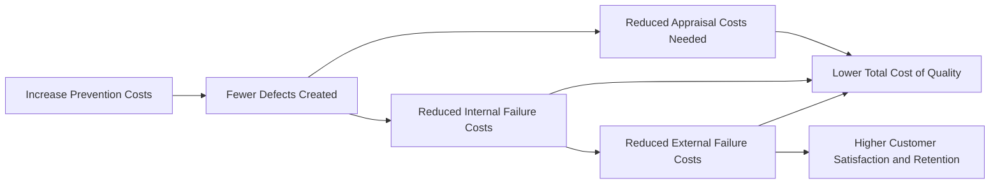

## Categories of Quality Costs (Prevention, Appraisal, Internal and External Failure)

### Definition and Purpose

Quality costs (also called costs of quality, COQ) are the costs incurred to prevent, detect, and correct poor-quality products or services, plus the costs that result from producing poor quality. The Cost of Quality model classifies these costs into four categories — Prevention, Appraisal, Internal Failure, and External Failure — commonly abbreviated as **PAF**. This classification allows management to see the full economic cost of quality (or the lack of it) and to make informed trade-off decisions about how much to invest in preventing defects versus the cost of tolerating them.

**Key Points**

- The PAF framework separates *conformance costs* (Prevention + Appraisal — costs of ensuring quality) from *nonconformance costs* (Internal Failure + External Failure — costs of failing to achieve quality).
- A core managerial insight: spending more on Prevention and Appraisal generally reduces Internal and External Failure costs by a larger amount, producing a net benefit — up to a point of diminishing returns.
- Quality cost reports are a nonfinancial-adjacent tool because they translate quality performance into dollar terms, making the cost of poor quality visible to management in a language executives act on.

### The Four Categories

#### 1. Prevention Costs

Costs incurred to *prevent* defects from occurring in the first place.

- Quality engineering and quality-by-design activities
- Employee training programs on quality methods
- Preventive maintenance on equipment
- Supplier evaluation and certification programs
- Quality circles and process improvement initiatives
- Design reviews

#### 2. Appraisal Costs

Costs incurred to *detect* defects before products reach the customer (inspection/testing, not prevention).

- Incoming raw material inspection
- In-process (work-in-process) inspection
- Finished goods testing and inspection
- Statistical process control (SPC) monitoring
- Testing equipment calibration and depreciation
- Field testing at customer site prior to formal acceptance

#### 3. Internal Failure Costs

Costs incurred when defects are detected **before** the product/service is delivered to the customer.

- Scrap
- Rework
- Re-inspection and re-testing of reworked units
- Downtime due to quality problems
- Disposal of defective materials
- Price concessions/downgrading of substandard products sold as seconds

#### 4. External Failure Costs

Costs incurred when defects are detected **after** delivery to the customer — generally the most costly category.

- Warranty claims and replacements
- Product recalls
- Customer complaint handling and returns processing
- Liability claims and litigation costs
- Lost sales due to reputational damage
- Loss of customer goodwill (often unquantified but strategically significant)

### Comparative Summary Table

| Category | Timing | Objective | Typical Examples |
| --- | --- | --- | --- |
| Prevention | Before production | Stop defects from occurring | Training, preventive maintenance, quality engineering |
| Appraisal | During/after production, before shipment | Detect defects | Inspection, testing, SPC |
| Internal Failure | After detection, before shipment | Correct defects found internally | Scrap, rework, downtime |
| External Failure | After shipment, at/after customer | Correct defects found by customer | Warranty, recalls, lost sales |

### The Cost of Quality Trade-off Relationship

The widely cited managerial principle — often summarized as the "1:10:100 rule" — holds that the cost of correcting a defect grows roughly tenfold at each stage it goes undetected: $1 to fix at the prevention stage, roughly $10 if caught internally, and roughly $100 (or more) if it reaches the external customer. [Inference] The specific 1:10:100 ratio is a widely used illustrative heuristic rather than a universally measured empirical constant, and actual multipliers vary substantially by industry and defect type.

### Quality Cost Report Format

A typical quality cost report expresses each category both in dollars and as a percentage of sales revenue, allowing trend comparison over time and benchmarking across periods or divisions.

**Example**

| Cost Category | Amount | % of Sales (Sales = $5,000,000) |
| --- | --- | --- |
| **Prevention Costs** |  |  |
| Quality training | $40,000 |  |
| Preventive maintenance | $35,000 |  |
| Supplier certification | $25,000 |  |
| Subtotal Prevention | $100,000 | 2.0% |
| **Appraisal Costs** |  |  |
| Incoming inspection | $30,000 |  |
| In-process testing | $50,000 |  |
| Subtotal Appraisal | $80,000 | 1.6% |
| **Internal Failure Costs** |  |  |
| Scrap | $60,000 |  |
| Rework | $90,000 |  |
| Subtotal Internal Failure | $150,000 | 3.0% |
| **External Failure Costs** |  |  |
| Warranty claims | $120,000 |  |
| Lost sales (estimated) | $150,000 |  |
| Subtotal External Failure | $270,000 | 5.4% |
| **Total Cost of Quality** | **$600,000** | **12.0%** |

**Analysis**: External Failure ($270,000) is the largest single category, exceeding Prevention and Appraisal combined ($180,000). This pattern is a common finding in immature quality systems and typically signals that additional investment in Prevention would generate a favorable return by shrinking the much larger Internal and External Failure categories.

### Calculating the Total Cost of Quality

$$\text{Total COQ} = \text{Prevention} + \text{Appraisal} + \text{Internal Failure} + \text{External Failure}$$

$$\text{COQ as \% of Sales} = \frac{\text{Total COQ}}{\text{Total Sales Revenue}} \times 100$$

Using the example above:

$$\text{COQ \%} = \frac{\$600{,}000}{\$5{,}000{,}000} \times 100 = 12.0\%$$

Organizations pursuing quality maturity typically aim to shift spending composition over time — increasing the proportion spent on Prevention while shrinking Internal and External Failure — even if total COQ as a percentage of sales declines overall.

### Conformance vs. Nonconformance Costs

| Grouping | Categories Included | Interpretation |
| --- | --- | --- |
| **Cost of Conformance** | Prevention + Appraisal | The cost of "doing it right" |
| **Cost of Nonconformance** | Internal Failure + External Failure | The cost of "doing it wrong" |

**Example**

Using the report above:

$$\text{Cost of Conformance} = \$100{,}000 + \$80{,}000 = \$180{,}000$$

$$\text{Cost of Nonconformance} = \$150{,}000 + \$270{,}000 = \$420{,}000$$

Nonconformance costs ($420,000) more than double conformance costs ($180,000), reinforcing that this company is paying disproportionately for failure rather than for prevention.

### Quality Cost Distribution Chart (svg_diagram)

<svg xmlns="http://www.w3.org/2000/svg" viewBox="0 0 620 280">
<text x="310" y="25" text-anchor="middle" font-size="16" font-weight="bold" fill="#1a1a1a">Cost of Quality Distribution (svg_diagram)</text>
<line x1="70" y1="230" x2="580" y2="230" stroke="#374151" stroke-width="1.5" />
<line x1="70" y1="50" x2="70" y2="230" stroke="#374151" stroke-width="1.5" />
<rect x="110" y="203" width="70" height="27" fill="#60a5fa" />
<text x="145" y="245" text-anchor="middle" font-size="11" fill="#1e3a8a">Prevention</text>
<text x="145" y="197" text-anchor="middle" font-size="10" fill="#1e3a8a">\$100,000</text>
<rect x="220" y="210" width="70" height="20" fill="#38bdf8" />
<text x="255" y="245" text-anchor="middle" font-size="11" fill="#075985">Appraisal</text>
<text x="255" y="204" text-anchor="middle" font-size="10" fill="#075985">\$80,000</text>
<rect x="330" y="180" width="70" height="50" fill="#fbbf24" />
<text x="365" y="245" text-anchor="middle" font-size="10" fill="#78350f">Internal Failure</text>
<text x="365" y="174" text-anchor="middle" font-size="10" fill="#78350f">\$150,000</text>
<rect x="440" y="140" width="70" height="90" fill="#f87171" />
<text x="475" y="245" text-anchor="middle" font-size="10" fill="#7f1d1d">External Failure</text>
<text x="475" y="134" text-anchor="middle" font-size="10" fill="#7f1d1d">\$270,000</text>

<text x="310" y="265" text-anchor="middle" font-size="11" fill="`#4b5563`">Failure costs ($420,000) more than double conformance costs ($180,000)</text>

</svg>

### Managerial Implications and Decision Use

- **Investment justification**: The COQ report provides data to justify capital investment in prevention (e.g., new SPC equipment, supplier development programs) by quantifying the downstream failure costs it could eliminate.
- **Trend monitoring**: Comparing COQ reports over multiple periods reveals whether quality initiatives are shifting the cost mix from failure-heavy to prevention-heavy.
- **Benchmarking**: COQ as a percentage of sales can be benchmarked against industry norms (see Benchmarking Practices) to gauge relative quality maturity.
- **Hidden/opportunity costs**: [Inference] Costs such as lost customer goodwill or brand damage from External Failure are often understated in formal accounting records because they are difficult to estimate reliably, meaning published COQ reports may understate true External Failure costs.

### Limitations and Cautions

- **Estimation difficulty**: Some External Failure costs, especially lost future sales and reputational damage, require subjective estimation and are rarely captured by the general ledger.
- **Cost allocation ambiguity**: Certain costs (e.g., a quality manager's salary who does both prevention and appraisal work) require allocation judgment across categories, reducing precision.
- **Behavior may vary**: [Unverified] Specific dollar magnitudes and category proportions in any real organization depend heavily on industry, product complexity, and process maturity, so the illustrative distributions above should not be read as universal benchmarks.
- **Optimal COQ level is not zero**: Driving failure costs to zero would typically require Prevention and Appraisal spending exceeding the benefit gained; the goal is minimizing *total* COQ, not eliminating any single category.

**Related Topics**

- Total Quality Management (TQM) philosophy and implementation
- Six Sigma and statistical process control (SPC)
- Lean accounting and value-stream costing
- Just-in-Time (JIT) production and its link to reduced Appraisal/Internal Failure costs
- Activity-Based Costing (ABC) for tracing quality costs to root-cause activities
- Non-value-added activity analysis