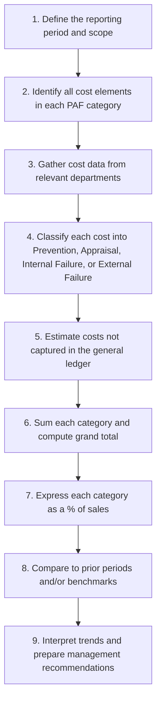

## Preparing and Interpreting Quality Cost Reports

### Definition and Purpose

A quality cost report is a formal, structured document that summarizes an organization's costs of quality across the four PAF categories (Prevention, Appraisal, Internal Failure, External Failure) for a given period, expressed in both dollar amounts and as a percentage of sales revenue. Its purpose is to translate operational quality performance into a financial language that management can use to prioritize investment, track trends, and evaluate the return on quality-improvement initiatives.

**Key Points**

- The report is a diagnostic and communication tool, not merely a historical record — its primary value lies in the *interpretation* of trends and cost mix, not just the totals.
- Quality cost reports are typically prepared quarterly or annually and compared across multiple periods to reveal directional trends.
- Because many underlying cost elements originate in different departments (production, engineering, customer service, legal), preparing the report requires cross-functional data gathering, not just extraction from the general ledger.

### Step-by-Step Process for Preparing a Quality Cost Report

#### Step Detail

1. **Define scope**: Determine whether the report covers a single plant, product line, or the entire organization, and select the reporting period (commonly quarterly, with an annual roll-up).
2. **Identify cost elements**: Compile a comprehensive checklist of cost items applicable to the four categories (see Categories of Quality Costs).
3. **Gather data**: Pull data from cost accounting records, payroll (for training and inspection labor), maintenance logs, warranty claim systems, and customer service records.
4. **Classify costs**: Assign each identified cost to exactly one PAF category; costs spanning multiple activities require allocation based on time studies or activity logs.
5. **Estimate untracked costs**: Some costs (notably lost sales from dissatisfied customers, opportunity cost of management time spent on complaints) are not recorded in the general ledger and must be estimated using judgment, survey data, or historical sales-loss patterns.
6. **Sum categories**: Total each of the four categories and compute the grand Total Cost of Quality (COQ).
7. **Express as percentage of sales**: Normalize each category and the total by dividing by period sales revenue, enabling comparison across periods of different sales volume.
8. **Compare and benchmark**: Set the current report against prior-period reports and, where available, industry benchmark COQ percentages.
9. **Interpret and recommend**: Translate the cost-mix pattern into actionable management recommendations (e.g., increase Prevention investment, target a specific defect source).

### Report Format

$$\text{Category \% of Sales} = \frac{\text{Category Total Cost}}{\text{Total Sales Revenue}} \times 100$$

**Example — Quarterly Quality Cost Report**

| Cost Category | Q1 ($) | Q1 (% of Sales) | Q2 ($) | Q2 (% of Sales) |
| --- | --- | --- | --- | --- |
| Sales Revenue | $4,000,000 | — | $4,200,000 | — |
| **Prevention** |  |  |  |  |
| Quality training | $25,000 |  | $45,000 |  |
| Preventive maintenance | $30,000 |  | $40,000 |  |
| Subtotal Prevention | $55,000 | 1.4% | $85,000 | 2.0% |
| **Appraisal** |  |  |  |  |
| Incoming inspection | $40,000 |  | $42,000 |  |
| In-process testing | $45,000 |  | $40,000 |  |
| Subtotal Appraisal | $85,000 | 2.1% | $82,000 | 2.0% |
| **Internal Failure** |  |  |  |  |
| Scrap | $70,000 |  | $55,000 |  |
| Rework | $95,000 |  | $70,000 |  |
| Subtotal Internal Failure | $165,000 | 4.1% | $125,000 | 3.0% |
| **External Failure** |  |  |  |  |
| Warranty claims | $130,000 |  | $90,000 |  |
| Lost sales (estimated) | $160,000 |  | $95,000 |  |
| Subtotal External Failure | $290,000 | 7.3% | $185,000 | 4.4% |
| **Total COQ** | **$595,000** | **14.9%** | **$477,000** | **11.4%** |

### Interpreting the Report — Trend Analysis

**Key Points**

- **Total COQ declined** from 14.9% to 11.4% of sales — a favorable overall trend.
- **Prevention spending increased** from 1.4% to 2.0% of sales, while **Internal Failure fell** from 4.1% to 3.0% and **External Failure fell sharply** from 7.3% to 4.4%.
- This pattern — rising Prevention paired with falling Internal and External Failure — is the textbook signature of a maturing quality system and supports the underlying trade-off logic of the Cost of Quality model.
- Appraisal remained roughly flat (2.1% → 2.0%), suggesting inspection effort was maintained rather than reduced, even as failure costs fell; [Inference] this may indicate the improvement is attributable more to Prevention investment and process redesign than to a change in detection intensity.

### Graphical Interpretation — Cost Mix Shift (svg_diagram)

<svg xmlns="http://www.w3.org/2000/svg" viewBox="0 0 680 300">
<text x="340" y="25" text-anchor="middle" font-size="16" font-weight="bold" fill="#1a1a1a">Quality Cost Mix: Q1 vs Q2 (svg_diagram)</text>

<text x="150" y="55" text-anchor="middle" font-size="13" font-weight="bold" fill="`#374151`">Q1 (14.9% of Sales)</text>

<rect x="60" y="65" width="180" height="30" fill="`#60a5fa`" />

<text x="150" y="85" text-anchor="middle" font-size="10" fill="#fff">Prevention 1.4%</text>

<rect x="60" y="95" width="180" height="42" fill="`#38bdf8`" />

<text x="150" y="120" text-anchor="middle" font-size="10" fill="#fff">Appraisal 2.1%</text>

<rect x="60" y="137" width="180" height="82" fill="`#fbbf24`" />

<text x="150" y="180" text-anchor="middle" font-size="10" fill="`#78350f`">Internal Failure 4.1%</text>

<rect x="60" y="219" width="180" height="146" fill="`#f87171`" />

<text x="150" y="290" text-anchor="middle" font-size="10" fill="`#7f1d1d`">External Failure 7.3%</text>

<text x="530" y="55" text-anchor="middle" font-size="13" font-weight="bold" fill="`#374151`">Q2 (11.4% of Sales)</text>

<rect x="440" y="65" width="180" height="40" fill="`#60a5fa`" />

<text x="530" y="88" text-anchor="middle" font-size="10" fill="#fff">Prevention 2.0%</text>

<rect x="440" y="105" width="180" height="40" fill="`#38bdf8`" />

<text x="530" y="128" text-anchor="middle" font-size="10" fill="#fff">Appraisal 2.0%</text>

<rect x="440" y="145" width="180" height="60" fill="`#fbbf24`" />

<text x="530" y="178" text-anchor="middle" font-size="10" fill="`#78350f`">Internal Failure 3.0%</text>

<rect x="440" y="205" width="180" height="88" fill="`#f87171`" />

<text x="530" y="253" text-anchor="middle" font-size="10" fill="`#7f1d1d`">External Failure 4.4%</text>

</svg>

Note: bar segment heights above are scaled proportionally to each category's percentage of sales within its respective quarter's total stack (not to an absolute dollar axis), to visually emphasize the compositional shift toward Prevention/Appraisal and away from Failure costs.

### Additional Interpretive Techniques

#### 1. Pareto Analysis of Quality Costs

Within each category, individual cost elements are ranked to identify the "vital few" driving the majority of cost, following the 80/20 principle. For example, if External Failure of $185,000 in Q2 breaks down as $90,000 warranty and $95,000 lost sales, management should investigate which specific products or defect types drive the largest share of each, rather than treating External Failure as a monolithic category.

#### 2. Cost of Quality as a Percentage of Sales — Ratio Trend

$$\text{COQ \%} = \frac{\text{Total COQ}}{\text{Sales Revenue}} \times 100$$

Tracking this ratio (not just the dollar total) over multiple periods controls for changes in sales volume, isolating genuine quality-cost improvement from mere revenue growth.

#### 3. Conformance-to-Nonconformance Ratio

$$\text{Conformance Ratio} = \frac{\text{Prevention} + \text{Appraisal}}{\text{Internal Failure} + \text{External Failure}}$$

Using Q2 data:

$$\text{Conformance Ratio} = \frac{85{,}000 + 82{,}000}{125{,}000 + 185{,}000} = \frac{167{,}000}{310{,}000} = 0.54$$

A ratio below 1.0 indicates the organization still spends more on failure than on conformance, even though the trend is improving — signaling continued room for Prevention investment.

### Common Pitfalls in Preparation and Interpretation

- **Incomplete data capture**: Understating External Failure by omitting hard-to-quantify items like lost goodwill produces an overly favorable report.
- **Inconsistent categorization across periods**: Reclassifying a cost element between categories from one period to the next distorts trend analysis; classification rules should be documented and applied consistently.
- **Focusing on totals only**: Interpreting only the Total COQ trend without examining the category mix can mask an unfavorable shift (e.g., total COQ falling only because sales grew, while failure costs in dollar terms stayed flat or rose).
- **Ignoring the percentage-of-sales denominator**: Comparing raw dollar totals across periods with different sales volumes can mislead; the percentage-of-sales metric should generally anchor the interpretation.
- **Treating the report as purely financial**: [Inference] A quality cost report is most effective when read alongside nonfinancial operational measures (defect rate, cycle time, customer satisfaction) rather than in isolation, since dollar figures alone do not reveal root causes.

### Using the Report for Decision-Making

- **Investment prioritization**: A high External Failure percentage relative to Prevention signals underinvestment in upstream quality activities and a likely favorable return from additional Prevention spending.
- **Target-setting**: Management can set explicit COQ percentage-of-sales targets for future periods (e.g., "reduce Total COQ to below 10% of sales within two years") derived from the trend and any available benchmark data.
- **Communicating with non-accounting stakeholders**: Translating quality performance into dollar figures helps quality engineers and operations managers make the business case for improvement projects to finance-oriented executives.
- **Linking to the Balanced Scorecard**: Quality cost report trends can populate the Internal Business Process perspective, connecting quality cost management to the broader strategic performance measurement system.

**Next Steps**

- Categories of Quality Costs (detailed cost element definitions)
- Total Quality Management (TQM) implementation
- Pareto analysis and root-cause diagramming (fishbone/Ishikawa diagrams)
- Lean accounting and value-stream costing
- Six Sigma cost-of-poor-quality (COPQ) methodology
- Activity-Based Costing (ABC) for quality cost tracing