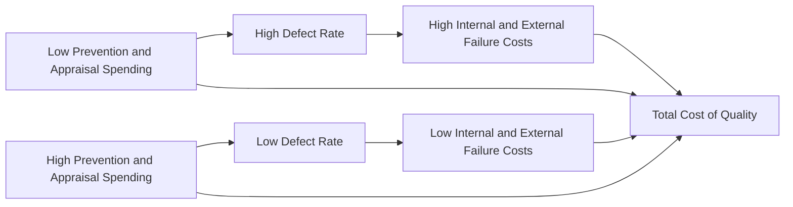

## Cost of Quality Trade Offs

### Definition and Purpose

The Cost of Quality (COQ) trade-off refers to the inverse relationship management must analyze between spending on conformance activities (Prevention and Appraisal) and the resulting costs of nonconformance (Internal Failure and External Failure). The central managerial accounting question is not "should we spend money on quality?" but rather "at what point does additional Prevention/Appraisal spending stop generating a larger offsetting reduction in failure costs?" This trade-off analysis guides optimal resource allocation across the four Cost of Quality categories.

**Key Points**

- Conformance costs (Prevention + Appraisal) and nonconformance costs (Internal Failure + External Failure) move in generally opposite directions as quality investment changes.
- The objective is minimizing **total** COQ, not minimizing or maximizing any single category in isolation.
- Two competing conceptual models describe this relationship: the traditional "optimal defect level" model and the modern "zero defects" (Total Quality Management) model.

### The Traditional Trade-off Model (Acceptable Quality Level)

The traditional model assumes an optimal, non-zero defect level exists, where the marginal cost of additional Prevention/Appraisal spending equals the marginal reduction in failure costs it produces.

Under this model, plotting Total COQ against the level of quality (percentage of defect-free units) produces a U-shaped curve: at very low quality levels, failure costs dominate and Total COQ is high; at very high (near-perfect) quality levels, conformance costs dominate and Total COQ rises again due to steeply increasing marginal Prevention/Appraisal costs. The minimum point of this U-shaped curve represents the traditionally defined "optimal" or "acceptable" quality level.

### The Modern Trade-off Model (Zero Defects / TQM View)

The modern view, associated with Total Quality Management philosophy, argues that failure costs rise so steeply as defects increase (particularly External Failure costs, which include intangible reputational and lost-sales effects) that the theoretical optimum is effectively at or near zero defects — meaning the traditional U-shape flattens into a curve where Total COQ continues to decline as quality approaches 100% conformance, at least within the practically achievable range.

| Dimension | Traditional Model | Modern (Zero-Defects) Model |
| --- | --- | --- |
| Assumed optimal defect rate | Positive/nonzero (some defects economically tolerable) | Approaches zero |
| Marginal Prevention/Appraisal cost near perfection | Rises steeply, exceeding failure cost savings | Assumed to remain justified by very high (often underestimated) failure cost savings |
| Treatment of External Failure intangibles (goodwill, reputation) | Often excluded or understated | Explicitly emphasized as very large and frequently underestimated |
| Underlying philosophy | Economic optimization with a cost-minimizing defect tolerance | Continuous improvement (Kaizen); defects viewed as always economically costly |

### Quantitative Illustration of the Trade-off

**Example**

A manufacturer is evaluating whether to invest an additional $50,000 annually in Prevention (enhanced supplier certification and employee training).

**Current state (before investment):**

| Category | Annual Cost |
| --- | --- |
| Prevention | $80,000 |
| Appraisal | $120,000 |
| Internal Failure | $200,000 |
| External Failure | $350,000 |
| **Total COQ** | **$750,000** |

**Projected state (after $50,000 additional Prevention investment):**

| Category | Annual Cost |
| --- | --- |
| Prevention | $130,000 |
| Appraisal | $100,000 (reduced inspection needs) |
| Internal Failure | $130,000 |
| External Failure | $200,000 |
| **Total COQ** | **$560,000** |

**Trade-off Evaluation**

$$\text{Net Change in Total COQ} = \$560{,}000 - \$750{,}000 = -\$190{,}000$$

The $50,000 incremental investment in Prevention is projected to reduce Total COQ by $190,000, a net favorable trade-off of $140,000 ($190,000 saved minus $50,000 spent).

$$\text{Return on Quality Investment} = \frac{\$190{,}000 - \$50{,}000}{\$50{,}000} \times 100 = 280\%$$

This calculation illustrates why, in most real-world manufacturing and service settings, the marginal return on well-targeted Prevention spending is often substantially positive, at least until an organization approaches world-class quality levels.

### Diminishing Returns and the Point of Reassessment

[Inference] As an organization moves closer to near-zero defect rates, each additional dollar of Prevention/Appraisal spending typically yields a progressively smaller reduction in failure costs, since the easiest and highest-impact defect sources are addressed first; specific thresholds vary by industry, process complexity, and starting defect rate, so no single dollar figure applies universally.

$$\text{Marginal Benefit of Quality Investment} = \Delta(\text{Failure Cost Reduction})$$

$$\text{Marginal Cost of Quality Investment} = \Delta(\text{Prevention} + \text{Appraisal Spending})$$

**Decision Rule**: Continue increasing Prevention/Appraisal spending as long as:

$$\text{Marginal Benefit} > \text{Marginal Cost}$$

Once marginal benefit falls below marginal cost, further conformance spending destroys value even though it continues to reduce the defect rate in absolute terms.

### Graphical Illustration — U-Shaped vs. Declining Total COQ Curves (svg_diagram)

<svg xmlns="http://www.w3.org/2000/svg" viewBox="0 0 700 320">
<text x="350" y="25" text-anchor="middle" font-size="16" font-weight="bold" fill="#1a1a1a">Total Cost of Quality vs. Quality Level (svg_diagram)</text>
<line x1="70" y1="270" x2="650" y2="270" stroke="#374151" stroke-width="1.5" />
<line x1="70" y1="60" x2="70" y2="270" stroke="#374151" stroke-width="1.5" />
<text x="360" y="300" text-anchor="middle" font-size="12" fill="#374151">Quality Level (% Defect-Free) --&gt;</text>
<text x="35" y="165" text-anchor="middle" font-size="12" fill="#374151" transform="rotate(-90 35 165)">Total COQ ($)</text>
<path d="M 100 130 Q 250 250 360 240 Q 480 220 610 110" fill="none" stroke="#2563eb" stroke-width="2.5" />
<text x="470" y="180" font-size="11" fill="#2563eb" font-weight="bold">Traditional (U-shaped)</text>
<path d="M 100 100 Q 300 180 450 210 Q 550 225 610 235" fill="none" stroke="#16a34a" stroke-width="2.5" stroke-dasharray="6,4" />
<text x="420" y="255" font-size="11" fill="#16a34a" font-weight="bold">Modern (Zero-Defects)</text>
<circle cx="360" cy="240" r="4" fill="#2563eb" />
<text x="360" y="228" text-anchor="middle" font-size="10" fill="#2563eb">Optimal Point</text>

<text x="100" y="285" font-size="10" fill="`#6b7280`">Low</text>

<text x="610" y="285" text-anchor="end" font-size="10" fill="`#6b7280`">100%</text>

</svg>

### Category-Level Trade-off Dynamics

| Spending Increase In | Likely Effect On | Rationale |
| --- | --- | --- |
| Prevention | ↓ Appraisal (fewer defects to catch), ↓ Internal Failure, ↓ External Failure | Fixing root causes reduces the volume of defects needing detection or correction downstream |
| Appraisal | ↓ Internal Failure (caught before shipment), possibly ↓ External Failure | Better detection prevents defective units reaching customers, but does not reduce the underlying defect rate |
| Underinvestment in both | ↑ Internal Failure, ↑ External Failure | Undetected and uncorrected defects flow through to production and customers |

[Inference] Prevention spending is generally considered to have the highest long-run leverage because it addresses root causes rather than merely detecting symptoms (Appraisal) or remediating consequences (Failure categories), though the specific magnitude of this leverage is context-dependent and not a fixed universal ratio.

### Strategic and Behavioral Considerations

- **Short-term vs. long-term trade-offs**: Cutting Appraisal spending can reduce costs in the current period's income statement but risks a lagged increase in External Failure costs once undetected defects reach customers — a timing mismatch that can distort short-term performance evaluation if managers are rewarded on short-term cost reduction alone.
- **Intangible cost estimation risk**: Since a large share of the potential benefit from Prevention investment flows through reduced External Failure (including hard-to-quantify lost goodwill and reputational damage), trade-off analyses that omit or understate these intangible costs will systematically bias decisions toward underinvestment in Prevention.
- **Capacity and capability constraints**: [Inference] The feasibility of shifting spending toward Prevention may be constrained by available quality engineering talent, supplier capability, or technology infrastructure, meaning the "optimal" trade-off computed on paper may not be immediately achievable in practice.
- **Continuous recalibration**: As process capability improves, the cost curves themselves shift, meaning the trade-off analysis should be periodically rerun rather than treated as a one-time calculation.

### Linking Trade-off Analysis to Broader Strategic Tools

| Tool | Connection to COQ Trade-offs |
| --- | --- |
| Quality Cost Reports | Provide the underlying dollar data used to quantify the trade-off |
| Benchmarking | Supplies external reference points for what "achievable" failure cost reduction looks like |
| Balanced Scorecard | Frames quality investment decisions within broader strategic objectives across financial and nonfinancial perspectives |
| Capital budgeting techniques (NPV/IRR) | Applied when Prevention investments require significant upfront capital (e.g., new inspection technology), treating projected failure cost savings as future cash inflows |

**Related Topics**

- Categories of Quality Costs (Prevention, Appraisal, Internal and External Failure)
- Preparing and Interpreting Quality Cost Reports
- Total Quality Management (TQM) and continuous improvement
- Six Sigma and statistical process control
- Capital budgeting techniques applied to quality investment decisions
- Kaizen costing and lean accounting