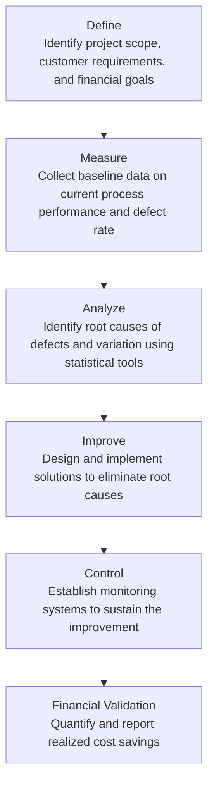
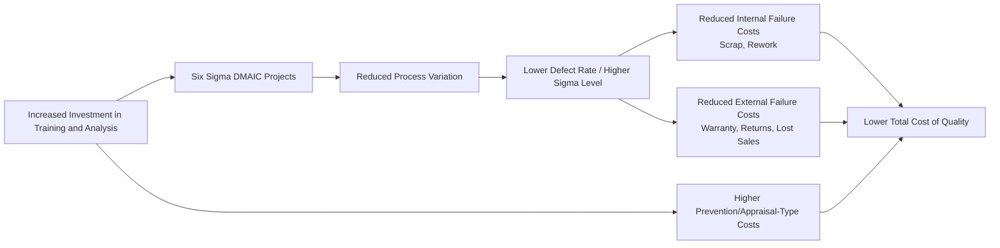

## Six Sigma Fundamentals for Cost Management

### Definition and Purpose

Six Sigma is a data-driven, statistically grounded quality management methodology aimed at reducing process variation and defects to near-zero levels — specifically, a defect rate of no more than 3.4 defects per million opportunities (DPMO) at a Six Sigma level of process capability. From a managerial accounting perspective, Six Sigma is significant because it provides a structured, project-based framework for systematically reducing the Cost of Poor Quality (COPQ), particularly Internal and External Failure costs, while generating measurable, dollar-quantified financial results tied to each improvement project.

**Key Points**

- The term "sigma" ($\sigma$) refers to the standard deviation of a process, representing the degree of variation around the process mean relative to customer specification limits.
- Six Sigma links statistical process control directly to the Cost of Quality framework: each sigma-level improvement corresponds to a measurable reduction in defect rate and associated failure costs.
- Unlike general TQM philosophy, Six Sigma projects are typically required to demonstrate a quantified financial return (cost savings or avoidance) before being approved and again upon completion, making it inherently compatible with managerial accounting's cost-benefit orientation.

### The Sigma Level and Defect Rate Relationship

| Sigma Level | Defects Per Million Opportunities (DPMO) | Approximate Yield |
| --- | --- | --- |
| 2σ | 308,537 | 69.1% |
| 3σ | 66,807 | 93.3% |
| 4σ | 6,210 | 99.4% |
| 5σ | 233 | 99.977% |
| 6σ | 3.4 | 99.9997% |

**Key Points**

- Most conventional manufacturing and service processes operate between 3σ and 4σ without deliberate improvement effort.
- The dramatic drop in DPMO between each sigma level illustrates why even modest sigma-level improvements can yield large percentage reductions in Internal and External Failure costs.
- [Inference] The commonly cited 3.4 DPMO figure for Six Sigma incorporates an assumed 1.5-sigma long-term process shift; this is a standard convention within Six Sigma methodology rather than a literal static-distribution calculation, and practitioners should be aware the underlying statistical assumption affects how the figure is derived.

### DMAIC — The Core Six Sigma Improvement Methodology

Six Sigma projects follow a structured five-phase cycle called **DMAIC**: Define, Measure, Analyze, Improve, Control.

#### Phase Detail and Cost Management Linkage

1. **Define**: The project charter specifies the problem, the customer impact, and — critically for cost management — a preliminary estimate of the financial opportunity (expected COPQ reduction).
2. **Measure**: Baseline defect rate, process capability ($C_p$, $C_{pk}$), and current-state Cost of Quality are documented, establishing the "before" figures against which savings will later be measured.
3. **Analyze**: Root-cause analysis tools (fishbone/Ishikawa diagrams, Pareto analysis, regression analysis) identify the process inputs driving defects and their associated failure costs.
4. **Improve**: Process changes are piloted and validated, often using design of experiments (DOE), with projected cost impact re-estimated based on pilot results.
5. **Control**: Statistical process control (SPC) charts and standard operating procedures lock in the gain, preventing regression to the prior defect rate and protecting the realized cost savings.
6. **Financial Validation**: A finance or accounting function typically certifies the actual realized savings against the original projection, closing the loop between the operational project and the accounting records.

### Process Capability and Cost Implications

**Process Capability Index ($C_{pk}$)**

$$C_{pk} = \min\left(\frac{USL - \bar{X}}{3\sigma}, \frac{\bar{X} - LSL}{3\sigma}\right)$$

Where $USL$ = upper specification limit, $LSL$ = lower specification limit, $\bar{X}$ = process mean, and $\sigma$ = process standard deviation.

**Interpretation**: A $C_{pk}$ of 1.0 corresponds approximately to a 3σ process; a $C_{pk}$ of 2.0 corresponds to a full Six Sigma (6σ) process. Higher $C_{pk}$ values indicate the process consistently produces output well within specification limits, directly reducing scrap, rework, and warranty-related Internal and External Failure costs.

### Quantifying the Financial Impact of a Six Sigma Project

**Example**

A call center processes 500,000 customer service transactions annually. Before a Six Sigma project, the error rate (requiring costly rework/callback) is 4% (operating near 3.3σ). Each error costs the company $18 in rework labor and $40 in estimated lost customer goodwill/potential churn (External Failure).

**Baseline (before project):**

$$\text{Defective Transactions} = 500{,}000 \times 4\% = 20{,}000$$

$$\text{Total Failure Cost} = 20{,}000 \times (\$18 + \$40) = 20{,}000 \times \$58 = \$1{,}160{,}000$$

**After DMAIC project** (error rate reduced to 0.5%, approximately a 4.1σ process):

$$\text{Defective Transactions} = 500{,}000 \times 0.5\% = 2{,}500$$

$$\text{Total Failure Cost} = 2{,}500 \times \$58 = \$145{,}000$$

**Realized Savings**

$$\text{Annual Savings} = \$1{,}160{,}000 - \$145{,}000 = \$1{,}015{,}000$$

If the Six Sigma project itself cost $150,000 (training, analyst time, process redesign), the **net financial benefit** and **return on investment** are:

$$\text{Net Benefit} = \$1{,}015{,}000 - \$150{,}000 = \$865{,}000$$

$$\text{ROI} = \frac{\$865{,}000}{\$150{,}000} \times 100 = 576.7\%$$

This example illustrates the characteristic pattern of well-scoped Six Sigma projects: high returns are achievable because failure costs (particularly External Failure, including intangible customer-retention effects) are often disproportionately large relative to the process-improvement investment required to eliminate them.

### Six Sigma Roles and Cost Management Governance

| Role | Responsibility | Relevance to Cost Management |
| --- | --- | --- |
| Champion/Sponsor | Executive who selects projects aligned to strategic/financial priorities | Ensures projects target the highest-COPQ opportunities |
| Master Black Belt | Expert trainer/mentor across multiple projects | Maintains methodological rigor in financial impact estimation |
| Black Belt | Leads individual DMAIC projects full-time | Owns the project's cost-benefit case from Define through Control |
| Green Belt | Leads smaller projects part-time alongside regular duties | Applies DMAIC to localized, lower-scope cost issues |
| Finance/Accounting Liaison | Validates and certifies projected vs. realized savings | Provides independent verification, preventing overstated savings claims |

### Six Sigma's Relationship to the Cost of Quality Framework

Six Sigma essentially operationalizes the Cost of Quality trade-off (see Cost of Quality Trade-offs): the training, statistical analysis, and process-redesign effort function as a form of Prevention investment, with the explicit goal of driving down Internal and External Failure costs by a larger amount than the investment cost.

### Distinguishing Six Sigma from Related Quality Frameworks

| Framework | Primary Focus | Cost Management Emphasis |
| --- | --- | --- |
| **Six Sigma** | Reducing process variation using statistical rigor | Strong — projects require quantified financial justification |
| **Total Quality Management (TQM)** | Organization-wide quality culture and continuous improvement | Broader, less project-specific financial tracking |
| **Lean** | Eliminating non-value-added activity and waste (see Manufacturing Cycle Efficiency) | Focuses on cycle time and waste cost, complements Six Sigma |
| **Lean Six Sigma** | Hybrid combining waste elimination (Lean) with variation reduction (Six Sigma) | Combines cycle-time cost savings with defect-cost savings |

### Limitations and Cautions

- **Implementation cost and time**: DMAIC projects, Black Belt certification/training programs, and statistical software represent a substantial upfront Prevention-type investment that may take months to show returns.
- **Estimation risk in financial claims**: [Inference] Projected savings for a Six Sigma project are estimates based on baseline measurement and pilot data; actual realized savings can differ from projections due to factors outside the immediate process scope, which is why independent finance validation of realized savings is a widely recommended governance practice.
- **Diminishing returns near very high sigma levels**: Consistent with general Cost of Quality trade-off logic, pushing a process from 5σ to 6σ typically requires substantially more investment per unit of additional defect reduction than earlier-stage improvements (e.g., 3σ to 4σ).
- **Not all defects carry equal cost**: A high sigma level in a low-cost-per-defect process may generate a smaller financial return than a moderate sigma improvement in a process with very high cost per defect (e.g., safety-critical or high-warranty-cost products); project selection should prioritize COPQ magnitude, not defect rate alone.
- **Cultural/behavioral risk**: Overly rigid application of statistical targets without attention to employee buy-in can create measurement gaming or resistance, similar to general risks noted in nonfinancial performance measurement.

**Next Steps**

- Categories of Quality Costs (Prevention, Appraisal, Internal and External Failure)
- Cost of Quality Trade-offs
- Statistical Process Control (SPC) and control charts
- Lean accounting and value-stream costing
- Total Quality Management (TQM) philosophy
- Design of Experiments (DOE) and root-cause analysis tools